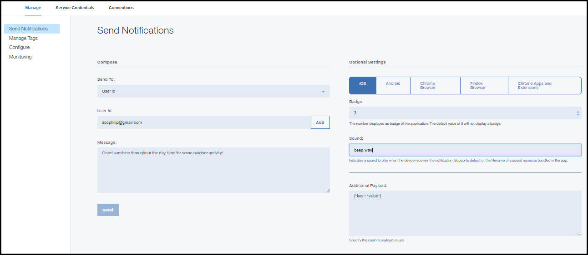

---

copyright:
 years: 2015, 2017

---

{:new_window: target="_blank"}
{:shortdesc: .shortdesc}
{:screen:.screen}
{:codeblock:.codeblock}

# Registrazione di un dispositivo con l'ID utente
{: #register_device_with_userId}
Ultimo aggiornamento: 11 gennaio 2017
{: .last-updated}

Per registrare la notifica basate sull'ID utente, completa la seguente procedura:

## Android
{: android-register}

Inizializza la classe MFPPush con le chiavi `AppGUID` e `clientSecret` del servizio {{site.data.keyword.mobilepushshort}}.
```
// Inizializza MFPPush
push = MFPPush.getInstance();
push.initialize(getApplicationContext(),"AppGUID", "clientSecret");
```
	{: codeblock}


- **AppGUID**: questa è la chiave AppGUID del servizio {{site.data.keyword.mobilepushshort}}.
- **clientSecret**: questa è la chiave clientSecret del servizio {{site.data.keyword.mobilepushshort}}.

  Utilizza l'API **registerDeviceWithUserId** per registrare il dispositivo per {{site.data.keyword.mobilepushshort}}.
```
// Registra il dispositivo per {{site.data.keyword.mobilepushshort}}.
push.registerDeviceWithUserId("userId",new MFPPushResponseListener<String>() {
  @Override
	    public void onSuccess(String deviceId) {
    Log.d("Device is registered with Push Service.");
  }
  @Override
    public void onFailure(MFPPushException ex) {
      Log.d("Error registering with Push Service...\n"
        + "Push notifications will not be received.");
  }
});
```
	{: codeblock}


- **userId**: passa il valore ID utente univoco per la registrazione per {{site.data.keyword.mobilepushshort}}.

**Nota:** per abilitare le {{site.data.keyword.mobilepushshort}} indirizzate dall'ID utente, assicurati di aver registrato il dispositivo con un ID utente e inoltre di passare il 'clientSecret' assegnato quando viene eseguito il provisioning dei servizi {{site.data.keyword.mobilepushshort}}. La registrazione del dispositivo avrà esito negativo senza un clientSecret valido.

## Cordova
{: cordova}

Utilizza le seguenti API per registrare le {{site.data.keyword.mobilepushshort}} basate sull'ID utente.

```
// Register device for push notification with UserId
var options = {"userId": "Your User Id value"};
BMSPush.registerDevice(options,success, failure); 
```
	{: codeblock}


- **userId**: passa il valore ID utente univoco per la registrazione per {{site.data.keyword.mobilepushshort}}.


## Swift
{: swift-register}

```
// Inizializza BMSPushClient
let push =  BMSPushClient.sharedInstance
push.initializeWithAppGUID("appGUID", clientSecret:"clientSecret")
```
	{: codeblock}


- **AppGUID**: questa è la chiave AppGUID del servizio {{site.data.keyword.mobilepushshort}}.
- **clientSecret**: questa è la chiave clientSecret del servizio {{site.data.keyword.mobilepushshort}}.

Utilizza l'API **registerWithUserId** per registrare il dispositivo per {{site.data.keyword.mobilepushshort}}.

```
// Registra il dispositivo per il servizio Push Notifications.
push.registerWithDeviceToken("deviceToken", WithUserId: "userId")  { (response, statusCode, error) -> Void in
if error.isEmpty {
  print( "Response during device registration : \(response)")
        print( "status code during device registration : \(statusCode)")
    } else {
  print( "Error during device registration \(error) ")
    }
  }
```
	{: codeblock}

- **userId**: passa il valore ID utente univoco per la registrazione per {{site.data.keyword.mobilepushshort}}.

## Google Chrome, Safari e Mozilla Firefox
{: web-register}

Utilizza le seguenti API per registrare le notifiche basate sull'ID utente. Inizializza l'SDK con `app GUID`, `app Region` e `Client Secret`.

```
var bmsPush = new BMSPush();
var params = {
    "appGUID":"push app GUID",
    "appRegion":"App Region",
    "clientSecret":"Push Client Secret" 
    }
  bmsPush.initialize(params, function(response){
          alert(response.response)
    })
```
	{: codeblock}
  
Dopo aver correttamente eseguito l'inizializzazione registra l'applicazione web con l'ID utente.

```
bmsPush.registerWithUserId("UserId", function(response) {
 alert(response.response)
  })
```
	{: codeblock}

## Estensioni e applicazioni Google Chrome
{: web-register-new}

Utilizza le seguenti API per registrare le notifiche basate sull'ID utente. Inizializza l'SDK con `app GUID`, `app Region` e `Client Secret`.

```
var bmsPush = new BMSPush();
var params = {
    "appGUID":"push app GUID",
    "appRegion":"App Region",
    "clientSecret":"Push Client Secret" 
    }
  bmsPush.initialize(params, function(response){
          alert(response.response)
    })
```
	{: codeblock}
  
Dopo l'inizializzazione, devi registrare l'applicazione web con l'ID utente.

```
bmsPush.registerWithUserId("UserId", function(response) {
 alert(response.response)
  })
```
	{: codeblock}

# Utilizzo delle notifiche basate sull'ID utente
{: #using_userid}

Le notifiche basate sull'ID utente sono messaggi di notifica destinati a uno specifico utente. Possono essere registrati con un utente molti dispositivi. I seguenti passi descrivono come inviare le notifiche basate sull'ID utente.

1. Dal dashboard **Push Notification**, seleziona l'opzione **Send Notifications**.
1. Seleziona **UserId** nell'elenco delle opzioni **Send to**.
1. Nel campo **User Id**, cerca gli ID utente che vuoi utilizzare e fai quindi clic su **+Add**.
1. Nel campo **Message**, immetti il testo che vuoi inviare nella tua notifica.
1. Fai clic su **Send**.
