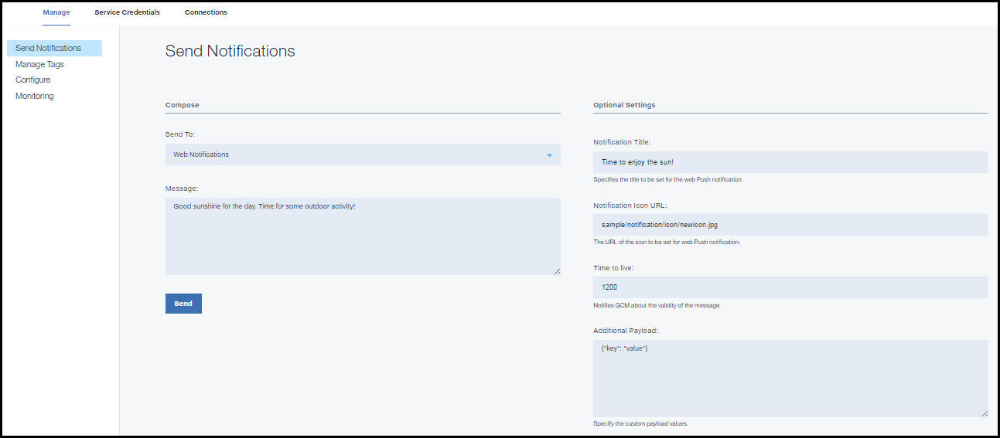

---

copyright:
years: 2015, 2017

---

{:new_window: target="_blank"}
{:shortdesc: .shortdesc}
{:screen:.screen}
{:codeblock:.codeblock}

# Web ブラウザーへの基本通知の送信
{: #web_notifications}
最終更新日: 2017 年 1 月 11 日
{: .last-updated}

アプリケーションの開発が完了したら、プッシュ通知を送信できます。 

1. **「通知の送信 (Send Notifications)」**を選択し、**「送信先 (Send To)」**オプションとして**「Web 通知 (Web Notifications)」**を選択することでメッセージを構成します。 
2. **「メッセージ」**フィールドに、配信する必要があるメッセージを入力します。
3. 以下のオプションの設定を指定することを選択できます。
  - **通知タイトル (Notification Title)**: メッセージ・アラートの見出しとして表示されるテキストです。
  - **通知アイコン URL (Notification Icon URL)**: メッセージにアプリ通知アイコンを付けて配信する必要がある場合、このフィールドにアイコンへのリンクを指定します。
  - **存続時間 (Time to live)**: メッセージの有効期間をサーバーに通知します。
4. Safari ブラウザーに送信される Web 通知の場合、以下のようにいくつかの追加情報が必要です。
  - **アクション (Action)**: これは、アクション・ボタンのラベルです。
  - **URL 引数 (URL Arguments)**: この通知で使用する必要がある URL 引数。これは、必ず JSON 配列形式で指定してください。 
 
以下のイメージは、ダッシュボードの Web 通知オプションを示しています。

  

## 次のステップ
  {: #next_steps_tags}

基本通知を正常にセットアップしたら、タグ・ベースの通知および詳細オプションの構成を行うことができます。

{{site.data.keyword.mobilepushshort}}サービスの以下の機能をご使用のアプリに追加します。
  タグ・ベースの通知を使用する場合は、[タグ・ベースの通知](c_tag_basednotifications.html)を参照してください。拡張通知オプションを使用する場合は、[拡張通知](t_advance_badge_sound_payload.html)を参照してください。

