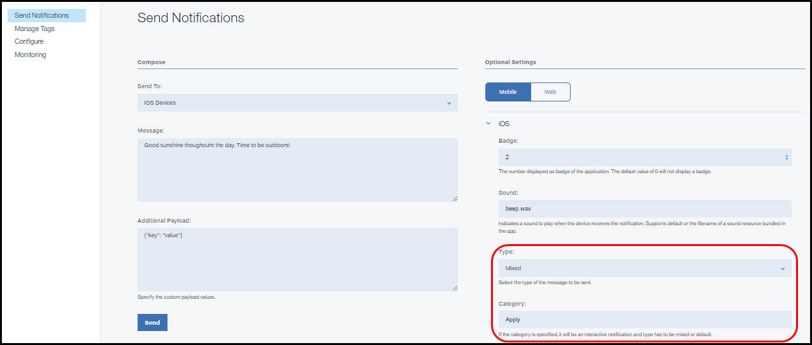

---

copyright:
 years: 2015, 2017

---

{:new_window: target="_blank"}
{:shortdesc: .shortdesc}
{:screen:.screen}
{:codeblock:.codeblock}

# モバイル・デバイス用の通知の使用可能化
{: #c_enable_push-notifications}
最終更新日: 2017 年 4 月 12 日
{: .last-updated}

[通知プロバイダーの資格情報の構成](t__main_push_config_provider.html)を確実に実行しておいてください。

このセクションでは、クライアント・アプリケーション (モバイル・アプリケーション、Web ブラウザー・アプリケーション、および Chrome アプリケーションおよびエクステンション) でのプッシュ通知の受け取りを使用可能にする方法、基本的な通知の作成方法、SDK またはプラグインの取得と初期化の方法、およびプッシュ通知を受け取るためにデバイスまたはブラウザーを登録する方法について説明します。また、ご使用のモバイル・アプリケーションおよび Web ブラウザー・アプリケーションで [REST API](t_restapi.html) を使用してプッシュ通知を受け取るようにすることもできます。

**注**: デバイス、ブラウザー、Chrome アプリケーションおよびエクステンションの登録のために、{{site.data.keyword.mobilepushshort}} サービスは、通知プロバイダー (Apple の場合は APNs、Google の場合は FCM) から発行されたトークンへの固有の参照を維持しています。これらのトークンは、いくつかの理由で、{{site.data.keyword.mobilepushshort}}サービスの通知プロバイダーによって無効にされることがあります。 

例えば、デバイス上のアプリのアンインストール時について考えてみます。この場合、そのデバイスが無効になったというプロバイダーの応答に基づいて通知の配信が試行されると、{{site.data.keyword.mobilepushshort}}サービスはデバイスまたは Web ブラウザーの登録を削除します。その結果として、これらの無効にされたデバイスに通知を送信しようとする試みが抑えられることになります。


## Android アプリケーションによるプッシュ通知受け取りの可能化
{: #tag_based_notifications}


Android アプリケーションでデバイスへのプッシュ通知を受け取れるようにすることができます。Android Studio が前提条件であり、Android プロジェクトをビルドするための推奨方式です。Android Studio の基本知識が必要です。

### Gradle を使用したクライアント Push SDK のインストール
{: #android_install}

このセクションでは、Android アプリケーションをさらに開発するためにクライアント Push SDK をインストールして使用する方法について説明します。

[Gradle ](http://developer.android.com/tools/building/configuring-gradle.html){: new_window} を使用して {{site.data.keyword.Bluemix}} Mobile Services Push SDK を追加できます。Gradle は自動的に成果物をリポジトリーからダウンロードし、Android アプリケーションで使用できるようにします。[Android Studio ](https://developer.android.com/tools/studio/index.html) および Android Studio SDK が正しくセットアップされていることを確認してください。 

モバイル・アプリケーションを作成し、開いてから、Android Studio を使用して以下の手順を実行します。

1. モジュール・レベルの **build.gradle** ファイルに、依存関係を追加します。 	

	- 以下の依存関係を追加して、Bluemix™ Mobile サービスの Push クライアント SDK と Google Play サービス SDK を、コンパイル有効範囲の依存関係に含めます。
	```
	com.ibm.mobilefirstplatform.clientsdk.android:push:3.+
	```
    	{: codeblock}
	
	- コード・スニペットに必要なインポート・ステートメントに、以下の依存関係を追加します。
	```
	import com.ibm.mobilefirstplatform.clientsdk.android.core.api.BMSClient;
	import com.ibm.mobilefirstplatform.clientsdk.android.push.api.MFPPush;
	import com.ibm.mobilefirstplatform.clientsdk.android.push.api.MFPPushException;
	import com.ibm.mobilefirstplatform.clientsdk.android.push.api.MFPPushResponseListener;
	import com.ibm.mobilefirstplatform.clientsdk.android.push.api.MFPPushNotificationListener;
	import com.ibm.mobilefirstplatform.clientsdk.android.push.api.MFPSimplePushNotification;
	```
    	{: codeblock}

	- 次の依存関係をモジュール・レベルの **build.gradle** ファイルの最後に追加します。
	```
		apply plugin: 'com.google.gms.google-services'
	```
		{: codeblock}
3. プロジェクト・レベルの **build.gradle** ファイルに、以下の依存関係を追加します。
```
dependencies {
    classpath 'com.android.tools.build:gradle:2.2.3'
    classpath 'com.google.gms:google-services:3.0.0'
}
``` 
    {: codeblock}
5. **AndroidManifest.xml** ファイルに、以下のアクセス権を追加します。サンプル・マニフェストを表示するには、[Android helloPush のサンプル・アプリケーション](https://github.com/ibm-bluemix-mobile-services/bms-samples-android-hellopush/blob/master/helloPush/app/src/main/AndroidManifest.xml){: new_window}を参照してください。サンプル Gradle ファイルを表示するには、[サンプルの Build Gradle ファイル](https://github.com/ibm-bluemix-mobile-services/bms-samples-android-hellopush/blob/master/helloPush/app/build.gradle){: new_window}を参照してください。
```
	<uses-permission android:name="android.permission.INTERNET"/>
	<uses-permission android:name="android.permission.GET_ACCOUNTS" />
	<uses-permission android:name="android.permission.USE_CREDENTIALS" />
	<uses-permission android:name="android.permission.WRITE_EXTERNAL_STORAGE" />
	<uses-permission android:name="android.permission.ACCESS_WIFI_STATE"/>
```
	{: codeblock}
ここをクリックすると、[Android のパーミッション ](http://developer.android.com/guide/topics/security/permissions.html){: new_window}の詳細が表示されます。

4. アクティビティーの通知インテント設定を追加します。この設定により、ユーザーが通知エリアで受信した通知をクリックすると、アプリケーションが開始します。
```
	<intent-filter>
		<action android:name="Your_Android_Package_Name.IBMPushNotification"/>
		<category  android:name="android.intent.category.DEFAULT"/>
	</intent-filter>
```
	{: codeblock}
**注**: 上記のアクション内の *Your_Android_Package_Name* を、アプリケーションで使用されているアプリケーション・パッケージ名に置き換えてください。

5. RECEIVE および REGISTRATION のイベント通知用に、Firebase Cloud Messaging (FCM) または Google Cloud Messaging (GCM) のインテント・サービスとインテント・フィルターを追加します。
```
	<service android:name="com.ibm.mobilefirstplatform.clientsdk.android.push.api.MFPPushIntentService"
    	android:exported="true" >
    	<intent-filter>
    	    <action android:name="com.google.firebase.MESSAGING_EVENT" />
    </intent-filter>
	</service>
	<service
    android:name="com.ibm.mobilefirstplatform.clientsdk.android.push.api.MFPPush"
    android:exported="true" >
    <intent-filter>
        <action android:name="com.google.firebase.INSTANCE_ID_EVENT" />
    </intent-filter>
	</service>
```
    {: codeblock}

6. {{site.data.keyword.mobilepushshort}} サービスは、通知トレイからの個々の通知の取り出しをサポートします。通知トレイから通知にアクセスする場合、クリックしている通知のみへのハンドルが提供されます。アプリケーションを通常どおりに開いた場合は、すべての通知が表示されます。この機能を使用するには、以下のスニペットを使用して **AndroidManifest.xml** ファイルを更新します。

```
	<activity android:name="
	com.ibm.mobilefirstplatform.clientsdk.android.push.api.MFPPushNotificationHandler"
	android:theme="@android:style/Theme.NoDisplay"/>
```
    {: codeblock}

[通知プロバイダーの資格情報の構成](t__main_push_config_provider.html)をすべて実行し、FCM プロジェクトのセットアップと資格情報の取得が完了している必要があります。Firebase Cloud Messaging (FCM) コンソールを使用して、以下の手順を実行します。

1. Firebase コンソールで、**「Project Settings (プロジェクト設定)」** アイコンをクリックします。
     

3. アプリケーション・ペインの「General (一般)」タブから、**「ADD APP」**または**「Android アプリへの Firebase の追加 (Add Firebase to your Android app)」アイコン**を選択します。
     

4. 「Android アプリへの Firebase の追加 (Add Firebase to your Android app)」ウィンドウで、パッケージ名として **com.ibm.mobilefirstplatform.clientsdk.android.push** を追加します。「アプリのニックネーム (App nickname)」フィールドはオプションです。**「ADD APP」**をクリックします。
     

5. 「Android アプリへの Firebase の追加 (Add Firebase to your Android app)」ウィンドウにパッケージ名を入力して、アプリケーションのパッケージ名を組み込みます。「アプリのニックネーム (App nickname)」フィールドはオプションです。**「ADD APP」**をクリックします。 

	

6. `google-services.json` ファイルが生成されます。`google-services.json` ファイルを Android アプリケーション・モジュールのルート・ディレクトリーにコピーします。この `google-service.json` ファイルには、追加されたパッケージ名が含まれていることに注意してください。

    

5. 「Android アプリへの Firebase の追加 (Add Firebase to your Android app)」ウィンドウで、**「続行」**をクリックして、**「終了 (Finish)」**をクリックします。 

  

アプリケーションをビルドして、実行します。

### Android アプリ用の Push SDK の初期化
{: #android_initialize}

初期化コードを配置する一般的な場所は、Android アプリケーション内のメインアクティビティーの onCreate メソッド内です。初期化を必要とする SDK のコンポーネントが 2 つあります。1 つは Core SDK であり、もう 1 つは Core SDK を基にビルドされた Push SDK です。

#### Core SDK の初期化
{: #initz_core_sdk}

```
// Initialize the SDK for Android
    BMSClient.getInstance().initialize(this, BMSClient.REGION_US_SOUTH);
```
    {: codeblock}

#### bluemixRegionSuffix
{: #bluemixRegionSuffix}

アプリがホストされている場所を指定します。次の 3 つの値のいずれかを使用できます。

- BMSClient.REGION_US_SOUTH
- BMSClient.REGION_UK
- BMSClient.REGION_SYDNEY

#### クライアント Push SDK を初期化します。
{: #initiz_client_pushSDK}

```
//Initialize client Push SDK for Java
MFPPush push = MFPPush.getInstance();
push.initialize(getApplicationContext(), "appGUID", "clientSecret");
```
	{: codeblock}

#### AppGUID
{: #appguid_initialize_client_push_sdk}

これは、{{site.data.keyword.mobilepushshort}}サービスの AppGUID キーです。この値では、大/小文字が区別されます。「Push Notification」ダッシュボードを開き、「構成」タブを選択します。「Push Notification」サービス・ダッシュボード上の「構成」タブの「モバイル・オプション」から、この値を取得できます。 

### Android デバイスの登録
{: #android_register}

`MFPPush.register()` API を使用して、デバイスを{{site.data.keyword.mobilepushshort}}サービスに登録します。Android デバイスを登録する場合、Firebase Cloud Messaging (FCM) 情報を Bluemix {{site.data.keyword.mobilepushshort}} サービス構成ダッシュボードに追加します。詳しくは、[通知プロバイダーの資格情報の構成](t__main_push_config_provider.html)を参照してください。

以下のコード・スニペットを Android モバイル・アプリケーションにコピーします。

```
	//Register Android devices
	push.registerDevice(new MFPPushResponseListener<String>() {
    	@Override
    	public void onSuccess(String response) {
    		//handle success here
    	}
		@Override
    	public void onFailure(MFPPushException ex) {
    		//handle failure here
		}
		});
```
	{: codeblock}


```
	//Handles the notification when it arrives
	MFPPushNotificationListener notificationListener = new MFPPushNotificationListener() {
    @Override
    public void onReceive (final MFPSimplePushNotification message){
		// Handle Push Notification
   		 }
		};
```
	{: codeblock}

### Android デバイスでのプッシュ通知の受け取り
{: #android_receive}

1. notificationListener オブジェクトをプッシュ通知サービスに登録するには、`MFPPush.listen()` メソッドを使用します。このメソッドは通常、プッシュ通知を処理しているアクティビティーの `onResume()` メソッドおよび `onPause` メソッドから呼び出されます。
```
	@Override
	protected void onResume(){
   	super.onResume();
   	if(push != null) {
       push.listen(notificationListener);
   }
	}
```
	{: codeblock}
```
	@Override
	protected void onPause() {
    super.onPause();
    if (push != null) {
        push.hold();
    }
	}
```
	{: codeblock}

2. プロジェクトをビルドし、デバイスまたはエミュレーター上で実行します。register() メソッド内で応答リスナーの onSuccess() メソッドが呼び出されると、デバイスが {{site.data.keyword.mobilepushshort}} サービスに正常に登録されたという確認となり、プッシュ通知を送信できるようになります。
3. デバイスが通知を受信していることを確認します。アプリケーションがフォアグラウンドにある場合は、通知は `MFPPushNotificationListener` により処理されます。アプリケーションがバックグラウンドにある場合は、メッセージが通知バーに表示されます。

### Android デバイスでのプッシュ通知のモニター
{: #android_monitor}

アプリケーション内で通知の現在の状況をモニターするには、`com.ibm.mobilefirstplatform.clientsdk.android.push.api.MFPPushNotificationStatusListener` インターフェースを実装し、メソッド onStatusChange(String messageId, MFPPushNotificationStatus status) を定義します。 

`messageId` は、サーバーから送信されたメッセージの ID です。`MFPPushNotificationStatus` は、以下のように、通知の状況を値として定義します。

- RECEIVED - アプリは通知を受信しました。 
- QUEUED - アプリは通知リスナーを呼び出すために、通知をキューに入れました。 
- OPENED - ユーザーが、トレイ内の通知をクリックするか、アプリ・アイコンから起動することで通知を開いたか、またはアプリがフォアグラウンドのときに通知を開きました。 
- DISMISSED - ユーザーがトレイ内の通知をクリアまたは破棄しました。

`com.ibm.mobilefirstplatform.clientsdk.android.push.api.MFPPushNotificationStatusListener` クラスを MFPPush に登録する必要があります。

```
	push.setNotificationStatusListener(new MFPPushNotificationStatusListener() {
	@Override
	public void onStatusChange(String messageId, MFPPushNotificationStatus status) {
		// Handle status change
	}
	});
```
    {: codeblock}


#### DISMISSED 状況の listen
{: #android_monitor_listen}

以下のいずれかの条件に基づいて DISMISSED 状況を listen することを選択できます。

- アプリがアクティブのとき (フォアグラウンドまたはバックグラウンドで実行中)

  次のスニペットを `AndroidManifest.xml` ファイルに追加します。

```
	<receiver android:name="com.ibm.mobilefirstplatform.clientsdk.android.push.api.MFPPushNotificationDismissHandler">
	<intent-filter>
	<action android:name="Your_Android_Package_Name.Cancel_IBMPushNotification"/>
	</intent-filter>
	</receiver>
```
	{: codeblock}

- アプリがアクティブのとき (フォアグラウンドまたはバックグラウンドで実行中) と未実行 (クローズ済み) のときの両方

`com.ibm.mobilefirstplatform.clientsdk.android.push.api.MFPPushNotificationDismissHandler` ブロードキャスト・レシーバーを拡張し、メソッド `onReceive()` をオーバーライドします。このとき、`MFPPushNotificationStatusListener` を登録してから、基本クラスのメソッド `onReceive()` を呼び出す必要があります。

```
	public class MyDismissHandler extends MFPPushNotificationDismissHandler {
	@Override
	public void onReceive(Context context, Intent intent) {
	MFPPush.getInstance().setNotificationStatusListener(new MFPPushNotificationStatusListener() {
	@Override
	public void onStatusChange(String messageId, MFPPushNotificationStatus status) {
	// Handle status change
	}
	});
	super.onReceive(context, intent);
	}
	}
```
    {: codeblock}


以下のスニペットを `AndroidManifest.xml` ファイルに追加します。

```
	<receiver android:name="Your_Android_Package_Name.Your_Handler">
	<intent-filter>
	<action android:name="Your_Android_Package_Name.Cancel_IBMPushNotification"/>
	</intent-filter>
	</receiver>
```
    {: codeblock}

### 基本プッシュ通知の送信
{: #send-basic-notification}

アプリケーションの開発が完了したら、基本プッシュ通知を送信できます。

基本プッシュ通知を送信するには、以下の手順を実行します。

1. **「通知の送信 (Send Notifications)」**を選択し、**「送信先 (Send To)」**オプションを選択することでメッセージを構成します。サポートされるオプションは、**「タグ指定によるデバイス (Device by Tag)」**、**「デバイス ID (Device Id)」**、**「ユーザー ID」**、**「Android デバイス (Android devices)」**、**「iOS デバイス (iOS devices)」**、**「Web 通知 (Web Notifications)」**、および**「すべてのデバイス」**です。
**注**: **「すべてのデバイス」**オプションを選択すると、{{site.data.keyword.mobilepushshort}}をサブスクライブしているすべてのデバイスが通知を受け取ることになります。


2. **「メッセージ」**フィールドで、メッセージを構成します。必要に応じてオプションの設定を構成してください。
3. **「送信」**をクリックします。
3. デバイスが通知を受信していることを確認します。

次のスクリーン・ショットは、Android デバイスのフォアグラウンドでプッシュ通知を処理しているアラート・ボックスを示しています。


次のスクリーン・ショットは、Android のバックグラウンドでのプッシュ通知を示しています。


### 通知を送信するためのオプションの Android 設定
{: #send_otpional_setting}

Android デバイスに通知を送信するための{{site.data.keyword.mobilepushshort}}設定をさらに詳細にカスタマイズできます。以下の任意指定のカスタマイズ・オプションがサポートされます。


- 省略キー (Collapse Key): 省略キーは通知にアタッチされます。デバイスがオフラインのときに、同じ省略キーを持つ複数の通知が連続して到着すると、それらは省略されます。デバイスがオンラインになると、FCM/GCM サーバーから通知を受け取り、同じ省略キーを持つ最新の通知のみを表示します。省略キーが設定されていない場合、新しいメッセージと古いメッセージの両方が将来の配信のために保管されます。
- 音 (Sound): 通知の受信時に音声クリップを再生するかどうかを示します。デフォルト、またはアプリにバンドルされている音声リソースの名前がサポートされます。
- アイコン (Icon): 通知用に表示するアイコンの名前を指定します。クライアント・アプリケーションと一緒に、アイコンを `res/drawable` フォルダーにパッケージしてあることを確認してください。
- 優先度 (Priority): メッセージに配信の優先度を割り当てるためのオプションを指定します。`high` または `max` の優先度は注意喚起の通知になり、一方、`low` または `default` の優先度のメッセージは、スリープ中デバイスに対してネットワーク接続を開きません。このオプションが `min` に設定されたメッセージの場合、サイレント通知になります。
- 可視性 (Visibility): 通知の可視性オプションは `public` または `private` のいずれかに設定できます。`private` オプションにすると、公開表示は制限されます。デバイスが PIN またはパターンによって保護されており、通知設定が**「プライベートな通知内容を非表示にする (Hide sensitive notification content)」**に設定されている場合は、公開表示を有効にするように選択できます。可視性を `private` に設定する場合は、`redact` フィールドの指定が必要です。`redact` フィールドに指定された内容のみが、保護されてロックされているデバイスの画面に表示されます。`public` を選択すると、通知は自由に読み取りされる状態になります。
- 存続時間: この値は秒単位で設定します。このパラメーターを指定しないと、FCM/GCM サーバーはメッセージを 4 週間保管し、配信を試行します。4 週間が経過すると、有効期限が切れます。可能な値の範囲は、0 から 2,419,200 秒です。
- アイドル時は遅延 (Delay when idle): デバイスがアイドル状態の場合、通知を配信しないように FCM/GCM サーバーに指示するには、この値を `true` に設定します。デバイスがアイドル状態であっても通知を配信できるようにするには、この値を `false` に設定します。
- 同期: このオプションを `true` に設定すると、ユーザーのすべての登録済みデバイス間で通知が同期化されます。あるユーザー名を持つユーザーが、同じアプリケーションがインストールされている複数のデバイスを所持している場合、1 台のデバイスで通知を読むと、その他のデバイスの通知は削除されます。
このオプションが機能するためには、ユーザーが userId を指定して
{{site.data.keyword.mobilepushshort}}サービスに登録されていることを確認する必要があります。
- 追加のペイロード (Additional payload): 通知用のカスタム・ペイロードの値を指定します。


### 次のステップ
{: #next_steps_tag_based_notifications}

基本通知を正常にセットアップしたら、タグ・ベースの通知および詳細オプションの構成を行うことができます。

以下の Push Notifications Service の機能を、ご使用のアプリに追加します。
タグ・ベースの通知を使用する場合は、[タグ・ベースの通知](c_tag_basednotifications.html)を参照してください。
拡張通知オプションを使用する場合は、[拡張プッシュ通知の使用可能化](t_advance_badge_sound_payload.html)を参照してください。


## Cordova アプリケーションによるプッシュ通知受け取りの可能化
{: #cordova_enable}


Cordova は、JavaScript、CSS、および HTML を使用したハイブリッド・アプリケーションの構築用プラットフォームです。
{{site.data.keyword.mobilepushshort}} サービスは、Cordova ベースの iOS アプリケーションおよび Android アプリケーションの開発をサポートします。

Cordova アプリケーションによる、デバイスでのプッシュ通知の受信を可能にすることができます。

### Cordova の Push プラグインのインストール
{: #cordova_install}

Cordova アプリケーションをさらに開発するために、クライアントの Push プラグインをインストールして使用します。これにより、Bluemix への接続を初期化する Cordova の Core プラグインもインストールされます。

1. 最新バージョンの Android Studio SDK と Xcode をダウンロードします。
1. エミュレーターをセットアップします。Android Studio では、Google Play API をサポートするエミュレーターを使用します。
1. Git のコマンド・ライン・ツールをインストールします。Windows では、必ず **「Windows コマンド・プロンプトから Git を実行する (Run Git from the Window Command Prompt)」**オプションを選択してください。このツールのダウンロードとインストールの方法については、[Git ](https://git-scm.com/downloads){: new_window}を参照してください。
1. Node.js と Node Package Manager (NPM) ツールをインストールします。NPM コマンド・ライン・ツールは Node.js とバンドルされています。Node.js のダウンロードとインストールの方法については、[Node.js ](https://nodejs.org/en/download/){: new_window}を参照してください。
1. コマンド・ラインから、**npm install -g cordova** コマンドを使用して、Cordova コマンド・ライン・ツールをインストールします。これは、Cordova の Push プラグインを使用するために必要です。Cordova をインストールして Cordova アプリをセットアップする方法については、[Cordova Apache ](https://cordova.apache.org/#getstarted){: new_window}を参照してください。詳細については、Cordova プッシュ・プラグインの [README ファイル](https://github.com/ibm-bluemix-mobile-services/bms-clientsdk-cordova-plugin-push){: new_window}を参照してください。
1. Cordova アプリを作成するフォルダーに移動し、次のコマンドを実行して Cordova アプリケーションを作成します。
既存の Cordova アプリがある場合は、ステップ 3 に進みます。
```cordova create your_app_name
cd your_app_name
```
	{: codeblock}
- オプション: **config.xml** ファイルを編集して、<name> エレメントのアプリケーション名を、デフォルトの HelloCordova という名前ではなく、自分で選択した名前に変更できます。

正しいバンドル ID を指定してください。誤ったバンドル ID を指定すると、Xcode で以下のエラー・メッセージが出されることがあります。

* 実行可能ファイルの署名に使用された資格が無効です (The executable was signed with invalid entitlements.) 
* アプリケーションのコード署名資格ファイルに指定された資格が、プロビジョニング・プロファイルに指定された資格と一致しません (The entitlements specified in your application’s Code Signing Entitlements file do not match those specified in your provisioning profile.)この問題を修正するには、Xcode または Cordova アプリ **config.xml** ファイルに正しいバンドル ID を指定します。

1. サポートされる最低レベルの API またはデプロイメント・ターゲット (Deployment Target) の宣言を、Cordova アプリケーションの config.xml ファイルに追加します。minSdkVersion の値は、15 より高くなければなりません。targetSdkVersion の値は、常に、Google から入手可能な最新の Android SDK を反映している必要があります。
	
	* Android - ご使用のエディターで **config.xml** ファイルを開き、以下のように、最低 SDK バージョンとターゲット SDK バージョンで `<platform name="android">` エレメントを更新します。

	```
	<platform name="android">
    	<preference name="android-minSdkVersion" value="15" />
    	<preference name="android-targetSdkVersion" value="23" />
    	<!-- add minimum and target Android API level declaration -->
	</platform> 
	```
    	{: codeblock}

   * iOS - <platform name="ios"> エレメントを、以下のデプロイメント・ターゲット宣言を使用して更新します。

	```
	<platform name="ios">
	    <preference name="deployment-target" value="8.0" />
	    <!-- add deployment target declaration -->
	</platform>
	```
		{: codeblock}

1. Cordova コマンド・ライン・インターフェース (CLI) から、以下のコマンドを使用して、プラットフォーム (iOS、Android、またはその両方) を追加します。
```
cordova platform add ios
cordova platform add android
```
	{: codeblock}

1. Cordova アプリケーションのルート・ディレクトリーで、コマンド **cordova plugin add bms-push** を入力して Cordova の Push プラグインをインストールします。追加したプラットフォームに応じて、以下のような内容が表示されます。
```
Installing "bms-push" for android
Installing "bms-push" for ios
```
	{: codeblock}

1. your-app-root-folder から、コマンド **cordova plugin list** を使用して、Cordova の Core および Push のプラグインが正常にインストールされたことを確認します。追加したプラットフォームに応じて、以下のような内容が表示されます。
```
bms-core <version> "BMSCore"
bms-push <version> "BMSPush"
```
	{: codeblock}

1. iOS 開発環境を構成します。
2. Xcode を使用してアプリケーションをビルドおよび実行します。
1. Firebase `google-services.json` for android をダウンロードし、Cordova プロジェクトのルート・フォルダー、[your-app-name]/platforms/android に置きます。
	1. `[your-app-name]/platforms/android` に移動します。
	2. ファイル `build.gradle` (パス : platform > android > build.gradle) を開きます。
	3. `build.gradle` ファイル内で `buildscript` テキストを検索します。
	4. クラスパス行の後に、classpath 'com.google.gms:google-services:3.0.0' という行を追加します。
	5. 次に、「dependencies」を検索します。`compile` というテキストがある場所の dependencies を選択します。そして、その dependencies が終了している場所のすぐ後に、次の行を追加します :apply plugin: 'com.google.gms.google-services'。
	6. Cordova Android プロジェクトの準備とビルド
		```
		cordova prepare android
		cordova build android
		```
			{: codeblock}
	**注**: Android Studio でプロジェクトを開く前に、Cordova CLI を使用して Cordova アプリケーションをビルドしてください。これは、ビルド・エラーの回避に有効です。### Cordova プラグインの初期化
{: #cordova_initialize}

{{site.data.keyword.mobilepushshort}}サービスの Cordova プラグインを使用するには、事前に、アプリケーション経路とアプリケーション GUID を受け渡すことでプラグインを初期化しておく必要があります。プラグインを初期化したら、Bluemix ダッシュボードで作成したサーバー・アプリに接続することができます。Cordova プラグインは、Cordova アプリが Bluemix サービスと通信できるようにするための Android および iOS のクライアント SDK のラッパーです。

1. 以下のコード・スニペットをメイン JavaScript ファイル (通常、**www/js** ディレクトリーの下にある) にコピー・アンド・ペーストして、BMSClient を初期化します。

```
onDeviceReady: function() {app.receivedEvent('deviceready');
	BMSClient.initialize("YOUR APP REGION");
	var category =  {};
	BMSPush.initialize(appGUID,clientSecret,category);
	var success = function(message) { console.log("Success: " + message); };
	var failure = function(message) { console.log("Error: " + message); };
	BMSPush.registerDevice({}, success, failure);
	var showNotification = function(notif)
	{
	alert(JSON.stringify(notif));
	};
	BMSPush.registerNotificationsCallback(showNotification);
    } 
```
	{: codeblock}

アプリケーションの地域を受け渡します。以下の定数が提供されています。

```
REGION_US_SOUTH // ".ng.bluemix.net";
REGION_UK //".eu-gb.bluemix.net";
REGION_SYDNEY // ".au-syd.bluemix.net";
```

例えば、次のようにします。

```
BMSClient.initialize(BMSClient.REGION_US_SOUTH);
```

**注**: Cordova CLI (例えば、Cordova の create app-name コマンド) を使用して Cordova アプリを作成した場合、この Javascript コードを index.js ファイルの onDeviceReady: function() 関数内の app.receivedEvent 関数の後に置いて、`BMSClient` を初期化します。 


### デバイスの登録
{: #cordova_register}


デバイスを{{site.data.keyword.mobilepushshort}}サービスに登録するには、register メソッドを呼び出します。デバイスを登録するために、次のコード・スニペットを Cordova アプリケーションにコピーします。

```
var success = function(message) { console.log("Success: " + message); };
var failure = function(message) { console.log("Error: " + message); };
BMSPush.registerDevice({}, success, failure);
```
	{: codeblock}

以下の JavaScript コード・スニペットは、Bluemix Mobile Services クライアント SDK を初期化し、デバイスを{{site.data.keyword.mobilepushshort}}サービスに登録し、プッシュ通知を listen する方法を示しています。このコードを Javascript ファイルに組み込んでください。

コードは **onDeviceReady: function()** 内に置きます。

```
onDeviceReady: function() {
app.receivedEvent('deviceready');
BMSClient.initialize("YOUR APP REGION");
var success = function(message) { console.log("Success: " + message); };
var failure = function(message) { console.log("Error: " + message); };
BMSPush.registerDevice({}, success, failure);
 var showNotification = function(notif)
 {
 alert(JSON.stringify(notif));
 };
BMSPush.registerNotificationsCallback(showNotification);
```
	{: codeblock}

アプリケーション代行クラスに次の Swift コード・スニペットを追加します。

```
// Register the device token with Bluemix Push Notification Service
func application(application: UIApplication,
  didRegisterForRemoteNotificationsWithDeviceToken deviceToken: NSData) {
   CDVBMSPush.sharedInstance().didRegisterForRemoteNotificationsWithDeviceToken(deviceToken)
} 
// Handle error when failed to register device token with APNs
func application(application: UIApplication,
    didFailToRegisterForRemoteNotificationsWithError error: NSErrorPointer) {
    CDVBMSPush.sharedInstance().didReceiveRemoteNotificationWithNotification(error)
} 
```
	{: codeblock}

### 次のステップ
{: #cordova_register_next}

プロジェクトをビルドし、以下のコマンドを使用してプロジェクトを実行します。

#### Android
{: #android-next-steps}

```
cordova build android
```
	{: codeblock}

```
cordova run android
```
	{: codeblock}

#### iOS
{: #ios-next-steps}

```
cordova build ios
```
	{: codeblock}

```
cordova run ios
```
	{: codeblock}

### デバイスでのプッシュ通知の受け取り
{: #cordova_receive}

デバイスでプッシュ通知を受け取るには、以下のコード・スニペットをコピーします。

#### JavaScript
{: #jvscrpt}

以下の JavaScript コード・スニペットを Cordova アプリケーションの Web パーツに追加します。
```
var showNotification = function(notif) {
  alert(JSON.stringify(notif));
        };
        BMSPush.registerNotificationsCallback(showNotification);
```
	{: codeblock}

#### Android 通知プロパティー
{: #And_notif}

次のセクションに、Android の通知プロパティーをリストします。

* **message** - プッシュ通知メッセージ
* **payload** - 通知ペイロードを含む JSON オブジェクト


#### iOS 通知プロパティー
{: #ios_notif}

次のセクションに、iOS の通知プロパティーをリストします。

* **message** - プッシュ通知メッセージ
* **payload** - 通知ペイロードを含む JSON オブジェクト。
action-loc-key - このストリングは、現行ローカリゼーションにおいて、`「View」`の代わりに該当ボタンのタイトルに使用されるローカライズされたストリングを取得するためのキーとして使用されます。
* **badge** - アプリ・アイコンのバッジとして表示する数。このプロパティーがないと、バッジは変更されません。バッジを削除するには、このプロパティーの値を 0 に設定します。
* **sound** - アプリ・バンドル内、またはアプリ・データ・コンテナーの Library/Sounds フォルダー内にある音声ファイルの名前。


アプリケーション代行クラスに次の Swift コード・スニペットを追加します。
```
// Handle receiving a remote notification
func application(application: UIApplication,
   didReceiveRemoteNotification userInfo: [NSObject : AnyObject],  fetchCompletionHandler completionHandler: ) {
   CDVBMSPush.sharedInstance().didReceiveRemoteNotificationWithNotification(userInfo)
}
```
	{: codeblock}

```
// Handle receiving a remote notification on launch
func application(application: UIApplication, didFinishLaunchingWithOptions launchOptions: [NSObject: AnyObject]?) -> Bool {
  let remoteNotif = launchOptions?[UIApplicationLaunchOptionsKey.remoteNotification] as? NSDictionary
  if remoteNotif != nil {
    CDVBMSPush.sharedInstance().didReceiveRemoteNotificationOnLaunchWithLaunchOptions(launchOptions)
  }
} 
```
	{: codeblock}

### 基本プッシュ通知の送信
{: #push-send-notifications}

アプリケーションの開発が完了したら、基本プッシュ通知を送信できます。

基本プッシュ通知を送信するには、以下の手順を実行します。

1. **「通知の送信 (Send Notifications)」**を選択し、**「送信先 (Send To)」**オプションを選択することでメッセージを構成します。サポートされるオプションは、**「タグ指定によるデバイス (Device by Tag)」**、**「デバイス ID (Device Id)」**、**「ユーザー ID」**、**「Android デバイス (Android devices)」**、**「iOS デバイス (iOS devices)」**、**「Web 通知 (Web Notifications)」**、および**「すべてのデバイス」**です。
**注**: **「すべてのデバイス」**オプションを選択すると、{{site.data.keyword.mobilepushshort}}をサブスクライブしているすべてのデバイスが通知を受け取ることになります。


2. **「メッセージ」**フィールドで、メッセージを構成します。必要に応じてオプションの設定を構成してください。
3. **「送信」**をクリックします。
3. デバイスが通知を受信していることを確認します。

次のスクリーン・ショットは、Android デバイスおよび iOS デバイス上のフォアグラウンドで{{site.data.keyword.mobilepushshort}}を処理しているアラート・ボックスを示しています。


   以下のイメージは、Android のバックグラウンドでの{{site.data.keyword.mobilepushshort}}を示しています。


#### 次のステップ
{: #next_steps_basic_notifications}

基本通知を正常にセットアップしたら、タグ・ベースの通知および詳細オプションの構成を行うことができます。

{{site.data.keyword.mobilepushshort}}サービスの機能をアプリに追加します。
タグ・ベースの通知を使用する場合は、[タグ・ベースの通知](c_tag_basednotifications.html)を参照してください。
拡張通知オプションを使用する場合は、[拡張プッシュ通知の使用可能化](t_advance_badge_sound_payload.html)を参照してください。


## iOS アプリケーションによるプッシュ通知の送信の可能化
{: #enable-push-ios-notifications}

iOS アプリケーションによる、デバイスへの {{site.data.keyword.mobilepushshort}} の送信を可能にすることができます。


### CocoaPods のインストール
{: #enable-push-ios-notifications-install}

既存の Xcode プロジェクトでは、CocoaPods 依存関係管理ツールを使用して Bluemix Mobile サービス・クライアント SDK をセットアップできます。あるいは、手動で SDK をインストールすることもできます。

Swift の Push の README ファイルを表示するには、[README ](https://github.com/ibm-bluemix-mobile-services/bms-clientsdk-swift-push/tree/master){: new_window}を参照してください。


1. Mac ターミナルで以下のコマンドを使用して CocoaPods をインストールします。
	```
		$ sudo gem install cocoapods
```
	{: codeblock}
2. ターミナルで `pod init` コマンドを入力して、CocoaPods を初期化します。このコマンドは、Xcode プロジェクトが位置するディレクトリーから必ず実行してください。`pod init` コマンドによって Podfile が作成されます。  
3. 生成された Podfile に、必要な SDK 依存関係を追加します。以下の Podfile をコピーします。
   
	```
		source 'https://github.com/CocoaPods/Specs.git'
		//Copy the following list as is and remove the dependencies you do not need.
		use_frameworks!
		target 'MyApp' do
		platform :ios, '8.0'
		pod 'BMSCore'
		pod 'BMSPush'
		pod 'BMSAnalyticsAPI' end
	```
		{: codeblock}

3. ターミナルで、プロジェクト・フォルダーに移動し、`pod update` コマンドを使用して依存関係をインストールします。

このコマンドにより、依存関係がインストールされ、新規 Xcode ワークスペースが作成されます。  
**注**: 元の Xcode プロジェクト・ファイルではなく、次のように必ず新しい Xcode ワークスペースを開いてください。
```
  $ open App.xcworkspace
```
	{: codeblock}

このワークスペースには、元のプロジェクトと、依存関係が含まれている Pods プロジェクトが含まれています。Bluemix モバイル・サービスのソース・フォルダーを変更する場合は、Pods プロジェクト内の `Pods/yourImportedSourceFolder` の下にあります (例えば、`Pods/BMSPush`)。

### Carthage を使用したフレームワークの追加
{: #carthage}

[Carthage ](https://github.com/Carthage/Carthage#if-youre-building-for-ios-tvos-or-watchos){: new_window}を使用してプロジェクトにフレームワークを追加します。Xcode8 の Carthage はサポートされません。

1. `BMSPush` フレームワークを Cartfile に追加します。
	```
	github "github "ibm-bluemix-mobile-services/bms-clientsdk-swift-push" ~> 1.0"
```
	{: codeblock}
2. `carthage update` コマンドを実行します。ビルドが完了したら、`BMSPush.framework`、 `BMSCore.framework`、および `BMSAnalyticsAPI.framework` をドラッグして、Xcode プロジェクトに入れます。
3. [Carthage ](https://github.com/Carthage/Carthage#if-youre-building-for-ios-tvos-or-watchos){: new_window}サイトの説明に従って統合を完了してください。

### iOS SDK のセットアップ
{: #ios-sdk}

iOS SDK をセットアップするには、以下のコードをアプリケーション内の **AppDelegate.swift** ファイルに追加します。これによって APNs にも登録されることに注意してください。  
```
  func application(_ application: UIApplication,
  didFinishLaunchingWithOptions launchOptions: [NSObject: AnyObject]?) -> Bool
   {
   BMSPushClient.sharedInstance.initializeWithAppGUID(appGUID: "APP-GUID-HERE", clientSecret:"CLIENT-SECRET-HERE")
  }
```
    {: codeblock}

### インポートされたフレームワークおよびソース・フォルダーの使用
{: #using-imported-frameworks}

コードで SDK を参照します。以下の前提条件を満たしていることを確認してください。

- iOS 8.0 以降	
- Xcode 7

関連するヘッダーの `#import` ディレクティブを記述します。例えば、以下のようにします。
```
	 //swift
 	 import BMSCore
	 import BMSPush
```
		{: codeblock}

Swift の Push の README ファイルを読むには、[README ](https://github.com/ibm-bluemix-mobile-services/bms-clientsdk-swift-push/tree/master){: new_window}を参照してください。

**注**: CocoaPods コマンド `pod install` または `pod update` を使用して Pods プロジェクトを更新すると、Bluemix モバイル・サービスのソース・フォルダーがオーバーライドされる可能性があります。元ファイルのカスタマイズしたバージョンを保持する場合は、これらのコマンドのいずれかを発行する前には、それらをバックアップしてください。


### ビルド設定
{: #build-settings}

**「Xcode」>「ビルド設定」>「ビルド・オプション」に移動し、「Bitcode を使用可能に設定 (Set Enable Bitcode)」**を**「いいえ」**に設定します。

**重要**: iOS 9 現在では、App Transport Security (ATS) 機能に対する変更が、認証プロセスの処理方法に影響する可能性があります。次のブログ投稿にこれらの変更の詳細な情報が記載されています: [ATS and Bitcode in iOS 9 ](https://developer.ibm.com/mobilefirstplatform/2015/09/09/ats-and-bitcode-in-ios9/){: new_window}および [Connect your iOS 9 app to Bluemix today ](https://developer.ibm.com/bluemix/2015/09/16/connect-your-ios-9-app-to-bluemix/){: new_window}を参照してください。

### iOS アプリ用の Push SDK の初期化
{: #enable-push-ios-notifications-initialize}

初期化コードを配置する一般的な場所は、iOS アプリケーションのアプリケーション代行内です。Push ダッシュボード内の**「モバイル・オプション」**リンクをクリックして、アプリケーション経路と GUID を取得します。

#### Core SDK の初期化
{: #Initializing-the-core-sdk}

Swift 用の Core SDK を IBM Bluemix GUID、経路、および地域で初期化するには、以下のコード・スニペットを使用します。
```
	let myBMSClient = BMSClient.sharedInstance
	myBMSClient.initialize(bluemixRegion: "Location where your app is hosted.") 
```
	{: codeblock}

#### 経路、GUID、および Bluemix の地域
{: #route-guid-bluemix-region}


- **appRoute**: Bluemix で作成したサーバー・アプリケーションに割り当てられた経路を指定します。


- **GUID**: Bluemix で作成したアプリケーションに割り当てられた固有キーを指定します。この値では、大/小文字が区別されます。


- **bluemixRegionSuffix**: アプリがホストされている場所を指定します。`bluemixRegion` パラメーターでは、使用する Bluemix デプロイメントを指定します。`BMSClient.REGION` 静的プロパティーを使用してこの値を設定し、次の 3 つの値のいずれかを使用できます。

	- BMSClient.Region.usSouth 
	- BMSClient.Region.unitedKingdom
	- BMSClient.Region.sydney


- **AppGUID**: Bluemix で作成した {{site.data.keyword.mobilepushshort}} サービスに割り当てられた固有の AppGUID キーを指定します。

#### クライアント Push SDK の初期化
{: #initializing-the-client-Push-SDK}

```
	let push = BMSPushClient.sharedInstance
	push.initializeWithAppGUID("appGUID", clientSecret:"clientSecret")
```
	{: codeblock}


### iOS アプリケーションとデバイスの登録
{: #enable-push-ios-notifications-register}

アプリケーションでリモート通知を受け取るには、アプリケーションをデバイスにインストールした後、APNs に登録する必要があります。アプリは、APNs によって生成されたデバイス・トークンを受け取った後、それを{{site.data.keyword.mobilepushshort}}サービスに送り返す必要があります。

iOS のアプリケーションおよびデバイスを登録するには、以下を行う必要があります。

1. バックエンド・アプリケーションを作成します。
2. トークンを {{site.data.keyword.mobilepushshort}} に渡します。


#### バックエンド・アプリケーションの作成
{: #create-a-backend-app}

Bluemix® カタログの Boilerplates セクションでバックエンド・アプリケーションを作成します。これにより、{{site.data.keyword.mobilepushshort}} サービスはこのアプリケーションに自動的にバインドされます。バックエンド・アプリを既に作成済みの場合は、必ずそのアプリを {{site.data.keyword.mobilepushshort}} サービスにバインドしてください。


#### プッシュ通知へのトークンの受け渡し
{: #pass-token-push-notifications}

トークンを APNs から受け取った後で、`registerWithDeviceToken` メソッドの一部としてそのトークンを{{site.data.keyword.mobilepushshort}}に渡します。

```
  func application (_application: UIApplication, didRegisterForRemoteNotificationsWithDeviceToken deviceToken: Data){
   let push =  BMSPushClient.sharedInstance
   push.registerWithDeviceToken(deviceToken) { (response, statusCode, error) -> Void in
      if error.isEmpty {
           print( "Response during device registration : \(response)")
           print( "status code during device registration : \(statusCode)")
      }
       else{
           print( "Error during device registration \(error) ")
           print( "Error during device registration \n  - status code: \(statusCode) \n Error :\(error) \n")
       }
   }
  }
```
	{: codeblock}


### iOS デバイスでのプッシュ通知の受け取り
{: #enable-push-ios-notifications-receiving}

iOS デバイスでプッシュ通知を受け取るには、アプリケーションのアプリケーション代行に以下の Swift メソッドを追加します。

```
   func application(_ application: UIApplication, didReceiveRemoteNotification userInfo: [AnyHashable : Any], fetchCompletionHandler completionHandler: @escaping (UIBackgroundFetchResult) -> Void) 
  { //UserInfo dictionary will contain data sent from the server }
```
	{: codeblock}

### iOS デバイスでのプッシュ通知のモニター
{: #ios-monitoring}


送信済みのプッシュ通知の数と現在の状況をモニターできます。モニターを有効にするには、イベントに基づいて、以下のいずれかの Swift メソッドをアプリケーションのアプリケーション代行に追加します。


- 通知をクリックすることでアプリが開かれたときに通知の状況を送信します。
	```
		func application(_ application: UIApplication, didReceiveRemoteNotification userInfo: [AnyHashable : Any]) { 					let push =  BMSPushClient.sharedInstance
				let respJson = (userInfo as NSDictionary).value(forKey: "payload") as! String
				let data = respJson.data(using: String.Encoding.utf8)
				let jsonResponse:NSDictionary = try! JSONSerialization.jsonObject(with: data! , options: JSONSerialization.ReadingOptions.allowFragments) as! NSDictionary
		 		let messageId:String = jsonResponse.value(forKey: "nid") as! String
		    	push.sendMessageDeliveryStatus(messageId: messageId) { (res, ss, ee) in
    		  print("Send message status to the Push server")
    	 }
		}
	```
			{: codeblock}


- アプリがバックグラウンド・モードのときに通知の状況を送信します。
	```
		func application(_ application: UIApplication, didReceiveRemoteNotification userInfo: [AnyHashable : Any], fetchCompletionHandler completionHandler: @escaping (UIBackgroundFetchResult) -> Void) {
	 	let payLoad = ((((userInfo as NSDictionary).value(forKey: "aps") as! NSDictionary).value(forKey: "alert") as! NSDictionary).value(forKey: "body") as! NSString)
	 	 	let push =  BMSPushClient.sharedInstance
			let respJson = (userInfo as NSDictionary).value(forKey: "payload") as! String
	 	let data = respJson.data(using: String.Encoding.utf8)
	 	let jsonResponse:NSDictionary = try! JSONSerialization.jsonObject(with: data! , options: JSONSerialization.ReadingOptions.allowFragments) as! NSDictionary
	 	let messageId:String = jsonResponse.value(forKey: "nid") as! String
		push.sendMessageDeliveryStatus(messageId: messageId) { (res, ss, ee) in
       completionHandler(UIBackgroundFetchResult.newData)
	}
	}
	```
			{: codeblock}


### 基本プッシュ通知の送信
{: #send}

アプリケーションの開発が完了したら、基本プッシュ通知を送信できます。

基本プッシュ通知を送信するには、以下の手順を実行します。

1. **「通知の送信 (Send Notifications)」**を選択し、**「送信先 (Send To)」**オプションを選択することでメッセージを構成します。サポートされるオプションは、**「タグ指定によるデバイス (Device by Tag)」**、**「デバイス ID (Device Id)」**、**「ユーザー ID」**、**「Android デバイス (Android devices)」**、**「iOS デバイス (iOS devices)」**、**「Web 通知 (Web Notifications)」**、および**「すべてのデバイス」**です。  
**注**: **「すべてのデバイス」**オプションを選択すると、{{site.data.keyword.mobilepushshort}}をサブスクライブしているすべてのデバイスが通知を受け取ることになります。


2. **「メッセージ」**フィールドで、メッセージを構成します。必要に応じてオプションの設定を構成してください。
3. **「送信」**をクリックします。
3. デバイスが通知を受信していることを確認します。

次のイメージは、iOS デバイス上で{{site.data.keyword.mobilepushshort}}を処理しているアラート・ボックスを示しています。

 

#### 通知を送信するためのオプションの設定
{: #send_ios_otpional_setting}

iOS デバイスに通知を送信するための{{site.data.keyword.mobilepushshort}}設定をさらに詳細にカスタマイズできます。以下の任意指定のカスタマイズ・オプションがサポートされます。

- **バッジ**: アプリケーション・バッジに表示される数値を示します。デフォルト値はゼロ (0) で、この場合、バッジは表示されません。 
- **音 (Sound)**: 通知の受信時に音声クリップを再生するかどうかを示します。デフォルト、またはアプリにバンドルされている音声リソースの名前がサポートされます。
- **追加のペイロード (Additional payload)**: 通知用のカスタム・ペイロードの値を指定します。

### 対話式通知の使用可能化
{: #enb_snd_ios_otpional}

対話式通知を使用可能にすることにより、イメージ、マップ、応答ボタンを追加するなど、より詳細な機能を iOS 通知に持たせることができるようになりました。これによって、より多くのコンテキストをお客様に提供するとともに、現行コンテキストから離れることなく、即時にアクションを取ることができます。  

対話式通知を使用可能にするには、以下のコードを使用します。


- ボタン・アクションを定義する
	```
		let actionOne = BMSPushNotificationAction(identifierName: "ACCEPT", buttonTitle: "Accept", isAuthenticationRequired: false, defineActivationMode: UIUserNotificationActivationMode.background)
		let actionTwo = BMSPushNotificationAction(identifierName: "DECLINE", buttonTitle: "Decline", isAuthenticationRequired: false, defineActivationMode: UIUserNotificationActivationMode.background)
	```
		{: codeblock}


- ボタンのカテゴリーを定義する
	```
		let category = BMSPushNotificationActionCategory(identifierName: "category", buttonActions: [actionOne, actionTwo])
	```
		{: codeblock}


- 登録を更新して、ボタンを組み込む
	```
		Pass the defined category into iOS BMSPushClientOptions
		let notificationOptions = BMSPushClientOptions(categoryName: [category])
		let push = BMSPushClient.sharedInstance
		push.initializeWithAppGUID(appGUID: "APP-GUID-HERE", clientSecret:"CLIENT-SECRET-HERE", options: notificationOptions)
	```
		{: codeblock}

対話式通知を送信するには、以下の手順を実行します。

1. 「構成 (Compose)」セクションで、「送信先 (Send To)」ドロップダウン・リストに、**「iOS Devices (iOS デバイス)」**を選択します。
2. 送信する通知メッセージを入力します。
3. 「オプション設定 (Optional Settings)」セクションで、**「モバイル」**を選択して、**「iOS」** をクリックします。
4. 「タイプ」ドロップダウン・リストで、**「混合」**を選択します。
5. 「カテゴリー」フィールドに、アプリで定義した通知タイプを指定します。 

 

#### 次のステップ
{: #next_steps_02}

基本通知を正常にセットアップしたら、タグ・ベースの通知および詳細オプションの構成を行うことができます。

以下の Push Notifications Service の機能をご使用のアプリに追加します。タグ・ベースの通知を使用する場合は、[タグ・ベースの通知](c_tag_basednotifications.html)を参照してください。
拡張通知オプションを使用する場合は、[拡張プッシュ通知の使用可能化](t_advance_badge_sound_payload.html)を参照してください。
