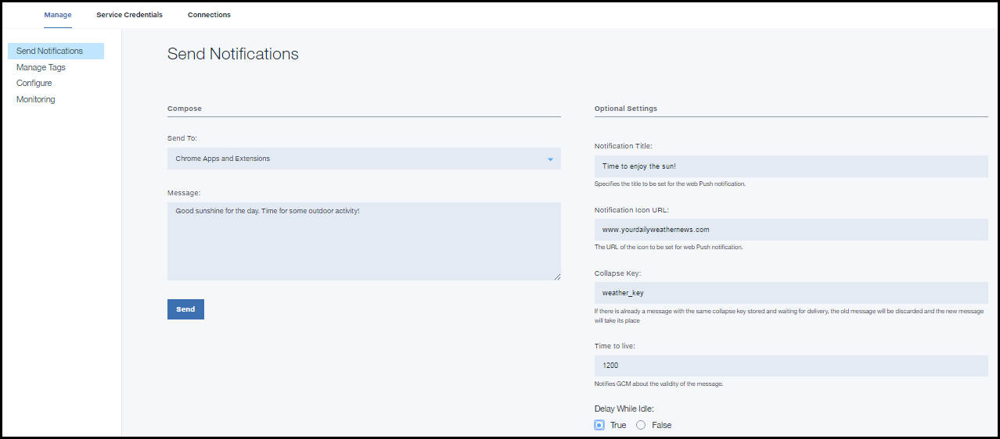

---

copyright:
 years: 2015, 2017

---

{:new_window: target="_blank"}
{:shortdesc: .shortdesc}
{:screen:.screen}
{:codeblock:.codeblock}

# Chrome アプリケーションおよびエクステンションへの基本通知の送信 
{: #web_extensions_notifications}
最終更新日: 2017 年 1 月 11 日
{: .last-updated}

アプリケーションの開発が完了したら、プッシュ通知を送信できます。 

1. **「通知の送信 (Send Notifications)」**を選択し、**「送信先 (Send To)」**オプションとして**「Web 通知 (Web Notifications)」**を選択することでメッセージを構成します。 
2. **「メッセージ」**フィールドに、配信する必要があるメッセージを入力します。
3. 以下のオプションの設定を指定することを選択できます。
  - **通知タイトル (Notification Title)**: メッセージ・アラートの見出しとして表示されるテキストです。
  - **通知アイコン URL (Notification Icon URL)**: メッセージにアプリ通知アイコンを付けて配信する必要がある場合、このフィールドにアイコンへのリンクを指定します。
  - **省略キー (Collapse key)**: 省略キーは通知にアタッチされます。デバイスがオフラインのときに、同じ省略キーを持つ複数の通知が連続して到着すると、それらは省略されます。デバイスがオンラインになると、FCM/GCM サーバーから通知を受け取り、同じ省略キーを持つ最新の通知のみを表示します。省略キーが設定されていない場合、新しいメッセージと古いメッセージの両方が将来の配信のために保管されます。
  - **存続時間**: この値は秒単位で設定します。このパラメーターを指定しないと、FCM/GCM サーバーはメッセージを 4 週間保管し、配信を試行します。4 週間が経過すると、有効期限が切れます。可能な値の範囲は、0 から 2,419,200 秒です。
  - **アイドル時は遅延 (Delay when idle)**: デバイスがアイドル状態の場合、通知を配信しないように FCM/GCM サーバーに指示するには、この値を `true` に設定します。デバイスがアイドル状態であっても通知を配信できるようにするには、この値を `false` に設定します。
  - **追加のペイロード (Additional payload)**: 通知用のカスタム・ペイロードの値を指定します。

以下のイメージは、ダッシュボードの Chrome アプリケーションおよびエクステンションの通知オプションを示しています。

  
  
## 次のステップ
  {: #next_steps_tags}

基本通知を正常にセットアップしたら、タグ・ベースの通知および詳細オプションの構成を行うことができます。

{{site.data.keyword.mobilepushshort}}サービスの以下の機能をご使用のアプリに追加します。
  タグ・ベースの通知を使用する場合は、[タグ・ベースの通知](c_tag_basednotifications.html)を参照してください。拡張通知オプションを使用する場合は、[拡張通知](t_advance_badge_sound_payload.html)を参照してください。
