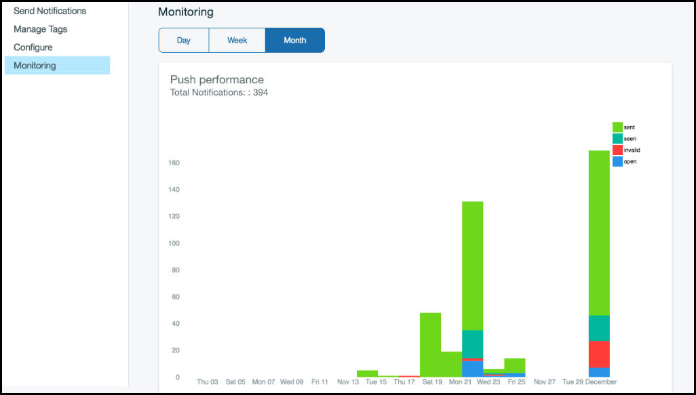
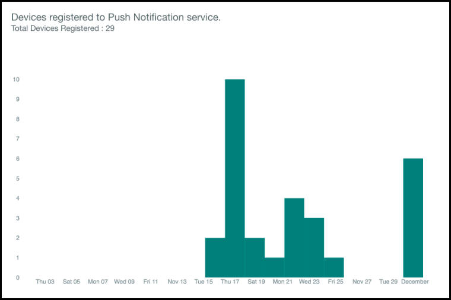

---

copyright:
 years: 2015, 2017

---

{:new_window: target="_blank"}
{:shortdesc: .shortdesc}
{:screen:.screen}
{:codeblock:.codeblock}

# プッシュ通知のモニター 
{: #monitor-notifications}
最終更新日: 2017 年 1 月 16 日
{: .last-updated}

IBM {{site.data.keyword.mobilepushshort}} サービスの機能が拡張され、ユーザー・データからグラフを生成することにより、プッシュのパフォーマンスをモニターできるようになりました。ユーティリティーを使用して、すべての送信プッシュ通知をリストするか、すべての登録デバイスをリストして、日次、週次、または月次ベースで情報を分析できます。

すべての送信通知のレポートを生成するには、[REST API](https://mobile.{DomainName}/imfpush/){: new_window} で Push Messages GET レポート・メソッドを使用します。 

すべての登録デバイスのレポートを生成するには、[REST API](https://mobile.{DomainName}/imfpush/){: new_window} で Push Device Registrations GET レポート・メソッドを使用します。

Android SDK を更新して通知情報をモニターする方法については、[Android デバイスでのプッシュ通知のモニター](c_android_enable.html#android_monitor)を参照してください。

 
