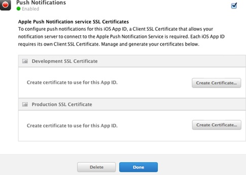
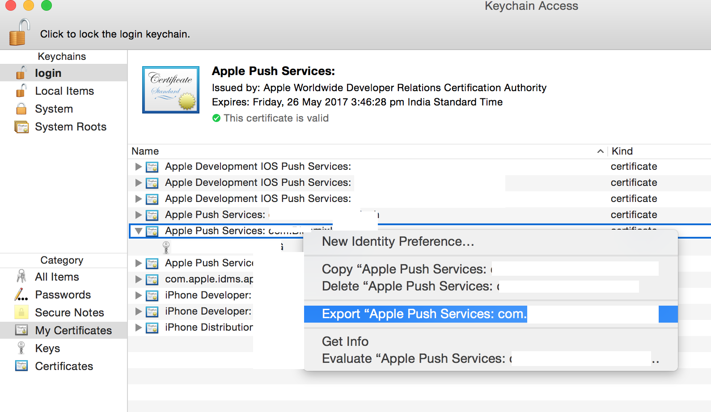

---

copyright:
 years: 2015, 2017

---

{:new_window: target="_blank"}
{:shortdesc: .shortdesc}
{:screen:.screen}
{:codeblock:.codeblock}

# APNs の資格情報の構成
{: #create-push-credentials-apns}
最終更新日: 2017 年 1 月 16 日
{: .last-updated}

Apple Push Notification Service (APNs) を使用して、アプリケーション開発者は、Bluemix (プロバイダー) 上の{{site.data.keyword.mobilepushshort}}サービス・インスタンスから iOS のデバイスおよびアプリケーションにリモート通知を送信することができます。メッセージは、デバイス上のターゲット・アプリケーションに送信されます。 

APNs の資格情報を取得して構成してください。
APNs の証明書は、{{site.data.keyword.mobilepushshort}}サービスによって安全に管理され、プロバイダーとしての APNs サーバーへの接続に使用されます。

<!-- 1. Obtain an [Apple Developers ](https://developer.apple.com/){: new_window} account.-->

<!--2. [Register an App ID](#create-push-credentials-apns-register)
3. [Create a development and distribution APNs SSL certificate](#create-push-credentials-apns-ssl)
4. [Create a development provisioning profile](#create-push-credentials-dev-profile)
5. [Create a store distribution provisioning profile](#create-push-credentials-apns-distribute_profile)
6. [Creating .p12 push certificate file for Bluemix push](#create-p12-push-certificate-file-for-Bluemix-push)
7. [Set up APNs on the Push Dashboard](#create-push-credentials-apns-dashboard)
-->

##アプリ ID の登録
{: #create-push-credentials-apns-register}

アプリ ID (バンドル ID) は、特定のアプリケーションを識別する固有の ID です。各アプリケーションにアプリ ID が必要です。{{site.data.keyword.mobilepushshort}}サービスのようなサービスが、特定のアプリ ID に対して構成されます。

1. [Apple Developers ](https://developer.apple.com/){: new_window} アカウントを持っていることを確認してください。
2. [Apple Developer ](https://developer.apple.com){: new_window}ポータルにアクセスし、**「Member Center」**をクリックし、**「Certificates, Identifiers & Profiles」**を選択します。
3. [Apple Developer Library ](https://developer.apple.com/library/mac/documentation/IDEs/Conceptual/AppDistributionGuide/MaintainingProfiles/MaintainingProfiles.html#//apple_ref/doc/uid/TP40012582-CH30-SW991){: new_window}の**「Registering App IDs」**セクションにアクセスし、指示に従って App ID を登録します。

アプリ ID を登録する際、以下のオプションを選択します。

* Push Notifications 
* Explicit ID Suffix (明示的 ID サフィックス) 
4. 開発および配布用 APNs SSL 証明書の作成。

##開発および配布用 APNs SSL 証明書の作成
{: #create-push-credentials-apns-ssl}

APNs 証明書を取得する前に、最初に証明書署名要求 (CSR) を生成し、それを Apple の認証局 (CA) にサブミットしておく必要があります。CSR には、ユーザーの会社を識別する情報および Apple プッシュ通知に署名するために使用する公開鍵と秘密鍵が含まれます。次に、iOS 開発者ポータル (iOS Developer Portal) で SSL 証明書を生成します。証明書は、公開鍵および秘密鍵と共に「キーチェーンアクセス」に保管されます。

<!-- ###Before you begin -->
<!-- {: before-you-begin-certificate} -->

<!--[Register an App ID](#create-push-credentials-apns-register)-->

APNs は、以下の 2 つのモードで使用できます。 

* サンドボックス・モード。開発およびテスト用です。
* 実動モード。App Store (またはその他のエンタープライズ配布メカニズム) を介してアプリケーションを配布するときのモードです。

開発環境と配布環境では別々の証明書を取得する必要があります。証明書は、リモート通知の受信者であるアプリのアプリ ID に関連付けられます。実動の場合、2 つまで証明書を作成できます。Bluemix は、その証明書を使用して APNs との SSL 接続を確立します。

<!-- Create a development and distribution SSL certificate. -->

1. [Apple Developer ](https://developer.apple.com){: new_window} Web サイトにアクセスし、**「Member Center」**をクリックし、**「Certificates, Identifiers & Profiles」**を選択します。
2. **「Identifiers (ID)」**エリアで、**「App IDs (アプリ ID)」**をクリックします。
3. アプリ ID のリストから、<!--newly created-->アプリ ID を選択し、次に、**「Settings (設定)」**を選択します。
4. **「Push Notifications (プッシュ通知)」**エリアで、開発 SSL 証明書を作成し、次に実動 SSL 証明書を作成します。

	

5. **「証明書署名要求 (CSR) の作成について (About Creating a Certificate Signing Request (CSR))」**画面が表示されたら、Mac で**「キーチェーンアクセス」**アプリケーションを開始して、証明書署名要求 (CSR) を作成します。
6. メニューから、**「キーチェーンアクセス」>「証明書アシスタント」>「認証局に証明書を要求…」**を選択します。 
7. **「証明書情報」**で、アプリ開発者アカウントに関連付けられている E メール・アドレスと通称を入力します。開発用 (サンドボックス) と配布用 (実動) のいずれの証明書であるかを識別するのに役立つ、分かりやすい名前にしてください。例えば、*sandbox-apns-certificate* または *production-apns-certificate* などです。
8. **「ディスクに保存」**を選択し、`.certSigningRequest` ファイルをデスクトップにダウンロードしてから、**「続ける」**をクリックします。
9. **「別名で保存」**メニュー・オプションで、`.certSigningRequest` ファイルに名前を指定し、**「保存」**をクリックします。
10. **「完了」**をクリックします。これで CSR を使用できるようになりました。
11. **「証明書署名要求 (CSR) の作成について (About Creating a Certificate Signing Request (CSR))」**ウィンドウに戻り、**「続ける」**をクリックします。 
12. **「Generate (生成)」**画面で、**「Choose File... (ファイルの選択...)」**をクリックして、デスクトップに保存した CSR ファイルを選択します。次に、**「Generate (生成)」**をクリックします。

13. 証明書ができたら、**「Done (完了)」**をクリックします。
14. **「Push Notifications (プッシュ通知)」**画面で、**「Download (ダウンロード)」**をクリックして証明書をダウンロードし、次に**「Done (完了)」**をクリックします。
15. Mac で、**「キーチェーンアクセス」 > 「自分の証明書」**に進み、新規にインストールした証明書を見つけます。証明書をダブルクリックして、それを「キーチェーンアクセス」にインストールします。
16. 「証明書」と「秘密鍵」を選択してから、**「書き出し」**を選択して、個人情報交換形式 (`.p12` 形式) に証明書を変換します。
	
17. **「別名で保存」**フィールドで、証明書に意味のある名前を指定します。例えば、`sandbox_apns.p12_certifcate` または `production_apns.p12` などです。その後、**「保存」**をクリックします。
	
18. **「パスワードの入力」**フィールドで、エクスポートされる項目を保護するためのパスワードを入力し、**「OK」**をクリックします。このパスワードは、Push ダッシュボードで APNs 設定を構成するために使用できます。{: #step18}
	
19. **「Key Access.app」**は、**「Keychain」**画面から、キーをエクスポートするように求めるプロンプトを出します。ご使用の Mac の管理パスワードを入力して、システムによるそれらの項目のエクスポートを許可し、**「常に許可」**オプションを選択します。`.p12` 証明書がデスクトップ上に生成されます。

##開発プロビジョニング・プロファイルの作成
{: #create-push-credentials-dev-profile}

プロビジョニング・プロファイルは、アプリ ID を使用して機能し、アプリをインストールして実行できるデバイス、およびアプリからアクセスできるサービスを判別します。各アプリ ID ごとに、2 つのプロビジョニング・プロファイル、すなわち、開発用に 1 つ、配布用にもう 1 つを作成します。Xcode は、開発プロビジョニング・プロファイルを使用して、アプリケーションのビルドを許可されている開発者と、アプリケーションのテストが許可されているデバイスを判別します。

アプリ ID を登録済みであること、それを {{site.data.keyword.mobilepushshort}} サービス用に使用可能化していること、および開発および実動の APNs SSL 証明書を使用するように構成済みであることを確認します。

以下のように、開発プロビジョニング・プロファイルを作成します。

1. [Apple Developer ](https://developer.apple.com){: new_window}ポータルにアクセスし、**「Member Center」**をクリックし、**「Certificates, Identifiers & Profiles」**を選択します。
2. [Mac Developer Library ](https://developer.apple.com/library/mac/documentation/IDEs/Conceptual/AppDistributionGuide/MaintainingProfiles/MaintainingProfiles.html#//apple_ref/doc/uid/TP40012582-CH30-SW62site){: new_window}にアクセスし、**「Creating Development Provisioning Profiles」**セクションにスクロールし、指示に従って開発プロファイルを作成します。
**注**: 開発プロビジョン・プロファイルを構成する際に、以下のオプションを選択します。
	* **「iOS App Development (iOS アプリ開発)」**
	* **「For iOS and watchOS apps (iOS アプリおよび watchOS アプリ用)」 **

##ストア配布プロビジョニング・プロファイルの作成
{: #create-push-credentials-apns-distribute_profile}

ストア・プロビジョニング・プロファイルを使用して、ご使用のアプリを配布用にアプリ・ストアにサブミットします。

1. [Apple Developer ](https://developer.apple.com){: new_window}ポータルにアクセスし、**「Member Center」**をクリックし、**「Certificates, Identifiers & Profiles」**を選択します。
2. ダウンロードしたプロビジョニング・プロファイルをダブルクリックして、Xcode にインストールします。
                    

##{{site.data.keyword.mobilepushshort}}ダッシュボードでの APNs のセットアップ
{: #create-push-credentials-apns-dashboard}

{{site.data.keyword.mobilepushshort}}サービスを使用して通知を送信するには、Apple Push Notification Service (APNs) で必要とされる SSL 証明書をアップロードします。REST API を使用して APNs 証明書をアップロードすることもできます。

<!-- Get your development and production APNs SSL certificate and the password associated with each type of certificate. For information, see Creating and configuring push credentials for APNs.-->

APNs に必要な証明書は、`.p12` 証明書です。これらの証明書には、アプリケーションのビルドと公開に必要な、秘密鍵と SSL 証明書が含まれています。これらの証明書は、Apple Developer Web サイト (このサイトには有効な Apple Developer アカウントが必要です) の「メンバー・センター」から生成する必要があります。開発環境 (サンドボックス) と実動 (配布) 環境には、別々の証明書が必要です。

**注**: `.cer` ファイルがキー・チェーン・アクセスに配置されたら、それをコンピューターにエクスポートして、`.p12` 証明書を作成します。

APNs の使用について詳しくは、[iOS Developer Library: Local and Push Notification Programming Guide ](https://developer.apple.com/library/ios/documentation/NetworkingInternet/Conceptual/RemoteNotificationsPG/Chapters/ProvisioningDevelopment.html#//apple_ref/doc/uid/TP40008194-CH104-SW4){: new_window}を参照してください。

「Push Notification」サービス・ダッシュボードで APNs をセットアップするには、以下の手順を実行します。

1. 「Push Notification」サービス・ダッシュボードで**「Configure (構成)」**を選択します。
2. **「モバイル」**オプションを選択し、**「APNs Push Credentials (APNs プッシュ資格情報)」**フォームの情報を更新します。
3. **「Sandbox (サンドボックス)」** (開発) または**「Production (実動)」** (配布) の該当する方を選択し、前の[ステップ](#step18)を使用して作成した `p.12` 証明書をアップロードします。
3. **「パスワード」**フィールドに、`.p12` 証明書ファイルに関連付けられているパスワードを入力し、次に**「保存」**をクリックします。

有効なパスワードを使用して証明書のアップロードに成功したら、通知の送信を開始できます。
