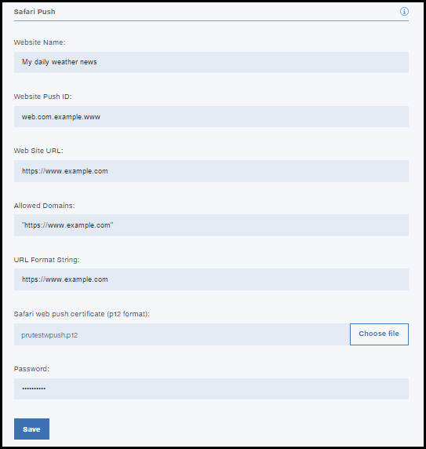

---

copyright:
 years: 2015, 2017

---

{:new_window: target="_blank"}
{:shortdesc: .shortdesc}
{:screen:.screen}
{:codeblock:.codeblock}

# Web ブラウザーの資格情報の構成
{: #configure-credential-for-browsers}
最終更新日: 2017 年 1 月 11 日
{: .last-updated}

IBM {{site.data.keyword.mobilepushshort}} サービスの機能が拡張され、ブラウザーに通知を送信できるようになりました。 

許可が必要な要求を識別するために、{{site.data.keyword.mobilepushshort}} サービスによって Web サイト URL または Web サイトのドメイン・ネームが要求されます。{{site.data.keyword.mobilepushshort}} サービス・インスタンスがサポートするのは、1 度に 1 つのドメイン・ネームのみです。したがって、Chrome、Firefox、および Safari に同じ値を設定するようにしてください。 

Chrome ブラウザーと Safari ブラウザーには、Web プッシュ用の追加構成が必要です。Chrome ではメッセージを送信するために FCM エンドポイントが使用されるため、FCM API キーが必要になります。FCM API キーを取得するには、[FCM の資格情報の構成](t_push_provider_android.html)を参照してください。

##Chrome および Firefox の Web プッシュの構成 
{: #config-chrome-firefox}

1. Push ダッシュボードで**「構成」**を選択します。
2. 「Web」タブを選択します。
	
3. プッシュ通知を受信するために登録する FCM/GCM API キーと Web サイトの URL を構成します。
4. **「保存」**をクリックします。
5. 次のステップ。[Google Chrome および Mozilla Firefox ブラウザー用の通知の使用可能化](c_enable_push.html)を行います。

## Safari Web プッシュの構成 
{: #configure-safari}

Safari でサポートされる {{site.data.keyword.mobilepushshort}} サービスのバージョンは 10.0 です。ブラウザーで通知を受信するように構成する前に、Apple Developer アカウントを介して証明書を生成する必要があります。

### 証明書の生成
{: #certificate-generation}

Apple 開発者アカウントを必ず取得しておいてください。Safari ブラウザーで通知を受け取るように構成するには、Web サイト Push ID を登録し、証明書を生成する必要があります。以下の手順を使用して、開始してください。

1. Apple Developer Member センターで、**「Certificates, ID & Profiles (証明書、ID およびプロファイル)」**をクリックします。 
2. **「Identifiers (ID)」**をクリックして、**「Website Push IDs (Web サイト Push ID)」**をクリックします。
3. プラス・アイコンを選択して、新規エントリーの作成を選択します。

4. 「Register Website Push ID (Web サイト Push ID の登録)」パネルで、適切な Web サイト Push ID の説明と識別子 ID を入力します。これは、「web」で始まる反転ドメイン名形式にすることをお勧めします。例: web.com.example.dailyweatherreports。
5. Web サイト Push ID を登録します。これで、Web サイト Push ID を使用できるようになりました。 
6. **「編集」**を選択して、Web サイト Push ID 用に使用する証明書を作成します。
7. 「Certificate Information (証明書情報)」の「Certificate Assistant (証明書アシスタント)」ウィンドウで、E メール ID と共通名を入力します。「Certificate Authority email address (認証局 E メール・アドレス)」はブランクのままにします。
8. **「Save to disk (ディスクに保存)」**をクリックし、**「続行」**を選択します。
9. 必要に応じて証明書を適切なフォルダーに保存してください。
10. 証明書を生成するためのウィザードでプロンプトが出されたときにディスク上で作成された `.certSigningRequest` を選択します。必ず `.cer` フォーマットで作成された Web サイト・プッシュ証明書をダウンロードしてください。
11. 「キーチェーンアクセス」ツールで証明書を開きます。右クリックして、p12 証明書としてエクスポートします。p12 証明書の生成時に指定したパスワードをメモしてください。

### 通知の構成
  {: #configuration-notification}
 
証明書を生成したら、通知を Safari に送信するように、サービスを構成できます。 

以下の手順を実行します。

1. 「Push Notifications」サービス・ダッシュボードで、**「構成」**をクリックします。 
2. 「Web」タブを選択します。
	 
3. 「Safari Push」セクションで、必要な情報を指定してフォームを更新します。 
	- **Website Name**: これは、「通知」センターで指定した名前です。
	- **Website Push ID**: Web サイト Push ID の反転ドメイン・ストリングを使用して更新します。例: web.com.example.www。
	- **Website URL**: プッシュ通知をサブスクライブする必要がある Web サイトの URL を指定します。例: https://www.example.com。
	- **Allowed Domains**: これは、オプション・パラメーターです。これは、ユーザーからの許可を要求する Web サイトのリストです。URL は、必ずコンマ区切りの値で指定します。これが指定されていない場合は、Web サイト URL 内の値が使用されます。 
	- **URL Format String**: 通知がクリックされたときに解決される URL。例: ["https://www.example.com"]。 URL には、http または https 方式を使用してください。
	- **Safari web push certificate**: .p12 証明書をアップロードして、パスワードを指定します。
4. **「保存」**をクリックします。	

	

これで、プッシュ通知を Safari ブラウザーに送信するように構成されました。

	
