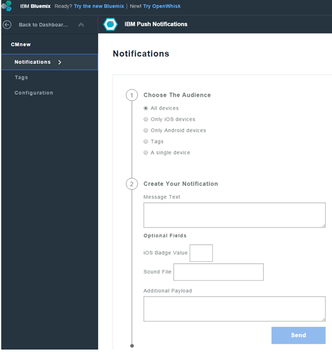
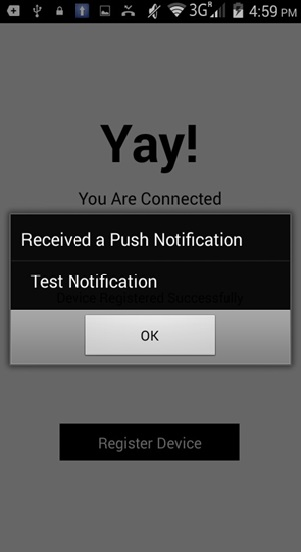

---

copyright:
 years: 2015, 2017

---

{:new_window: target="_blank"}
{:shortdesc: .shortdesc}
{:screen:.screen}
{:codeblock:.codeblock}

# 基本プッシュ通知の送信
{: #push-send-notifications}
最終更新日: 2017 年 1 月 11 日
{: .last-updated}

アプリケーションを開発したら、(タグ、バッジ、追加のペイロード、音声ファイルを使用することなく) 基本プッシュ通知を送信できます。

基本プッシュ通知を送信するには、以下にリストした手順を実行します。

1. **「通知の送信 (Send Notifications)」**を選択し、次に適切な**「送信先 (Send To)」**オプションを選択します。 

**注**: **「すべてのデバイス」**オプションを選択すると、{{site.data.keyword.mobilepushshort}}をサブスクライブしているすべてのデバイスが通知を受け取ることになります。

2. **「メッセージ」**フィールドで、メッセージを入力してから**「送信」**をクリックします。

3. デバイスが通知を受信していることを確認します。次のイメージは、Android デバイスおよび iOS デバイス上でフォアグラウンドの{{site.data.keyword.mobilepushshort}}を処理しているアラート・ボックスを示しています。

次のスクリーン・ショットは、Android のバックグラウンドでの{{site.data.keyword.mobilepushshort}}を示しています。

