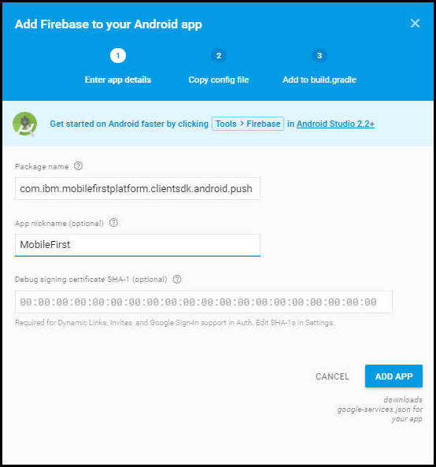

---

copyright:
years: 2015, 2017

---

{:new_window: target="_blank"}
{:shortdesc: .shortdesc}
{:screen:.screen}
{:codeblock:.codeblock}

# {{site.data.keyword.mobilepushshort}}를 수신하도록 Android 애플리케이션 설정
{: #tag_based_notifications}
마지막 업데이트 날짜: 2017년 1월 16일
{: .last-updated}

Android 애플리케이션에서 사용자 디바이스에 푸시 알림을 수신하도록 설정할 수 있습니다. Android Studio는 필수 소프트웨어이며 이를 사용하여 Android 프로젝트를 빌드하는 것이 좋습니다. Android Studio에 대한 기본 지식이 반드시 있어야 합니다. 

## Gradle을 사용하여 클라이언트 푸시 SDK 설치
{: #android_install}

이 섹션에서는 클라이언트 푸시 SDK를 설치하고 이를 사용하여 추가적으로 Android 애플리케이션을 개발하는 방법에 대해 설명합니다.

Gradle을 사용하여 Bluemix® 모바일 서비스 푸시 SDK를 추가할 수 있습니다. Gradle은 저장소에서 아티팩트를 자동으로 다운로드하여 Android 애플리케이션에 제공합니다. Android Studio 및 Android Studio SDK를 올바로 설정해야 합니다. 시스템을 설정하는 방법에 대한 자세한 정보는 [Android Studio 개요 ](https://developer.android.com/tools/studio/index.html){: new_window}을 참조하십시오. Gradle에 대한 자세한 정보는 [Gradle 빌드 구성 ](http://developer.android.com/tools/building/configuring-gradle.html){: new_window}을 참조하십시오.

모바일 애플리케이션을 작성하고 연 후 Android Studio를 사용하여 다음 단계를 완료하십시오. 

1. 모듈 레벨 **build.gradle** 파일에 종속 항목을 추가하십시오.  	

	- 다음 종속 항목을 추가하여 Bluemix™ 모바일 서비스 푸시 클라이언트 SDK 및 Google 플레이 서비스 SDK를 사용자의 컴파일 범위 종속 항목에 추가하십시오. 
	```
	com.ibm.mobilefirstplatform.clientsdk.android:push:3.+
	```
    	{: codeblock}
	
	- 코드 스니펫에 필요한 import 문에 다음 종속 항목을 추가하십시오. 
	```
	import com.ibm.mobilefirstplatform.clientsdk.android.core.api.BMSClient;
	import com.ibm.mobilefirstplatform.clientsdk.android.push.api.MFPPush;
	import com.ibm.mobilefirstplatform.clientsdk.android.push.api.MFPPushException;
	import com.ibm.mobilefirstplatform.clientsdk.android.push.api.MFPPushResponseListener;
	import com.ibm.mobilefirstplatform.clientsdk.android.push.api.MFPPushNotificationListener;
	import com.ibm.mobilefirstplatform.clientsdk.android.push.api.MFPSimplePushNotification;
	```
    	{: codeblock}

	- 끝에 있는 모듈 레벨 **build.gradle** 파일에 다음 종속 항목을 추가하십시오.
	```
		apply plugin: 'com.google.gms.google-services'
	```
		{: codeblock}
3. 프로젝트 레벨 **build.gradle** 파일에 다음 종속 항목을 추가하십시오. 
```
dependencies {
    classpath 'com.android.tools.build:gradle:3.0.0'
    classpath 'com.google.gms:google-services:3.0.0'
}
``` 
    {: codeblock}
5. **AndroidManifest.xml** 파일에서 다음 권한을 추가하십시오. 샘플 Manifest를 보려면 [Android helloPush 샘플 애플리케이션 ](https://github.com/ibm-bluemix-mobile-services/bms-samples-android-hellopush/blob/master/helloPush/app/src/main/AndroidManifest.xml){: new_window}을 참조하십시오. 샘플 Gradle 파일을 보려면 [샘플 빌드 Gradle 파일 ](https://github.com/ibm-bluemix-mobile-services/bms-samples-android-hellopush/blob/master/helloPush/app/build.gradle){: new_window}을 참조하십시오.
```
<uses-permission android:name="android.permission.INTERNET"/>
<uses-permission android:name="android.permission.GET_ACCOUNTS" />
<uses-permission android:name="android.permission.USE_CREDENTIALS" />
<uses-permission android:name="android.permission.WRITE_EXTERNAL_STORAGE" />
<uses-permission android:name="android.permission.ACCESS_WIFI_STATE"/>
```
	{: codeblock}
 여기에서 [Android 권한 ](http://developer.android.com/guide/topics/security/permissions.html "외부 링크 아이콘"){: new_window}에 대해 자세히 보십시오.

4. 활동에 대한 알림 의도 설정을 추가하십시오. 사용자가 알림 영역에서 수신한 알림을 클릭할 경우 이 설정을 통해 애플리케이션이 시작됩니다. 
```
<intent-filter>
	<action android:name="Your_Android_Package_Name.IBMPushNotification"/>
	<category  android:name="android.intent.category.DEFAULT"/>
</intent-filter>
```
	{: codeblock}
**참고**: 위의 조치에서 *Your_Android_Package_Name*을 사용자 애플리케이션에서 사용되는 애플리케이션 패키지 이름으로 대체하십시오.

5. RECEIVE 및 REGISTRATION 이벤트 통지용으로 FCM(Firebase Cloud Messaging) 또는 GCM(Google Cloud Messaging) 의도 서비스 및 의도 필터를 추가하십시오. 
```
<service android:name="com.ibm.mobilefirstplatform.clientsdk.android.push.api.MFPPushIntentService"
    android:exported="true" >
    <intent-filter>
        <action android:name="com.google.firebase.MESSAGING_EVENT" />
    </intent-filter>
</service>
<service
    android:name="com.ibm.mobilefirstplatform.clientsdk.android.push.api.MFPPush"
    android:exported="true" >
    <intent-filter>
        <action android:name="com.google.firebase.INSTANCE_ID_EVENT" />
    </intent-filter>
</service>
```
    {: codeblock}

6. {{site.data.keyword.mobilepushshort}} 서비스는 알림 트레이에서 개별 알림을 검색하도록 지원합니다. 알림 트레이에서 액세스하는 알림의 경우 클릭하는 알림에 대한 핸들만 사용자에게 제공됩니다. 애플리케이션이 정상적으로 열리면 모든 알림이 표시됩니다. 이 기능을 사용하려면 다음 스니펫으로 **AndroidManifest.xml** 파일을 업데이트하십시오. 

```
<activity android:name="
com.ibm.mobilefirstplatform.clientsdk.android.push.api.MFPPushNotificationHandler"
android:theme="@android:style/Theme.NoDisplay"/>
```
    {: codeblock}

FCM 프로젝트를 설정하고 신임 정보를 얻으려면 [발신인 ID 및 API 키 가져오기](t_push_provider_android.html)를 참조하십시오. FCM(Firebase Cloud Messaging) 콘솔을 사용하여 다음 단계를 완료하십시오. 

1. Firebase 콘솔에서 **프로젝트 설정** 아이콘을 클릭하십시오.
	

3. 앱 분할창의 일반 탭에서 **앱 추가** 또는 **Android 앱에 Firebase 추가 아이콘**을 선택하십시오.
    

4. Android 앱에 Firebase 추가 창에서 패키지 이름으로 **com.ibm.mobilefirstplatform.clientsdk.android.push**를 추가하십시오. 앱 닉네임 필드는 선택사항입니다. **앱 추가**를 클릭하십시오.
    

5. 'Android 앱에 Firebase 추가' 창에서 패키지 이름을 입력하여 애플리케이션의 패키지 이름을 포함하십시오. 앱 닉네임 필드는 선택사항입니다. **앱 추가**를 클릭하십시오.  

	

6. `google-services.json` 파일이 생성됩니다. `google-services.json` 파일을 Android 애플리케이션 모듈 루트 디렉토리에 복사하십시오. `google-service.json` 파일에 추가된 패키지 이름이 포함됩니다. 

    

5. Android 앱에 Firebase 추가 창에서 **계속**을 클릭하고 **완료**를 클릭하십시오. 

  

애플리케이션을 빌드하고 실행하십시오. 

## Android 앱을 위한 푸시 SDK 초기화
{: #android_initialize}

초기화 코드를 배치하는 공통 위치는 Android 애플리케이션에서 기본 활동의 onCreate 메소드입니다. 초기화해야 하는 두 개의 SDK 컴포넌트가 있습니다. 하나는 코어 SDK이고 다른 하나는 코어 SDK 위에 빌드되는 푸시 SDK입니다. 

###Core SDK 초기화

```
// Initialize the SDK for Android
    BMSClient.getInstance().initialize(this, BMSClient.REGION_US_SOUTH);
```
    {: codeblock}

####bluemixRegionSuffix
{: bluemixRegionSuffix}

앱이 호스트된 위치를 지정합니다. 다음 세 값 중 하나를 사용할 수 있습니다. 

- BMSClient.REGION_US_SOUTH
- BMSClient.REGION_UK
- BMSClient.REGION_SYDNEY

###클라이언트 푸시 SDK 초기화

```
//Initialize client Push SDK for Java
MFPPush push = MFPPush.getInstance();
push.initialize(getApplicationContext(), "appGUID", "clientSecret");
```
	{: codeblock}

####AppGUID
{: appguid_initialize_client_push_sdk}

{{site.data.keyword.mobilepushshort}} 서비스의 AppGUID 키입니다. 이 값은 대소문자를 구분합니다. 푸시 알림 대시보드를 열고 구성 탭을 선택하십시오. 푸시 알림 서비스 대시보드에 있는 구성 탭의 모바일 옵션에서 이 값을 가져올 수 있습니다.  

## Android 디바이스 등록
{: #android_register}

`MFPPush.register()` API를 사용하여 {{site.data.keyword.mobilepushshort}} 서비스에 디바이스를 등록합니다. Android 디바이스에서 사용하도록 등록하는 경우 Bluemix {{site.data.keyword.mobilepushshort}} 서비스 구성 대시보드에 FCM(Firebase Cloud Messaging) 또는 GCM(Google Cloud Messaging) 정보를 추가하십시오. 자세한 정보는 [GCM(Google Cloud Messaging)의 신임 정보 구성](t_push_provider_android.html)을 참조하십시오. 

다음 코드 스니펫을 Android 모바일 애플리케이션에 복사하십시오. 

```
//Register Android devices
	push.registerDevice(new MFPPushResponseListener<String>() {
	    @Override
	    public void onSuccess(String deviceId) {
	           //handle success here
	    }
	    @Override
    public void onFailure(MFPPushException ex) {
         //handle failure here
	    }
	});
```
	{: codeblock}


```
//Handles the notification when it arrives
	MFPPushNotificationListener notificationListener = new MFPPushNotificationListener() {
	    @Override
	    public void onReceive (final MFPSimplePushNotification message){
	      // Handle Push Notification
	    }
	};
```
	{: codeblock}

## Android 디바이스에서 푸시 알림 수신
{: #android_receive}

notificationListener 오브젝트를 푸시에 등록하려면 **MFPPush.listen()** 메소드를 호출하십시오. 푸시 알림을 처리하는 활동의 **onResume()** 메소드에서 일반적으로 이 메소드가 호출됩니다. 

1. notificationListener 오브젝트를 푸시에 등록하려면 **listen()** 메소드를 호출하십시오. 이 메소드는 일반적으로 푸시 알림을 처리하는 활동의 **onResume()** 및 **onPause** 메소드에서 호출됩니다. 


```
@Override
	protected void onResume(){
	   super.onResume();
	   if(push != null) {
	       push.listen(notificationListener);
	   }
	}
```
	{: codeblock}


```
@Override
protected void onPause() {
super.onPause();
    if (push != null) {
                push.hold();
    }
}
```
	{: codeblock}

2. 프로젝트를 빌드하고 디바이스 또는 에뮬레이터에서 이를 실행하십시오. register() 메소드의 응답 리스너에 대해 onSuccess() 메소드가 호출되면 디바이스가 {{site.data.keyword.mobilepushshort}} 서비스에 정상적으로 등록된 것입니다. 이 때 기본 푸시 알림 전송에 설명된 대로 메시지를 보낼 수 있습니다. 
3. 디바이스가 알림을 수신했는지 확인하십시오. 애플리케이션이 포그라운드에 있는 경우 **MFPPushNotificationListener**에 의해 알림이 처리됩니다. 애플리케이션이 백그라운드에 있는 경우 알림 막대에 메시지가 표시됩니다. 

## Android 디바이스에서 푸시 알림 모니터링
{: #android_monitor}

`com.ibm.mobilefirstplatform.clientsdk.android.push.api.MFPPushNotificationStatusListener` 인터페이스를 구현하고 onStatusChange(String messageId, MFPPushNotificationStatus status) 메소드를 정의하여 애플리케이션 내의 현재 알림 상태를 모니터할 수 있습니다.  

**messageId**는 서버에서 발송한 메시지의 ID입니다. **MFPPushNotificationStatus**는 알림 상태를 값으로 정의합니다. 

- **RECEIVED** - 앱에서 알림을 수신한 상태입니다.  
- **QUEUED** - 앱에서 알림 리스너 호출을 대기하도록 알림을 대기시킨 상태입니다.  
- **OPENED** - 트레이에서 알림을 클릭하거나 앱 아이콘에서 실행하거나 앱이 포그라운드에 있을 때 사용자가 알림을 연 상태입니다.  
- **DISMISSED** - 사용자가 트레이의 알림을 선택 취소하거나 해제하는 상태입니다. 

**com.ibm.mobilefirstplatform.clientsdk.android.push.api.MFPPushNotificationStatusListener** 클래스를 MFPPush와 함께 등록해야 합니다. 

```
push.setNotificationStatusListener(new MFPPushNotificationStatusListener() {
@Override
public void onStatusChange(String messageId, MFPPushNotificationStatus status) {
// Handle status change
}
});
```
    {: codeblock}


### DISMISSED 상태 청취

다음 조건 중 하나에 대한 DISMISSED 상태를 청취하도록 선택할 수 있습니다. 

- 앱이 활성인 경우(포그라운드 또는 백그라운드에서 실행 중)

  `AndroidManifest.xml` 파일에 스니펫을 추가하십시오. 

```
<receiver android:name="com.ibm.mobilefirstplatform.clientsdk.android.push.api.MFPPushNotificationDismissHandler">
<intent-filter>
<action android:name="Your_Android_Package_Name.Cancel_IBMPushNotification"/>
</intent-filter>
</receiver>
```
	{: codeblock}

- 앱이 활성(포그라운드 또는 백그라운드에서 실행 중)이면서 실행 중이 아닌 경우(종료됨)

**com.ibm.mobilefirstplatform.clientsdk.android.push.api.MFPPushNotificationDismissHandler** 브로드캐스트 수신기를 확장하고 **onReceive()** 메소드를 대체해야 합니다. 여기서 기본 클래스의 메소드 **onReceive()**를 호출하기 전에 **MFPPushNotificationStatusListener**를 등록해야 합니다. 

```
public class MyDismissHandler extends MFPPushNotificationDismissHandler {
@Override
public void onReceive(Context context, Intent intent) {
MFPPush.getInstance().setNotificationStatusListener(new MFPPushNotificationStatusListener() {
@Override
public void onStatusChange(String messageId, MFPPushNotificationStatus status) {
// Handle status change
}
});
super.onReceive(context, intent);
}
}
```
    {: codeblock}


다음 스니펫을 `AndroidManifest.xml` 파일에 추가하십시오. 

```
<receiver android:name="Your_Android_Package_Name.Your_Handler">
<intent-filter>
<action android:name="Your_Android_Package_Name.Cancel_IBMPushNotification"/>
</intent-filter>
</receiver>
```
    {: codeblock}

## 기본 {{site.data.keyword.mobilepushshort}} 전송
{: #send}

애플리케이션을 개발한 후에는 기본 푸시 알림을 전송할 수 있습니다. 

기본 푸시 알림을 전송하려면 다음 단계를 완료하십시오. 

1. **알림 전송**을 선택하고 **받는 사람** 옵션을 선택하여 메시지를 작성하십시오. 지원되는 옵션은 **태그별 디바이스**, **디바이스 ID**, **사용자 ID**, **Android 디바이스**, **iOS 디바이스**, **웹 알림** 및 **모든 디바이스**입니다.
**참고**: **모든 디바이스** 옵션을 선택하는 경우 {{site.data.keyword.mobilepushshort}}를 구독하는 모든 디바이스가 알림을 수신합니다.


2. **메시지** 필드에 메시지를 작성하십시오. 필요에 따라 선택적 옵션을 구성하도록 선택하십시오.
3. **전송**을 클릭하십시오. 
3. 디바이스가 알림을 수신했는지 확인하십시오. 

다음 스크린샷은 Android 디바이스의 포그라운드에서
푸시 알림을 처리하는 경보 상자를 표시합니다.


다음 스크린샷은 Android의 백그라운드에 있는 푸시 알림을 보여줍니다.


### 알림 전송을 위한 선택적 Android 설정
{: #send_otpional_setting}

Android 디바이스에 알림을 전송하기 위해 {{site.data.keyword.mobilepushshort}} 설정을 추가로 사용자 정의할 수 있습니다. 다음과 같은 선택적 사용자 정의 옵션이 지원됩니다.


- **접기 키**: 접기 키는 알림에 첨부됩니다. 디바이스가 오프라인 상태일 때 접기 키가 동일한 여러 개의 알림이 순차적으로 도착하는 경우 해당 알림은 접혀 있습니다. 디바이스가 온라인 상태가 되면 FCM/GCM 서버에서 알림을 수신하고 동일한 접기 키가 있는 최신 알림만 표시합니다. 접기 키가 설정되어 있지 않는 경우에는 나중에 전달할 수 있도록 새 메시지와 이전 메시지가 모두 저장됩니다.
- **사운드**: 알림을 수신할 때 재생되는 사운드 클립을 표시합니다. 기본값 또는 앱에 번들링된 사운드 리소스의 이름을 지원합니다.
- **아이콘**: 알림과 관련하여 표시할 아이콘의 이름을 지정합니다. 클라이언트 애플리케이션을 사용하여 res/drawable 폴더에 아이콘을 패키지했는지 확인하십시오. 
- **우선순위**: 메시지에 전달 우선순위를 지정하는 옵션을 지정합니다. `high` 또는 `max` 우선순위를 지정한 메시지는 heads-up 알림이 되는 반면, `low` 또는 `default` 우선순위 메시지는 휴면 디바이스에서 네트워크 연결을 열지 않습니다. 이 옵션을 `min`으로 설정한 메시지는 자동 알림이 됩니다.
- **가시성**: 알림 가시성 옵션을 `public` 또는 `private`으로 설정할 수 있습니다. `private` 옵션은 일반 사용자가 볼 수 없도록 제한하며, 디바이스가 핀 또는 패턴으로 보호되거나 알림 설정이 "민감한 알림 컨텐츠 숨기기"로 설정된 경우 이 옵션을 사용하도록 선택할 수 있습니다. 가시성을 `private`으로 설정하는 경우에는 "redact" 필드를 언급해야 합니다. redact 필드에 지정된 컨텐츠만 디바이스의 보안 잠금 화면에 표시됩니다. `public`을 선택하면 알림이 누구나 읽을 수 있도록 렌더링됩니다.
- **유효 기간**: 이 값은 초 단위로 설정됩니다. 이 매개변수를 지정하지 않는 경우 FCM/GCM 서버는 메시지를 4주 동안 저장하고 전달하려고 합니다. 4주 후에 유효성이 만료됩니다. 가능한 값 범위는 0 - 2,419,200초입니다.
- **유휴 시 지연**: 이 값을 `true`로 설정하면 디바이스가 유휴 상태인 경우 FCM/GCM 서버가 알림을 전달하지 않습니다. 디바이스가 유휴 상태인 경우에도 알림이 전달되도록 하려면 이 값을 `false`로 설정하십시오.
- **동기화**: 이 옵션을 `true`로 설정하면 등록된 모든 디바이스에서 알림이 동기화됩니다. 하나의 사용자 이름을 갖는 사용자에게 동일한 애플리케이션이 설치된 여러 개의 디바이스가 있는 경우, 하나의 디바이스에서 알림을 읽으면 나머지 디바이스에서 해당 알림이 삭제됩니다. 사용자 ID를 사용하여 {{site.data.keyword.mobilepushshort}} 서비스에 등록한 경우에만 이 옵션이 작동합니다.
- **추가 페이로드**: 알림에 대한 사용자 정의 페이로드 값을 지정합니다.


## 다음 단계
{: #next_steps_tags}

정상적으로 기본 알림을 설정한 후 태그 기반 알림 및 고급 옵션을 구성할 수 있습니다. 

이러한 푸시 알림 서비스 기능을 앱에 추가하십시오.
태그 기반 알림을 사용하려면 [태그 기반 알림](c_tag_basednotifications.html)을 참조하십시오.
고급 알림 옵션을 사용하려면 [고급 푸시 알림 사용](t_advance_badge_sound_payload.html)의 내용을 참조하십시오. 
