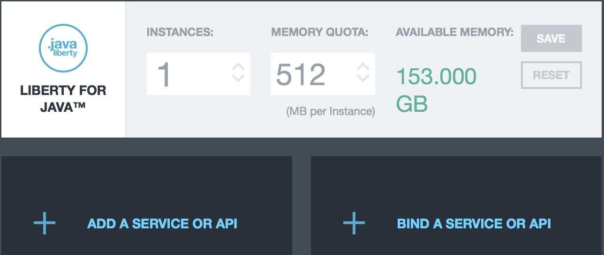

---

copyright:
 years: 2015, 2017

---

{:new_window: target="_blank"}
{:shortdesc: .shortdesc}
{:screen:.screen}
{:codeblock:.codeblock}

# 바인딩하지 않은 Android용 {{site.data.keyword.mobilepushshort}} 서비스 작성
{: #create_android_unbound}
마지막 업데이트 날짜: 2017년 1월 11일
{: .last-updated}

{{site.data.keyword.mobilepushshort}} 서비스 인스턴스를 작성하십시오. 백엔드 애플리케이션에 바인드하지 않아도 {{site.data.keyword.mobilepushshort}} 서비스 인스턴스를 사용할 수 있습니다. 

1. {{site.data.keyword.mobilepushshort}} 서비스 인스턴스를 Bluemix 애플리케이션에 바인드하십시오. 바인딩 시 서비스와 관련된 모든 세부사항이 JSON 형식으로 VCAP_SERVICES 환경 변수에 저장됨을 확인할 수 있습니다.  


 2. **바인드**를 클릭하고 바인드할 {{site.data.keyword.mobilepushshort}} 서비스 인스턴스를 선택하십시오. 애플리케이션이 {{site.data.keyword.mobilepushshort}} 서비스에 바인드되면 서비스에 대한 정보가 JSON 형식으로 앱의 VCAP_SERVICES 환경 변수에 저장됩니다. 예:  
```
 	{
    "imfpush_Dev": [
   {
     "name": "myname_sampleUnbound",
         "label": "imfpush_Dev",
         "plan": "Basic",
         "credentials": null
      }
    ]
    }
```
	{: codeblock}
