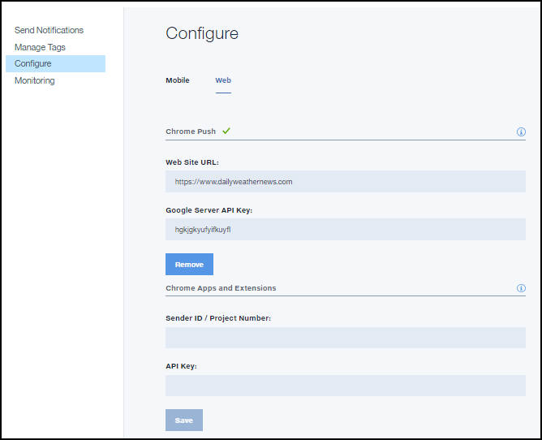

---

copyright:
 years: 2015, 2017

---

{:new_window: target="_blank"}
{:shortdesc: .shortdesc}
{:screen:.screen}
{:codeblock:.codeblock}

# 웹 브라우저의 신임 정보 구성
{: #configure-credential-for-browsers}
마지막 업데이트 날짜: 2017년 1월 11일
{: .last-updated}

IBM {{site.data.keyword.mobilepushshort}} 서비스는 이제 기능을 확장하여 사용자의 브라우저에 알림을 전송합니다. 

{{site.data.keyword.mobilepushshort}} 서비스에서 허용해야 할 요청을 식별하려면 웹 사이트 URL 또는 웹 사이트의 도메인 이름이 필요합니다. {{site.data.keyword.mobilepushshort}} 서비스 인스턴스는 한 번에 하나의 도메인 이름만 지원합니다. 그러므로 Chrome, Firefox 및 Safari에 동일한 값이 설정되는지 확인하십시오. 

Chrome 및 Safari 브라우저에서는 웹 푸시를 위해 추가 구성이 필요합니다. FCM 엔드포인트를 사용하여 Chrome에서 메시지를 제공하므로 FCM API 키가 필요합니다. FCM API 키를 얻으려면 [FCM의 신임 정보 구성](t_push_provider_android.html)을 참조하십시오.

##Chrome 및 Firefox 웹 푸시 구성 
{: #config-chrome-firefox}

1. 푸시 대시보드 패널에서 **구성**을 선택하십시오.
2. 웹 탭을 선택하십시오.
	
3. 푸시 알림을 수신하도록 등록할 웹 사이트의 URL과 FCM/GCM API 키를 구성하십시오. 
4. **저장**을 클릭하십시오.
5. 다음 단계. [Google Chrome 및 Mozilla Firefox 브라우저에 알림 사용](c_enable_push.html).

## Safari 웹 푸시 구성 
{: #configure-safari}

Safari에서 {{site.data.keyword.mobilepushshort}} 서비스에 지원되는 버전은 10.0입니다. Apple Developer 계정을 통해 인증서를 생성해야 알림을 받도록 브라우저를 구성할 수 있습니다.

### 인증서 생성
{: #certificate-generation}

Apple 개발자 계정이 있는지 확인하십시오. 알림을 수신하도록 Safari 브라우저를 구성하려면 웹 사이트 푸시 ID를 등록하고 인증서를 생성해야 합니다. 다음 단계를 수행하면 시작에 도움이 됩니다. 

1. Apple 개발자 구성원 센터에서 **인증서, ID 및 프로파일**을 클릭하십시오.  
2. **ID**를 클릭한 후 **웹 사이트 푸시 ID**를 클릭하십시오. 
3. 더하기 아이콘을 선택하여 새 항목을 작성하도록 선택하십시오.
  

4. 웹 사이트 푸시 ID 등록 패널에서 적절한 웹 사이트 푸시 ID 설명 및 식별자 ID를 제공하십시오. 'web'으로 시작하는 역 도메인 이름 형식을 사용하는 것이 좋습니다. 예: web.com.example.dailyweatherreports.
5. 웹 사이트 푸시 ID를 등록하십시오. 사용자의 웹 사이트 푸시 ID가 생성됩니다.  
6. **편집**을 선택하여 웹 사이트 푸시 ID에 사용할 인증서를 생성하십시오. 
7. 인증서 정보의 인증서 지원 창에서 이메일 ID와 공통 이름을 제공하십시오. 인증 기관 이메일 주소는 공백으로 두십시오. 
8. **디스크에 저장**을 클릭하고 **계속**을 선택하십시오. 
9. 인증서를 적절한 폴더에 저장하도록 선택하십시오. 
10. 마법사에서 인증서를 생성하도록 프롬프트하면 디스크에 작성된 `.certSigningRequest`를 선택하십시오. `.cer` 형식으로 작성된 웹 사이트 푸시 인증서를 다운로드해야 합니다. 
11. KeyChain Access 도구에서 인증서를 여십시오. 마우스 오른쪽 단추를 클릭하고 p12 인증서로 내보내십시오. p12 인증서 생성 중에 입력한 비밀번호를 기록하십시오. 

### 알림 구성
  {: #configuration-notification}
 
인증서를 생성한 후에 서비스를 구성하여 알림을 Safari로 보낼 수 있습니다.  

다음 단계를 완료하십시오. 

1. 푸시 알림 서비스 대시보드에서 **구성을 클릭**하십시오. 
2. 웹 탭을 선택하십시오. 
3. Safari 푸시 섹션에서 필수 정보로 양식을 업데이트하십시오.  
	- **웹 사이트 이름**: 알림 센터에서 입력한 이름입니다. 
	- **웹 사이트 푸시 ID**: 웹 사이트 푸시 ID에 대한 역 도메인 문자열로 업데이트하십시오. 예: web.com.example.www.
	- **웹 사이트 URL**: 푸시 알림에 등록될 웹 사이트의 URL을 입력하십시오. 예: https://www.example.com.
	- **허용 도메인**: 선택적 매개변수입니다. 사용자에게 권한을 요청하는 웹 사이트 목록입니다. URL은 쉼표로 구분된 값이어야 합니다. 이 값을 입력하지 않으면 웹 사이트 URL 값을 사용합니다.  
	- **URL 형식 문자열**: 알림을 클릭할 때 분석할 URL입니다. 예: ["https://www.example.com"]. 이 URL은 http 또는 https 체계를 사용해야 합니다. 
	- **Safari 웹 푸시 인증서**: .p12 인증서를 업로드하고 비밀번호를 입력하십시오. 
4. **저장**을 클릭하십시오.	

	

이제 Safari 브라우저로 푸시 알림을 전송하는 구성이 완료되었습니다. 

	
