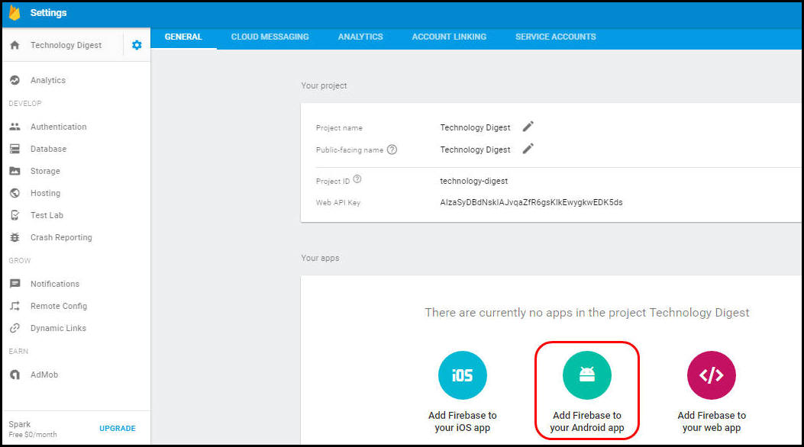

---

copyright:
years: 2015, 2017

---

{:new_window: target="_blank"}
{:shortdesc: .shortdesc}
{:screen:.screen}
{:codeblock:.codeblock}

# Ativando aplicativos Android para receber {{site.data.keyword.mobilepushshort}}
{: #tag_based_notifications}
Última atualização: 14 de fevereiro de 2017
{: .last-updated}

É possível ativar os aplicativos do Android para receber notificações push para os seus dispositivos. O Android Studio é um pré-requisito e é o método recomendado para construir projetos Android. Um conhecimento de configuração básica de Android Studio é essencial.

## Instalando o Client Push SDK com Gradle
{: #android_install}

Esta seção descreve como instalar e usar o Client Push SDK para desenvolver ainda mais os aplicativos Android.

O Bluemix® Mobile Services Push SDK pode ser incluído usando o Gradle. O Gradle faz download automaticamente dos artefatos de repositórios e os disponibiliza para seu aplicativo Android. Assegure-se de configurar corretamente o Android Studio e o Android Studio SDK. Para obter mais informações sobre como configurar seu sistema, veja a [Visão geral do Android Studio ](https://developer.android.com/tools/studio/index.html){: new_window}. Para obter informações sobre o Gradle, veja [Configurando construções do Gradle ](http://developer.android.com/tools/building/configuring-gradle.html){: new_window}.

Após a criação e a abertura do seu aplicativo móvel, conclua as etapas a seguir usando o Android Studio.

1. Inclua dependências em seu arquivo de nível Módulo **build.gradle**. 	

	- Inclua a dependência a seguir para incluir o SDK do cliente Push dos serviços do Bluemix™ Mobile e o SDK dos serviços do Google Play em suas dependências do escopo de compilação.
	```
	com.ibm.mobilefirstplatform.clientsdk.android:push:3.+
	```
    	{: codeblock}
	
	- Inclua as dependências a seguir para importar instruções que são requeridas para os fragmentos de código.
	```
	import com.ibm.mobilefirstplatform.clientsdk.android.core.api.BMSClient;
	import com.ibm.mobilefirstplatform.clientsdk.android.push.api.MFPPush;
	import com.ibm.mobilefirstplatform.clientsdk.android.push.api.MFPPushException;
	import com.ibm.mobilefirstplatform.clientsdk.android.push.api.MFPPushResponseListener;
	import com.ibm.mobilefirstplatform.clientsdk.android.push.api.MFPPushNotificationListener;
	import com.ibm.mobilefirstplatform.clientsdk.android.push.api.MFPSimplePushNotification;
	```
    	{: codeblock}

	- Inclua a dependência a seguir no arquivo de nível Módulo **build.gradle** no final.
	```
		apply plugin: 'com.google.gms.google-services'
	```
		{: codeblock}
3. Inclua as dependências a seguir para o seu arquivo de nível Projeto **build.gradle**.
```
dependencies {
    classpath 'com.android.tools.build:gradle:2.2.3'
    classpath 'com.google.gms:google-services:3.0.0'
}
``` 
    {: codeblock}
5. No arquivo **AndroidManifest.xml**, inclua as permissões a seguir. Para visualizar um manifest de amostra, veja [Aplicativo de amostra helloPush Android ](https://github.com/ibm-bluemix-mobile-services/bms-samples-android-hellopush/blob/master/helloPush/app/src/main/AndroidManifest.xml){: new_window}. Para visualizar um arquivo Gradle de amostra, veja [Arquivo Gradle de construção de amostra ](https://github.com/ibm-bluemix-mobile-services/bms-samples-android-hellopush/blob/master/helloPush/app/build.gradle){: new_window}.
```
	<uses-permission android:name="android.permission.INTERNET"/>
	<uses-permission android:name="android.permission.GET_ACCOUNTS" />
	<uses-permission android:name="android.permission.USE_CREDENTIALS" />
	<uses-permission android:name="android.permission.WRITE_EXTERNAL_STORAGE" />
	<uses-permission android:name="android.permission.ACCESS_WIFI_STATE"/>
```
	{: codeblock}
 Leia mais sobre as [Permissões do Android ](http://developer.android.com/guide/topics/security/permissions.html){: new_window} aqui.

4. Inclua as configurações de intento de notificação da atividade. Essa configuração inicia o aplicativo quando o usuário clica na notificação recebida da área de notificação.
```
	<intent-filter>
	<action android:name="Your_Android_Package_Name.IBMPushNotification"/>
	<category  android:name="android.intent.category.DEFAULT"/>
	</intent-filter>
```
	{: codeblock}
**Nota**: substitua *Your_Android_Package_Name* na ação anterior pelo nome do pacote de aplicativos usado em seu aplicativo.

5. Inclua o serviço de intenção e os filtros de intenção do Firebase Cloud Messaging (FCM) ou do Google Cloud Messaging (GCM) para as notificações de eventos RECEIVE e REGISTRATION.
```
	<service android:name="com.ibm.mobilefirstplatform.clientsdk.android.push.api.MFPPushIntentService"
    android:exported="true" >
    	<intent-filter>
        <action android:name="com.google.firebase.MESSAGING_EVENT" />
    </intent-filter>
	</service>
<service
    android:name="com.ibm.mobilefirstplatform.clientsdk.android.push.api.MFPPush"
    android:exported="true" >
    <intent-filter>
        <action android:name="com.google.firebase.INSTANCE_ID_EVENT" />
    </intent-filter>
	</service>
```
    {: codeblock}

6. O serviço {{site.data.keyword.mobilepushshort}} suporta a recuperação de notificações individuais a partir da bandeja de notificação. Para notificações acessadas a partir da bandeja de notificação, você receberá um identificador somente para a notificação que estiver sendo clicada. Todas as notificações são exibidas quando o aplicativo é aberto normalmente. Para usar essa funcionalidade, atualize o seu arquivo **AndroidManifest.xml** com o fragmento a seguir:

```
	<activity android:name="
com.ibm.mobilefirstplatform.clientsdk.android.push.api.MFPPushNotificationHandler"
android:theme="@android:style/Theme.NoDisplay"/>
```
    {: codeblock}

Para configurar o projeto FCM e obter as suas credenciais, veja [Obtendo o seu ID de emissor e chave API](t_push_provider_android.html). Conclua as etapas a seguir usando o console do Firebase Cloud Messaging (FCM).

1. No console do Firebase, clique no ícone **Configurações de projeto**.
    

3. Selecione **INCLUIR APP** ou **Incluir Firebase em seu ícone de app Android** a partir da guia Geral no painel Seus apps.
    

4. Na janela Incluir Firebase no seu app Android, inclua **com.ibm.mobilefirstplatform.clientsdk.android.push** como o Nome do pacote. O campo de apelido App é opcional. Clique em **INCLUIR APP**. 
    

5. Inclua o nome do pacote do seu aplicativo inserindo o nome do pacote na janela Incluir Firebase no seu app Android. O campo de apelido App é opcional. Clique em **INCLUIR APP**. 

	

6. O arquivo `google-services.json` é gerado. Copie o arquivo `google-services.json` para o seu diretório-raiz do módulo do aplicativo Android. Observe que o arquivo `google-service.json` inclui os nomes de pacote adicionados.

    

5. Na janela Incluir Firebase no seu app Android, clique em **Continuar** e, em seguida, **Concluir**. 

  

Construa e execute o seu aplicativo.

## Inicializando os apps Push SDK for Android
{: #android_initialize}

Um local comum para colocar o código de inicialização está no método onCreate da atividade principal no aplicativo Android. Há dois componentes do SDK que precisam ser inicializados. Um é o SDK principal e o outro é o SDK push construído sobre o SDK principal.

###Inicializar o SDK principal

```
// Initialize the SDK for Android
    BMSClient.getInstance().initialize(this, BMSClient.REGION_US_SOUTH);
```
    {: codeblock}

####bluemixRegionSuffix
{: bluemixRegionSuffix}

Especifica o local em que o app está hospedado. É possível usar um destes três valores:

- BMSClient.REGION_US_SOUTH
- BMSClient.REGION_UK
- BMSClient.REGION_SYDNEY

###Inicializar o Push SDK do cliente

```
//Initialize client Push SDK for Java
MFPPush push = MFPPush.getInstance();
push.initialize(getApplicationContext(), "appGUID", "clientSecret");
```
	{: codeblock}

####AppGUID
{: appguid_initialize_client_push_sdk}

Esta é a chave AppGUID do serviço {{site.data.keyword.mobilepushshort}}. Esse valor faz distinção entre maiúsculas e minúsculas. Abra o painel Notificação push e selecione a guia Configurar. É possível obter esse valor em Opções móveis na guia configurar no painel de serviço Notificação push. 

## Registrando dispositivos Android
{: #android_register}

Use a API `MFPPush.register()` para registrar o dispositivo com o serviço {{site.data.keyword.mobilepushshort}}. Para o registro para dispositivos Android, inclua as informações do Firebase Cloud Messaging (FCM) ou do Google Cloud Messaging (GCM) no painel de configuração de serviço {{site.data.keyword.mobilepushshort}} do Bluemix. Para obter mais informações, consulte [Configurando credenciais para o Google Cloud Messaging](t_push_provider_android.html).

Copie os fragmentos de código a seguir para seu aplicativo móvel Android.

```
	//Register Android devices
push.registerDevice(new MFPPushResponseListener<String>() {
    	@Override
    	public void onSuccess(String response) {
    		//handle success here
    }
		@Override
	    public void onFailure(MFPPushException ex) {
    		//handle failure here
    }
		});
```
	{: codeblock}


```
	//Handles the notification when it arrives
MFPPushNotificationListener notificationListener = new MFPPushNotificationListener() {
    @Override
    public void onReceive (final MFPSimplePushNotification message){
// Handle Push Notification
    }
		};
```
	{: codeblock}

## Recebendo notificações push em dispositivos Android
{: #android_receive}

Para registrar o objeto notificationListener com push, chame o método **MFPPush.listen()**. Esse método é chamado geralmente a partir do método** onResume() **da atividade que está manipulando as notificações push.

1. Para registrar o objeto notificationListener com push, chame o método **listen()**. Este método é geralmente chamado a partir dos métodos **onResume()** e **onPause** da atividade que está manipulando as notificações push.


```
	@Override
protected void onResume(){
   super.onResume();
   if(push != null) {
       push.listen(notificationListener);
   }
	}
```
	{: codeblock}


```
	@Override
protected void onPause() {
    super.onPause();
    if (push != null) {
        push.hold();
    }
	}
```
	{: codeblock}

2. Compile o projeto e execute-o no dispositivo ou simulador. Quando o método onSuccess() para o listener de resposta no método register() for chamado, ele confirmará que o dispositivo foi registrado com sucesso com o serviço {{site.data.keyword.mobilepushshort}}. Nesse momento, é possível enviar uma mensagem conforme descrito em Enviando notificações push básicas.
3. Verifique se seus dispositivos receberam sua notificação. Se o aplicativo estiver em execução no primeiro plano, a notificação será manipulada por **MFPPushNotificationListener**. Se o aplicativo estiver em segundo plano, uma mensagem será exibida na barra de notificações.

## Monitorando notificações push em dispositivos Android
{: #android_monitor}

Para monitorar o status atual da notificação dentro do aplicativo, é possível implementar a interface `com.ibm.mobilefirstplatform.clientsdk.android.push.api.MFPPushNotificationStatusListener` e definir o método onStatusChange(String messageId, MFPPushNotificationStatus status). 

O **messageId** é o identificador da mensagem enviada do servidor.  **MFPPushNotificationStatus** define o status das notificações como valores:

- **RECEIVED** - o app recebeu a notificação. 
- **QUEUED** - o app enfileira a notificação para chamar o listener de notificação. 
- **OPENED** - o usuário abre a notificação clicando na notificação na bandeja, ativando-a no ícone do app ou quando o app está em primeiro plano. 
- **DISMISSED** - o usuário limpa/descarta a notificação na bandeja.

É necessário registrar a classe **com.ibm.mobilefirstplatform.clientsdk.android.push.api.MFPPushNotificationStatusListener** com MFPPush.

```
	push.setNotificationStatusListener(new MFPPushNotificationStatusListener() {
	@Override
public void onStatusChange(String messageId, MFPPushNotificationStatus status) {
		// Handle status change
}
	});
```
    {: codeblock}


### Atendendo ao status DISMISSED

É possível optar por atender ao status DISMISSED em uma das seguintes condições:

- Quando o app está ativo (em execução em primeiro plano ou em segundo plano)

  Inclua o fragmento no seu arquivo `AndroidManifest.xml`:

```
	<receiver android:name="com.ibm.mobilefirstplatform.clientsdk.android.push.api.MFPPushNotificationDismissHandler">
<intent-filter>
<action android:name="Your_Android_Package_Name.Cancel_IBMPushNotification"/>
	</intent-filter>
	</receiver>
```
	{: codeblock}

- Quando o app está ativo (em execução em primeiro plano ou em segundo plano) e não executando (encerrado)

É necessário estender o receptor de transmissão **com.ibm.mobilefirstplatform.clientsdk.android.push.api.MFPPushNotificationDismissHandler** e substituir o método **onReceive()**, em que o **MFPPushNotificationStatusListener** deve ser registrado antes de chamar o método **onReceive()** da classe de base.

```
	public class MyDismissHandler extends MFPPushNotificationDismissHandler {
	@Override
public void onReceive(Context context, Intent intent) {
	MFPPush.getInstance().setNotificationStatusListener(new MFPPushNotificationStatusListener() {
	@Override
public void onStatusChange(String messageId, MFPPushNotificationStatus status) {
	// Handle status change
}
	});
super.onReceive(context, intent);
}
	}
```
    {: codeblock}


Inclua o fragmento a seguir no arquivo `AndroidManifest.xml`:

```
	<receiver android:name="Your_Android_Package_Name.Your_Handler">
<intent-filter>
<action android:name="Your_Android_Package_Name.Cancel_IBMPushNotification"/>
	</intent-filter>
	</receiver>
```
    {: codeblock}

## Enviando {{site.data.keyword.mobilepushshort}} básicas
{: #send}

Depois de ter desenvolvido seus aplicativos, será possível enviar notificações push básicas.

Para enviar notificações push básicas, conclua as etapas:

1. Selecione **Enviar notificações** e componha uma mensagem escolhendo uma opção **Enviar para**. As opções suportadas são **Dispositivo por tag**, **ID do dispositivo**, **ID do usuário**, **Dispositivos Android**, **Dispositivos iOS**, **Notificações da web** e **Todos os dispositivos**.
**Nota**: ao selecionar a opção **Todos os dispositivos**, todos os dispositivos inscritos para {{site.data.keyword.mobilepushshort}} receberão notificações.


2. No campo **Mensagem**, componha sua mensagem. Escolha a configurar das definições opcionais conforme necessário.
3. Clique em **Enviar**.
3. Verifique se seus dispositivos receberam sua notificação.

A captura de tela a seguir mostra uma caixa de alerta que
manipula uma notificação push no primeiro plano em um dispositivo Android.


A captura de tela a seguir mostra uma notificação push no plano de fundo para Android.


### Configurações opcionais do Android para envio de notificações
{: #send_otpional_setting}

É possível customizar ainda mais as configurações do {{site.data.keyword.mobilepushshort}} para enviar notificações a dispositivos Android. As opções de customização opcionais a seguir são suportadas.


- **Chave de redução**: as chaves de redução são anexadas às notificações. Se diversas notificações chegarem sequencialmente com a mesma chave de redução quando o dispositivo estiver off-line, elas serão reduzidas. Quando um dispositivo fica on-line, ele recebe notificações a partir do servidor FCM/GCM e exibe somente a notificação mais recente que comporta a mesma chave de redução. Se a chave de redução não estiver configurada, as mensagens novas e antigas serão armazenadas para entrega futura.
- **Som**: indica que um clique de som seja reproduzido no recebimento de uma notificação. Suporta o padrão ou o nome de um recurso de som empacotado no app.
- **Ícone**: especifique o nome do ícone a ser exibido para a notificação. Assegure-se de ter empacotado o ícone na pasta rec/desenhável com o aplicativo cliente.
- **Prioridade**: especifica as opções para designar prioridade de entrega às mensagens. Uma prioridade `high` ou `max` resultará em notificação direta, enquanto mensagens com prioridade `low` ou `default` não abririam conexões de rede em um dispositivo em suspensão. Para mensagens com a opção configurada como `min`, será uma notificação silenciosa.
- **Visibilidade**: é possível optar por configurar a opção de visibilidade de notificação como `public` ou `private`. A opção `private` restringe a visualização pública e será possível optar por ativá-la se seu dispositivo for protegido com pin ou padrão e a configuração de notificação estiver configurada como "Ocultar conteúdo de notificação confidencial". Quando a visibilidade for configurada como `private`, um campo "redact" deverá ser mencionado. Somente o conteúdo especificado no campo de edição será exibido em uma tela bloqueada segura no dispositivo. A escolha de `public` renderizaria as notificações para serem livremente lidas.
- **Tempo de vida**: esse valor é configurado em segundos. Se esse parâmetro não for especificado, o servidor FCM/GCM armazenará a mensagem por quatro semanas e tentará entregar. A validade expira após quatro semanas. A faixa de valores possíveis vai de 0 a 2.419.200 segundos.
- **Atrasar quando inativo**: configurar esse valor como `true` instruirá o servidor FCM/GCM a não entregar a notificação se o dispositivo estiver inativo. Configure esse valor como `false` para assegurar a entrega de notificação mesmo que o dispositivo esteja inativo.
- **Sincronizar**: a configuração dessa opção como `true` sincroniza as notificações entre todos os dispositivos registrados. Se o usuário com um nome de usuário tiver diversos dispositivos com o mesmo aplicativo instalado, a leitura da notificação em um dispositivo assegura a exclusão das notificações nos outros dispositivos. É preciso assegurar-se de estar registrado no serviço {{site.data.keyword.mobilepushshort}} com userId para que essa opção funcione.
- **Carga útil adicional**: especifica os valores de carga útil customizados para suas notificações.


## Etapas Seguintes
{: #next_steps_tags}

Depois de configurar com êxito notificações básicas, é possível configurar notificações baseadas em tag e opções avançadas.

Inclua esses recursos de serviço de notificações push no seu app. Para usar notificações baseadas em tag, consulte [Notificações baseadas em tag](c_tag_basednotifications.html).
Para usar opções de notificações avançadas, veja [Ativando notificações push avançadas](t_advance_badge_sound_payload.html).
