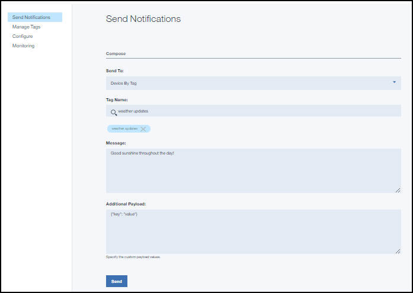

---

copyright:
 years: 2015, 2017

---

{:new_window: target="_blank"}
{:shortdesc: .shortdesc}
{:screen:.screen}
{:codeblock:.codeblock}

#Ativando aplicativos iOS para enviar {{site.data.keyword.mobilepushshort}}
{: #enable-push-ios-notifications}
Última atualização: 16 de janeiro de 2017
{: .last-updated}

É possível ativar aplicativos iOS para enviar {{site.data.keyword.mobilepushshort}}
para os seus dispositivos.


##Instalando o CocoaPods
{: #enable-push-ios-notifications-install}

Para obter um projeto Xcode existente, é possível configurar o SDK do cliente de serviços móveis do Bluemix usando a ferramenta de gerenciamento de dependência CocoaPods. Uma alternativa é instalar o SDK manualmente.

Para visualizar o arquivo leia-me do Swift Push, acesse [Leia-me ](https://github.com/ibm-bluemix-mobile-services/bms-clientsdk-swift-push/tree/master "Ícone de link externo"){: new_window}.


1. Instale o CocoaPods usando o comando a seguir em seu terminal Mac.
```$ sudo gem install cocoapods
```
	{: codeblock}
2. Insira o comando `pod init` no terminal para inicializar o CocoaPods. Assegure-se de executar o comando a partir do diretório no qual seu projeto Xcode está. O comando `pod init` cria um Podfile.  
3. No Podfile gerado, inclua as dependências necessárias de SDK. Copie o Podfile a
seguir.
   
	```
	source 'https://github.com/CocoaPods/Specs.git'
	// Copy the following list as is and remove the dependencies you do not need.
	use_frameworks!
	target 'MyApp' do
	    platform :ios, '8.0'
	pod 'BMSCore'
	    pod 'BMSPush'
      pod 'BMSAnalyticsAPI'
	end
	```
		{: codeblock}

3. A partir do terminal, acesse a sua pasta do projeto e instale as dependências com o comando `pod update`.

O comando instala as suas dependências e cria uma nova área de trabalho do Xcode.  
**Nota**: assegure-se de sempre abrir a nova área de trabalho do Xcode,
em vez do arquivo de projeto do Xcode original:
```
$ open App.xcworkspace
```
	{: codeblock}

A área de trabalho contém o projeto original e o projeto Pods que contém suas
dependências. Para
modificar a pasta de origem de serviços móveis do Bluemix, é possível localizá-la em seu
projeto Pods, em `Pods/yourImportedSourceFolder`, por exemplo:
`Pods/BMSPush`.

##Incluindo estruturas usando Carthage
{: #carthage}

Inclua estruturas no projeto usando [Carthage ](https://github.com/Carthage/Carthage#if-youre-building-for-ios-tvos-or-watchos "Ícone de link externo"){: new_window}. Observe que
Carthage em Xcode8 não é suportado.

1. Inclua as estruturas `BMSPush` em seu Cartfile:
```
github "github "ibm-bluemix-mobile-services/bms-clientsdk-swift-push" ~> 1.0"
```
	{: codeblock}
2. Execute o comando `carthage update`. Quando a construção for concluída, arraste `BMSPush.framework`, `BMSCore.framework` e `BMSAnalyticsAPI.framework` até seu projeto Xcode.
3. Siga as instruções no site [Carthage ](https://github.com/Carthage/Carthage#if-youre-building-for-ios-tvos-or-watchos "Ícone de link externo"){: new_window} para concluir a integração.

##Configurando o SDK do iOS
{: ios-sdk}

Configure o SDK iOS, inclua o código a seguir no arquivo **AppDelegate.swift**
em seu aplicativo. Observe que isso também é registrado com o APNs.  
```
func application(_ application: UIApplication,
didFinishLaunchingWithOptions launchOptions: [NSObject: AnyObject]?) -> Bool {  
 BMSPushClient.sharedInstance.initializeWithAppGUID(appGUID: "APP-GUID-HERE", clientSecret:"CLIENT-SECRET-HERE")
  }
```
    {: codeblock}

##Usando estruturas importadas e pastas de origem
{: using-imported-frameworks}

Referencie o SDK no código. Assegure-se de que os pré-requisitos a seguir sejam atendidos.
	- iOS 8.0 ou superior	
	- Xcode 7

Grave diretivas `#import` para os cabeçalhos relevantes, por exemplo:
	```
	//swift
	import BMSCore
	import BMSPush
	```
		{: codeblock}

Para ler o arquivo leia-me do Swift Push, veja [Leia-me ](https://github.com/ibm-bluemix-mobile-services/bms-clientsdk-swift-push/tree/master "Ícone de link externo"){: new_window}.

**Nota**: a atualização de seu projeto Pods usando os comandos `pod install` ou `pod update` do CocoaPods pode substituir as pastas de origem de serviços móveis do Bluemix. Para reter as versões
customizadas dos arquivos originais, assegure-se de que sejam submetidas a backup antes de emitir um destes
comandos.


##Configurações de Compilação
{: build-settings}

Acesse **Xcode > Configurações de compilação > Opções de compilação e
configure Ativar Bitcode** como **Não**.

**Atenção**: Desde o iOS 9, mudanças no recurso App Transport
Security (ATS) podem afetar a maneira de manipular o processo de autenticação. As postagens do blog a seguir descrevem mais informações sobre as mudanças: [ATS e Bitcode no iOS 9 ](https://developer.ibm.com/mobilefirstplatform/2015/09/09/ats-and-bitcode-in-ios9/ "Ícone de link externo"){: new_window} e [Conecte seu app iOS 9 ao Bluemix hoje ](https://developer.ibm.com/bluemix/2015/09/16/connect-your-ios-9-app-to-bluemix/ "Ícone de link externo"){: new_window}.

## Inicializando apps Push SDK para iOS
{: #enable-push-ios-notifications-initialize}

Um local comum para colocar o código de inicialização é no aplicativo delegado do aplicativo iOS. Clique no link **Opções móveis** no Painel Push para obter a rota e o GUID do aplicativo.

###Inicializando o SDK principal
{: Initializing-the-core-sdk}


```
// Initialize the Core SDK for Swift with IBM Bluemix GUID, route, and region
let myBMSClient = BMSClient.sharedInstance
myBMSClient.initialize(bluemixRegion: "Location where your app is hosted.") 
```
	{: codeblock}

### Rota, GUID e região do Bluemix
{: route-guid-bluemix-region}

####appRoute
{: ios-approute}

Especifica a rota que é designada ao aplicativo do servidor que você criou no Bluemix.

####GUID
{: ios-guid}

Especifica a chave exclusiva que é designada ao aplicativo que você criou no Bluemix. Esse valor faz
distinção entre maiúsculas e minúsculas.

####bluemixRegionSuffix
{: ios-bluemixRegionSuffix}

Especifica o local em que o app está hospedado. O parâmetro `bluemixRegion` especifica qual implementação do Bluemix você está usando. É possível configurar esse valor com uma propriedade estática `BMSClient.REGION` e use um dos três valores:

- BMSClient.Region.usSouth 
- BMSClient.Region.unitedKingdom
- BMSClient.Region.sydney

####AppGUID
{: ios-AppGUID}

Especifica a chave AppGUID exclusiva que é designada ao serviço {{site.data.keyword.mobilepushshort}} que você criou no Bluemix.

###Inicializando o SDK de Push do cliente
{: initializing-the-client-Push-SDK}

```
//Initialize client Push SDK for Swift
let push = BMSPushClient.sharedInstance
push.initializeWithAppGUID("appGUID", clientSecret:"clientSecret")
```
	{: codeblock}


## Registrando aplicativos e dispositivos iOS
{: #enable-push-ios-notifications-register}


Um aplicativo deve se registrar com os APNs para receber notificações remotas, após a instalação em um dispositivo. Depois que o token de dispositivo gerado pelo APNs é recebido pelo app, ele deve ser passado de volta ao serviço {{site.data.keyword.mobilepushshort}}.

Para registrar aplicativos e dispositivos iOS, será necessário:

1. Criar um aplicativo backend.
2. Passar o token para o {{site.data.keyword.mobilepushshort}}.


###Criar um aplicativo backend
{: create-a-backend-app}

Crie um aplicativo backend no catálogo do Bluemix® da seção Modelos, que ligará automaticamente o
serviço {{site.data.keyword.mobilepushshort}} a esse aplicativo. Se você já tiver criado um app backend, assegure-se de ligar o app ao serviço {{site.data.keyword.mobilepushshort}}.


###Passando tokens para {{site.data.keyword.mobilepushshort}}
{: pass-token-push-notifications}

Depois que o token for recebido do APNs, passe-o para {{site.data.keyword.mobilepushshort}} como parte do método `registerWithDeviceToken`.

Depois que o token for recebido dos APNs, transmita o token para Notificações push
como parte do método `didRegisterForRemoteNotificationsWithDeviceToken`.

```
func application (_application: UIApplication, didRegisterForRemoteNotificationsWithDeviceToken deviceToken: Data){
   let push =  BMSPushClient.sharedInstance
   push.registerWithDeviceToken(deviceToken) { (response, statusCode, error) -> Void in
      if error.isEmpty {
           print( "Response during device registration : \(response)")
            print( "status code during device registration : \(statusCode)")
        }
       else{
            print( "Error during device registration \(error) ")
           print( "Error during device registration \n  - status code: \(statusCode) \n Error :\(error) \n")
        }
   }
}
```
	{: codeblock}


## Recebendo notificações push em dispositivos iOS
{: #enable-push-ios-notifications-receiving}


Para receber notificações push em dispositivos iOS, inclua o método Swift a seguir
na delegação de seu aplicativo.

```
// For Swift
func application(_ application: UIApplication, didReceiveRemoteNotification userInfo: [AnyHashable : Any], fetchCompletionHandler completionHandler: @escaping (UIBackgroundFetchResult) -> Void) 
{ //UserInfo dictionary will contain data sent from the server }
```
	{: codeblock}

## Monitorando notificações push em dispositivos iOS
{: ios-monitoring}

Para monitorar o status atual da notificação, inclua o método Swift a seguir na delegação de seu aplicativo.

```
// Send notification status when app is opened by clicking the notifications
func application(_ application: UIApplication, didReceiveRemoteNotification userInfo: [AnyHashable : Any]) {
 let push =  BMSPushClient.sharedInstance
 let respJson = (userInfo as NSDictionary).value(forKey: "payload") as! String
 let data = respJson.data(using: String.Encoding.utf8)
 let jsonResponse:NSDictionary = try! JSONSerialization.jsonObject(with: data! , options: JSONSerialization.ReadingOptions.allowFragments) as! NSDictionary
 let messageId:String = jsonResponse.value(forKey: "nid") as! String
    push.sendMessageDeliveryStatus(messageId: messageId) { (res, ss, ee) in
      print("Send message status to the Push server")
     }
}
```
	{: codeblock}

```
// Send notification status when the app is in background mode.
func application(_ application: UIApplication, didReceiveRemoteNotification userInfo: [AnyHashable : Any], fetchCompletionHandler completionHandler: @escaping (UIBackgroundFetchResult) -> Void) {
 let payLoad = ((((userInfo as NSDictionary).value(forKey: "aps") as! NSDictionary).value(forKey: "alert") as! NSDictionary).value(forKey: "body") as! NSString)
 self.showAlert(title: "Recieved Push notifications", message: payLoad)
 let push =  BMSPushClient.sharedInstance
 let respJson = (userInfo as NSDictionary).value(forKey: "payload") as! String
 let data = respJson.data(using: String.Encoding.utf8)
 let jsonResponse:NSDictionary = try! JSONSerialization.jsonObject(with: data! , options: JSONSerialization.ReadingOptions.allowFragments) as! NSDictionary
 let messageId:String = jsonResponse.value(forKey: "nid") as! String
 push.sendMessageDeliveryStatus(messageId: messageId) { (res, ss, ee) in
       completionHandler(UIBackgroundFetchResult.newData)
   }
}
```
	{: codeblock}


## Enviando notificações push básicas
{: #send}

Depois de ter desenvolvido seus aplicativos, será possível enviar notificações push básicas.

Para enviar notificações push básicas, conclua as etapas:

1. Selecione **Enviar notificações** e componha uma mensagem
escolhendo uma opção **Enviar para**. As opções suportadas são
**Dispositivo por tag**, **ID do dispositivo**,
**ID do usuário**, **Dispositivos Android**,
**Dispositivos iOS**, **Notificações da web** e
**Todos os dispositivos**.  
**Nota**: ao selecionar a opção **Todos os dispositivos**, todos os dispositivos inscritos para {{site.data.keyword.mobilepushshort}} receberão notificações.


2. No campo **Mensagem**, componha sua mensagem. Escolha a
configurar das definições opcionais conforme necessário.
3. Clique em **Enviar**.
3. Verifique se seus dispositivos receberam sua notificação.

A imagem a seguir mostra uma caixa de alerta manipulando um {{site.data.keyword.mobilepushshort}} e um dispositivo iOS.

 

### Configurações opcionais para enviar notificações
{: #send_ios_otpional_setting}

É possível customizar ainda mais as configurações do
{{site.data.keyword.mobilepushshort}} para enviar notificações a dispositivos
iOS. As opções de customização opcionais a seguir são suportadas.

- **Badge**: indica o número que é exibido no badge do aplicativo. O valor padrão é zero (0) e isso não exibiria um badge. 
- **Som**: indica que um clique de som seja reproduzido no recebimento de uma notificação. Suporta o padrão ou o nome de um recurso de som empacotado no app.
- **Carga útil adicional**: especifica os valores de carga útil customizados para suas notificações.

##Ativando notificações interativas

Agora, é possível enriquecer suas notificações de iOS com mais detalhes, como incluir uma imagem, um mapa
ou um botão de resposta ativando notificações interativas. Isso fornece mais contexto aos clientes,
além da capacidade de executar ação imediata sem sair do contexto atual.  

Para ativar notificações interativas, use o código a seguir:

```
// This defines the button action.
let actionOne = BMSPushNotificationAction(identifierName: "ACCEPT", buttonTitle: "Accept", isAuthenticationRequired: false, defineActivationMode: UIUserNotificationActivationMode.background)
 let actionTwo = BMSPushNotificationAction(identifierName: "DECLINE", buttonTitle: "Decline", isAuthenticationRequired: false, defineActivationMode: UIUserNotificationActivationMode.background)
```
	{: codeblock}
```
// This defines category for the buttons
let category = BMSPushNotificationActionCategory(identifierName: "category", buttonActions: [actionOne, actionTwo])
```
	{: codeblock}
```
// This updates the registration to include the buttonsPass the defined category into iOS BMSPushClientOptions
let notificationOptions = BMSPushClientOptions(categoryName: [category])
let push = BMSPushClient.sharedInstance
push.initializeWithAppGUID(appGUID: "APP-GUID-HERE", clientSecret:"CLIENT-SECRET-HERE", options: notificationOptions)
```
	{: codeblock}

Para enviar uma notificação interativa, conclua estas etapas:

1. Na seção Editar, para a lista suspensa Enviar para, selecione **Dispositivos iOS**.
2. Insira a mensagem de notificação que talvez queira enviar.
3. Na seção Configurações opcionais, selecione **Móvel** e clique em
**iOS**.
4. Na lista suspensa Tipo, selecione **Combinado**.
5. No campo Categoria, especifique o tipo de notificação que você definiu em seu app. 

 

## Etapas Seguintes
{: #next_steps_tags}

Depois de configurar com êxito notificações básicas,
é possível configurar notificações baseadas em tag e opções
avançadas.

Inclua esses recursos de serviço de Notificações push no seu app. Para usar
notificações baseadas em tag, consulte [Notificações baseadas em
tag](c_tag_basednotifications.html).
Para usar opções de notificações avançadas, veja [Ativando notificações push avançadas](t_advance_badge_sound_payload.html).
