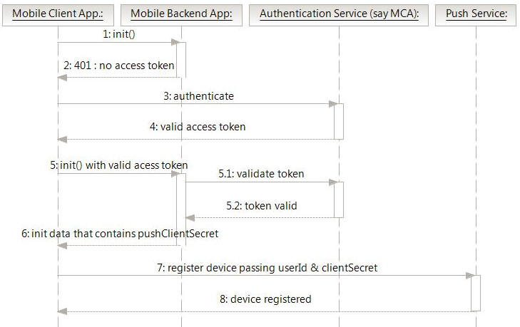

---

copyright:
 years: 2015, 2017

---

{:new_window: target="_blank"}
{:shortdesc: .shortdesc}
{:screen:.screen}
{:codeblock:.codeblock}

# Serviço de Notificação push
{: #overview-push}
Última atualização: 31 de março de 2017
{: .last-updated}

O IBM {{site.data.keyword.mobilepushshort}} é um serviço que pode ser usado para enviar notificações para dispositivos e plataformas. É possível direcionar notificações para todos os usuários
do aplicativo ou para um conjunto específico de usuários e dispositivos usando tags. É possível administrar dispositivos, tags e assinaturas.  

É possível usar qualquer uma das opções a seguir para criar um serviço de limite ou desvinculado:

- Criando um aplicativo Bluemix usando o modelo do MobileFirst Services Starter do catálogo. Isso cria um serviço Push Notifications ligado a um aplicativo backend do Bluemix.
- Criando um serviço Push Notifications desvinculado diretamente do catálogo Mobile. É possível ligar posteriormente a um aplicativo ou até mesmo escolher usá-lo desvinculado. 
- Usando o [painel Mobile ](https://console.ng.bluemix.net/docs/mobile/services.html){: new_window}.

Observe que a guia de monitoramento {{site.data.keyword.mobilepushshort}} não mostra dados de analítica.

O serviço {{site.data.keyword.mobilepushshort}} agora está ativado para OpenWhisk. Para obter mais informações, consulte [OpenWhisk](/docs/openwhisk/index.html).

## Processo do serviço de Notificação push
{: #overview_push_process}

Dispositivos móveis, clientes do navegador da web, Apps Google Chrome e Extensões podem assinar e se registrar no serviço
{{site.data.keyword.mobilepushshort}}. Na inicialização, os aplicativos
clientes farão seus próprios registros e assinaturas no serviço
{{site.data.keyword.mobilepushshort}}. As notificações são despachadas para o servidor Apple Push Notification Service (APNs) ou Firebase Cloud Messaging
(FCM)/Google Cloud Messaging (GCM) e, em seguida, enviadas para os dispositivos móveis ou clientes do navegador registrados.

### Aplicativos móveis e do navegador
{: #mobile-applications}

Na inicialização, os aplicativos clientes se registram e assinam o serviço {{site.data.keyword.mobilepushshort}} para receber notificações.

### Aplicativos backend
{: #backend-applications}

Os aplicativos backend podem ser locais ou estarem em uma nuvem pública. Os
aplicativos backend usarão o serviço
{{site.data.keyword.mobilepushshort}} para enviar notificações sensíveis ao
contexto para usuários de aplicativos móveis e do navegador. Os aplicativos backend não
são obrigados a manter e gerenciar dispositivos móveis, agentes do navegador e
informações sobre o usuário para enviar notificações push. Em vez disso, os aplicativos
podem usar o serviço {{site.data.keyword.mobilepushshort}} que os gerenciará
e os manterá.

### Proprietário backend do app
{: #app-backend-owner}

O proprietário backend do App cria o aplicativo backend móvel que empacota uma instância do serviço {{site.data.keyword.mobilepushshort}}. O
proprietário backend do App também configura e instala o serviço
{{site.data.keyword.mobilepushshort}} para adequar os aplicativos backend usando
o serviço com os aplicativos móveis e do navegador que se destinam a {{site.data.keyword.mobilepushshort}}.

### Serviço de Notificação push
{: #push-notification-service}

O serviço {{site.data.keyword.mobilepushshort}} gerencia todas as
informações relacionadas a dispositivos móveis e clientes do navegador da web que são
registrados para notificações. O serviço mantém seus aplicativos transparentes para os
detalhes de tecnologia de envio de notificações a plataformas móveis e de navegador da
web heterogêneas, manipulando todos esses dentro.

### Gateways
{: #gateways}

Serviços de nuvem de Notificações push específicos da plataforma, como FCM/GCM ou Apple Push Notification Service (APNs), que são usados pelo serviço IBM
{{site.data.keyword.mobilepushshort}} para despachar notificações aos aplicativos móveis e do navegador.

### Segurança de Push
{: #push-security}

As APIs de {{site.data.keyword.mobilepushshort}} são protegidas por dois tipos de segredos:

- **appSecret**: o `appSecret` protege as APIs que são geralmente chamadas por aplicativos backend - como a API para enviar o {{site.data.keyword.mobilepushshort}} e a API para configurar definições.
- **clientSecret**: o `clientSecret` protege as APIs que são geralmente chamadas por aplicativos cliente móveis. Existe somente uma API relacionada para registro de um dispositivo com um ID de usuário associado que requer este `clientSecret`. Nenhuma das outras APIs chamadas de clientes móveis requer o `clientSecret`. 

O `appSecret` e o `clientSecret` são alocados para todas as instâncias de serviço no momento da ligação de um aplicativo ao serviço {{site.data.keyword.mobilepushshort}}. Consulte a documentação das [APIs de REST ](https://mobile.{DomainName}/imfpush/) para obter informações sobre como os segredos devem ser passados e para quais APIs.

**Nota**: os aplicativos anteriores eram necessários para passar o clientSecret somente ao registrar ou atualizar dispositivos com o campo userId. Todas
as outras APIs chamadas por clientes móveis e do navegador não requerem o clientSecret. Esses aplicativos antigos podem continuar a usar o clientSecret opcionalmente
para registros de dispositivo ou chamadas de atualização. Entretanto, é
expressamente recomendado que a verificação do clientSecret seja imposta para todas as
chamadas de API do cliente. Para usar isso em aplicativos existentes, há uma nova API `verifyClientSecret` publicada. Para novos aplicativos, a verificação do clientSecret será usada em todas as chamadas API do cliente e esse comportamento não poderá ser mudado com a API `verfiyClientSecret`.

Por padrão, a verificação do segredo do cliente é impingida apenas em novos apps. Os apps existentes e novos têm permissão para ativar ou desativar a verificação do segredo do cliente
usando a API de REST verifyClientSecret. Recomenda-se que você impinja a verificação do segredo do cliente para evitar
expor dispositivos para usuários que possam conhecer o ID do aplicativo e o ID do dispositivo.

Assegure-se de que o `clientSecret` seja mantido confidencial e nunca seja codificado permanentemente no app móvel. Há vários padrões de inicialização de aplicativo que podem ser usados para puxar o `clientSecret` dinamicamente durante o tempo de execução dos aplicativos. O diagrama de sequência é descrito nesse
possível padrão.
 

## Tipos de Notificação push
{: #overview-push-types}

### Difusão
{: #broadcast}

Quando um aplicativo cliente se registra no serviço {{site.data.keyword.mobilepushshort}}, ele pode começar a receber transmissões. Notificações de
transmissão são mensagens destinadas a todas as instâncias de um aplicativo instalado em dispositivos móveis, navegadores ou implementadas como apps Chrome ou
instâncias de extensão e configuradas para o serviço {{site.data.keyword.mobilepushshort}}. As notificações de transmissão são ativadas por padrão para qualquer aplicativo ativado para {{site.data.keyword.mobilepushshort}}. Aplicativos ativados para o serviço {{site.data.keyword.mobilepushshort}} possuem uma assinatura predefinida para a tag Push.ALL, que é usada pelo servidor para transmitir mensagens de notificação para todos os dispositivos. Para enviar uma
notificação de transmissão usando a API Push REST, assegure-se de que
o "destino" seja um JSON vazio ao postar no recurso de mensagens.

### Notificações baseadas em tag
{: #tag-based-notifications}

Notificações de tag são mensagens destinadas a todos os dispositivos inscritos em uma tag específica. As notificações baseadas em identificação
permitem a segmentação de notificações com base em áreas ou tópicos de assunto. Os destinatários da notificação podem optar por receber notificações somente se for
sobre um assunto ou um tópico de interesse. Portanto, a notificação baseada em
identificação fornece um meio de segmentar destinatários. Esse recurso ativa
a capacidade de definir identificações e, em seguida, de enviar e receber mensagens por identificações. Uma mensagem é destinada somente para instâncias do aplicativo
cliente (no dispositivo móvel, navegador ou como um app ou extensões) que estão inscritas para a identificação. Deve-se primeiramente criar tags para o aplicativo, configurar as assinaturas da tag e, em seguida, iniciar as notificações baseadas em tag. Para enviar uma notificação baseada em tag que usa a API REST, assegure-se de que os "tagNames" sejam fornecidos ao postar no recurso de mensagem.

### Notificações unicast
{: #unicast-notifications}

Notificações unicast são mensagens destinadas a um dispositivo ou usuário específico. As notificações unicast destinadas a dispositivos não requerem configuração adicional e são ativadas por padrão quando o aplicativo está ativado para {{site.data.keyword.mobilepushshort}}.

No entanto, as notificações Unicast destinadas para usuários requerem a associação de um ID do usuário com um dispositivo no momento do registro do dispositivo
móvel, do navegador da web ou de Apps Chrome e Extensões do cliente para {{site.data.keyword.mobilepushshort}}.   

Geralmente, um aplicativo cliente executará, primeiramente, um ciclo de autenticação no qual o usuário do app móvel é autenticado em um serviço como
[Mobile Client Access](docs/services/mobileaccess/index.html). Na
autenticação bem-sucedida, o ID de usuário autenticado então é passado para a API de
registro de dispositivo push. 
Para enviar notificações Unicast por meio da API REST, assegure-se de que os deviceIds ou userIds sejam fornecidos ao postar em um recurso de mensagem.

### Notificações com base em plataforma
{: #platform-based-notifications}

Notificações podem ser
destinada a atingir uma plataforma de dispositivo
específica. Por exemplo, uma notificação pode ser enviada a todos os usuários do Android
ou somente a usuários do Google Chrome. Para enviar uma notificação baseada em
plataforma usando a API REST, assegure-se de que as plataformas
destinadas sejam fornecidas ao postar no recurso de mensagem. Especifique as plataformas como uma matriz. As plataformas
suportadas são como a seguir:
* A (Apple)
* G (Google)
* WEB_CHROME (Google Chrome Browser Web Push)
* WEB_FIREFOX (Mozilla Firefox Browser Web Push)
* WEB_SAFARI (Safari Browser Web Push)
* APPEXT_CHROME (Apps Google Chrome e Extensões)

## Tamanho de mensagem da notificação push
{: #push-message-size}

O tamanho da carga útil da mensagem de {{site.data.keyword.mobilepushshort}} depende das restrições estabelecidas pelos Gateways (FCM/GCM, APNs) e
pelas plataformas do cliente. 

### iOS e Safari
{: #ios-message-size}

Para o iOS 8 e posterior, o tamanho máximo permitido é 2 kilobytes. O serviço de Notificação push Apple não envia notificações que excedem
esse limite.

### Android, navegador Firefox, navegador Chrome e Apps e
extensões Chrome
{: #android-message-size}

Há uma limitação de 4 kilobytes como o tamanho da carga útil de
mensagem máximo permitido.  
