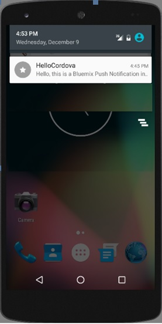

---

copyright:
 years: 2015, 2017

---

{:new_window: target="_blank"}
{:shortdesc: .shortdesc}
{:screen:.screen}
{:codeblock:.codeblock}

# Enviando notificações push básicas
{: #push-send-notifications}
Última atualização: 11 de janeiro de 2017
{: .last-updated}

Depois de desenvolver seus aplicativos, é possível enviar notificações push básicas (sem usar tags, badges, cargas úteis adicionais ou arquivos de som).

Para enviar notificações push básicas, conclua as etapas listadas:

1. Selecione **Enviar notificações** e depois escolha a opção
**Enviar para** apropriada. 

**Nota**: ao selecionar a opção **Todos os dispositivos**, todos os dispositivos inscritos para {{site.data.keyword.mobilepushshort}} receberão notificações.

2. No campo **Mensagem**, insira sua mensagem e, em seguida,
clique em **Enviar**.

3. Verifique se seus dispositivos receberam sua notificação. A imagem a seguir
mostra uma caixa de alerta que manipula um {{site.data.keyword.mobilepushshort}}
no primeiro plano em um dispositivo Android e iOS.

A captura de tela a seguir mostra um {{site.data.keyword.mobilepushshort}} no plano de fundo para Android.

