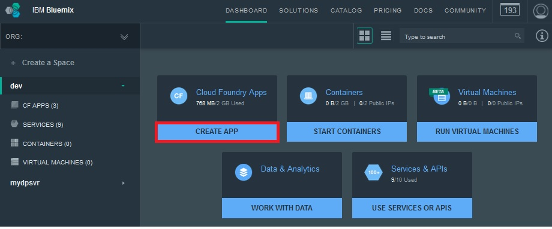

---

copyright:
 years: 2015, 2016

---

# Criando uma instância de serviço de push
{: #create-push-instance}

Para uma introdução ao {{site.data.keyword.IBM}} {{site.data.keyword.mobilepushshort}}, primeiro, deve-se criar um aplicativo {{site.data.keyword.Bluemix}}; por exemplo, um app Node.js. Em seguida, deve-se criar uma instância de um serviço Push, {{site.data.keyword.mobilepushfull}}, que precisa ser vinculado a este aplicativo Bluemix. É possível também fazer isso acessando a seção Modelo do catálogo do Bluemix e clicando no Iniciador de serviços MobileFirst.

**Nota**: Se você configurou organizações para gerenciar seu ambiente, selecione a organização na qual deseja criar o tempo de execução e os serviços para seu app móvel.

1. Se você não tiver um aplicativo Bluemix, será necessário criar um; por exemplo, o app Node.js. Para criar um aplicativo Bluemix, acesse o painel do Bluemix e clique em **Criar app**.
	
	**Nota**: Se você tiver um aplicativo, acesse a etapa 7 para incluir um serviço.

1. Em **Escolher seu modelo de app**, clique em **WEB**

3. Na área **Escolher ponto de início**, selecione **SDK for Node.js** e clique em **CONTINUE**. 

4. No menu suspenso **Espaço**, selecione o espaço da organização.

	
1. Em **Nome**, insira o nome de seu app e no host, insira o nome do host.

1. No menu suspenso **Plano selecionado**, selecione um plano e depois clique no botão **CRIAR**. Aguarde até que o aplicativo entre no estágio.

1. Clique no link **Visão geral**.
1. Clique em **Incluir um serviço** . A tela CATALOG é exibida.

1. Selecione **IBM Push Notifications:** e, no menu suspenso **Espaço**, selecione a organização.

	
1. No nome **Serviço**, insira o nome do serviço de notificação push.

1. Em **Plano selecionado**, selecione um plano e clique no botão **CRIAR**.

1. Clique em **Sim** para remontar o aplicativo.

	

1. Clique em **Notificações push** para exibir o painel Notificação push.
