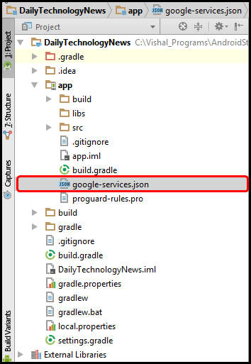

---

copyright:
years: 2015, 2017

---

{:new_window: target="_blank"}
{:shortdesc: .shortdesc}
{:screen:.screen}
{:codeblock:.codeblock}

# 使 Android 应用程序能够接收 {{site.data.keyword.mobilepushshort}}
{: #tag_based_notifications}
上次更新时间：2017 年 2 月 14 日
{: .last-updated}

您可以让 Android 应用程序具有向您的设备接收推送通知的能力。Android Studio 是必备软件，也是构建 Android 项目的建议方法。必须具有 Android Studio 的基本知识。

## 使用 Gradle 安装客户机推送 SDK
{: #android_install}

本部分描述如何安装和使用客户机推送 SDK 来进一步开发 Android 应用程序。

可以使用 Gradle 来添加 Bluemix® Mobile Services 推送 SDK。Gradle 会从存储库自动下载工件，并使这些工件可用于您的 Android 应用程序。
确保正确设置了 Android Studio 和 Android Studio SDK。有关如何设置系统的更多信息，请参阅 [Android Studio 概述 ](https://developer.android.com/tools/studio/index.html){: new_window}。有关 Gradle 的更多信息，请参阅[配置 Gradle 构建 ](http://developer.android.com/tools/building/configuring-gradle.html){: new_window}。

创建并打开移动应用程序后，使用 Android Studio 完成以下步骤。

1. 向模块级别 **build.gradle** 文件添加依赖关系。 	

	- 添加以下依赖关系会将 Bluemix™ Mobile 服务推送客户机 SDK 和 Google 播放服务 SDK 添加到编译作用域依赖关系中。
	```
	com.ibm.mobilefirstplatform.clientsdk.android:push:3.+
	```
    	{: codeblock}
	
	- 添加以下依赖关系可以导入代码片段所需的语句。
	```
	import com.ibm.mobilefirstplatform.clientsdk.android.core.api.BMSClient;
	import com.ibm.mobilefirstplatform.clientsdk.android.push.api.MFPPush;
	import com.ibm.mobilefirstplatform.clientsdk.android.push.api.MFPPushException;
	import com.ibm.mobilefirstplatform.clientsdk.android.push.api.MFPPushResponseListener;
	import com.ibm.mobilefirstplatform.clientsdk.android.push.api.MFPPushNotificationListener;
	import com.ibm.mobilefirstplatform.clientsdk.android.push.api.MFPSimplePushNotification;
	```
    	{: codeblock}

	- 在结尾，向模块级别 **build.gradle** 文件添加以下依赖关系。
	```
		apply plugin: 'com.google.gms.google-services'
	```
		{: codeblock}
3. 向项目级别 **build.gradle** 文件添加以下依赖关系。
```
dependencies {
classpath 'com.android.tools.build:gradle:2.2.3'
    classpath 'com.google.gms:google-services:3.0.0'
}
``` 
    {: codeblock}
5. 在 **AndroidManifest.xml** 文件中，添加以下许可权，要查看样本清单，请参阅 [Android helloPush 样本应用程序 ](https://github.com/ibm-bluemix-mobile-services/bms-samples-android-hellopush/blob/master/helloPush/app/src/main/AndroidManifest.xml){: new_window}。要查看样本 Gradle 清单，请参阅 [样本构建 Gradle 文件 ](https://github.com/ibm-bluemix-mobile-services/bms-samples-android-hellopush/blob/master/helloPush/app/build.gradle){: new_window}。
```
	<uses-permission android:name="android.permission.INTERNET"/>
	<uses-permission android:name="android.permission.GET_ACCOUNTS" />
	<uses-permission android:name="android.permission.USE_CREDENTIALS" />
<uses-permission android:name="android.permission.WRITE_EXTERNAL_STORAGE" />
<uses-permission android:name="android.permission.ACCESS_WIFI_STATE"/>
```
	{: codeblock}
在此处阅读有关 [Android 许可权 ](http://developer.android.com/guide/topics/security/permissions.html){: new_window} 的更多信息。
4. 添加活动的通知意向设置。此设置会在用户单击通知区域中收到的通知时启动应用程序。
```
	<intent-filter>
	<action android:name="Your_Android_Package_Name.IBMPushNotification"/>
	<category  android:name="android.intent.category.DEFAULT"/>
</intent-filter>
```
	{: codeblock}
**注**：将上述操作中的 *Your_Android_Package_Name* 替换为应用程序中使用的应用程序包名称。

5. 针对 RECEIVE 和 REGISTRATION 事件通知，添加 Firebase 云消息传递 (FCM) 或 Google 云消息传递 (GCM) 意向服务和意向过滤器。
```
	<service android:name="com.ibm.mobilefirstplatform.clientsdk.android.push.api.MFPPushIntentService"
    android:exported="true" >
    <intent-filter>
        <action android:name="com.google.firebase.MESSAGING_EVENT" />
    </intent-filter>
	</service>
<service
    android:name="com.ibm.mobilefirstplatform.clientsdk.android.push.api.MFPPush"
    android:exported="true" >
    <intent-filter>
        <action android:name="com.google.firebase.INSTANCE_ID_EVENT" />
    </intent-filter>
	</service>
```
    {: codeblock}

6. {{site.data.keyword.mobilepushshort}} 服务支持从通知区检索个别通知。对于从通知区访问的通知，系统仅会就单击的通知向您提供手柄。当正常打开应用程序时会显示所有通知。使用以下片段来更新 **AndroidManifest.xml** 文件，以使用此功能：

```
	<activity android:name="
com.ibm.mobilefirstplatform.clientsdk.android.push.api.MFPPushNotificationHandler"
android:theme="@android:style/Theme.NoDisplay"/>
```
    {: codeblock}

要设置 FCM 项目并获取凭证，请参阅[获取您的发送方标识和 API 密钥](t_push_provider_android.html)。使用 Firebase 云消息传递 (FCM) 控制台完成以下步骤。

1. 在 Firebase 控制台中，单击**项目设置**图标。

3. 从您的应用程序窗格的“常规”选项卡中选择**添加应用程序**或**添加 Firebase 至您的 Android 应用程序图标**。

4. 在“添加 Firebase 至您的 Android 应用程序”窗口中，添加 **com.ibm.mobilefirstplatform.clientsdk.android.push** 作为程序包名。“应用程序昵称”字段为可选字段。单击**添加应用程序**。


5. 通过在“添加 Firebase 至您的 Android 应用程序”窗口中，输入应用程序的程序包名。“应用程序昵称”字段为可选字段。单击**添加应用程序**。
 

	

6. 生成 `google-services.json` 文件。将 `google-services.json` 文件复制到 Android 应用程序模块根目录。请注意，`google-service.json` 文件包括添加的程序包名。

    

5. 在“添加 Firebase 至您的 Android 应用程序”窗口中，单击**继续**然后单击**完成**。 

  

构建并运行应用程序。

## 为 Android 应用程序初始化推送 SDK
{: #android_initialize}

在 Android 应用程序中，通常会将初始化代码放置在主活动的 onCreate 方法中。SDK 有两个组件需要初始化。一个是核心 SDK，另一个是在核心 SDK 之上构建的推送 SDK。

###初始化核心 SDK

```
// Initialize the SDK for Android
    BMSClient.getInstance().initialize(this, BMSClient.REGION_US_SOUTH);
```
    {: codeblock}

####bluemixRegionSuffix
{: bluemixRegionSuffix}

指定托管应用程序的位置。可以使用以下三个值中的一个值：

- BMSClient.REGION_US_SOUTH
- BMSClient.REGION_UK
- BMSClient.REGION_SYDNEY

###初始化客户机推送 SDK

```
//Initialize client Push SDK for Java
MFPPush push = MFPPush.getInstance();
push.initialize(getApplicationContext(), "appGUID", "clientSecret");
```
	{: codeblock}

####AppGUID
{: appguid_initialize_client_push_sdk}

此为 {{site.data.keyword.mobilepushshort}} 服务的 AppGUID 键。此值区分大小写。打开 Push Notification 仪表板并选择“配置”选项卡。您可以从 Push Notification 服务仪表板上“配置”选项卡中的“移动选项”中获取此值。 

## 注册 Android 设备
{: #android_register}

使用 `MFPPush.register()` API 可向 {{site.data.keyword.mobilepushshort}} 服务注册设备。对于注册 Android 设备，请在 Bluemix {{site.data.keyword.mobilepushshort}} 服务配置仪表板中添加 Firebase 云消息传递 (FCM) 或 Google 云消息传递 (GCM) 信息。有关更多信息，请参阅[为 Google 云消息传递配置凭证](t_push_provider_android.html)。

将以下代码片段复制到 Android 移动应用程序中。

```
	//Register Android devices
	push.registerDevice(new MFPPushResponseListener<String>() {
	    @Override
    	public void onSuccess(String response) {
    		//handle success here
	    }
	    @Override
    public void onFailure(MFPPushException ex) {
         //handle failure here
	    }
	});
```
	{: codeblock}


```
	//Handles the notification when it arrives
	MFPPushNotificationListener notificationListener = new MFPPushNotificationListener() {
	    @Override
	    public void onReceive (final MFPSimplePushNotification message){
	      // Handle Push Notification
	    }
	};
```
	{: codeblock}

## 在 Android 设备上接收推送通知
{: #android_receive}

要为 notificationListener 对象注册推送，请调用 **MFPPush.listen()** 方法。此方法通常是通过处理推送通知的活动的 **onResume()** 方法进行调用。

1. 要为 notificationListener 对象注册推送，请调用 **listen()** 方法。此方法通常是通过处理推送通知的活动的 **onResume()** 和 **onPause** 方法进行调用的。


```
	@Override
	protected void onResume(){
	   super.onResume();
	   if(push != null) {
	       push.listen(notificationListener);
	   }
	}
```
	{: codeblock}


```
	@Override
protected void onPause() {super.onPause();
    if (push != null) {
        push.hold();
    }
}
```
	{: codeblock}

2. 构建项目，然后在设备或仿真器上运行该项目。在 register() 方法中针对响应侦听器调用 onSuccess() 方法时，这证实设备已成功注册 {{site.data.keyword.mobilepushshort}} 服务。此时，可以如“发送基本推送通知”中所述发送消息。
3. 验证设备是否收到通知。如果应用程序在前台运行，那么通知将由 **MFPPushNotificationListener** 进行处理。如果应用程序在后台运行，那么通知栏中会显示一条消息。

## 在 Android 设备上监视推送通知
{: #android_monitor}

要监视应用程序中通知的当前状态，您可以实现 `com.ibm.mobilefirstplatform.clientsdk.android.push.api.MFPPushNotificationStatusListener` 接口，并定义方法 onStatusChange(String messageId, MFPPushNotificationStatus status)。 

**messageId** 是从服务器发送的消息的标识。**MFPPushNotificationStatus** 将通知的状态定义为值：

- **RECEIVED** - 应用程序已接收通知。 
- **QUEUED** - 应用程序将通知排入队列，以用于调用通知侦听器。 
- **OPENED** - 用户通过单击托盘中的通知或从应用程序图标启动应用程序或当应用程序位于前台时，打开通知。 
- **DISMISSED** - 用户清除/关闭托盘中的通知。

您需要使用 MFPPush，来注册 **com.ibm.mobilefirstplatform.clientsdk.android.push.api.MFPPushNotificationStatusListener** 类。

```
	push.setNotificationStatusListener(new MFPPushNotificationStatusListener() {
@Override
public void onStatusChange(String messageId, MFPPushNotificationStatus status) {
// Handle status change
}
});
```
    {: codeblock}


### 侦听 DISMISSED 状态

您可以选择在以下任何一个条件中，侦听 DISMISSED 状态：

- 当应用程序处于活动状态（在前台或后台运行）时

  添加以下片段到 `AndroidManifest.xml` 文件：

```
	<receiver android:name="com.ibm.mobilefirstplatform.clientsdk.android.push.api.MFPPushNotificationDismissHandler">
<intent-filter>
<action android:name="Your_Android_Package_Name.Cancel_IBMPushNotification"/>
</intent-filter>
	</receiver>
```
	{: codeblock}

- 当应用程序处于活动状态（在前台或后台运行）和未在运行（已关闭）时

您需要扩展 **com.ibm.mobilefirstplatform.clientsdk.android.push.api.MFPPushNotificationDismissHandler** 广播接收器并覆盖方法 **onReceive()**，其中 **MFPPushNotificationStatusListener** 应该在调用基类的方法 **onReceive()** 之前注册。

```
	public class MyDismissHandler extends MFPPushNotificationDismissHandler {
@Override
public void onReceive(Context context, Intent intent) {
MFPPush.getInstance().setNotificationStatusListener(new MFPPushNotificationStatusListener() {
@Override
public void onStatusChange(String messageId, MFPPushNotificationStatus status) {
// Handle status change
}
});
super.onReceive(context, intent);
}
}
```
    {: codeblock}


添加以下片段到 `AndroidManifest.xml` 文件：

```
	<receiver android:name="Your_Android_Package_Name.Your_Handler">
<intent-filter>
<action android:name="Your_Android_Package_Name.Cancel_IBMPushNotification"/>
</intent-filter>
	</receiver>
```
    {: codeblock}

## 发送基本 {{site.data.keyword.mobilepushshort}}
{: #send}

开发应用程序后，可以发送基本推送通知。

要发送基本推送通知，请完成以下步骤：

1. 选择**发送通知**，并通过选择**发送至**选项编辑消息。支持的选项有**按标记列出设备**、**设备标识**、**用户标识**、**Android 设备**、**iOS 设备**、**Web 通知**和**所有设备**。
**注**：选择**所有设备**选项时，预订了 {{site.data.keyword.mobilepushshort}} 的所有设备都会收到通知。

2. 在**消息**字段中，编辑您的消息。根据需要，选择配置可选设置。
3. 单击**发送**。
3. 验证设备是否收到通知。

以下屏幕快照显示了在 Android 设备上前台处理推送通知的警报框。


以下屏幕快照显示了 Android 后台的推送通知。


 

### 发送通知的可选 Android 设置
{: #send_otpional_setting}

对于向 Android 设备发送通知的 {{site.data.keyword.mobilepushshort}} 设置，您可以进一步定制。支持以下可选的定制选项。


- **折叠键**：折叠键附加在通知上。如果设备脱机时多个通知使用相同的折叠键按顺序抵达，那么将折叠通知。在设备联机时，将从 FCM/GCM 服务器接收通知，并只显示带有相同折叠键的最新通知。如果没有设置折叠键，将存储新和旧的消息，以在以后传递。
- **声音**：指示在接收通知时播放声音片段。支持缺省值或应用程序中绑定的声音资源的名称。
- **图标**：指定要针对通知显示的图标名称。请确保您已使用客户机应用程序，在 res/drawable 文件夹中包装了该图标。
- **优先级**：指定将向消息分配传送优先级的选项。`high` 或 `max` 优先级将生成提醒通知，而 `low` 或 `default` 优先级的消息不会打开休眠设备上的网络连接。对于选项设置为 `min` 的消息，将发送静默通知。
- **可视性**：您可以选择将消息可视性选项设置为 `public` 或 `private`。
`private` 选项限制公共查看，如果您的设备已通过锁定或模式保护，您可以选择启用该选项，通知设置将设置为“隐藏敏感的通知内容”。当可视性设置为 `private` 时，一定会涉及“编辑”字段。在设备的安全锁定屏幕上将显示编辑字段中指定的内容。选择 `public` 时，通知可以自由阅读。
- **生存时间**：此值以秒为单位进行设置。如果未指定此参数，FCM/GCM 服务器将把消息存储 4 周时间并将尝试传递。4 周后有效性到期。值可以为 0 至 2,419,200 秒之间的值。
- **空闲时延迟**：将此值设置为 `true` 将指示 FCM/GCM 服务器在设备空闲时不要传递通知。将此值设置为 `false`，以确保在设备空闲时传递通知。
- **同步**：通过将此选项设置为 `true`，将同步所有已注册设备的通知。如果某个用户名的用户在多个设备上安装了相同的应用程序，那么在一个设备上读取通知将确保删除其他设备上的通知。要使此选项生效，您需要确保已使用用户标识向 {{site.data.keyword.mobilepushshort}} 服务进行注册。
- **其他有效内容**：为您的通知指定定制的有效内容值。


## 后续步骤
{: #next_steps_tags}

成功设置基本通知后，可以配置基于标记的通知和高级选项。

将这些推送通知服务功能添加到应用程序中。
要使用基于标记的通知，请参阅[基于标记的通知](c_tag_basednotifications.html)。
要使用高级通知选项，请参阅[启用高级推送通知](t_advance_badge_sound_payload.html)。
