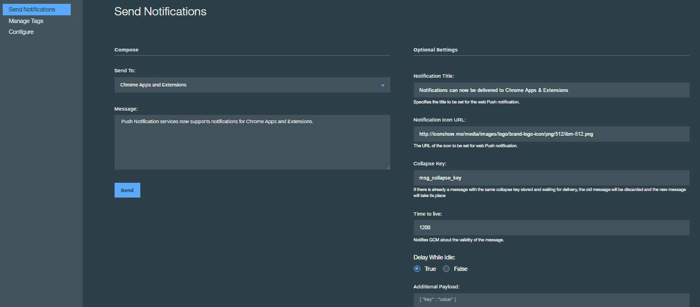

---

copyright:
 years: 2015, 2017

---

{:new_window: target="_blank"}
{:shortdesc: .shortdesc}
{:screen:.screen}
{:codeblock:.codeblock}

# 向 Chrome Apps and Extensions 发送基本通知 
{: #web_extensions_notifications}
上次更新时间：2017 年 1 月 11 日
{: .last-updated}

开发应用程序后，可以发送推送通知。 

1. 选择**发送通知**，并通过选择 **Web 通知**作为**发送至**选项来编辑消息。 
2. 键入需要在**消息**字段中传递的消息。
3. 您可以选择提供可选设置：
  - **通知标题**：这是作为消息警报标题显示的文本。
  - **通知图标 URL**：如果您的消息需要与应用程序通知图标一起传递，请在字段中提供图标的链接。
  - **折叠键**：折叠键附加在通知上。如果设备脱机时多个通知使用相同的折叠键按顺序抵达，那么将折叠通知。在设备联机时，将从 FCM/GCM 服务器接收通知，并只显示带有相同折叠键的最新通知。如果没有设置折叠键，将存储新和旧的消息，以在以后传递。
  - **生存时间**：此值以秒为单位进行设置。如果未指定此参数，FCM/GCM 服务器将把消息存储 4 周时间并将尝试传递。4 周后有效性到期。值可以为 0 至 2,419,200 秒之间的值。
  - **空闲时延迟**：将此值设置为 `true` 将指示 FCM/GCM 服务器在设备空闲时不要传递通知。将此值设置为 `false`，以确保在设备空闲时传递通知。
  - **其他有效内容**：为您的通知指定定制的有效内容值。

下面的图像显示仪表板中的 Chrome Apps and Extensions 通知选项。

  
  
## 后续步骤
  {: #next_steps_tags}

成功设置基本通知后，可以选择配置基于标记的通知和高级选项。

将这些 {{site.data.keyword.mobilepushshort}} 服务功能添加到应用程序中。要使用基于标记的通知，请参阅[基于标记的通知](c_tag_basednotifications.html)。要使用高级通知选项，请参阅[高级通知](t_advance_badge_sound_payload.html)。
