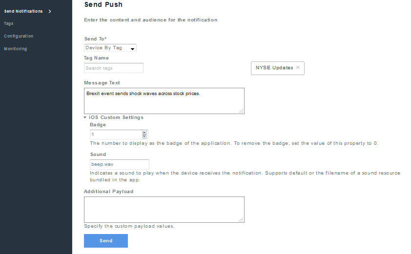
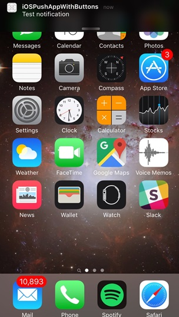

---

copyright:
 years: 2015, 2017

---

{:new_window: target="_blank"}
{:shortdesc: .shortdesc}
{:screen:.screen}
{:codeblock:.codeblock}

# 发送基本推送通知
{: #push-send-notifications}
上次更新时间：2017 年 1 月 11 日
{: .last-updated}

开发应用程序后，可以发送基本推送通知（不使用标记、角标、其他有效内容或声音文件）。

要发送基本推送通知，请完成所列步骤：

1. 选择**发送通知**，然后选择相应的**发送至**选项。 

**注**：选择**所有设备**选项时，预订了 {{site.data.keyword.mobilepushshort}} 的所有设备都会收到通知。

2. 在**消息**字段中，输入消息然后单击**发送**。

3. 验证设备是否收到通知。下图显示了在 Android 和 iOS 设备上前台处理 {{site.data.keyword.mobilepushshort}} 的警报框。

以下屏幕快照显示了 Android 后台的 {{site.data.keyword.mobilepushshort}}。

 
