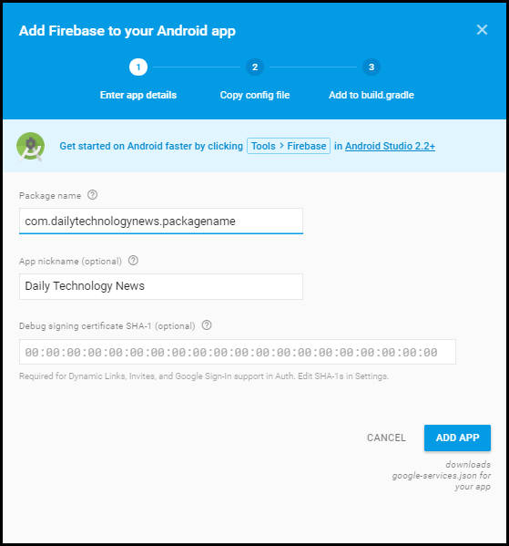
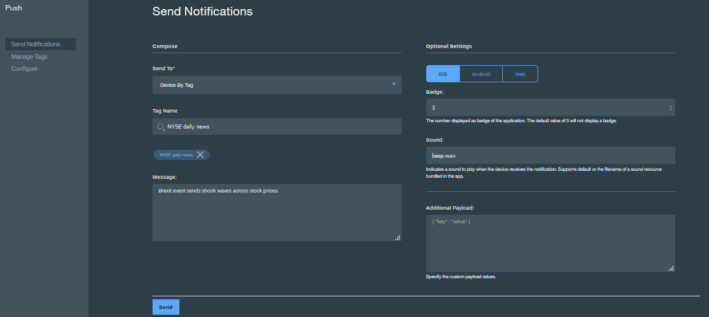

---

copyright:
years: 2015, 2017

---

{:new_window: target="_blank"}
{:shortdesc: .shortdesc}
{:screen:.screen}
{:codeblock:.codeblock}

# 啟用 Android 應用程式來接收 {{site.data.keyword.mobilepushshort}}
{: #tag_based_notifications}
前次更新：2017 年 2 月 14 日
{: .last-updated}

您可以啟用 Android 應用程式來接收傳送至您裝置的推送通知。Android Studio 是必備項目，而且是建置 Android 專案的建議方法。對 Android Studio 的基本瞭解十分重要。

## 使用 Gradle 安裝 Client Push SDK
{: #android_install}

本節說明如何安裝及使用 Client Push SDK 來進一步開發 Android 應用程式。

Bluemix® Mobile Services Push SDK 可以使用 Gradle 進行新增。Gradle 會從儲存庫中自動下載構件，並讓它們可供 Android 應用程式使用。請確定您已正確設定 Android Studio 及 Android Studio SDK。如需如何設定系統的相關資訊，請參閱 [Android Studio Overview ](https://developer.android.com/tools/studio/index.html){: new_window}。如需 Gradle 的相關資訊，請參閱 [Configuring Gradle Builds ](http://developer.android.com/tools/building/configuring-gradle.html){: new_window}。

在建立並開啟行動應用程式之後，請使用 Android Studio 來完成下列步驟。

1. 將相依關係新增至「模組」層次 **build.gradle** 檔案。 	

	- 新增下列相依關係，以將 Bluemix™ Mobile Services Push Client SDK 及 Google Play Services SDK 包含在您的編譯範圍相依關係。
	```
	com.ibm.mobilefirstplatform.clientsdk.android:push:3.+
	```
    	{: codeblock}
	
	- 將下列相依關係新增至 import 陳述式，程式碼 Snippet 需要這些 import 陳述式。
	```
	import com.ibm.mobilefirstplatform.clientsdk.android.core.api.BMSClient;
	import com.ibm.mobilefirstplatform.clientsdk.android.push.api.MFPPush;
	import com.ibm.mobilefirstplatform.clientsdk.android.push.api.MFPPushException;
	import com.ibm.mobilefirstplatform.clientsdk.android.push.api.MFPPushResponseListener;
	import com.ibm.mobilefirstplatform.clientsdk.android.push.api.MFPPushNotificationListener;
	import com.ibm.mobilefirstplatform.clientsdk.android.push.api.MFPSimplePushNotification;
	```
    	{: codeblock}

	- 最後，將下列相依關係新增至「模組」層次 **build.gradle** 檔案。
	```
		apply plugin: 'com.google.gms.google-services'
	```
		{: codeblock}
3. 將下列相依關係新增至「專案」層次 **build.gradle** 檔案。
```
dependencies {
    classpath 'com.android.tools.build:gradle:2.2.3'
    classpath 'com.google.gms:google-services:3.0.0'
}
``` 
    {: codeblock}
5. 在 **AndroidManifest.xml** 檔案中，新增下列許可權。若要檢視範例資訊清單，請參閱 [Android helloPush 範例應用程式 ](https://github.com/ibm-bluemix-mobile-services/bms-samples-android-hellopush/blob/master/helloPush/app/src/main/AndroidManifest.xml){: new_window}。若要檢視範例 Gradle 檔案，請參閱 [範例建置 Gradle 檔案 ](https://github.com/ibm-bluemix-mobile-services/bms-samples-android-hellopush/blob/master/helloPush/app/build.gradle){: new_window}。
```
	<uses-permission android:name="android.permission.INTERNET"/>
	<uses-permission android:name="android.permission.GET_ACCOUNTS" />
	<uses-permission android:name="android.permission.USE_CREDENTIALS" />
	<uses-permission android:name="android.permission.WRITE_EXTERNAL_STORAGE" />
	<uses-permission android:name="android.permission.ACCESS_WIFI_STATE"/>
```
	{: codeblock}
 此處鏈結可閱讀 [Android 許可權 ](http://developer.android.com/guide/topics/security/permissions.html){: new_window}。

4. 新增活動的通知目的設定。此設定會在使用者按一下通知區域中的接收通知時啟動應用程式。
```
	<intent-filter>
	<action android:name="Your_Android_Package_Name.IBMPushNotification"/>
	<category  android:name="android.intent.category.DEFAULT"/>
</intent-filter>
```
	{: codeblock}
**附註**：將先前動作中的 *Your_Android_Package_Name* 取代為您應用程式中所使用的應用程式套件名稱。

5. 針對 RECEIVE 及 REGISTRATION 事件通知，新增 Firebase Cloud Messaging (FCM) 或 Google Cloud Messaging (GCM) 目的服務及目的過濾器。
```
	<service android:name="com.ibm.mobilefirstplatform.clientsdk.android.push.api.MFPPushIntentService"
    android:exported="true" >
    <intent-filter>
        <action android:name="com.google.firebase.MESSAGING_EVENT" />
    </intent-filter>
	</service>
<service
    android:name="com.ibm.mobilefirstplatform.clientsdk.android.push.api.MFPPush"
    android:exported="true" >
    <intent-filter>
        <action android:name="com.google.firebase.INSTANCE_ID_EVENT" />
    </intent-filter>
	</service>
```
    {: codeblock}

6. {{site.data.keyword.mobilepushshort}} Service 支援從通知匣擷取個別通知。對於從通知匣存取的通知，只會提供給您所點選之通知的控點。正常開啟應用程式時，會顯示所有通知。請使用下列 Snippet 來更新 **AndroidManifest.xml** 檔案，以使用此功能：

```
	<activity android:name="
com.ibm.mobilefirstplatform.clientsdk.android.push.api.MFPPushNotificationHandler"
android:theme="@android:style/Theme.NoDisplay"/>
```
    {: codeblock}

若要設定 FCM 專案並取得您的認證，請參閱[取得傳送端 ID 及 API 金鑰](t_push_provider_android.html)。請使用 Firebase Cloud Messaging (FCM) 主控台來完成下列步驟。

1. 在 Firebase 主控台中，按一下**專案設定**圖示。
	

3. 從應用程式窗格的「一般」標籤中，選取**新增應用程式**或**將 Firebase 新增至 Android 應用程式**圖示。

4. 在「將 Firebase 新增至 Android 應用程式」視窗中，新增 **com.ibm.mobilefirstplatform.clientsdk.android.push** 作為「套件名稱」。應用程式暱稱欄位是選用性的。按一下**新增應用程式**。  
    

5. 在「將 Firebase 新增至 Android 應用程式」視窗中輸入套件名稱，以包含應用程式的套件名稱。應用程式暱稱欄位是選用性的。按一下**新增應用程式**。 

	

6. 會產生 `google-services.json` 檔案。將 `google-services.json` 檔案複製到您的 Android 應用程式模組根目錄。請注意，`google-service.json` 檔案包含已新增的套件名稱。

    

5. 在「將 Firebase 新增至 Android 應用程式」視窗中，按一下**繼續**，然後按一下**完成**。 

  

建置並執行應用程式。

## 起始設定 Push SDK for Android 應用程式
{: #android_initialize}

放置起始設定碼的一般位置位於 Android 應用程式之主要活動的 onCreate 方法中。SDK 有兩個需要起始設定的元件。一個是核心 SDK，另一個是根據核心 SDK 所建置的 Push SDK。

###起始設定 Core SDK

```
// Initialize the SDK for Android
    BMSClient.getInstance().initialize(this, BMSClient.REGION_US_SOUTH);
```
    {: codeblock}

####bluemixRegionSuffix
{: bluemixRegionSuffix}

指定管理應用程式的位置。您可以使用下列三個值的其中一個：

- BMSClient.REGION_US_SOUTH
- BMSClient.REGION_UK
- BMSClient.REGION_SYDNEY

###起始設定 Client Push SDK

```
//Initialize client Push SDK for Java
MFPPush push = MFPPush.getInstance();
push.initialize(getApplicationContext(), "appGUID", "clientSecret");
```
	{: codeblock}

####AppGUID
{: appguid_initialize_client_push_sdk}

這是 {{site.data.keyword.mobilepushshort}} Service 的 AppGUID 金鑰。此值區分大小寫。開啟 Push Notification 儀表板，然後選取「配置」標籤。您可以從 Push Notification Service 儀表板上「配置」標籤的「行動選項」中取得此值。 

## 登錄 Android 裝置
{: #android_register}

使用 `MFPPush.register()` API，以向 {{site.data.keyword.mobilepushshort}} Service 登錄裝置。如需登錄 Android 裝置，請在 Bluemix {{site.data.keyword.mobilepushshort}} Service 配置儀表板中新增 Firebase Cloud Messaging (FCM) 或 Google Cloud Messaging (GCM) 資訊。如需相關資訊，請參閱[配置 Google Cloud Messaging 的認證](t_push_provider_android.html)。

將下列程式碼 Snippet 複製到 Android 行動應用程式。

```
	//Register Android devices
	push.registerDevice(new MFPPushResponseListener<String>() {
    	@Override
    	public void onSuccess(String response) {
    		//handle success here
    	}
		@Override
    	public void onFailure(MFPPushException ex) {
    		//handle failure here
		}
		});
```
	{: codeblock}


```
	//Handles the notification when it arrives
	MFPPushNotificationListener notificationListener = new MFPPushNotificationListener() {
    @Override
    public void onReceive (final MFPSimplePushNotification message){
		// Handle Push Notification
   		 }
		};
```
	{: codeblock}

## 在 Android 裝置上接收推送通知
{: #android_receive}

若要向 Push 登錄 notificationListener 物件，請呼叫 **MFPPush.listen()** 方法。此方法一般是透過處理推送通知之活動的 **onResume()** 方法所呼叫。

1. 若要向 Push 登錄 notificationListener 物件，請呼叫 **listen()** 方法。此方法一般是透過處理推送通知之活動的 **onResume()** 及 **onPause** 方法所呼叫。


```
	@Override
	protected void onResume(){
   	super.onResume();
   	if(push != null) {
       push.listen(notificationListener);
   }
	}
```
	{: codeblock}


```
	@Override
	protected void onPause() {
    super.onPause();
    if (push != null) {
        push.hold();
    }
	}
```
	{: codeblock}

2. 建置專案，並在裝置或模擬器上執行該專案。在 register() 方法中呼叫回應接聽器的 onSuccess() 方法時，它會確認已順利向 {{site.data.keyword.mobilepushshort}} Service 登錄裝置。此時，您可以如「傳送基本推送通知」所述傳送訊息。
3. 驗證您的裝置已接收到通知。如果應用程式是在前景中，則 **MFPPushNotificationListener** 會處理通知。如果應用程式是在背景中，則會在通知列中顯示一則訊息。

## 在 Android 裝置上監視推送通知
{: #android_monitor}

若要監視應用程式內的現行通知狀態，您可以實作 `com.ibm.mobilefirstplatform.clientsdk.android.push.api.MFPPushNotificationStatusListener` 介面，並定義方法 onStatusChange(String messageId, MFPPushNotificationStatus status)。 

**messageId** 是從伺服器傳送之訊息的 ID。**MFPPushNotificationStatus** 以值來定義通知的狀態：

- **RECEIVED** - 應用程式已收到通知。 
- **QUEUED** - 應用程式將通知置入佇列以便呼叫通知接聽器。 
- **OPENED** - 使用者藉由按一下系統匣裡的通知，或是從應用程式圖示或在應用程式處於前景時啟用它，來開啟通知。 
- **DISMISSED** - 使用者清除/跳出系統匣裡的通知。

您需要向 MFPPush 登錄 **com.ibm.mobilefirstplatform.clientsdk.android.push.api.MFPPushNotificationStatusListener** 類別。

```
	push.setNotificationStatusListener(new MFPPushNotificationStatusListener() {
@Override
public void onStatusChange(String messageId, MFPPushNotificationStatus status) {
// Handle status change
}
});
```
    {: codeblock}


### 接聽 DISMISSED 狀態

您可以選擇在下列任一狀況接聽 DISMISSED 狀態：

- 當應用程式在作用中（在前景或背景執行）時

  將 Snippet 新增至您的 `AndroidManifest.xml` 檔案：

```
	<receiver android:name="com.ibm.mobilefirstplatform.clientsdk.android.push.api.MFPPushNotificationDismissHandler">
<intent-filter>
<action android:name="Your_Android_Package_Name.Cancel_IBMPushNotification"/>
</intent-filter>
	</receiver>
```
	{: codeblock}

- 當應用程式在作用中（在前景或背景執行）以及不在執行中（已關閉）時

您需要延伸 **com.ibm.mobilefirstplatform.clientsdk.android.push.api.MFPPushNotificationDismissHandler** 廣播接收端並置換 **onReceive()** 方法，其中應該先登錄 **MFPPushNotificationStatusListener** 然後再呼叫基礎類別的 **onReceive()** 方法。

```
	public class MyDismissHandler extends MFPPushNotificationDismissHandler {
@Override
public void onReceive(Context context, Intent intent) {
MFPPush.getInstance().setNotificationStatusListener(new MFPPushNotificationStatusListener() {
@Override
public void onStatusChange(String messageId, MFPPushNotificationStatus status) {
// Handle status change
}
});
super.onReceive(context, intent);
}
}
```
    {: codeblock}


將下列 Snippet 新增至您的 `AndroidManifest.xml` 檔案：

```
	<receiver android:name="Your_Android_Package_Name.Your_Handler">
<intent-filter>
<action android:name="Your_Android_Package_Name.Cancel_IBMPushNotification"/>
</intent-filter>
	</receiver>
```
    {: codeblock}

## 傳送基本 {{site.data.keyword.mobilepushshort}}
{: #send}

開發應用程式之後，您可以傳送基本推送通知。

若要傳送基本推送通知，請完成下列步驟：

1. 選取**傳送通知**，然後選擇**傳送至**選項來編寫訊息。支援的選項是**依標籤的裝置**、**裝置 ID**、**使用者 ID**、**Android 裝置**、**iOS 裝置**、**Web 通知**及**所有裝置**。  
**附註**：當您選取**所有裝置**選項時，所有已訂閱 {{site.data.keyword.mobilepushshort}} 的裝置都會接收到通知。

2. 在**訊息**欄位中，編寫訊息。視需要選擇配置選用設定。
3. 按一下**傳送**。
3. 驗證您的裝置已接收到通知。

下列擷取畫面顯示在 Android 裝置的前景中處理推送通知的警示框。


下列擷取畫面顯示 Android 背景中的推送通知。
	


### 傳送通知的選用 Android 設定
{: #send_otpional_setting}

您可以進一步自訂 {{site.data.keyword.mobilepushshort}} 設定，以將通知傳送給 Android 裝置。支援下列選用自訂選項。


- **收合金鑰**：收合金鑰會附加至通知。如果多個具有相同收合金鑰的通知在裝置離線時循序到達，則會予以收合。當裝置上線時，會接收到來自 FCM/GCM 伺服器的通知，並且只會顯示含有相同收合金鑰的最新通知。如果未設定收合金鑰，則會儲存新舊訊息，以供未來遞送。
- **音效**：指出要在收到通知時播放的音效短片。支援預設值或應用程式中所組合的音效資源名稱。
- **圖示**：指定要針對通知顯示的圖示名稱。請確定您已將圖示與用戶端應用程式包裝至 res/drawable 資料夾。
- **優先順序**：指定用於指派訊息遞送優先順序的選項。優先順序 `high` 或 `max` 將會導致提前通知，而 `low` 或 `default` 優先順序訊息則不會在休眠裝置上開啟網路連線。針對選項設為 `min` 的訊息，它會是無聲自動通知。
- **可見性**：您可以選擇將通知可見性選項設為 `public` 或 `private`。`private` 選項會限制公用檢視，因此，如果您的裝置使用 PIN 碼或型樣保護，且通知設定設為「隱藏機密通知內容」，則可以選擇啟用它。可見性設為 `private` 時，必須提及 "redact" 欄位。只有 redact 欄位中所指定的內容才會顯示在裝置的安全鎖定畫面上。選擇 `public` 則會呈現可自由讀取的通知。
- **存活時間**：此值是以秒為單位來設定。如果未指定此參數，則 FCM/GCM 伺服器會儲存訊息四週，並嘗試遞送。有效性會在四週後到期。可能值範圍是從 0 到 2,419,200 秒。
- **閒置時延遲**：將此值設為 `true` 時，指示 FCM/GCM 伺服器不要在裝置閒置時遞送通知。將此值設為 `false`，則可確保遞送通知，即使裝置閒置也是一樣。
- **同步**：透過將此選項設為 `true`，所有已登錄裝置的通知就會同步。如果具有使用者名稱的使用者有多個已安裝相同應用程式的裝置，則讀取某個裝置上的通知可確保刪除其他裝置中的通知。您需要確定已使用 userId 向 {{site.data.keyword.mobilepushshort}} Service 進行登錄，此選項才能運作。
- **其他有效負載**：指定通知的自訂有效負載值。


## 後續步驟
{: #next_steps_tags}

順利設定基本通知之後，您就可以配置標籤型通知及進階選項。

將這些 Push Notifications Service 特性新增至您的應用程式。
若要使用標籤型通知，請參閱[標籤型通知](c_tag_basednotifications.html)。
若要使用進階通知選項，請參閱[啟用進階推送通知](t_advance_badge_sound_payload.html)。
