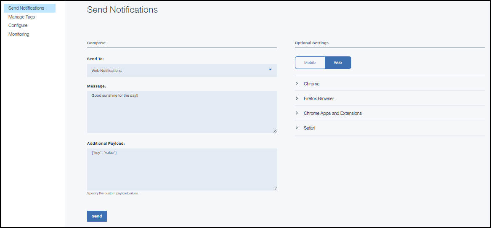

---

copyright:
years: 2015, 2017

---

{:new_window: target="_blank"}
{:shortdesc: .shortdesc}
{:screen:.screen}
{:codeblock:.codeblock}

# 啟用 Web 應用程式來接收推送通知
{: #web_notifications}
前次更新：2017 年 4 月 12 日
{: .last-updated}

您可以啟用 Google Chrome、Mozilla Firefox 及 Safari Web 應用程式來接收 {{site.data.keyword.mobilepushshort}}。請確定您已通過[配置通知提供者的認證](t__main_push_config_provider.html)，再繼續進行下列步驟。

## 安裝適用於 {{site.data.keyword.mobilepushshort}} 的 Web 瀏覽器用戶端 SDK
{: #web_install}

本主題說明如何安裝及使用用戶端 JavaScript Push SDK，來進一步開發 Web 應用程式。

### 在 Web 應用程式中起始設定
{: #web_initialise_web_app}

若要在 Google Chrome Web 應用程式中安裝 Javascript SDK，請完成下列步驟：

從 [Bluemix Web Push SDK](https://codeload.github.com/ibm-bluemix-mobile-services/bms-clientsdk-javascript-webpush/zip/master){: new_window} 下載 `BMSPushSDK.js`、`BMSPushServiceWorker.js` 及 `manifest_Website.json` 檔案。

1. 編輯 `manifest_Website.json` 檔案。
	- 若為 Google Chrome 瀏覽器，請將 `name` 變更為您網站的名稱。例如，`www.dailynewsupdates.com`。將 `gcm_sender_id` 變更為 Firebase Cloud Messaging (FCM) 或 Google Cloud Messaging (GCM) sender_ID。如需相關資訊，請參閱[配置通知提供者的認證](t__main_push_config_provider.html)。gcm_sender_id 值只包含數字。

		```
			{
	"name": "YOUR_WEBSITE_NAME",
  			"gcm_sender_id": "GCM_Sender_Id"
			 }
		```
    		{: codeblock}
 
	- 若使用 Mozilla Firefox 瀏覽器，請在 `manifest_Website.json` 檔案中新增下列值。提供適當的 `name`。這將會是網站的名稱。

		```
			{ 
	"name": "YOUR_WEBSITE_NAME"
			 }
		```
    		{: codeblock}

2. 將 `manifest_Website.json` 檔名變更為 `manifest.json`。
3. 將 `BMSPushSDK.js`、`BMSPushServiceWorker.js` 及 `manifest.json` 新增至網站的根目錄。
3. 在 html 檔案的 `<head>` 標籤中包含 `manifest.json`。
	```
		<link rel="manifest" href="manifest.json">
	```
    	{: codeblock}
4. 在 Web 應用程式中包含 Bluemix Web Push SDK。
	```
		<script src="BMSPushSDK.js" async></script>
	```
    	{: codeblock}

**附註**：確定已部署程式碼，且範例鏈結是使用 `https` 存取，而非 `http`。 

## 起始設定 Web Push SDK 
{: #web_initialize}

使用 Bluemix {{site.data.keyword.mobilepushshort}} 服務 `app GUID` 及 `app Region` 來起始設定 Push SDK。  

若要取得應用程式 GUID，請在導覽窗格中選取已起始設定之 Push 服務的**配置**選項，然後按一下**行動選項**。修改程式碼 Snippet，以使用 Bluemix Push Notifications Service appGUID 參數。

`App Region` 指定管理 {{site.data.keyword.mobilepushshort}} Service 的位置。您可以使用下列三個值的其中一個：

 - 美國達拉斯：`.ng.bluemix.net`
 - 英國：`.eu-gb.bluemix.net`
 - 雪梨：`.au-syd.bluemix.net`

```
	var bmsPush = new BMSPush();
 function callback(response) {
 alert(response.response)
 }
  var initParams = {
  "appGUID":"push app GUID",
  "appRegion":"Region where service hosted",
   "clientSecret":"clientSecret of your push service"
   "websitePushIDSafari": "Optional parameter for Safari Push Notifications only. The value should match the website Push ID provided during the server side configuration."
  }
  bmsPush.initialize(initParams, callback)
```
	{: codeblock}

**附註：**如果您的 Web 推送 SDK 的 FCM 認證變更，Chrome 瀏覽器的訊息遞送可能會失敗。請確定您呼叫 `bmsPush.unRegisterDevice`，以避免發生失敗。

如果您提供錯誤參數，您可能會看到配置相關的錯誤。如需相關資訊，請參閱[疑難排解](troubleshooting.html)。

## 登錄 Web 應用程式
{: #web_register}

使用 **register()** API，以向 {{site.data.keyword.mobilepushshort}} Service 登錄裝置。根據您的瀏覽器，使用下列任何選項。

- 若要從 Google Chrome 登錄，請在 Bluemix {{site.data.keyword.mobilepushshort}} Service Web 配置儀表板中新增 Firebase Cloud Messaging (FCM) 或 Google Cloud Messaging (GCM) API 金鑰及網站 URL。如需相關資訊，請參閱 Chrome 設定下的[配置通知提供者的認證](t__main_push_config_provider.html)。

- 若要從 Mozilla Firefox 登錄，請在 Bluemix {{site.data.keyword.mobilepushshort}} Service Web 配置儀表板的 Firefox 設定下新增網站 URL。

使用下列程式碼 Snippet，在 Bluemix {{site.data.keyword.mobilepushshort}} Service 中登錄。

```
	var bmsPush = new BMSPush();
 function callback(response) {
 alert(response.response)
  }
  var initParams = {
  "appGUID":"push app GUID",
  "appRegion":"Region where service hosted",
  "clientSecret":"clientSecret of your push service"
  "websitePushIDSafari": "Optional parameter for Safari Push Notifications only. The value should match the website Push ID provided during the server side configuration."
  }
  bmsPush.initialize(params, callback)
  bmsPush.register(function(response) {
    alert(response.response)
  })
```
    {: codeblock}


## 將基本通知傳送至 Web 瀏覽器
{: #web_browsers}

開發應用程式之後，您可以傳送推送通知。 

1. 選取**傳送通知**，然後選擇 **Web 通知**作為**傳送至**選項來編寫訊息。 
2. 在**訊息**欄位中，鍵入需要遞送的訊息。
3. 您可以選擇提供選用設定：
  - **通知標題**：這是將顯示為訊息警示標題的文字。
  - **通知圖示 URL**：如果需要使用應用程式通知圖示來遞送您的訊息，請在此欄位中提供該圖示的鏈結。
  - **存活時間**：通知伺服器訊息的有效性。
4. 針對傳送給 Safari 瀏覽器的 Web 通知，還需要一些其他資訊：
  - **動作**：這是動作按鈕的標籤。
  - **URL 引數**：需要與此通知一起使用的 URL 引數。請確定這是以 JSON 陣列的格式提供。 
 
下列影像顯示儀表板中的 Web 通知選項。

  


### 後續步驟
{: #next_steps_tags}

順利設定基本通知之後，即可選擇配置標籤型通知及進階選項。

將這些 {{site.data.keyword.mobilepushshort}} Service 特性新增至您的應用程式。若要使用標籤型通知，請參閱[標籤型通知](c_tag_basednotifications.html)。若要使用進階通知選項，請參閱[進階通知](t_advance_badge_sound_payload.html)。


