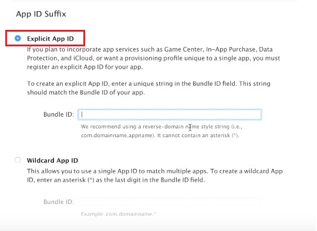
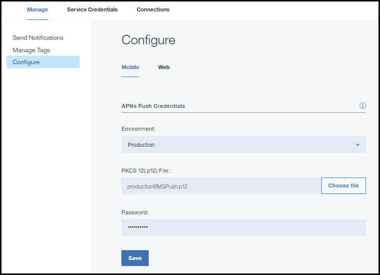

---

copyright:
 years: 2015, 2017

---

{:new_window: target="_blank"}
{:shortdesc: .shortdesc}
{:screen:.screen}
{:codeblock:.codeblock}

# Configuring credentials for a notification provider
{: #create-push-credentials}
Last updated: 12 April 2017
{: .last-updated}

To set up {{site.data.keyword.mobilepushshort}} service, obtain the required  credentials from your push notification provider - either Firebase Cloud Messaging (FCM) or Apple Push Notification service (APNs) for mobile devices. 

You can set up {{site.data.keyword.mobilepushshort}} using either the **IBM Bluemix Services** Dashboard or by using the [REST APIs ](https://mobile.{DomainName}/imfpush/){: new_window}.

## Configuring credentials for FCM
{: #create-push-enable-gcm}

Firebase Cloud Messaging (FCM) is the gateway used to deliver push notifications to Android devices and Google Chrome. FCM is the new version of Google Cloud Messaging (GCM). To set up the {{site.data.keyword.mobilepushshort}} service on the dashboard, you need to get your FCM credentials. Ensure that you use FCM configurations for new apps. Existing apps would continue to function with GCM configurations.

### Getting Your Sender ID and API key
{: #android-senderid-apikey}

The API key is stored securely and used by the {{site.data.keyword.mobilepushshort}} service to connect to the FCM server and the sender ID (project number) is used by the Android SDK and the JS SDK for  Google Chrome and Mozilla Firefox on the client side. 

To setup the FCM, generate the API key and Sender ID, complete the steps:

1. Visit the [Firebase Console ](https://console.firebase.google.com/?pli=1){: new_window}.
2. Select **Create new project**. 
3. In the Create a project window, provide a project name, choose a country/region and click **Create project**.
3. In the navigation pane, click the Settings icon and select **Project settings**.
4. Choose the Cloud Messaging tab to generate a Server API Key and a Sender ID.

### Setting up Push Notification service for Android and Chrome Apps and Extensions
{: #setup-push-android}

**Note:** You will need your FCM/GCM API Key and Sender ID (project number).

1. Open your Bluemix dashboard and then click the {{site.data.keyword.mobilepushfull}} service instance you have created, to open the dashboard. The Push dashboard is displayed. To set up an unbound {{site.data.keyword.mobilepushshort}} service for Android, select the Unbound {{site.data.keyword.mobilepushshort}} service icon to open the {{site.data.keyword.mobilepushshort}} service dashboard. 

2. Click the **Setup Push** button, to configure the FCM/GCM credentials for Android applications and Google Chrome Apps and Extensions.
3. On the **Configuration** page, for Android, go to the **Mobile** tab and configure the Sender ID (GCM project number) and API Key. For Google Chrome Apps and Extensions, go to the **Web** tab and configure the Sender ID (FCM/GCM project number) and API Key appropriately.
4. Click **Save**.
5. Next steps. [Enabling notifications for Android](c_enable_push.html) or [Enabling notifications for Google Chrome Apps & Extensions](c_web_extensions.html).

## Configuring credentials for APNs
{: #create-push-credentials-apns}

Apple Push Notification Service (APNs) allows application developers to send remote notifications from the {{site.data.keyword.mobilepushshort}} service instance on Bluemix (the provider) to iOS devices and applications. Messages are sent to a target application on the device. 

Obtain and configure your APNs credentials. The APNs certificates are securely managed by {{site.data.keyword.mobilepushshort}} service and used to connect to APNs server as a provider.

<!-- 1. Obtain an [Apple Developers ](https://developer.apple.com/){: new_window} account.-->

<!--2. [Register an App ID](#create-push-credentials-apns-register)
3. [Create a development and distribution APNs SSL certificate](#create-push-credentials-apns-ssl)
4. [Create a development provisioning profile](#create-push-credentials-dev-profile)
5. [Create a store distribution provisioning profile](#create-push-credentials-apns-distribute_profile)
6. [Creating .p12 push certificate file for Bluemix push](#create-p12-push-certificate-file-for-Bluemix-push)
7. [Set up APNs on the Push Dashboard](#create-push-credentials-apns-dashboard)
-->

### Registering an App ID
{: #create-push-credentials-apns-register}

The App ID (the bundle identifier) is a unique identifier that identifies a specific application. Each application requires an App ID. Services like the {{site.data.keyword.mobilepushshort}} service are configured to the App ID.

1. Make sure you have an [Apple Developers ](https://developer.apple.com/){: new_window} account.
2. Go to the [Apple Developer ](https://developer.apple.com){: new_window} portal, click **Member Center**, and select **Certificates, Identifiers & Profiles**.
3. Go to the **Registering App IDs** section in the [Apple Developer Library ](https://developer.apple.com/library/mac/documentation/IDEs/Conceptual/AppDistributionGuide/MaintainingProfiles/MaintainingProfiles.html#//apple_ref/doc/uid/TP40012582-CH30-SW991){: new_window}, and follow the instructions to register the App ID.

When you register an App ID, select the following options:

* Push Notifications

* Explicit ID Suffix

4. Create a development and distribution APNs SSL certificate.

### Create a development and distribution APNs SSL certificate
{: #create-push-credentials-apns-ssl}

Before you obtain an APNs certificate, you must first generate a certificate signing request (CSR) and submit it to Apple, the certificate authority (CA). The CSR contains information that identifies your company and your public and private key that you use to sign for your Apple push notifications. Then, generate the SSL certificate on the iOS Developer Portal. The certificate, along with its public and private key, is stored in Keychain Access.

<!-- ###Before you begin -->
<!-- {: before-you-begin-certificate} -->

<!--[Register an App ID](#create-push-credentials-apns-register)-->

You can use APNs in two modes: 

* Sandbox mode for development and testing.
* Production mode when distributing applications through the App Store (or other enterprise distribution mechanisms).

You must obtain separate certificates for your development and distribution environments. The certificates are associated with an App ID for the app that is the recipient of remote notifications. For production, you can create up to two certificates. Bluemix uses the certificates to establish an SSL connection with APNs.

<!-- Create a development and distribution SSL certificate. -->

1. Go to the [Apple Developer ](https://developer.apple.com){: new_window} website, click **Member Center**, and select **Certificates, Identifiers & Profiles**.
2. In the **Identifiers** area, click **App IDs**.
3. From your list of App IDs, select your <!--newly created--> App ID, then select **Settings**.
4. In the **Push Notifications** area, create a Development SSL certificate and then a Production SSL certificate.

	

5. When the **About Creating a Certificate Signing Request (CSR) screen** displays, start the **Keychain Access** application on your Mac to create a Certificate Signing Request (CSR).
6. From the menu, select **Keychain Access > Certificate Assistant > Request a Certificate From a Certificate Authority…** 
7. In **Certificate Information**, enter the email address that is associated with your App Developer account and a common name. Give a meaningful name that helps you identify whether it is a certificate for development (sandbox) or distribution (production); for example, _sandbox-apns-certificate_ or _production-apns-certificate_.
8. Select **Save to disk** to download the `.certSigningRequest` file to your desktop, then click **Continue**.
9. In the **Save As** menu option, name the `.certSigningRequest` file and click **Save**.
10. Click **Done**. You now have a CSR.
11. Return to the **About Creating a Certificate Siging Request (CSR)** window and click **Continue**. 
12. From the **Generate** screen, click **Choose File ...** and select the CSR file that you saved on your desktop. Then, click **Generate**.
	
13. When your certificate is ready, click **Done**.
14. On the **Push Notifications** screen, click **Download** to download your certificate, then click **Done**. 
	
15. On your Mac, go to **Keychain Access > My Certificates**, and locate your newly installed certificate. Double-click the certificate to install it into the Keychain Access.
16. Select the certificate and private key, and then select **Export** to convert the certificate into the personal information exchange format (`.p12` format).
	
17. In the **Save As** field, provide the certificate a meaningful name. For example, `sandbox_apns.p12_certifcate` or `production_apns.p12`, then click **Save**.
	
18. In the **Enter a password** field, enter a password to protect the exported items, then click **OK**. You can use this password to configure your APNs settings on the Push dashboard.{: #step18}
	
19. The **Key Access.app** prompts you to export your key from the **Keychain** screen. Enter your administrative password for your Mac to allow your system to export these items, and then select the **Always Allow** option. A `.p12` certificate is generated on your desktop.

### Creating a development provisioning profile
{: #create-push-credentials-dev-profile}

The provisioning profile works with the App ID to determine which devices can install and run your app and which services your app can access. For each App ID, you create two provisioning profiles: one for development and the other for distribution. Xcode uses the development provisioning profile to determine which developers are allowed to build the application and which devices are allowed to be tested on the application.

Ensure that you have registered an App ID, enabled it for {{site.data.keyword.mobilepushshort}} service, and configured it to use a development and production APNs SSL certificate.

Create a development provisioning profile, as follows:

1. Go to the [Apple Developer ](https://developer.apple.com){: new_window} portal, click **Member Center**, and select **Certificates, Identifiers & Profiles**.
2. Go to the [Mac Developer Library ](https://developer.apple.com/library/mac/documentation/IDEs/Conceptual/AppDistributionGuide/MaintainingProfiles/MaintainingProfiles.html#//apple_ref/doc/uid/TP40012582-CH30-SW62site){: new_window} , scroll to the **Creating Development Provisioning Profiles** section, and follow the instructions to create a development profile.
**Note**: When you configure a development provision profile, select the following options:
	* **iOS App Development**
	* **For iOS and watchOS apps**

### Creating a store distribution provisioning profile
{: #create-push-credentials-apns-distribute_profile}

Use the store provisioning profile to submit your app for distribution to the App Store.

1. Go to the [Apple Developer ](https://developer.apple.com){: new_window} portal, click **Member Center**, and select **Certificates, Identifiers & Profiles**.
2. Double-click the downloaded provisioning profile to install it into Xcode.

### Setting up APNs on the Push Notification Dashboard
{: #create-push-credentials-apns-dashboard}

To use the {{site.data.keyword.mobilepushshort}} service to send notifications, upload the SSL certificates that are required for Apple Push Notification Service (APNs). You can also use the REST API to upload an APNs certificate.

<!-- Get your development and production APNs SSL certificate and the password associated with each type of certificate. For information, see Creating and configuring push credentials for APNs.-->

The certificates required for APNs are `.p12` certificates. These certificates contain the private key and SSL certificates that are required to build and publish your application. You must generate the certificates from the Member Center of the Apple Developer website (for which a valid Apple Developer account is required). Separate certificates are required for the development environment (sandbox) and the production (distribution) environment.

**Note**: After the `.cer` file is in your key chain access, export it to your computer to create a `.p12` certificate.

For more information about using the APNs, see [iOS Developer Library: Local and Push Notification Programming Guide ](https://developer.apple.com/library/ios/documentation/NetworkingInternet/Conceptual/RemoteNotificationsPG/Chapters/ProvisioningDevelopment.html#//apple_ref/doc/uid/TP40008194-CH104-SW4){: new_window}.

To set up APNs on the Push Notification services dashboard, complete the steps:

1. Select **Configure** on the Push Notification services dashboard.
2. Choose the **Mobile** option to update the information in the **APNs Push Credentials** form.
3. Select **Sandbox** (development) or **Production** (distribution) as appropriate and then upload the `p.12` certificate that you created using the previous [step](#step18).
  
3. In the **Password** field, enter the password that is associated with the `.p12` certificate file, then click **Save**.

After the certificates are uploaded successfully with a valid password, you can start sending notifications.

## Configuring credentials for web browsers
{: #configure-credential-for-browsers}

The IBM {{site.data.keyword.mobilepushshort}} service now extends capabilities to send notifications to your browser. 

The website URL or the domain name of your website is required by the {{site.data.keyword.mobilepushshort}} service to identify the requests that need to be allowed. A {{site.data.keyword.mobilepushshort}} service instance supports only one domain name at a time. Hence, ensure that the same value is set for Chrome, Firefox and Safari. 

Chrome and Safari browsers require additional configuration for web push. You would need an FCM API key, as an FCM endpoint is used to deliver messages in Chrome. 

### Configuring for Chrome and Firefox web push 
{: #config-chrome-firefox}

1. On the Push Dashboard panel, select **Configure**.
2. Select the Web tab.
	
3. Configure the FCM/GCM API key and the URL of your website that will be registered to receive push notifications.
4. Click **Save**.
5. Next steps. [Enabling notifications for Google Chrome and Mozilla Firefox browsers](c_chrome_firefox_enable.html).

### Configuring for Safari web push 
{: #configure-safari}

The supported version for {{site.data.keyword.mobilepushshort}} service on Safari is 10.0. You need to generate a certificate through your Apple Developer account, before you can configure your browser to receive notifications.

#### Generating a certificate
{: #certificate-generation}

Ensure that you have an Apple Developer account. You need to register a Website Push ID and generate a certificate to configure your Safari browser to receive notifications. The following steps will help you get started.

1. In the Apple Developer Member center, click **Certificates, ID & Profiles**. 
2. Click **Identifiers** and then **Website Push IDs**.
3. Choose to create a new entry by selecting the plus icon.
  

4. In the Register Website Push ID panel, provide an appropriate Website Push ID description and identifier ID. It is recommended that this is in reverse-domain name format, starting with `web`. For example: `web.com.example.dailyweatherreports`.
5. Register the Website Push ID. You now have your Website Push ID 
6. Select **Edit** to create a certificate to use for the Website Push ID.
7. In the Certificate Assistant window for Certificate Information, provide your email ID, and a common name. Leave the Certificate Authority email address as blank.
8. Click **Save to disk** and select **Continue**.
9. Choose to save the certificate to an appropriate folder.
10. Choose the `.certSigningRequest` created on the disk when prompted in the wizard for generating the certificate. Ensure that you download the Website push certificate created in the `.cer` format.
11. Open the Certificate in the KeyChain Access tool. Right-click and export as a p12 certificate. Note the password provided during the generation of the p12 certificate.

#### Configuring for notifications
{: #configuration-notification}
 
After generating the certificate, you can configure the service to send notifications to Safari. 

Complete the steps:

1. In the Push Notifications service dashboard, **click Configure**. 
2. Select the Web tab. 
3. In the Safari Push section, update the form with the required information. 
	- **Website Name**: This is the name that you have provided in the Notification center.
	- **Website Push ID**: Update with the reverse-domain string for your Website Push ID. For example, web.com.example.www.
	- **Website URL**: Provide the URL of the website that should be subscribed to push notifications. For example, https://www.example.com.
	- **Allowed Domains**: This is optional parameter. This is the list of websites that requests permission from the user. Ensure that the URLs are comma separated values. Note that the value in Website URL will be used if this is not provided. 
	- **URL Format String**: The URL to resolve when the notification is clicked. For example, ["https://www.example.com"]. Ensure that the URL use the http or https scheme.
	- **Safari web push certificate**: Upload the .p12 certificate and provide the password.
4. Click **Save**.	

	

You are now configured to send push notifications to the Safari browser.