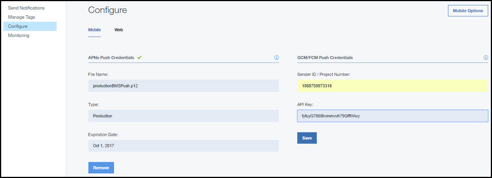

---

copyright:
 years: 2015, 2016

---

{:new_window: target="_blank"}
# Configuring credentials for Apple push notifications(APNs)

{: #create-push-credentials-apns}

Apple Push Notification service (APNs) allows the application developer to send remote notifications from the Push Service instance on Bluemix (the provider) to iOS devices and applications. Messages are sent to a target application on the device. Obtain and configure your APNs credentials. APNs certificates are securely managed by the Push Notification Service and used to connect to the APNs server as a provider.

1. Obtain an [Apple Developers](https://developer.apple.com/) account.
2. [Register an App ID](#create-push-credentials-apns-register)
3. [Create a development and distribution APNs SSL certificate](#create-push-credentials-apns-ssl)
4. [Create a development provisioning profile](#create-push-credentials-dev-profile)
5. [Create a store distribution provisioning profile](#create-push-credentials-apns-distribute_profile)
6. [Set up APNs on the Push Dashboard](#create-push-credentials-apns-dashboard)

##Registering an App ID
{: #create-push-credentials-apns-register}

The App ID (the bundle identifier) is a unique identifier that identifies a specific application. Each application requires an App ID. Services like the Push Notifications Service are configured to the App ID.

1. Go to the [Apple Developer](https://developer.apple.com) portal, click **Member Center**, and select **Certificates, Identifiers & Profiles**.
2. Go to the **Registering App IDs** section in the [Apple Developer Library](https://developer.apple.com/library/mac/documentation/IDEs/Conceptual/AppDistributionGuide/MaintainingProfiles/MaintainingProfiles.html#//apple_ref/doc/uid/TP40012582-CH30-SW991), and follow the instructions to register the App ID.

	**Note**: When you register an App ID, select the following options:
	* Push Notifications

	

	* Explicit ID Suffix

	
3. Next steps. Create a development and distribution APNs SSL certificate.

##Create a development and distribution APNs SSL certificate
{: #create-push-credentials-apns-ssl}

Before you can obtain an APNs certificate, you must first generate a certificate signing request (CSR) and submit it to Apple, the certificate authority (CA). The CSR contains information that identifies your company and your public and private key that you use to sign your Apple push notifications. Then, generate the SSL certificate on the iOS Developer Portal. The certificate, along with its public and private key, is stored in Keychain Access.

**Before you begin**

[Register an App ID](#create-push-credentials-apns-register)

APNs can be used in two modes: sandbox and production.

* Sandbox mode is used during development and testing.
* Production mode is used when distributing applications through the App Store (or other enterprise distribution mechanisms).

You must obtain separate certificates for your development and distribution environments. The certificates are associated with an App ID for the app that is the recipient of remote notifications. For production, you can create up to two certificates. Bluemix uses the certificates to establish an SSL connection with APNs.

Create a development and distribution SSL certificate.

1. Go to [Apple Developer](https://developer.apple.com), click **Member Center**, and select **Certificates, Identifiers & Profiles**.
2. In the **Identifiers** area, click **App IDs**.
3. From your list of App IDs, select your newly created App ID, then select **Settings**.
4. In the **Push Notifications** area, create a Development SSL certificate and then a Production SSL certificate.
 
	

	The About Creating a Certificate a Signing Request screen is displayed.

	

5. On your Mac, start the **Keychain Access** application to create a Certificate Signing Request (CSR).
6. Select **Keychain Access > Certificate Assistant > Request a Certificate From a Certificate Authority…** 
7. In **Certificate Information**, enter your email address that is associated with your App Developer account and a common name. Give a meaningful name that helps you identify whether it is a certificate for development, (sandbox) or distribution (production); for example, **sandbox_apns_certificate** or **production_apns_certificate**.

8. Select the **Saved to disk** to download the **.certSigningRequest** file to your desktop, then click **Continue**.
9. In the **Save As**, name the **.certSigningRequest** file; for example **sandbox.certSigningRequest**, then click **Save**.
10. Click **Done**. You now have a CSR.
11. From the **About Creating a Certificate a Siging Request (CSR)**, click **Continue**. 12. 
12. From the **Generate** screen, click **Choose File ...** and select the CSR file that you saved on your desktop. Then, click **Generate**.

	

13. When your certificate is ready, click **Done**.
14. On the **Push Notifications** screen, click **Download** to download your certificate, then click **Done**. 
15. On your Mac, go to **Keychain Access > My Certificates**, and locate your newly installed certificate. Double-click the certificate to install it into the Keychain Access.
16. Select the certificate and private key, and then select **Export** to convert the certificate into the personal information exchange format (.p12 format).

	

17. In the **Save As** field, give the certificate a meaningful name so that you can identify it later; for example **sandbox_apns.p12_certifcate** or **production_apns.p12**, then click **Save**.

   	

18. In the **Enter a password** field, enter a password to protect the exported items, then click **OK**. You use this password to later configure your APNs settings on the Push dashboard.

	
19. The **Key Access.app** prompts you to export your key from the **Keychain** screen. Enter your administrative password for your Mac to allow your system to export these items, and then select **Always Allow** option. A .p12 certificate is generated on your desktop.

##Creating a development provisioning profile
{: #create-push-credentials-dev-profile}

The provisioning profile works with the App ID to determine which devices can install and run your app and which services your app can access. For each App ID, you create two provisioning profiles: one for development and the other for distribution. Xcode uses the development provisioning profile to determine which developers are allowed to build the application and which devices are allowed to be tested on the application.

**Before you begin**

Make sure you have registered an App ID, enabled it for Push Notification Service, and configured it to use a development and production APNs SSL certificate.

Create a development provisioning profile.

1. Go the Go to [Apple Developer](https://developer.apple.com) portal, click **Member Center**, and select **Certificates, Identifiers & Profiles**.
2. Go to the [Mac Developer Library ](https://developer.apple.com/library/mac/documentation/IDEs/Conceptual/AppDistributionGuide/MaintainingProfiles/MaintainingProfiles.html#//apple_ref/doc/uid/TP40012582-CH30-SW62site) , scroll to **Creating Development Provisioning Profiles** section, and follow the instructions to create a development profile.

	**Note**: When you configure a development provision profile, select the following options:
	* **iOS App Development**
	* **For iOS and watchOS apps**

##Creating a store distribution provisioning profile
{: #create-push-credentials-apns-distribute_profile}

Use the store provisioning profile to submit your app for distribution to the App Store.

1. Go the Go to [Apple Developer](https://developer.apple.com) portal, click **Member Center**, and select **Certificates, Identifiers & Profiles**.
2. Double-click the downloaded provisioning profile to install it into Xcode.

##Setting up APNs on the Push Notification Dashboard
{: #create-push-credentials-apns-dashboard}

To use the Push Notification Service to send notifications, upload the SSL certificates that are required for Apple Push Notification service (APNs). You can also use the REST API to upload an APNs certificate.

**Before you begin**

Get your development and production APNS SSL certificate and the password associated with each type of certificate. For information, see Creating and configuring push credentials for APNS.

The certificates that are needed for APNs are .p12 certificates, which contain the private key and SSL certificates that are required to build and publish your application. You must generate the certificates from the Member Center of the Apple Developer website (for which a valid Apple Developer account is required). Separate certificates are required for the development environment (sandbox) and the production (distribution) environment.

**Note**: After the .**cer**  is in your key chain access, export it to your computer to create a .p12 certificate.

For more information about using the APNs, see [iOS Developer Library: Local and Push Notification Programming Guide](https://developer.apple.com/library/ios/documentation/NetworkingInternet/Conceptual/RemoteNotificationsPG/Chapters/ProvisioningDevelopment.html#//apple_ref/doc/uid/TP40008194-CH104-SW4).

Set up APNs on the Push dashboard.

1. Open your backend application in the Bluemix dashboard and then click the **IBM Push Notifications** service to open the Push dashboard.

	

	The Push dashboard is displayed.
	
	
1
2. On the **Configuration** tab, go to the **Apple Push Certificate** section,  select **Sandbox** (development) or **Production** (distribution) and then upload the p.12 certificate to Bluemix.

	
3. In the **Password** field, enter the password that is associated with the **.p12** certificate file, then click **Save**.
After the certificates are uploaded successfully with a valid password, you can start sending notifications.

