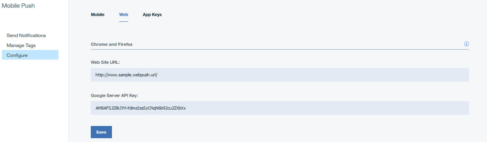

---

copyright:
 years: 2015, 2017

---

{:new_window: target="_blank"}
{:shortdesc: .shortdesc}
{:screen:.screen}
{:codeblock:.codeblock}

# Configuring credentials for web browsers
{: #configure-credential-for-browsers}
Last updated: 11 January 2017
{: .last-updated}

The IBM {{site.data.keyword.mobilepushshort}} service now extends capabilities to send notifications to your browser. 

The website URL or the domain name of your website is required by the {{site.data.keyword.mobilepushshort}} service to identify the requests that need to be allowed. A {{site.data.keyword.mobilepushshort}} service instance supports only one domain name at a time. Hence, ensure that the same value is set for Chrome, Firefox and Safari. 

Chrome and Safari browsers require additional configuration for web push. You would need an FCM API key, as an FCM endpoint is used to deliver messages in Chrome. To obtain your FCM API key, see [Configuring credentials for FCM](t_push_provider_android.html).

## Configuring for Chrome and Firefox web push 
{: #config-chrome-firefox}

1. On the Push Dashboard panel, select **Configure**.
2. Select the Web tab.
	
3. Configure the FCM/GCM API key and the URL of your website that will be registered to receive push notifications.
4. Click **Save**.
5. Next steps. [Enabling notifications for Google Chrome and Mozilla Firefox browsers](c_enable_push.html).

## Configuring for Safari web push 
{: #configure-safari}

The supported version for {{site.data.keyword.mobilepushshort}} service on Safari is 10.0. You need to generate a certificate through your Apple Developer account, before you can configure your browser to receive notifications.

### Generating a certificate
{: #certificate-generation}

Ensure that you have an Apple Developer account. You need to register a Website Push ID and generate a certificate to configure your Safari browser to receive notifications. The following steps will help you get started.

1. In the Apple Developer Member center, click **Certificates, ID & Profiles**. 
2. Click **Identifiers** and then **Website Push IDs**.
3. Choose to create a new entry by selecting the plus icon.
  

4. In the Register Website Push ID panel, provide an appropriate Website Push ID description and identifier ID. It is recommended that this is in reverse-domain name format, starting with 'web'. For example: web.com.example.dailyweatherreports.
5. Register the Website Push ID. You now have your Website Push ID 
6. Select **Edit** to create a certificate to use for the Website Push ID.
7. In the Certificate Assistant window for Certificate Information, provide your email ID, and a common name. Leave the Certificate Authority email address as blank.
8. Click **Save to disk** and select **Continue**.
9. Choose to save the certificate to an appropriate folder.
10. Choose the `.certSigningRequest` created on the disk when prompted in the wizard for generating the certificate. Ensure that you download the Website push certificate created in the `.cer` format.
11. Open the Certificate in the KeyChain Access tool. Right-click and export as a p12 certificate. Note the password provided during the generation of the p12 certificate.

### Configuring for notifications
  {: #configuration-notification}
 
After generating the certificate, you can configure the service to send notifications to Safari. 

Complete the steps:

1. In the Push Notifications service dashboard, **click Configure**. 
2. Select the Web tab. 
3. In the Safari Push section, update the form with the required information. 
	- **Website Name**: This is the name that you have provided in the Notification center.
	- **Website Push ID**: Update with the reverse-domain string for your Website Push ID. For example, web.com.example.www.
	- **Website URL**: Provide the URL of the website that should be subscribed to push notifications. For example, https://www.example.com.
	- **Allowed Domains**: This is optional parameter. This is the list of websites that requests permission from the user. Ensure that the URLs are comma separated values. Note that the value in Website URL will be used if this is not provided. 
	- **URL Format String**: The URL to resolve when the notification is clicked. For example, ["https://www.example.com"]. Ensure that the URL use the http or https scheme.
	- **Safari web push certificate**: Upload the .p12 certificate and provide the password.
4. Click **Save**.	

	

You are now configured to send push notifications to the Safari browser.

	