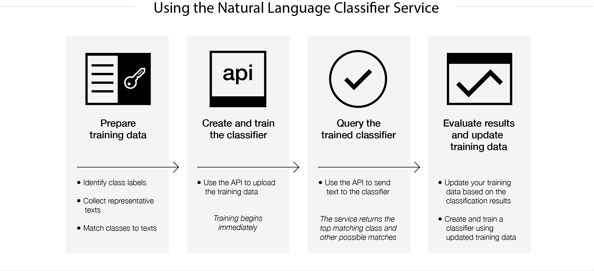

---

copyright:
  years: 2015, 2017
lastupdated: "2017-04-20"

---

{:new_window: target="_blank"}
{:shortdesc: .shortdesc}

# About
{: #about}

{{site.data.keyword.nlclassifierfull}} uses machine learning algorithms to return the top matching predefined classes for short text inputs.
{:shortdesc}

## How you use the service

The following image shows the process of creating and using the classifier:

## What to use the service for
{: #use-cases}

{{site.data.keyword.nlclassifiershort}} can help your application understand the language of short texts and make predictions about how to handle them. A classifier learns from your example data and then can return information for texts that it is not trained on.

One use of the service is for customer support. For example, you can use the service to take predictive actions, such as routing users' questions to the correct person or classifying issues by severity. And by incorporating the {{site.data.keyword.speechtotextshort}} service in your app, you can also route voice questions to a specific department.

## Supported languages
{: #supported-languages}

{{site.data.keyword.nlclassifiershort}} supports English, Arabic, French, German, Japanese, Italian, Portuguese, and Spanish.

## Next steps
{: #next-steps}

- [Get started](/docs/services/natural-language-classifier/overview.html) with the service.
- Try out the [demo ](http://natural-language-classifier-demo.mybluemix.net){:new_window}.
