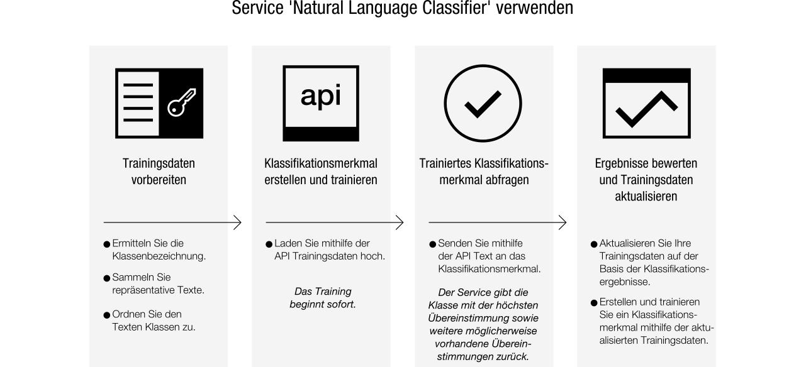

---

copyright:
  years: 2015, 2017
lastupdated: "2017-04-20"

---

{:new_window: target="_blank"}
{:shortdesc: .shortdesc}

# Informationen zu Natural Language Classifier
{: #about}

{{site.data.keyword.nlclassifierfull}} verwendet Algorithmen für maschinelles Lernen, um für kurze Texteingaben die vordefinierten Klassen zurückzugeben, die die höchste Übereinstimmung aufweisen.
{:shortdesc}

## Verwendung des Service 

Die folgende Abbildung zeigt den Prozess für das Erstellen und Verwenden des Klassifikationsmerkmals an: 

## Einsatzbereich des Service
{: #use-cases}

Der Service {{site.data.keyword.nlclassifiershort}} unterstützt Ihre Anwendung, sodass sie die Sprache kurzer Texte verstehen und Vorhersagen zu ihrer Handhabung erstellen kann. Ein Klassifikationsmerkmal ('Classifier') lernt anhand Ihrer Beispieldaten und kann anschließend Informationen zu Texten zurückgeben, anhand derer es nicht trainiert wurde. 

Der Service kann unter anderem im Kundendienst eingesetzt werden. Zum Beispiel können Sie mithilfe des Service vorausschauende Aktionen vornehmen, beispielsweise um Benutzerfragen an die zuständige Person weiterzuleiten oder um Probleme nach Schweregrad zu klassifizieren. Indem Sie den Service '{{site.data.keyword.speechtotextshort}}' in Ihre App integrieren, können Sie außerdem mithilfe einer Sprachunterstützung gestellte Fragen an eine bestimmte Abteilung weiterleiten. 

## Unterstützte Sprachen
{: #supported-languages}

Der Service '{{site.data.keyword.nlclassifiershort}}' unterstützt die Sprachen Englisch, Arabisch, Französisch, Deutsch, Japanisch, Italienisch, Portugiesisch und Spanisch. 

## Nächste Schritte
{: #next-steps}

- [Los geht's](/docs/natural-language-classifier/overview.html) mit dem Service. 
- Probieren Sie die [Demo ](http://natural-language-classifier-demo.mybluemix.net){:new_window} aus. 
