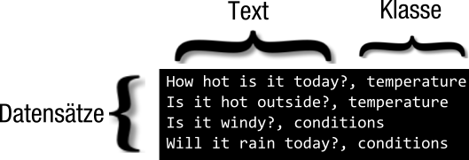

---

copyright:
  years: 2015, 2017
lastupdated: "2017-04-20"

---

{:new_window: target="_blank"}
{:shortdesc: .shortdesc}

# Eigene Daten verwenden
Nach dem Erstellen, Trainieren und Abfragen einer {{site.data.keyword.nlclassifierfull}}-Instanz mit den Daten im Beispiel unter [Einführung](/doc/natural-language-classifier/getting-started.html) möchten Sie ein Klassifikationsmerkmal erstellen, das mit Ihren eigenen Daten arbeitet. Diese Trainingsdaten werden von Ihnen zusammengestellt und bereitgestellt.
{:shortdesc}

## Struktur der Trainingsdaten
Sie können die Daten zum Trainieren der {{site.data.keyword.nlclassifiershort}}-Instanz im CSV-Format bereitstellen. 

Im CSV-Format stellt eine Zeile der Datei einen Beispieldatensatz dar. Jeder Datensatz hat mindestens zwei Spalten. Die erste Spalte ist der repräsentative Text, der klassifiziert werden soll. Die zusätzlichen Spalten sind Klassen, die für diesen Text gültig sind. Die folgende Abbildung zeigt eine CSV-Datei mit vier Datensätzen. In jedem Datensatz in diesem Beispiel sind getrennt durch ein Komma die Texteingabe und eine Klasse enthalten: 

Es handelt sich hier um ein kleines Beispiel. Richtige Trainingsdaten umfassen weit mehr Datensätze. 

Laden Sie die Datei <a target="_blank" href="https://watson-developer-cloud.github.io/doc-tutorial-downloads/natural-language-classifier/weather_data_train.csv" download="weather_data_train.csv">weather_data_train.csv</a> herunter, um eine Beispieldatei für Trainingsdaten anzuzeigen. 

### Zusätzliche Metadaten

Zusätzlich zu den Texten und Klassen umfasst die Anforderung für die Erstellung eines Klassifikationsmerkmals weitere Informationen. Die Metadaten geben die Sprache der Daten an und Sie können auch einen Namen einschließen, um das Klassifikationsmerkmal leichter zu identifizieren. 

### Dateiformat für CSV-Trainingsdaten

Stellen Sie sicher, dass Ihre CSV-Trainingsdaten folgende Formatvoraussetzungen erfüllen: 

- Die Daten müssen die UTF-8-Codierung aufweisen. 
- Textwerte und die einzelnen Klassenwerte müssen durch ein Komma als Trennzeichen getrennt werden. Jeder Datensatz (Zeile) endet mit einem Zeilenendezeichen, bei dem es sich um ein Sonderzeichen oder eine Zeichenfolge handelt, das bzw. die das Ende einer Zeile angibt. 
- Jeder Datensatz muss einen Textwert und mindestens einen Klassenwert aufweisen. 
- Klassenwerte dürfen keine Tabulatoren oder Zeilenendezeichen enthalten. 
- Ohne eine besondere Handhabung dürfen Textwerte keine Tabulatoren oder Zeilenumbrüche enthalten. Damit Tabulatoren oder Zeilenumbrüche erhalten bleiben, versehen Sie einen Tabulator mit `\t` und einen Zeilenumbruch mit `\r`, `\n` oder `\r\n`. 

	Zum Beispiel ist `Example text\twith a tab` gültig, `Example text    with a tab` ist ungültig.
- Schließen Sie Text- oder Klassenwerte in den Trainingsdaten stets in Anführungszeichen ein, wenn folgende Zeichen enthalten sind: 
	- Kommas: `"Example text, with comma"`. 
	- Anführungszeichen. Darüber hinaus müssen Anführungszeichen nochmals mit Anführungszeichen als Escapezeichen versehen werden: `"Example text with ""quotation"""`. 

## Größenbegrenzungen
Für die Trainingsdaten gelten sowohl Mindestwerte als auch Maximalwerte: 

-   Die Trainingsdaten müssen mindestens fünf Datensätze (Zeilen) und höchstens 15.000 Datensätze aufweisen. 
-   Die maximale Gesamtlänge eines Textwerts beträgt 1024 Zeichen. 

## Sprachen
Obwohl die voreingestellte Sprache Englisch ist, können Sie beim Erstellen des Klassifikationsmerkmals die Sprache der Trainingsdaten angeben. Die Sprache der Trainingsdaten muss mit der Sprache des Textes übereinstimmen, den Sie klassifizieren wollen. Details finden Sie in der [API-Referenz ](http://www.ibm.com/watson/developercloud/natural-language-classifier/api/v1/){:new_window}. 

Das Klassifikationsmerkmal unterstützt Englisch (en), Arabisch (ar), Französisch (fr), Deutsch (de), Japanisch (ja), Italienisch (it), Portugiesisch (Brasilien) (pt) und Spanisch (es). 

## Richtlinien für ein gutes Training
Folgende Richtlinien werden nicht von der API erzwungen. Das Klassifikationsmerkmal erbringt jedoch eine bessere Leistung, wenn die Trainingsdaten diese Richtlinien einhalten: 

- Die Länge des Eingabetextes sollte auf weniger als 60 Wörter begrenzt sein. 
- Die Anzahl der Klassen sollte einige hundert Klassen nicht übersteigen. In höheren Versionen des Service wird möglicherweise Unterstützung für eine größere Anzahl Klassen enthalten sein. 
- Stellen Sie sicher, dass jede Klasse eine Übereinstimmung mit mindestens 5 - 10 Datensätzen hat, wenn jeder Textdatensatz nur eine Klasse aufweist. Diese Anzahl bietet ausreichend Training für die Klasse. 
- Bewerten Sie, ob es erforderlich ist, mehrere Klassen zu haben. Zwei allgemeine Gründe sprechen für das Vorhandensein mehrerer Klassen: 
	- Wenn der Text vage ist, ist die Ermittlung einer einzelnen Klasse häufig nicht eindeutig. 
	- Wenn Experten den Text auf unterschiedliche Weise interpretieren, werden diese Interpretationen bei Vorhandensein mehrerer Klassen unterstützt. 

	Wenn jedoch viele Texte in Ihren Trainingsdaten mehrere Klassen aufweisen oder wenn einige Texte mehr als drei Klassen aufweisen, müssen Sie die Klassen möglicherweise optimieren. Überprüfen Sie beispielsweise, ob die Klassen hierarchisch sind. Wenn sie hierarchisch sind, schließen Sie den Blattknoten als Klasse ein.
-  Schließen Sie standardmäßige Begriffe mit Bindestrich ein, wenn sie Teil der Trainingsdaten sind (`back-to-back` oder ` part-time job`). 

	Verbinden Sie jedoch nicht aufeinander folgende Wörter, um neue Begriffe zu erstellen, die es in der Sprache der Trainingsdaten nicht gibt. Definieren Sie zum Beispiel statt `dish-ran-away` oder `with_the_spoon` (Text aus einem Kindergedicht) die relevanten Ausdrücke als einzelne Wörter (`dish ran away` und `with the spoon`) mit der entsprechenden Klasse. 

## Trainingsdaten erstellen
Das maschinelle Lernen beschreibt einen Prozess, bei dem anhand eines Datensatzes einige Eigenschaften erlernt werden und diese Eigenschaften dann auf neue Daten angewendet werden. Der Service '{{site.data.keyword.nlclassifiershort}}' folgt diesem Prozess. Er wird trainiert, um vordefinierte Klassen mit Beispieltext zu verbinden, und er wendet diese Klassen anschließend auf neue Eingaben an. 

Das trainierte Klassifikationsmerkmal ist also nur so gut wie die Trainingsdaten. Jeder Textwert in den Daten muss die Art der Texte darstellen, die das Klassifikationsmerkmal vorhersagen soll. Jede Klasse, die zurückgegeben werden soll, muss auch in den Trainingsdaten enthalten sein, und die Klassen, die Sie den einzelnen Texten zuordnen, müssen richtig sein. 

Wenn es sich bei den Texten in Ihren Trainingsdaten beispielsweise um Fragen handelt, verwenden Sie Fragen, die für die Fragen Ihrer Benutzer repräsentativ und typisch sind. Sie können diese Texte aus tatsächlichen Benutzerdaten erfassen oder Sie haben Experten in Ihrem Bereich, die die Texte erstellen können. 

Es ist wichtig, dass die Daten repräsentativ und korrekt sind, da die Daten der Ausgangspunkt für alle Prozesse und Ergebnisse des Klassifikationsmerkmals sind. Darüber hinaus gilt, dass das Klassifikationsmerkmal eine desto größere Chance hat, eine Übereinstimmung zu finden, je mehr Datensätze Sie in die Trainingsdaten einschließen. 
