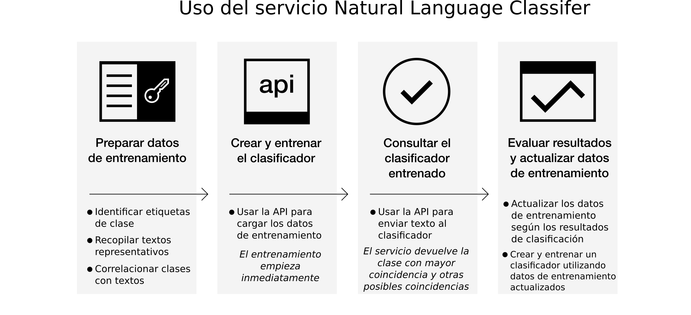

---

copyright:
  years: 2015, 2017
lastupdated: "2017-04-20"

---

{:new_window: target="_blank"}
{:shortdesc: .shortdesc}

# Acerca de Natural Language Classifier
{: #about}

{{site.data.keyword.nlclassifierfull}} utiliza algoritmos de aprendizaje de máquina para devolver las principales clases predefinidas coincidentes para entradas de texto cortas. {:shortdesc}

## Cómo utilizar el servicio

En la siguiente imagen se muestra el proceso de creación y utilización del clasificador: 

## Para qué se utiliza el servicio
{: #use-cases}

El servicio {{site.data.keyword.nlclassifiershort}} puede ayudar a su aplicación a comprender el lenguaje de textos breves y realizar predicciones sobre cómo gestionarlos. Un clasificador aprende de sus datos de ejemplo y puede devolver información sobre textos sobre los que no está entrenado.

Uno de los posibles usos del servicio es para dar soporte al cliente. Por ejemplo, puede utilizar el servicio para emprender acciones predictivas, como direccionamiento de las preguntas de los usuarios a la persona correcta o clasificación de problemas según su gravedad. Si incorpora el servicio {{site.data.keyword.speechtotextshort}} a su app, también puede dirigir las preguntas por voz a un departamento específico. 

## Idiomas admitidos
{: #supported-languages}

El servicio {{site.data.keyword.nlclassifiershort}} admite los idiomas inglés, árabe, francés, alemán, japonés, italiano, portugués y español. 

## Siguientes pasos
{: #next-steps}

- [Cómo empezar](/docs/natural-language-classifier/overview.html) a trabajar con el servicio. 
- Pruebe la [demo ](http://natural-language-classifier-demo.mybluemix.net){:new_window}.
