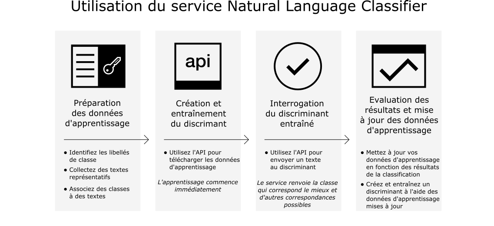

---

copyright:
  years: 2015, 2017
lastupdated: "2017-04-20"

---

{:new_window: target="_blank"}
{:shortdesc: .shortdesc}

# A propos de Natural Language Classifier
{: #about}

{{site.data.keyword.nlclassifierfull}} utilise des algorithmes
d'apprentissage automatique afin de renvoyer les classes prédéfinies qui correspondent le
mieux pour des entrées de texte court.
{:shortdesc}

## Utilisation du service 

L'image suivante représente le processus de création et d'utilisation du
discriminant :

## Objectif du service 
{: #use-cases}

Le service {{site.data.keyword.nlclassifiershort}} peut aider votre application à comprendre la langue de textes courts et prévoir leur traitement. 
Un discriminant effectue son apprentissage à partir de vos exemples de données, puis peut
renvoyer des informations pour les textes pour lesquels il n'est pas entraîné.

L'une des utilisations du service s'adresse au service de support
client. Par
exemple, vous pouvez utiliser le service pour prendre des mesures en amont, comme
acheminer des questions posées par des utilisateurs à la personne appropriée ou
classifier des problèmes selon leur gravité.
De plus, en incorporant le service {{site.data.keyword.speechtotextshort}} à
votre application, vous pouvez également acheminer des questions enregistrées
vocalement à un département spécifique.

## Langues prises en charge
{: #supported-languages}

Le service {{site.data.keyword.nlclassifiershort}} prend en charge
l'anglais, l'arabe, le français, l'allemand, le japonais, l'italien, le portugais et
l'espagnol.

## Etapes suivantes
{: #next-steps}

- [Initiez-vous](/docs/natural-language-classifier/overview.html) au service.
- Suivez la [démonstration ](http://natural-language-classifier-demo.mybluemix.net){:new_window}.
