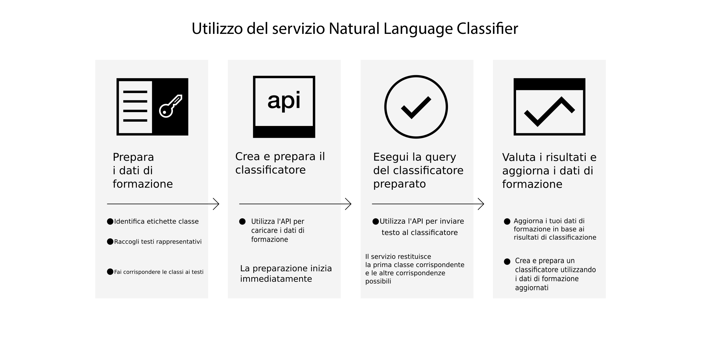

---

copyright:
  years: 2015, 2017
lastupdated: "2017-04-20"

---

{:new_window: target="_blank"}
{:shortdesc: .shortdesc}

# Informazioni su Natural Language Classifier
{: #about}

{{site.data.keyword.nlclassifierfull}} utilizza gli algoritmi di apprendimento automatico (machine learning) per restituire le classi più corrispondenti per le immissioni di brevi testi.
{:shortdesc}

## Come utilizzi il servizio

La seguente immagine illustra il processo di creazione e utilizzo del classificatore:

## Come utilizzare il servizio
{: #use-cases}

Il servizio {{site.data.keyword.nlclassifiershort}} può
aiutare la tua applicazione a comprendere la lingua di brevi testi e fare delle previsioni su come gestirli. Un classificatore fornisce informazioni sui dati di esempio e può restituire le informazioni per i testi su cui non è preparato. 

Un utilizzo del servizio è per il supporto personalizzato. Ad esempio, puoi utilizzare il servizio per eseguire azioni predittive, come indirizzare le domande dell'utente alla persona corretta o classificando i problemi per severità. Incorporando il servizio {{site.data.keyword.speechtotextshort}} nella tua applicazione, puoi anche indirizzare le domande vocali a un dipartimento specifico.

## Lingue supportate 
{: #supported-languages}

Il servizio {{site.data.keyword.nlclassifiershort}} supporta inglese, arabo, francese, tedesco, giapponese, italiano, portoghese e spagnolo.

## Passi successivi
{: #next-steps}

- [Inizia ad utilizzare](/docs/natural-language-classifier/overview.html) il servizio.
- Prova la demo {:new_window}.
