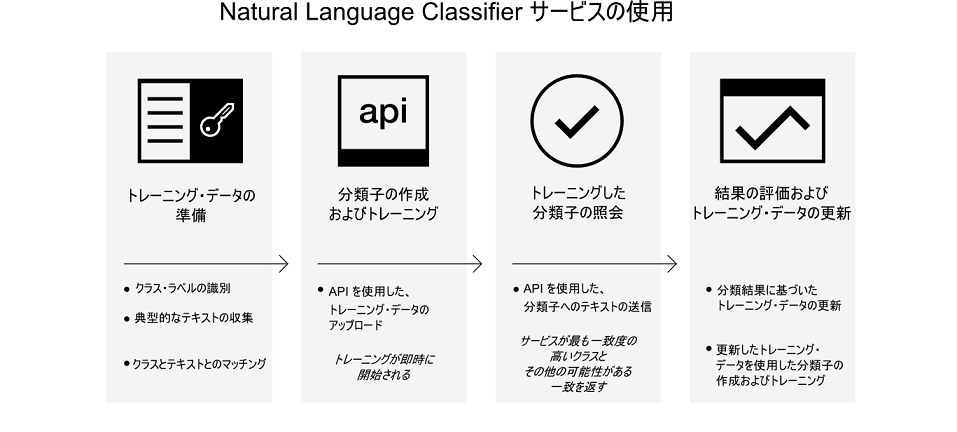

---

copyright:
  years: 2015, 2017
lastupdated: "2017-04-20"

---

{:new_window: target="_blank"}
{:shortdesc: .shortdesc}

# Natural Language Classifier の詳細
{: #about}

{{site.data.keyword.nlclassifierfull}} は機械学習アルゴリズムを使用して、ショート・テキスト入力に対して最も一致度の高い定義済みクラスを返します。{:shortdesc}

## このサービスの使用方法

以下のイメージは、分類子を作成して使用するプロセスを示しています。

## サービスの使用目的
{: #use-cases}

{{site.data.keyword.nlclassifiershort}} サービスは、アプリケーションがショート・テキストの言語を理解し、それらのテキストの処理方法を予測するのに役立ちます。分類子は、サンプル・データから学習した後、トレーニングされていないテキストに関する情報を返すことができるようになります。

このサービスの用途の 1 つはお客様サポートです。例えば、このサービスを使用して、ユーザーの質問を正しい担当者に転送したり、問題を重大度別に分類したりするような予測アクションを行うことができます。アプリに {{site.data.keyword.speechtotextshort}} サービスを取り込むことで、音声の質問を特定の部門に転送することもできます。

## サポートされる言語
{: #supported-languages}

{{site.data.keyword.nlclassifiershort}} サービスでは、英語、アラビア語、フランス語、ドイツ語、日本語、イタリア語、ポルトガル語、およびスペイン語がサポートされます。

## 次のステップ
{: #next-steps}

- サービスを[開始します](/docs/natural-language-classifier/overview.html)。
- [デモ ](http://natural-language-classifier-demo.mybluemix.net){:new_window} を試してみます。
