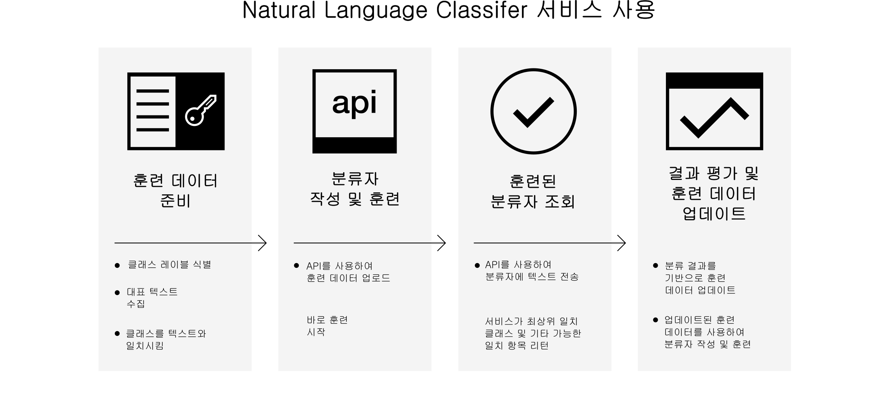

---

copyright:
  years: 2015, 2017
lastupdated: "2017-04-20"

---

{:new_window: target="_blank"}
{:shortdesc: .shortdesc}

# Natural Language Classifier 정보
{: #about}

{{site.data.keyword.nlclassifierfull}}는 기계 학습 알고리즘을 사용하여 짧은 텍스트 입력과 가장 잘 일치하는 사전 정의된 클래스를 리턴합니다.
{:shortdesc}

## 서비스 사용법

다음 이미지는 분류자를 작성하고 사용하는 프로세스를 보여줍니다. 

## 서비스의 용도
{: #use-cases}

{{site.data.keyword.nlclassifiershort}} 서비스를 통해 애플리케이션은 짧은 텍스트의 언어를 이해하고 해당 텍스트의 처리 방법을 예측할 수 있습니다. 분류자는 예제 데이터를 통해 훈련한 후에 아직 훈련되지 않은 텍스트에 대한 정보를 리턴할 수 있습니다.

이 서비스의 용도 중 하나는 고객 지원입니다. 예를 들어, 서비스를 사용하여 사용자의 질문을 담당자에게 지정하거나 심각도별로 문제를 분류하는 등 예상적 조치를 취할 수 있습니다. 그리고 앱에서 {{site.data.keyword.speechtotextshort}} 서비스를 통합하여 음성 질문을 특정 부서에 지정할 수도 있습니다. 

## 지원 언어
{: #supported-languages}

{{site.data.keyword.nlclassifiershort}} 서비스는 영어, 아랍어, 프랑스어, 독일어, 일본어, 이탈리아어, 포르투갈어 및 스페인어를 지원합니다. 

## 다음 단계
{: #next-steps}

- 서비스 [시작하기](/docs/natural-language-classifier/overview.html)
- [데모 ](http://natural-language-classifier-demo.mybluemix.net){:new_window} 사용해 보기
