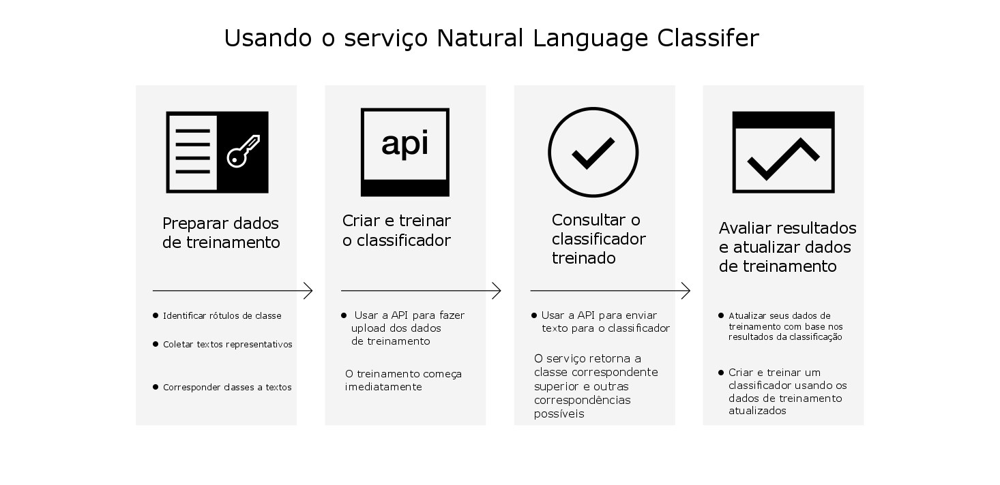

---

copyright:
  years: 2015, 2017
lastupdated: "2017-04-20"

---

{:new_window: target="_blank"}
{:shortdesc: .shortdesc}

# Sobre o Natural Language Classifier
{: #about}

O {{site.data.keyword.nlclassifierfull}} usa algoritmos de aprendizado de máquina para retornar as principais classes predefinidas correspondentes para entradas curtas de texto.
{:shortdesc}

## Como usar o serviço

A imagem a seguir mostra o processo de criação e uso do classificador:

## Para o que usar o serviço
{: #use-cases}

O serviço do {{site.data.keyword.nlclassifiershort}} pode ajudar seu aplicativo a entender o idioma de textos breves e fazer predições
sobre como manipulá-los. Um classificador aprende com seus dados de exemplo e então pode retornar informações para os textos nos quais ele não está treinado.

Um uso do serviço é para suporte ao cliente. Por exemplo, é possível usar o serviço para executar ações preditivas, como rotear perguntas dos usuários para a pessoa correta ou classificar problemas por gravidade. E ao incorporar o serviço {{site.data.keyword.speechtotextshort}} em seu app, também será possível rotear perguntas de voz para um departamento específico.

## Idiomas suportados
{: #supported-languages}

O serviço {{site.data.keyword.nlclassifiershort}} suporta inglês, árabe, francês, alemão, japonês, italiano, português e espanhol.

## Etapas Seguintes
{: #next-steps}

- [Introdução](/docs/natural-language-classifier/overview.html) ao serviço.
- Experimente o [demo ](http://natural-language-classifier-demo.mybluemix.net){:new_window}.
