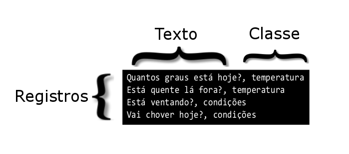

---

copyright:
  years: 2015, 2017
lastupdated: "2017-04-20"

---

{:new_window: target="_blank"}
{:shortdesc: .shortdesc}

# Usando seus próprios dados
Depois de criar, treinar e consultar um {{site.data.keyword.nlclassifierfull}} com os dados no exemplo [Introdução](/doc/natural-language-classifier/getting-started.html), você desejará criar um classificador que trabalhe com seus próprios dados. Você monta e fornece esses dados de treinamento.
{:shortdesc}

## Estrutura de dados de treinamento
É possível fornecer os dados para treinar o {{site.data.keyword.nlclassifiershort}} no formato de valor separado por vírgula (CSV).

No formato CSV, uma linha no arquivo representa um registro de exemplo. Cada registro possui duas ou mais colunas. A primeira coluna é o texto representativo a ser classificado. As colunas adicionais são classes que se aplicam a esse texto. A imagem a seguir mostra um arquivo CSV que tem quatro registros. Cada registro nessa amostra inclui a entrada de texto e uma classe, que são separadas por uma vírgula:

Este exemplo é uma pequena amostra. Dados de treinamento adequados incluem um número muito maior de registros.

Faça download do arquivo <a target="_blank" href="https://watson-developer-cloud.github.io/doc-tutorial-downloads/natural-language-classifier/weather_data_train.csv" download="weather_data_train.csv">weather_data_train.csv</a> para ver um arquivo de dados de treinamento de amostra.

### Metadados adicionais

Além do texto e das classes, a solicitação para criar um classificador inclui informações adicionais. Os metadados identificam o idioma dos dados e também é possível incluir um nome para ajudá-lo a identificar o classificador.

### Formato de arquivo de dados de treinamento CSV

Certifique-se de que seus dados de treinamento CSV sigam os requisitos de formato a seguir:

- Os dados devem ser codificados como UTF-8.
- Separe os valores de texto e cada valor de classe por um delimitador de vírgula. Cada registro (linha) é finalizado por um caractere de fim de linha, que é um caractere especial ou uma sequência de caracteres que indicam o final de uma linha.
- Cada registro deve ter um valor de texto e pelo menos um valor de classe.
- Os valores de classe não podem incluir guias ou caracteres de fim de linha.
- Os valores de texto não podem conter guias ou novas linhas sem manipulação especial. Para preservar guias ou novas linhas, escape uma guia com `\t` e escape novas linhas com `\r`, `\n` ou `\r\n`.

	Por exemplo, `Example text\twith a tab` é válido, mas `Example text    with a tab` não é válido.
- Sempre coloque valores de texto ou de classe entre aspas duplas nos dados de treinamento quando eles incluírem os caracteres a seguir:
	- Vírgulas: `"Example text, with comma"`.
	- Aspas duplas. Além disso, as aspas devem ser escapadas com aspas duplas: `"Example text with ""quotation"""`.

## Limitações de tamanho
Há os limites mínimo e máximo para os dados de treinamento:

-   Os dados de treinamento devem ter pelo menos cinco registros (linhas) e não mais de 15.000 registros.
-   O comprimento máximo total de um valor de texto é de 1.024 caracteres.

## Linguagens
Embora o idioma padrão seja o inglês, é possível especificar o idioma dos dados de treinamento ao criar o classificador. O idioma dos dados de treinamento deve corresponder ao idioma do texto que você pretende classificar. Para obter detalhes, veja a [Referência de API ](http://www.ibm.com/watson/developercloud/natural-language-classifier/api/v1/){:new_window}.

O classificador suporta inglês (en), árabe (ar), francês (fr), alemão (de), japonês (ja), italiano (), português do Brasil (pt) e espanhol (es).

## Diretrizes para um bom treinamento
As diretrizes a seguir não são aplicadas pela API. No entanto, o classificador tende a executar melhor quando os dados de treinamento aderem a eles:

- Limitar o comprimento do texto de entrada a menos de 60 palavras.
- Limitar o número de classes a várias centenas de classes. O suporte para números maiores de classes poderá ser incluído em versões posteriores do serviço.
- Certificar-se de que cada classe seja correspondida a pelo menos 5 a 10 registros quando cada registro de texto tiver apenas uma classe. Esse número fornece treinamento suficiente nessa classe.
- Avaliar a necessidade de múltiplas classes. Duas razões comuns direcionam múltiplas classes:
	- Quando o texto é vago, identificar uma única classe nem sempre é claro.
	- Quando os especialistas interpretam o texto de diferentes maneiras, múltiplas classes suportam essas interpretações.

	No entanto, se muitos textos em seus dados de treinamento incluírem múltiplas classes ou se alguns textos tiverem mais de três classes, talvez seja necessário refinar as classes. Por exemplo, revise se as classes são hierárquicas. Se forem hierárquicas, inclua o nó folha como a classe.
-  Inclua termos hifenizados padrão quando eles fizerem parte dos dados de treinamento (`back-to-back` ou ` part-time job`).

	No entanto, não conecte palavras adjacentes para criar novos termos não localizados no idioma dos dados de treinamento. Por exemplo, em vez de definir `dish-ran-away` ou `with_the_spoon`, defina as frases relevantes como palavras separadas (`dish ran away` e `with the spoon`) com a classe apropriada.

## Construindo dados de treinamento
O aprendizado de máquina descreve um processo de aprender algumas propriedades de um conjunto de dados e, em seguida, aplicar as propriedades a novos dados. O serviço {{site.data.keyword.nlclassifiershort}} segue esse processo. Ele é treinado para conectar classes predefinidas a textos de exemplo e, em seguida, aplicar essas classes a novas entradas.

Portanto, o classificador treinado é apenas tão bom quanto os dados de treinamento. Cada valor de texto nos dados deve representar os tipos de textos que você espera que o classificador prediga. Cada classe que você espera que seja retornada também deve estar nos dados de treinamento e as classes que você associa a cada texto devem estar corretas.

Por exemplo, quando os textos em seus dados de treinamento forem perguntas, use perguntas que sejam representativas e típicas das perguntas que seus usuários fazem. É possível coletar esses textos de dados de usuários reais ou é possível ter pessoas especialistas em seu campo para criar os textos.

Essa natureza representativa e precisa dos dados é importante porque direciona todos os processos e resultados do classificador. Além disso, quanto mais registros você incluir nos dados de treinamento, mais oportunidade terá o classificador de localizar uma correspondência.
