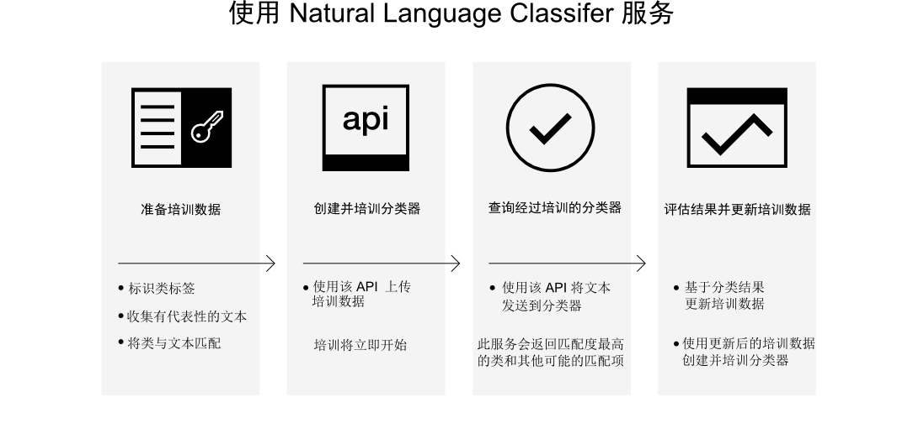

---

copyright:
  years: 2015, 2017
lastupdated: "2017-04-20"

---

{:new_window: target="_blank"}
{:shortdesc: .shortdesc}

# 关于 Natural Language Classifier
{: #about}

{{site.data.keyword.nlclassifierfull}} 使用机器学习算法，以针对简短文本输入返回匹配度最高的预定义类。
{:shortdesc}

## 如何使用服务

下图显示了创建和使用分类器的过程：

## 服务用途
{: #use-cases}

{{site.data.keyword.nlclassifiershort}} 服务可以帮助应用程序了解简短文本的语言，并对如何处理这些文本进行预测。分类器通过示例数据进行学习，然后可以返回培训分类器时未包含的文本的信息。

服务的一个用途是客户支持。例如，可以使用此服务来执行预测性操作，如将用户的提问传递给合适的人员，或者按严重性对问题分类。通过将 {{site.data.keyword.speechtotextshort}} 服务合并到应用程序中，还可以将语音提问传递给特定部门。

## 支持的语言
{: #supported-languages}

{{site.data.keyword.nlclassifiershort}} 服务支持英语、阿拉伯语、法语、德语、日语、意大利语、葡萄牙语和西班牙语。

## 后续步骤
{: #next-steps}

- 服务[入门](/docs/natural-language-classifier/overview.html)。
- 试用[演示 ](http://natural-language-classifier-demo.mybluemix.net){:new_window}。
