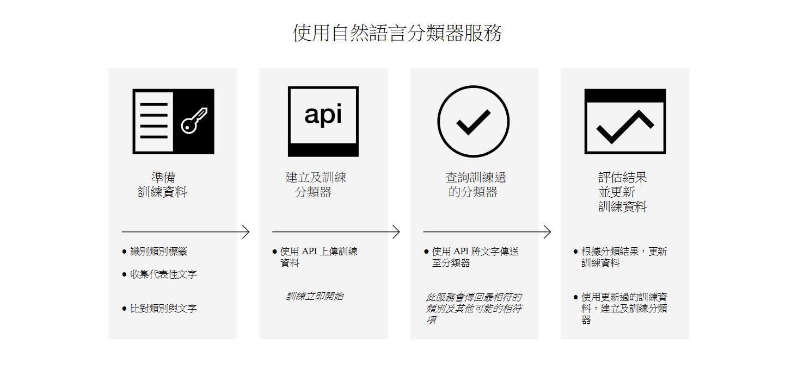

---

copyright:
  years: 2015, 2017
lastupdated: "2017-04-20"

---

{:new_window: target="_blank"}
{:shortdesc: .shortdesc}

# 關於 Natural Language Classifier
{: #about}

{{site.data.keyword.nlclassifierfull}} 使用機器學習演算法來傳回簡短文字輸入的前幾個相符預先定義類別。
{:shortdesc}

## 如何使用服務

下列影像顯示如何建立及使用分類器的程序：

## 服務的用途
{: #use-cases}

{{site.data.keyword.nlclassifiershort}} 服務可協助您的應用程式瞭解簡短文字的語言，並預測如何處理它們。分類器會從您的範例資料學習，接著便可以針對未對其進行訓練的文字傳回資訊。

服務的其中一個用法是用於客戶支援。例如，您可以使用服務來採取預測性的動作，例如，將使用者的問題遞送給正確的人，或是依嚴重性來分類問題。將 {{site.data.keyword.speechtotextshort}} 服務納入應用程式中，也可以將語音問題遞送給特定部門。

## 支援的語言
{: #supported-languages}

{{site.data.keyword.nlclassifiershort}} 服務支援英文、阿拉伯文、法文、德文、日文、義大利文、葡萄牙文及西班牙文。

## 後續步驟
{: #next-steps}

- [開始使用](/docs/natural-language-classifier/overview.html)服務。
- 試用[展示 ](http://natural-language-classifier-demo.mybluemix.net){:new_window}。
