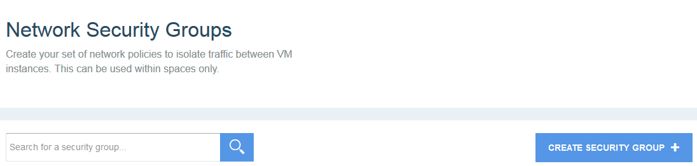
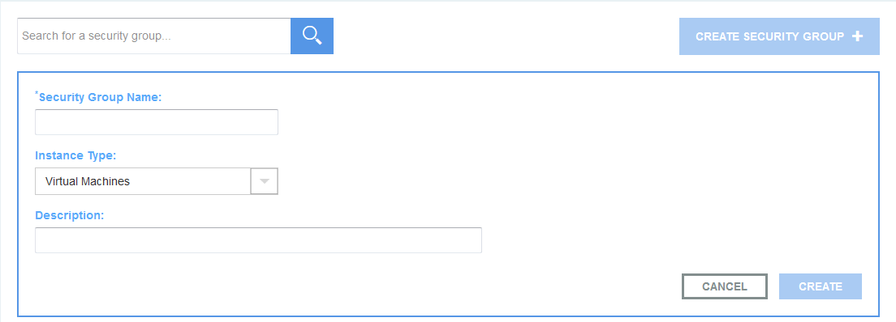
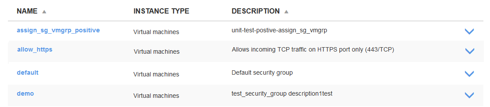
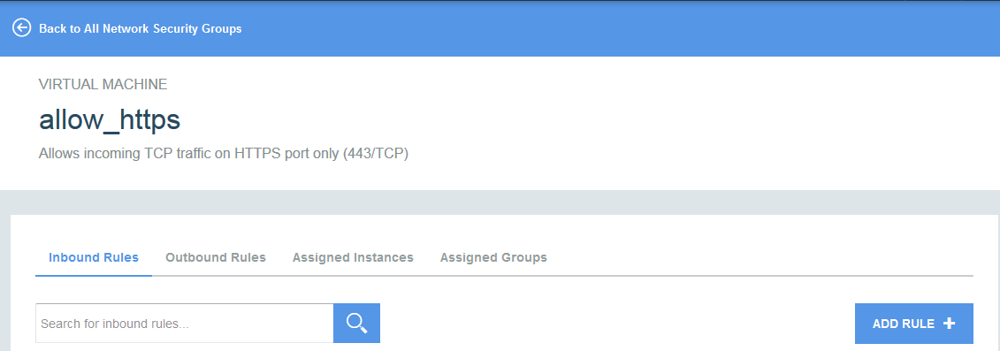
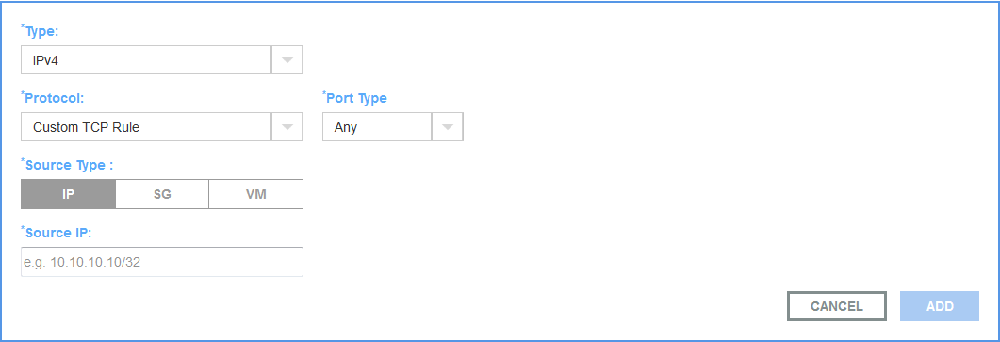
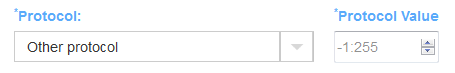
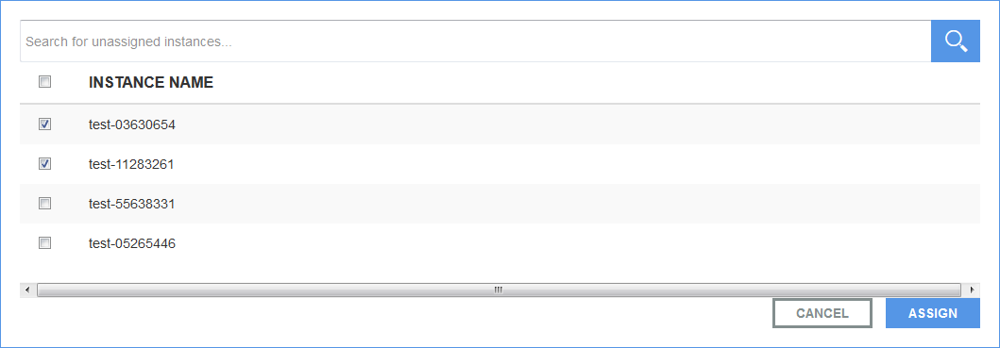
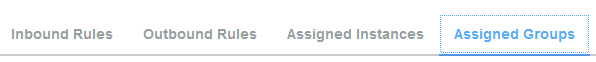
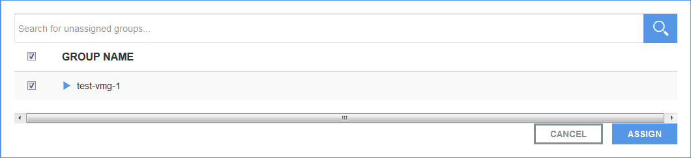
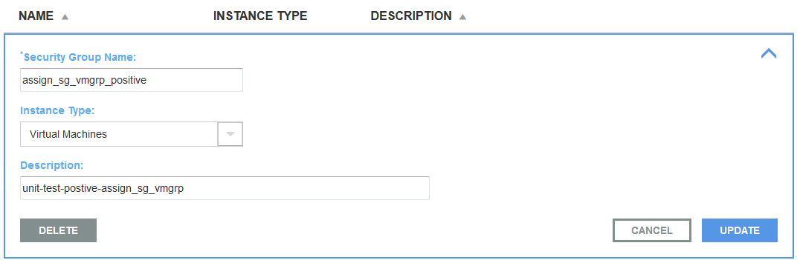

---

copyright:

  years: 2016

---

# Getting started with IBM Network Security Groups (BETA)

The {{site.data.keyword.networksecuritygroups_full}} service in Bluemix focuses on network security. Use the IBM Network Security Groups service to configure and manage network policies that control inbound and outbound traffic between virtual servers. You can find the service in the Bluemix catalog under the Security category and under the Network category.

A security group is a set of IP filter rules. Each IP rule represents a network security rule. Each security group represents a network security policy. You can have up to 10 security groups per space of your Bluemix organization. You can assign multiple security groups to a single virtual server or to a virtual server group. 

**Note:** All instances in a virtual server group must have the same security groups associated. 

For more information about IBM Virtual Servers and security groups, see: [Security Groups](https://www.{DomainName}/docs/virtualmachines/vm_index.html#vm_security_groups).

The following security groups are provided in Bluemix for IBM Virtual Servers:

* **allow_ssh**: This security group defines the IP rules that allow incoming TCP traffic on the SSH port only (22/TCP).  
* **allow_https**: This security group defines the IP rules that allow incoming TCP traffic on HTTPS port only (443/TCP).  
* **allow_rdp**: This security group defines the IP rules that allow incoming TCP traffic on remote desktop client port only (3389/TCP).  
* **allow_all**: This security group defines the IP rules that allow all incoming traffic on all ports.  
* **default**: This security group defines the IP rules that deny all incoming traffic from outside the private network.  

You can define up to 10 security groups for a space in your organization. These security groups include the five predefined security groups. 

### Adding IBM Network Security Groups Service
1. Select IBM Bluemix > Catalog > Services > Security. You will see the available security services.
2. Select **Network Security Groups** service. You will see the service description, available plans, and pricing details. 
3. Select a suitable plan. 
4. Select the **Space:** in the **Add Service** section:  
5. Select **CREATE**. The service instance is created.

### Creating a Security Group

**Note:** Use only Google Chrome 47.0.2526 or Mozilla Firefox 38.5.2 browser to create and configure IBM Network Security Groups.

1. Select IBM Bluemix > Dashboard > Services > Network Security Groups service instance tile. You will see the **Network Security Groups** page.  

2. Select **CREATE SECURITY GROUP +**.  
  
3. Provide the following information:
	* **Security Group Name**: Enter a name for your security group.
	* **Instance Type**: Select the instance type for which you want to create the security group. Value: Virtual Servers.  
	* **Description**: Enter a description of your security group.

4. Select **SAVE**. The security group is created.

### Configuring Rules

You can configure rules to manage inbound traffic (ingress traffic) to a virtual server, and outbound traffic (egress traffic) from a virtual server 

1. Select the security group for which you want to configure the rules.  
  
2. Select **Inbound Rules** or **Outbound Rules**, as required.
3. Select **ADD RULE**.  

4. Specify inbound or outbound rules:  
	  
	* **Type:** Select IPv4.  
	* **Protocol:** Select the protocol from the drop-down list. If you want to specify a protocol that is not in the list, select **Other protocol** from the drop-down.  
	  
	Provide the following information:  
	  * **Protocol value:** The IP number of the protocol. For example: You enter 1 for ICMP protocol.  
	* **Port:** or **Port Range:** The port configuration parameter depends on the protocol you select.  
		* If you select **ALL ICMP**, **ALL TCP**, or **ALL UDP**, no port information is required.  
		* If you select a single protocol, the port number is automatically displayed. For example: If you select **HTTP**, port **80** is displayed.  
		* If you select **Custom TCP Rule** or **Custom UDP rule**, select a port type. Values: port, port range. If you select **Port**, enter the port number; if you select **Port range**, enter the range of port numbers.  
		* If you select **Custom ICMP Rule**, enter the ICMP **Code** and **Type**.
	* **Select source type:** Select **IP** or **SG** or **Server**.  
		* If you select **IP**, enter an IP address in the **Source IP** or **Destination IP** field.  
		* If you select **SG**, select a security group from the **Source SG** or **Destination SG** drop-down. The list displays all the configured security groups, including the default security group.  
		* If you select **Server**, select a virtual server from the **Source Virtual Server** or **Destination Virtual Server** drop-down.

###Assigning Instances

Select virtual server instances or virtual server groups to which you want to assign the security group.  

####Assign Virtual Server Instances

**Note:** Select only virtual server instances that are not part of a virtual server group. If you select an instance that is part of a virtual server group, subsequent assign/unassign operations for virtual server groups can become unstable.

1. Select **Assigned Instances**.  
  
2. Select **ASSIGN INSTANCE +**.  
  
3. Select the virtual server instances as required.  
  
4. Select **ASSIGN**.
	
####Assign Virtual Server Groups

Select one or more virtual server groups to which you want to assign the security group.

1. Select **Assigned Groups**.  

2. Select **ASSIGN GROUP +**.  
  
3. Select the virtual server groups as required.  

4. Select **ASSIGN**.

###Deleting a Security Group

Select a security group to be deleted. 

**Note:** A security group cannot be deleted if it is associated with a virtual server or a virtual server group.

1. Select IBM Bluemix > Dashboard > Services > Network Security Groups service instance tile. You will see the list of security groups on the **Network Security Groups** page.  

2. Expand the security group that you want to delete.

3. Select **DELETE**.

># Related Links {:class="linklist"}
>## Related Links {:id="general"}  
>* [IBM Network Security Groups Command Line Interface](../../cli/plugins/networksecuritygroups/index.html)
>
>{:elementKind="article" id="rellinks"}

