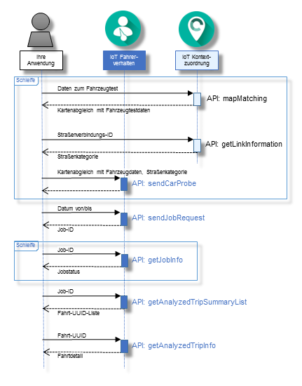

---

copyright:
  years: 2016

---

{:new_window: target="_blank"}
{:shortdesc: .shortdesc}
{:screen: .screen}
{:codeblock: .codeblock}
{:pre: .pre}

# Einführung in {{site.data.keyword.iotdriverinsights_short}}
{: #gettingstartedtemplate}
*Letzte Aktualisierung: 13 Mai 2016*

Mit {{site.data.keyword.iotdriverinsights_full}} können Sie Analysen des Fahrerverhaltens mithilfe der {{site.data.keyword.iotdriverinsights_short}}-API ausführen, um Fahrzeugtestdaten und Kontextdaten zu sammeln und zu analysieren.
{:shortdesc}

Führen Sie die folgenden Schritte aus, um Ihre Anwendung in die {{site.data.keyword.iotdriverinsights_short}}-API zu integrieren, nachdem Sie eine ungebundene Serviceinstanz erstellt und implementiert haben.  

1. (Optional) Bevor Sie Daten zum Fahrzeugtest an die {{site.data.keyword.iotdriverinsights_short}}-API senden, können Sie weitere Daten mithilfe der {{site.data.keyword.iotmapinsights_short}}-API zu Ihren Fahrzeugtestdaten hinzufügen.
     - Mit der Karte übereinstimmende Fahrzeugtestdaten mithilfe der `mapMatching`-API abrufen.
        - [Anforderung] Fahrzeugtestdaten
        - [Antwort] Mit der Karte übereinstimmende Fahrzeugtestdaten
     - Straßenkategoriedaten mit der `getLinkInformation`-API abrufen.
        - [Anforderung] Straßenverbindungs-ID
        - [Antwort] Straßenkategorie
2. Fahrzeugtestdaten zum Speichern und Analysieren mithilfe der `sendCarProbe`-API senden.
   - [Anforderung] Mit Karte abgeglichene Fahrzeugtestdaten und Straßenkategorie
3. Jobanforderung zum Analysieren der Fahrzeugtestdaten mithilfe der `sendJobRequest`-API senden.
   - [Anforderung] Datum von/bis
   - [Antwort] Job-ID
4. Jobstatus mithilfe der `getJobInfo`-API überprüfen.
   - [Anforderung] Job-ID
   - [Antwort] Jobstatus
5. Analysierte Fahrtzusammenfassungsliste mithilfe der `getAnalyzedTripSummaryList`-API abrufen.
   - [Anforderung] Job-ID
   - [Antwort] Liste der analysierten Fahrtzusammenfassung
6. Detailliert analysierte Fahrtinformationen mithilfe der `getAnalyzedTripInfo`-API abrufen.
   - [Anforderung] Fahrt-UUID
   - [Antwort] Detail der analysierten Fahrt 

Das folgende Ablaufdiagramm zeigt die Reihenfolge der Schritte an. 

Siehe das Thema [Informationen zu {{site.data.keyword.iotdriverinsights_short}}](iotdriverinsights_overview.html) über Einzelheiten zu analysierbaren Verhalten und Kontexten.
Verwenden Sie [{{site.data.keyword.iotmapinsights_short}} / {{site.data.keyword.iotdriverinsights_short}} Lernprogramm Teil 1](https://github.com/IBM-Bluemix/car-data-management){:new_window}, um eine Beispielanwendung mit Beispielen für Fahrzeugtestdaten auszuprobieren. 

# Zugehörige Links
{: #rellinks}
## Lernprogramme und Beispiele
{: #samples}

* [{{site.data.keyword.iotmapinsights_short}} / {{site.data.keyword.iotdriverinsights_short}} Lernprogramm Teil 1](https://github.com/IBM-Bluemix/car-data-management){:new_window}
* [{{site.data.keyword.iotmapinsights_short}} / {{site.data.keyword.iotdriverinsights_short}} Lernprogramm Teil 2](https://github.com/IBM-Bluemix/map-driver-insights){:new_window}

## API-Referenz
{: #api}

* [API-Dokumente](http://ibm.biz/IoTDriverBehavior_APIdoc){:new_window}

## Zugehörige Links
{: #general}

* [Einführung in {{site.data.keyword.iotmapinsights_short}}](../IotMapInsights/index.html){:new_window}
* [Einführung in {{site.data.keyword.iot_full}}](https://www.ng.bluemix.net/docs/services/IoT/index.html){:new_window}
* [dW Answers in IBM developerWorks](https://developer.ibm.com/answers/topics/iot-driver-behavior){:new_window}
* [Stack Overflow](http://stackoverflow.com/questions/tagged/iot-driver-behavior){:new_window}
* [Neuerungen in Bluemix Services](http://www.ng.bluemix.net/docs/whatsnew/index.html#services_category){:new_window}

