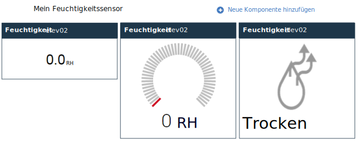

---

copyright:
  years: 2015,2016

---

{:shortdesc: .shortdesc}

# Dashboards und Vorlagen verwalten{: #managing-dashboards}

Die Echtzeitdaten Ihrer IoT-Geräte werden in anpassbaren Dashboards angezeigt. Sie können manuell Dashboards erstellen, die Echtzeit-Metriken, Diagramme und andere Informationen für ein oder mehrere Geräte anzeigen. Dashboards können auch gefilterte Listen von Geräten und Links zu anderen Dashboards enthalten.
{: shortdesc}

Außer den manuell erstellten Dashboards gibt es bei {{site.data.keyword.iotrtinsights_short}} ein vordefiniertes Gerätealert-Dashboard unter **Dashboards > Überblick**. Außerdem werden Gerätedashboards auf der Basis der erstellten Nachrichtenschemas dynamisch erstellt. 

## Dashboards {: #dashboards}

Administratoren können neue Dashboards erstellen und vorhandene Dashboards ändern, um die gewünschten Gerätedaten anzuzeigen.   
Gehen Sie wie folgt vor, um ein Dashboard zu erstellen: 
1.	Gehen Sie zu **Dashboards > Dashboards durchsuchen**. 
2.	Klicken Sie auf **Neues Dashboard hinzufügen**. 
3.	Geben Sie den Namen des Dashboards an und wählen Sie Attribute aus, wie zum Beispiel Symbol und Hintergrund. Wählen Sie außerdem aus, ob das Dashboard für Benutzer von {{site.data.keyword.iotrtinsights_short}} mit Bedienerberechtigung bearbeitbar sein soll. 
4.	Klicken Sie auf .
5.	Klicken Sie auf die neue Dashboardkachel, um das leere Dashboard zu öffnen. 
6.	Gehen Sie wie folgt vor, um Widgets zu dem Dashboard hinzuzufügen:   
 1.	Klicken Sie auf **Neue Komponente hinzufügen**, um ein erstes Dashboard-Widget hinzuzufügen. 
 2.	Wählen Sie eine Komponente aus, die hinzugefügt werden soll, und wählen Sie anschließend weitere Komponentenattribute und gegebenenfalls Anzeigeeigenschaften aus. Beispiel: Um den numerischen Wert eines bestimmten Datenpunkts für ein Gerät anzuzeigen, wählen Sie `Gerät` und anschließend das Gerät aus, das hinzugefügt werden soll. Wählen Sie im Dashboard-Editor unter 'Visualisierung' einen Datenpunkt aus, der angezeigt werden soll. Positionieren Sie anschließend das neu hinzugefügte Widget im Dashboardraster. 
 3.	Klicken Sie auf , um das Widget zum Dashboard hinzuzufügen. 
7.	Das Dashboard wird mit den neu hinzugefügten Widgets aktualisiert und zeigt die Echtzeitdaten an, die vom ausgewählten Datenpunkt definiert werden. 

>**Tipp:** Gehen Sie wie folgt vor, um ein Dashboard zu erstellen, das alle Ihre Geräte auflistet:   
1. Gehen Sie zu **Dashboards > Dashboards durchsuchen** und klicken Sie auf **Neues Dashboard hinzufügen**. 
2. Geben Sie einen beschreibenden Namen für das Dashboard an, wie zum Beispiel `Alle Geräte`, und klicken Sie auf . 
3. Klicken Sie in der Dashboardanzeige auf das Dashboard und anschließend auf **Neue Komponente hinzufügen**. 
4. Wählen Sie die Komponente **Container** aus und anschließend **Gefilterte Geräte**, um eine Liste aller Geräte zu erstellen. 
5. Klicken Sie auf .  

>Ihre Geräte werden in dem neuen Dashboard aufgelistet. Klicken Sie auf ein Gerätesymbol, um das Gerätedashboard zu öffnen und die Echtzeitdaten für das Gerät anzuzeigen.
### Dashboard-Widgets{: #dashboard-widgets}
Die Dashboards bestehen aus Widgets, die Echtzeitdaten von einem oder mehreren Geräten anzeigen. Das Verhalten des Widgets hängt von seinem Typ, dem angezeigten Datenpunkt und der Art der Konfiguration des Datenpunkts im Schema ab.   
Wenn Sie beispielsweise ein Gerätewidget für einen 'unaufbereiteten' Datenpunkt hinzufügen, zeigt das Widget die Rohdaten nur als Zeichenfolge an. 

Wenn Sie jedoch den Datenpunkt mit einem Mindest- und einem Maximalwert konfigurieren, haben Sie die Möglichkeit, ein Widget als Messanzeige darzustellen. 

Sie können auch einen Sensortyp als Datenpunkt zuordnen, um einen speziellen Typ eines Visualisierungswidgets zu aktivieren und den Typ der angezeigten Sensordaten besser darzustellen. Sie können zum Beispiel den Sensortyp `Licht ein/aus` auswählen, um ein Visualisierungswidget `Licht – einfache Anzeige (ein/aus)` zu aktivieren. 

Außerdem haben Sie die Möglichkeit, mehrere Widgets für denselben Datenpunkt in einem Dashboard aufzunehmen, um den unaufbereiteten numerischen Wert und die Feuchtigkeit nebeneinander anzuzeigen.   
*Drei Visualisierungsoptionen für denselben Datenpunkt.*

Widget | Typ und Visualisierung
------------- | -------------
Gerät | Daten - Echtzeitwert der Datenpunkte für das Gerät. Wenn der Datenpunkt mit einem Mindest- und einem Maximalwert konfiguriert wird, umfasst die Visualisierung eine Option, den Datenpunkt als Messanzeige darzustellen. Wenn der Datenpunkt mit einem Sensortyp konfiguriert ist, sind außerdem zusätzliche Visualisierungsoptionen verfügbar.
Diagramm | Grafik - Echtzeitwerte von Datenpunkten für ein oder mehrere Geräte zeichnen.
Dashboard | Link zu einem Dashboard oder einer Vorlage.
Text | Textfeld - Formatierter Text.
Container | Typen von Container-Widgets: <ul><li>Alle Dashboards – Eine verkettete Liste aller Dashboards.</li><li>Gefilterte Geräte – Eine Liste aller Geräte, oder gefiltert nach Name oder Position. </li><li>Gefilterte Geräte mit Alerts – Eine Liste aller Geräte mit Alerts, oder gefiltert nach Name oder Position. </li><li>Alerts für Gerät – Eine Liste der Alerts für ein Gerät, das in einem Container "Gefilterte Geräte mit Alerts" ausgewählt wird. </li></ul>
Speziell | Typen spezieller Widgets:<ul><li>Landkarte – Eine Karte, in der das ausgewählte Gerät lokalisiert wird. </li><li>Zusätzliche Geräteinformationen – Weitere Informationen zu dem ausgewählten Gerät. </li></ul>

In der folgenden Tabelle werden die Visualisierungsoptionen zusammengefasst, die für Gerätewidgets zur Verfügung stehen, wenn der ausgewählte Datenpunkt mit einem Sensortypattribut im Nachrichtenschema konfiguriert ist. 

Datenpunktsensortyp | Visualisierungsoptionen | Details | Unterstützter Datentyp
------------- | ------------- | -------------
Keine Auswahl | Einfacher Wert | - | Zeichenfolge/Ganze Zahl/Gleitkommawert
Licht ein/aus | Licht - einfache Anzeige (ein/aus) | 0=aus | Ganze Zahl Schalter ein/aus | Schalter - einfache Anzeige (ein/aus) | 0=aus | ganze Zahl Temperatursensor | Generische Temperatur - Messanzeige | Nicht zutreffend | Ganze Zahl/Gleitkommawert
Temperaturregelung | Generische Temperatur - Messanzeige | Nicht zutreffend | Ganze Zahl/Gleitkommawert Drucksensor | Druck - einfache Messanzeige | Nicht zutreffend | Ganze Zahl/Gleitkommawert
Batteriestatus | Batterie - einfaches Widget (niedrig/hoch) | 0=gut | Ganze Zahl
Helligkeit | Helligkeitsanzeige (dunkel/hell) | 0=dunkel | Ganze Zahl
Fenster geöffnet/geschlossen | Fensterstatus - einfache Anzeige (geöffnet/geschlossen) | 0=geschlossen | Ganze Zahl
Tür geöffnet/geschlossen | Türstatus - einfache Anzeige (geöffnet/geschlossen) | 0=geschlossen | Ganze Zahl
Feuchtigkeitssensor | Feuchtigkeitsstatus (trocken/nass) | 0=trocken | Ganze Zahl
Stromverbrauch | Stromzähler - einfache Anzeige | Nicht zutreffend | Ganze Zahl/Gleitkommawert
Energiemessgerät | Einfacher Wert | Nicht zutreffend | Ganze Zahl/Gleitkommawert
Prozent | Prozentsatz - einfache Anzeige (0-100) | Nicht zutreffend | Ganze Zahl/Gleitkommawert
Spannung | Spannungsmessung - einfache Anzeige | Nicht zutreffend | Ganze Zahl/Gleitkommawert
Strom | Stromzähler - einfache Anzeige | Nicht zutreffend | Ganze Zahl/Gleitkommawert
Längengrad | Geräteposition im Widget "Speziell" > "Landkarte" (Widget "Breitengrad" ebenfalls erforderlich) | **Wichtig:** Dem für den Längengrad verwendeten Datenpunkt muss der Sensortyp "Längengrad" im Nachrichtenschema zugeordnet sein.  | Gleitkommawert
Breitengrad | Geräteposition im Widget "Speziell" > "Landkarte" (Widget "Längengrad" ebenfalls erforderlich) | **Wichtig:** Dem für den Breitengrad verwendeten Datenpunkt muss der Sensortyp "Breitengrad" im Nachrichtenschema zugeordnet sein.  | Gleitkommawert  

## Standarddashboard-Layouts
{{site.data.keyword.iotrtinsights_short}} verfügt über vordefinierte Dashboards: ein Alerts-Dashboard und Gerätedashboards.

In den folgenden Tabellen werden die Widgets und das Layout der vordefinierten Dashboards beschrieben. 
### Alerts-Dashboard (Dashboards > Überblick)
Dieses Dashboard ist im Produktumfang enthalten stellt eine Liste der Geräte bereit, für die offene Alerts vorliegen. Sie können ein Gerät auswählen, um Details zu den Alerts anzuzeigen. Außerdem können Sie auf das Gerätesymbol klicken, um ein Gerätedashboard zu öffnen und die Echtzeitdaten für das Gerät anzuzeigen. 

<table>
<thead>
<tr>
<th colspan="3">Alerts-Dashboard</th>
</tr>
</thead>
<tbody>
<tr>
<td style="width:30%">Container: Geräte mit Alerts</td>
<td style="width:30%">Container: Alerts für Gerät</td>
<td style="width:30%">Speziell: Zusätzliche Geräteinformationen</td>
</tr>
<tr>
<td style="width:30%"></td>
<td style="width:30%"></td>
<td style="width:30%">Speziell: Landkarte</td>
</tr>
</tbody>
</table>

*Alerts-Dashboard-Layout*

### Gerätedashboards
Durch das Klicken auf ein Gerätesymbol in einer Geräteliste wird ein Gerätedashboard für das Gerät geöffnet. Wenn ein Datenpunkt zu dem Nachrichtenschema hinzugefügt wird, wird er auch als Widget zu der Gerätevorlage hinzugefügt, die das Gerätedashboard dynamisch erstellt. Administratoren können Widgets manuell hinzufügen oder entfernen. 

<table>
<thead>
<tr>
<th colspan="3">Gerätedashboard</th>
</tr>
</thead>
<tbody>
<tr>
<td style="width:30%">Gerät: Datenpunkt 1</td>
<td style="width:30%">Gerät: Datenpunkt 2</td>
<td style="width:30%">Gerät: Datenpunkt 3</td>
</tr>
<tr>
<td style="width:30%">Gerät: Datenpunkt N</td>
<td style="width:30%"></td>
<td style="width:30%"></td>
</tr>
</tbody>
</table>

*Vordefiniertes Gerätedashboard-Layout*

### Dashboardbeispiel: Liste aller Geräte
Das folgende Dashboard umfasst eine Liste aller Geräte und stellt Geräteinformationen zur Verfügung, wenn Sie ein Gerät aus der Liste auswählen. 

<table>
<thead>
<tr>
<th colspan="3">Liste aller Geräte - Dashboard</th>
</tr>
</thead>
<tbody>
<tr>
<td style="width:30%">Container: Gefilterte Geräte (keine Filterparameter festgelegt)</td>
<td style="width:30%">Speziell: Zusätzliche Geräteinformationen</td>
<td style="width:30%"></td>
</tr>
</tbody>
</table>

*Liste aller Geräte - Dashboard-Layout*

## Vorlagen{: #templates}
Vorlagen steuern das Layout der vordefinierten Dashboards für einen bestimmten Gerätetyp. Administratoren können diese vordefinierten Vorlagen an die Anforderungen der Benutzer anpassen. Beispiel: Eine vordefinierte Vorlage enthält nur die generischen Datenpunkte. Sie können je nach Bedarf Grafiken und andere Komponenten hinzufügen. 

Ein Benutzer kann beispielsweise auf ein vordefiniertes Gerätedashboard zugreifen, um die grundlegenden Gerätedaten anzuzeigen, und dann einen Link zu einer manuell erstellten Vorlage aufrufen, die einen kompletten Satz Echtzeitgrafiken enthalten kann. Sie erstellen eine Vorlage ähnlich wie ein Dashboard.   

Gehen Sie wie folgt vor, um eine vordefinierte Vorlage zu ändern: 
1.	Gehen Sie zu **Dashboards > Vorlagen verwalten**.
2.	Lokalisieren Sie in der Anzeige "Vorlagen verwalten" die Vorlagenkachel und klicken Sie auf ** > Layout ändern**, um die Vorlage zum Bearbeiten zu öffnen.   
3.	Fügen Sie Widgets zu der Vorlage hinzu. 
 1.	Klicken Sie auf **Neue Vorlagenkomponente hinzufügen**, um ein erstes Vorlagenwidget hinzuzufügen. 
 2.	Wählen Sie eine Komponente aus, die hinzugefügt werden soll, und wählen Sie anschließend weitere Komponentenattribute und gegebenenfalls Anzeigeeigenschaften aus.   
 3.	Klicken Sie auf , um das Widget zu der Vorlage hinzuzufügen. 
4.	Bearbeiten Sie vorhandene Widgets. 
 1.	Bewegen Sie die Maustaste über ein Vorlagenwidget und klicken Sie auf . 
 2.	Ändern Sie die Komponente und ihre Attribute und positionieren Sie das Widget nach Bedarf neu. 
 3.	Klicken Sie auf , um das Widget zu aktualisieren.   

Die Vorlage wird mit Ihren Änderungen aktualisiert. 

<!-- Administrators can also manually add templates for specific device types. These templates can then be linked to from the predefined templates.  -->

<!-- To create a template:
1.	Go to **Dashboards > Manage templates**.
2.	Click **Add new template**.
3.	Give the template a name, select a device type and attributes such as icon and background.
4.	Click .
5.	The empty template opens.
6.	Add widgets to the template.  
For a list of widgets, see below.
 1.	Click **Add new component** to add an initial template widget.
 2.	Select a component to add, then select further component attributes and, if needed, select display properties.
 For example, ... Then position the newly added widget in the dashboard grid.
 3.	Click  to add the widget to the template.
7.	The template updates with the newly added widgets.

### Template widgets
Widget | Type and visualization
------------- | -------------
Device | Data - Real-time value of data points for the device. For a description of the available widget options, see [Dashboard widgets](#dashboard-widgets "Dashboard widgets") above.
Chart | Graph - Plot real-time values of data points for one or more devices.
Dashboard | Link to a dashboard or a template.
Text | Text box - Formatted text
Container | Types of containers:<ul><li>All dashboards – A linked list of all dashboards</li><li>Filtered devices – A list of all devices, or filtered by name or location</li><li>Filtered devices with alerts – A list of all devices with alerts, or filtered by name or location</li><li>Alerts for device – A list of alerts for a device that is selected in a Filtered devices with alerts container</li></ul>
Special | Types of special:<ul><li>Map – A map that locates the selected device</li><li>Additional device information – More information about the selected device</li></ul>

### Template example: Selected set of graphs
One way of using device templates is to expand on the predefined device template by creating specialized templates for a device type, and then linking these from the predefined template by using a Dashboard widget.

<table>
<thead>
<tr>
<th colspan="3">Descriptive graphs template</th>
</tr>
</thead>
<tbody>
<tr>
<td style="width:30%">Device: ID</td>
<td style="width:30%">Graph: One data point</td>
<td style="width:30%">Graph: Another data point</td>
</tr>
<tr>
<td style="width:30%">Special: Additional device information</td>
<td style="width:30%">Text: Short description of how to  interpret the device data in the graphs.</td>
<td></td>
</tr>
</tbody>
</table>

*Descriptive graphs template*

Link to this template from a predefined device template:

<table>
<thead>
<tr>
<th colspan="3">Predefined device dashboard layout with link to template</th>
</tr>
</thead>
<tbody>
<tr>
<td style="width:30%">Device: Datapoint 1</td>
<td style="width:30%">Device: Datapoint 2</td>
<td style="width:30%">Device: Datapoint 3</td>
</tr>
<tr>
<td style="width:30%">Device: Datapoint N</td>
<td style="width:30%"><b>Dashboard: Descriptive graphs template</b></td>
<td style="width:30%"></td>
</tr>
</tbody>
</table>

*Predefined device dashboard layout with link to template* -->

## Vordefinierte Dashboards und Vorlagen zurücksetzen{: #resetting-dashboards}
Wenn Sie eine vordefinierte Vorlage ändern, wird die Vorlage nicht mehr dynamisch durch Aktualisierungen des Nachrichtenschemas aktualisiert und Sie müssen das Dashboard oder die Vorlage zurücksetzen, um das ursprüngliche Layout und die ursprünglichen Widgets wiederherzustellen.
Gehen Sie wie folgt vor, um vordefinierte Dashboards und Vorlagen zurückzusetzen: 
1.	Gehen Sie zu **Dashboards > Vorlagen verwalten** oder zu **Dashboards > Dashboards durchsuchen**. 
2.	Suchen Sie die Kachel mit der vordefinierten Vorlage oder dem vordefinierten Dashboard und klicken Sie auf ** > Layout zurücksetzen**, um die Vorlage zu löschen und anschließend neu zu erstellen.  

Die Vorlage oder das Dashboard wird mit dem Standardsatz an Widgets neu erstellt. 
