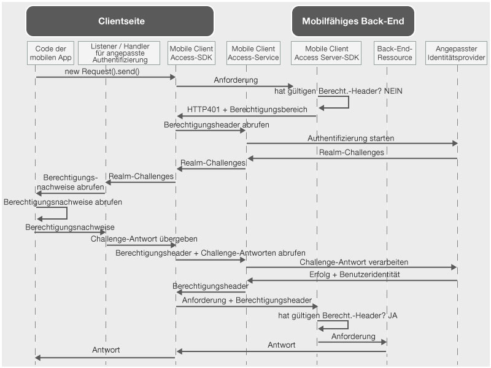

---

copyright:
  years: 2015, 2016

---

# Angepassten Identitätsprovider zur Authentifizierung von Benutzern verwenden
{: #custom-id}
Sie können einen angepassten Identitätsprovider erstellen und eigene Logik zur Erfassung und Validierung von Berechtigungsnachweisen implementieren. Ein angepasster Identitätsprovider ist eine Webanwendung, die eine REST-konforme Schnittstelle bereitstellt. Sie können einen angepassten Identitätsprovider in eigenen Räumlichkeiten oder auf {{site.data.keyword.Bluemix}} betreiben. Die einzige Voraussetzung besteht darin, dass der angepasste Identitätsprovider über das öffentliche Internet erreichbar sein muss, sodass er mit dem {{site.data.keyword.amashort}}-Service kommunizieren kann.

## Übersicht über {{site.data.keyword.amashort}}
{: #custom-id-ovr}
 Das folgende Diagramm zeigt, wie {{site.data.keyword.amashort}} in einen angepassten Identitätsprovider integriert wird.



1. Verwenden Sie das {{site.data.keyword.amashort}}-SDK, um eine Anforderung an Ihre Back-End-Ressourcen zu senden, die mit dem {{site.data.keyword.amashort}}-Server-SDK geschützt werden.
* Das {{site.data.keyword.amashort}}-Server-SDK erkennt eine nicht autorisierte Anforderung und gibt den Status HTTP 401 sowie den Berechtigungsbereich zurück.
* Das {{site.data.keyword.amashort}}-Client-SDK erkennt den obigen Status HTTP 401 automatisch und startet den Authentifizierungsprozess.
* Das {{site.data.keyword.amashort}}-Client-SDK kontaktiert den {{site.data.keyword.amashort}}-Service und fordert die Ausgabe eines Berechtigungsheaders an.
* Der {{site.data.keyword.amashort}}-Service kommuniziert mit dem angepassten Identitätsprovider, um den Authentifizierungsprozess zu starten.
* Der angepasste Identitätsprovider gibt eine Authentifizierungsanforderung (Challenge) an den {{site.data.keyword.amashort}}-Service zurück.
* Der {{site.data.keyword.amashort}}-Service gibt die Authentifizierungsanforderung an das {{site.data.keyword.amashort}}-Client-SDK zurück.
* Das {{site.data.keyword.amashort}}-Client-SDK delegiert die Authentifizierung an eine benutzerdefinierte Klasse, die Sie erstellt haben. Sie sind dafür verantwortlich, die Berechtigungsnachweise zu erfassen und diese an das {{site.data.keyword.amashort}}-Client-SDK zurückzugeben.
* Wenn der Entwickler Berechtigungsnachweise an das {{site.data.keyword.amashort}}-SDK übergeben hat, werden diese an den {{site.data.keyword.amashort}}-Service als Antwort auf die Authentifizierungsanforderung (Challenge) gesendet.
* Der {{site.data.keyword.amashort}}-Service validiert die Antwort auf die Authentifizierungsanforderung mit dem angepassten Identitätsprovider.
* Wenn die Validierung erfolgreich ist, generiert der {{site.data.keyword.amashort}}-Service einen Berechtigungsheader und gibt diesen an das {{site.data.keyword.amashort}}-Client-SDK zurück. Der Berechtigungsheader enthält zwei Tokens: ein Zugriffstoken, das Informationen zu Zugriffsberechtigungen enthält, und ein ID-Token, das Informationen zum aktuellen Benutzer, zum Gerät und zur Anwendung enthält.
* Von diesem Punkt an haben alle Anforderungen, die mit dem {{site.data.keyword.amashort}}-Client-SDK gesendet werden, einen neu abgerufenen Berechtigungsheader.
* Das {{site.data.keyword.amashort}}-Client-SDK wiederholt automatisch das Senden der ursprünglichen Anforderung, die den Berechtigungsablauf ausgelöst hat.
* Das {{site.data.keyword.amashort}}-Server-SDK extrahiert den Berechtigungsheader aus der Anforderung, validiert ihn mit dem {{site.data.keyword.amashort}}-Service und erteilt den Zugriff auf eine Back-End-Ressource.

## Informationen zu angepassten Identitätsprovidern
{: #custom-id-about}

Mit einem angepassten Identitätsprovider können Sie angepasste Authentifizierungsanforderungen (Challenges) bereitstellen, die an den Client gesendet werden sollen. Mithilfe eines angepassten Identitätsproviders können Sie den Authentifizierungsablauf vollständig anpassen.

Beim Erstellen eines angepassten Identitätsproviders haben Sie folgende Möglichkeiten:

1. Sie können eine Authentifizierungsanforderung (Challenge) anpassen, die vom {{site.data.keyword.amashort}}-Service an die mobile Clientanwendung gesendet werden soll. Eine Authentifizierungsanforderung ist ein JSON-Objekt, das angepasste Daten enthält. Der mobile Client kann mithilfe dieser angepassten Daten Authentifizierungsabläufe anpassen.

Beispiel für eine angepasste Authentifizierungsanforderung:

	```JavaScript
	{
		status: "challenge",
		challenge: {
			message:"Enter username and password",
			retriesLeft: 2,
			minUsernameLenth: 8
		}
	}
	```

1. Sie können einen angepassten Ablauf für die Erfassung von Berechtigungsnachweisen auf dem mobilen Client, einschließlich einer Authentifizierung in mehreren Schritten und mit mehreren Formularen, implementieren. Ähnlich wie bei der angepassten Authentifizierungsanforderung müssen Sie die Struktur einer Antwort auf eine angepasste Authentifizierungsanforderung gestalten.

Beispiel für eine Antwort auf eine angepasste Authentifizierungsanforderung, die von einem mobilen Client gesendet wird:

	```JavaScript
	{
		username:"bob.smith",
		password:"abcd1234",
		pincode:"1234"
	}
	```
1. Sie können angepasste Logik für die Validierung der bereitgestellten Antwort auf eine Authentifizierungsanforderung implementieren.

1. Sie können ein angepasstes Benutzeridentitätsobjekt definieren, das beliebige erforderliche angepasste Eigenschaften enthält. Ein Beispiel für ein angepasstes Benutzeridentitätsobjekt, das nach einer erfolgreichen Authentifizierung vom mobilen Client abgerufen wird:

	```JavaScript
	{
		username:"bob.smith",
		displayName:"Bob Smith",
		attributes:{
			age: 30,
			accountNumber: 12345,
			lastLogin: "Sept 1st, 2015"
		}
	}
	```

### Beispielimplementierung eines angepassten Identitätsproviders
{: #custom-sample}
Sie können beliebige der folgenden Beispiele für Node.js-Implementierungen eines angepassten Identitätsproviders als Referenz verwenden, wenn Sie Ihren angepassten Identitätsprovider entwickeln. Laden Sie den vollständigen Anwendungscode aus den GitHub-Repositorys herunter.

 * [Einfaches Beispiel](https://github.com/ibm-bluemix-mobile-services/bms-mca-custom-identity-provider-sample)
 * [Erweitertes Beispiel](https://github.com/ibm-bluemix-mobile-services/bms-mca-custom-identity-provider-with-user-management)
 
## Typische Kommunikation zwischen dem {{site.data.keyword.amashort}} Server und einem angepassten Identitätsprovider
{: #custom-id-comm}
1. Der {{site.data.keyword.amashort}}-Service sendet eine Anforderung `startAuthorization` an den angepassten Identitätsprovider.
1. Der angepasste Identitätsprovider antwortet mit einer angepassten Authentifizierungsanforderung (Challenge), die an den Client gesendet werden soll.
1. Der {{site.data.keyword.amashort}}-Service sendet die vom angepassten Identitätsprovider empfangene angepasste Authentifizierungsanforderung an den mobilen Client und empfängt schließlich eine Antwort auf die Authentifizierungsanforderung vom mobilen Client.
1. Der {{site.data.keyword.amashort}}-Service sendet eine Anforderung `handleChallengeAnswer` mit der Antwort auf die Authentifizierungsanforderung an den angepassten Identitätsprovider.
1. Der angepasste Identitätsprovider prüft die Antwort auf die Authentifizierungsanforderung und reagiert mit einer Antwort mit dem Status 'success', die die Benutzeridentitätsinformationen enthält.
1. Optional: Der angepasste Identitätsprovider stellt möglicherweise weitere Anforderungen (Challenges) bereit, nachdem er eine Antwort auf eine Anforderung vom Client empfangen hat. Das Senden mehrerer Anforderungen ermöglicht einen Authentifizierungsprozess mit mehreren Schritten.

## Statusabhängigkeit und Statusunabhängigkeit
{: #custom-id-state}
Der angepasste Identitätsprovider wird standardmäßig als statusunabhängige Anwendung betrachtet. In einigen Fällen muss der angepasste Identitätsprovider möglicherweise auf den Authentifizierungsprozess bezogene Statusdaten speichern. Ein Beispiel für einen Anwendungsfall ist eine Authentifizierung mit mehreren Schritten, bei der der angepasste Identitätsprovider das Ergebnis des ersten Authentifizierungsschrittes speichern muss, bevor er mit dem nächsten Schritt fortfährt. Zur Unterstützung einer statusabhängigen Funktionalität muss ein angepasster Identitätsprovider eine Status-ID (stateID) generieren und in der Antwort an den {{site.data.keyword.amashort}}-Service bereitstellen. Der {{site.data.keyword.amashort}}-Service muss die Status-ID in nachfolgenden Anforderungen übergeben, die zum Clientauthentifizierungsprozess gehören.

## Angepasster Realm
{: #custom-id-custom}

Ein angepasster Identitätsprovider unterstützt genau einen angepassten Authentifizierungsrealm. Zur Verarbeitung eingehender Authentifizierungsanforderungen (Challenges) erstellen und registrieren Sie eine Instanz von AuthenticationDelegate / AuthenticationListener in Ihrer mobilen Clientanwendung. Definieren Sie den angepassten Authentifizierungsrealmnamen, wenn Sie einen angepassten Identitätsprovider im {{site.data.keyword.amashort}}-Dashboard konfigurieren. Diese kann dazu verwendet werden, die Anforderung zu identifizieren, die von einer bestimmten {{site.data.keyword.amashort}}-Serviceinstanz eingeht.

## Nächste Schritte
{: #next-steps}
* [Angepassten Identitätsprovider erstellen](custom-auth-identity-provider.html)
* [{{site.data.keyword.amashort}} für die angepasste Authentifizierung konfigurieren](custom-auth-config-mca.html)
* [Angepasste Authentifizierung für Android konfigurieren](custom-auth-android.html)
* [Angepasste Authentifizierung für iOS konfigurieren](custom-auth-ios.html)
* [Angepasste Authentifizierung für Cordova konfigurieren](custom-auth-cordova.html)
