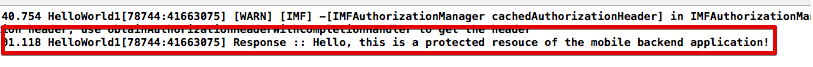

---

copyright:
  years: 2015, 2016

---

# iOS-Objective-C-SDK einrichten
{: #getting-started-ios}

Instrumentieren Sie Ihre iOS-Anwendung mit dem {{site.data.keyword.amashort}}-SDK, initialisieren Sie das SDK und senden Sie Anforderungen an geschützte und nicht geschützte Ressourcen.

**Tipp:** Wenn Sie Ihre iOS-App mit Swift entwickeln, sollten Sie die Verwendung von {{site.data.keyword.amashort}}-Client-Swift-SDK in Erwägung ziehen. Details hierzu finden Sie in [iOS-Swift-SDK einrichten](getting-started-ios-swift-sdk.html).

## Vorbereitungen
{: #before-you-begin}
* Sie müssen über eine Instanz eines mobilen Back-Ends verfügen, die durch den {{site.data.keyword.amashort}}-Service geschützt wird. Weitere Informationen zur Erstellung eines mobilen Back-Ends finden Sie in der [Einführung](getting-started.html).
* Stellen Sie sicher, dass Sie Xcode ordnungsgemäß eingerichtet haben. Weitere Informationen zur Einrichtung Ihrer iOS-Entwicklungsumgebung finden Sie auf der [Apple Developer-Website](https://developer.apple.com/support/xcode/).


## {{site.data.keyword.amashort}}-Client-SDK installieren
{: #install-mca-sdk-ios}
Das {{site.data.keyword.amashort}}-SDK wird mit CocoaPods, einem Abhängigkeitenmanager für iOS-Projekte, verteilt. CocoaPods lädt automatisch Artefakte aus Repositorys herunter und stellt sie für Ihre iOS-Anwendung zur Verfügung.


### CocoaPods installieren
{: #install-cocoapods}
1. Öffnen Sie das Terminal und führen Sie den Befehl **pod --version** aus. Wenn CocoaPods bereits installiert ist, wird die Versionsnummer angezeigt. Sie können mit dem nächsten Abschnitt fortfahren, um das SDK zu installieren.

1. Wenn CocoaPods nicht installiert ist, führen Sie den folgenden Befehl aus:
```
sudo gem install cocoapods
```
Weitere Informationen finden Sie auf der [CocoaPods-Website](https://cocoapods.org/).

### {{site.data.keyword.amashort}}-Client-SDK mit CocoaPods installieren
{: #install-sdk-cocoapods}

1. Navigieren Sie im Terminal zum Stammverzeichnis Ihres iOS-Projekts.

1. Wenn Sie Ihren Arbeitsbereich für CocoaPods noch nicht initialisiert haben, führen Sie den Befehl `pod init` aus.<br/>
 CocoaPods erstellt eine `Podfile`-Datei für Sie, in der Sie die Abhängigkeiten für Ihr iOS-Projekt definieren.

1. Bearbeiten Sie die `Podfile`-Datei und fügen Sie den erforderlichen Zielen die folgende Zeile hinzu:

	```
	pod 'IMFCore'
	```

1. Speichern Sie die `Podfile`-Datei und führen Sie den Befehl `pod install` über die Befehlszeile aus. <br/>Cocoapods installiert die hinzugefügten Abhängigkeiten. Der Fortschritt und die hinzugefügten Komponenten werden angezeigt.<br/>
**Wichtig**: CocoaPods generiert eine `xcworkspace`-Datei.  Sie müssen diese Datei öffnen, um mit Ihrem Projekt in Zukunft arbeiten zu können.

1. Öffnen Sie Ihren iOS-Projektarbeitsbereich. Öffnen Sie die `xcworkspace`-Datei, die von CocoaPods generiert wurde. Beispiel: `{your-project-name}.xcworkspace`. Führen Sie den Befehl `open {your-project-name}.xcworkspace` aus.

## {{site.data.keyword.amashort}}-Client-SDK initialisieren
{: #init-mca-sdk-ios}

Zur Verwendung des {{site.data.keyword.amashort}}-Client-SDK müssen Sie das SDK initialisieren, indem Sie die Parameter **Route** (`applicationRoute`) und **App-GUID** (`applicationGUID`) übergeben.


1. Klicken Sie auf der Hauptseite des {{site.data.keyword.Bluemix_notm}}-Dashboards auf Ihre App. Klicken Sie auf **Mobile Systemerweiterungen**. Sie benötigen die Werte für **Route** und **App-GUID** zum Initialisieren des SDK.

1. Importieren Sie das Framework `IMFCore` in die Klasse, in der Sie das {{site.data.keyword.amashort}}-Client-SDK verwenden möchten, indem Sie den folgenden Header hinzufügen:

	**Objective-C:**
	 ```Objective-C
	#import <IMFCore/IMFCore.h>
	```

	**Swift:**

	Das {{site.data.keyword.amashort}}-Client-SDK ist mit Objective-C implementiert. Sie müssen Ihrem Swift-Projekt möglicherweise einen Überbrückungsheader hinzufügen:

	1. Klicken Sie mit der rechten Maustaste auf Ihr Projekt in Xcode und wählen Sie **New File** aus.
	1. Wählen Sie in der Kategorie **iOS Source** die Option **Header file** aus. Geben Sie der Datei den Namen `BridgingHeader.h`.
	1. Fügen Sie Ihrem Überbrückungsheader die folgende Zeile hinzu: `#import <IMFCore/IMFCore.h>`
	1. Klicken Sie auf Ihr Projekt in Xcode und wählen Sie die Registerkarte **Build Settings** (Buildeinstellungen) aus.
	1. Suchen Sie nach `Objective-C Bridging Header`.
	1. Setzen Sie den Wert auf die Position Ihrer Datei `BridgingHeader.h`. Beispiel: `$(SRCROOT)/MyApp/BridgingHeader.h`.
	1. Stellen Sie sicher, dass Ihr Überbrückungsheader von Xcode aufgenommen wird, indem Sie Ihr Projekt erstellen (Build). Dabei sollten keine Fehlernachrichten angezeigt werden.

1. Verwenden Sie den folgenden Code, um das {{site.data.keyword.amashort}}-Client-SDK zu initialisieren.  Eine gängige, wenngleich nicht verbindliche, Position für den Initialisierungscode ist die Methode `application:didFinishLaunchingWithOptions` Ihres Anwendungsdelegats. <br/>
Ersetzen Sie die Werte *applicationRoute* und *applicationGUID* durch die Werte unter **Mobile Systemerweiterungen** im {{site.data.keyword.Bluemix_notm}}-Dashboard.

	**Objective-C:**

	```Objective-C
	[[IMFClient sharedInstance]
			initializeWithBackendRoute:@"applicationRoute"
			backendGUID:@"applicationGUID"];
	```

	**Swift:**

	```Swift
IMFClient.sharedInstance().initializeWithBackendRoute("applicationRoute",backendGUID: "applicationGUID")
	```

## Anforderung an das mobile Back-End senden
{: #request}

Nach der Initialisierung des {{site.data.keyword.amashort}}-Client-SDK können Sie mit dem Senden von Anforderungen an Ihr mobiles Back-End beginnen.

1. Versuchen Sie, in Ihrem Browser eine Anforderung an den Endpunkt '/protected' in Ihrem mobilen Back-End zu senden. Öffnen Sie die folgende URL: `{applicationRoute}/protected`. Beispiel: `http://my-mobile-backend.mybluemix.net/protected`
<br/>Der Endpunkt `/protected` eines mobilen Back-Ends, der mit der MobileFirst Services Starter-Boilerplate erstellt wurde, wird mit {{site.data.keyword.amashort}} geschützt. Eine Nachricht `Unauthorized` (Nicht autorisiert) wird in Ihrem Browser zurückgegeben, weil auf diesen Endpunkt nur mobile Anwendungen zugreifen können, die mit dem {{site.data.keyword.amashort}}-Client-SDK instrumentiert sind.

1. Verwenden Sie Ihre iOS-Anwendung, um eine Anforderung an denselben Endpunkt zu senden. Fügen Sie den folgenden Code hinzu, nachdem Sie `IMFClient` initialisiert haben:

	**Objective-C:**

	```Objective-C
	NSString *requestPath = [NSString stringWithFormat:@"%@/protected",
								[[IMFClient sharedInstance] backendRoute]];

	IMFResourceRequest *request =  [IMFResourceRequest requestWithPath:requestPath
																method:@"GET"];

	[request sendWithCompletionHandler:^(IMFResponse *response, NSError *error) {
		if (error){
			NSLog(@"Error :: %@", [error description]);
		} else {
			NSLog(@"Response :: %@", [response responseText]);
		}
	}];
	```

	**Swift:**

	```Swift
	let requestPath = IMFClient.sharedInstance().backendRoute + "/protected"

	let request = IMFResourceRequest(path: requestPath, method: "GET");
	request.sendWithCompletionHandler { (response, error) -> Void in
		if (nil != error){
			NSLog("Error :: %@", error.description)
		} else {
			NSLog("Response :: %@", response.responseText)
		}
	};

	```

1.  Wenn Ihre Anforderung erfolgreich ist, wird die folgende Ausgabe in der Xcode-Konsole angezeigt:

	

## Nächste Schritte
{: #next-steps}
Wenn Sie eine Verbindung zu dem geschützten Endpunkt hergestellt haben, waren keine Berechtigungsnachweise erforderlich. Wenn Sie die Benutzer zur Anmeldung bei Ihrer Anwendung veranlassen wollen, müssen Sie eine Authentifizierung über Facebook oder Google oder eine angepasste Authentifizierung konfigurieren.
  * [Facebook](facebook-auth-ios.html)
  * [Google](google-auth-ios.html)
  * [Angepasst](custom-auth-ios.html)
