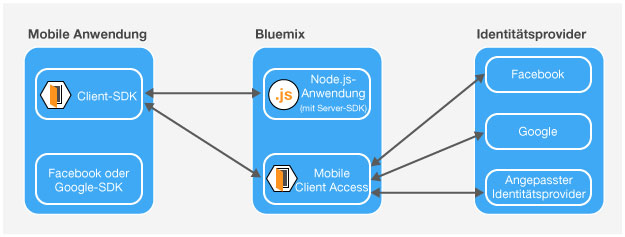
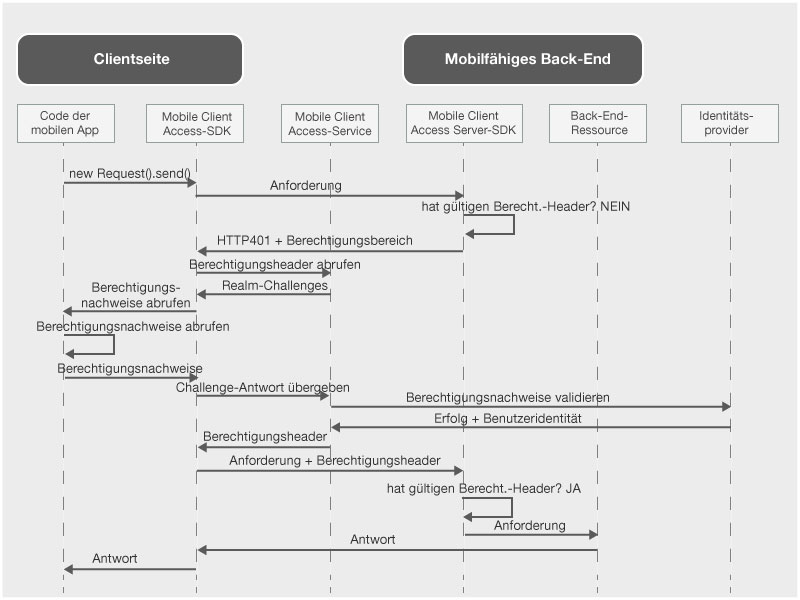

---

copyright:
  years: 2015, 2016

---

# Informationen zu {{site.data.keyword.amashort}}
{: #mca-overview}

Der {{site.data.keyword.amafull}}-Service stellt Authentifizierungs- und Überwachungsservices für mobile Anwendungen bereit, die auf Cloudressourcen zugreifen, die per Hosting in {{site.data.keyword.Bluemix_notm}} zur Verfügung werden.

Sie können den {{site.data.keyword.amashort}}-Service verwenden, um Node.js- und Liberty for Java&trade;-Anwendungen, die in {{site.data.keyword.Bluemix_notm}} gehostet werden, durch verschiedene Authentifizierungstypen zu schützen. Durch die Instrumentierung Ihrer mobilen Anwendungen mit dem {{site.data.keyword.amashort}}-SDK haben Sie die Möglichkeit, Authentifizierungsfunktionen zu nutzen, die durch den {{site.data.keyword.amashort}}-Service bereitgestellt werden. Überwachungsdaten und clientseitige Protokolldaten werden automatisch erfasst und auf Anforderung an den {{site.data.keyword.amashort}}-Service gesendet. Über das {{site.data.keyword.amashort}}-Dashboard können Sie die verschiedenen Authentifizierungstypen konfigurieren und die Daten anzeigen, die durch das clientseitige SDK erfasst werden.

**Anmerkung**: Der {{site.data.keyword.amashort}}-Service wurde früher als Advanced Mobile Access bezeichnet.

## {{site.data.keyword.amashort}}-Komponenten
{: #components}

* **{{site.data.keyword.amashort}}-Dashboard**: Dient zur Konfiguration verschiedener Authentifizierungstypen und zur Überwachung der Leistung mobiler Anwendungen sowie von Analysedaten, Nutzungsstatistiken und Einheitenprotokollen.
* **{{site.data.keyword.amashort}}-Client-SDK**: Instrumentiert mobile Anwendungen zur Verwendung der {{site.data.keyword.amashort}}-Funktionalität. Unterstützte Plattformen: iOS 8+, Android 4+, Cordova.
* **{{site.data.keyword.amashort}}-Server-SDK**: Schützt Ressourcen, die in {{site.data.keyword.Bluemix_notm}} gehostet werden. Gegenwärtig unterstützte Laufzeiten sind Node.js und Liberty for Java&trade;.

## Authentifizierungstypen
{: #authtypes}
Sie können die folgenden Typen von Authentifizierung in Ihrer mobilen App verwenden:
* **Facebook**: Facebook als Identitätsprovider verwenden. Ihre Benutzer melden sich bei der mobilen App mit ihren Facebook-Berechtigungsnachweisen an.
* **Google**: Google als Identitätsprovider verwenden. Ihre Benutzer melden sich bei der mobilen App mit ihren Google+-Berechtigungsnachweisen an.
* **Angepasst**: Eigenen Identitätsprovider erstellen. Sie können vollständig steuern, welche Arten von Informationen erfasst und validiert werden.

## {{site.data.keyword.amashort}}-Architekturübersicht
{: #architecture}

* Schützen Sie Ihre Cloudressourcen (Node.js-Anwendungen) mit dem {{site.data.keyword.amashort}}-Server-SDK.
* Verwenden Sie die vom {{site.data.keyword.amashort}}-Client-SDK bereitgestellte Klasse `Request` für die Kommunikation mit Ihren geschützten Cloudressourcen.
* Das {{site.data.keyword.amashort}}-Server-SDK erkennt eine nicht autorisierte Anforderung und gibt den Code HTTP 401 für die Berechtigungsanforderung (Challenge) zurück.
* Das {{site.data.keyword.amashort}}-Client-SDK erkennt die Berechtigungsanforderung (Challenge) mit dem Code HTTP 401 und startet automatisch den Authentifizierungsprozess mit dem {{site.data.keyword.amashort}}-Service.
* Für die Authentifizierung wird Facebook, Google oder eine angepasste Authentifizierung verwendet.
* Nach einer erfolgreichen Authentifizierung gibt {{site.data.keyword.amashort}} ein Berechtigungstoken zurück.
* Das {{site.data.keyword.amashort}}-Client-SDK fügt das Berechtigungstoken automatisch der ursprünglichen Anforderung hinzu und sendet die Anforderung erneut an die Cloudressource.
* Das {{site.data.keyword.amashort}}-Server-SDK extrahiert das Zugriffstoken (accessToken) aus der Anforderung und validiert es mit dem {{site.data.keyword.amashort}}-Service.
* Der Zugriff wird erteilt.  Die Antwort wird an die mobile Anwendung zurückgegeben.

## {{site.data.keyword.amashort}}-Anforderungsablauf
{: #flow}
Das folgende Diagramm beschreibt, wie eine Anforderung aus dem SDK an Ihr mobiles Back-End und an Identitätsprovider geleitet wird.

1. Verwenden Sie das {{site.data.keyword.amashort}}-SDK, um eine Anforderung an Ihre Back-End-Ressourcen zu senden, die mit dem {{site.data.keyword.amashort}}-Server-SDK geschützt werden.
* Das {{site.data.keyword.amashort}}-Server-SDK erkennt eine nicht autorisierte Anforderung und gibt den Status HTTP 401 und den Berechtigungsbereich zurück.
* Das {{site.data.keyword.amashort}}-Client-SDK erkennt den Status HTTP 401 automatisch und startet den Authentifizierungsprozess.
* Das {{site.data.keyword.amashort}}-Client-SDK kontaktiert den {{site.data.keyword.amashort}}-Service und fordert die Ausgabe eines Berechtigungsheaders an.
* Der {{site.data.keyword.amashort}}-Service fordert die Client-App auf, sich zuerst durch die Bereitstellung einer Authentifizierungsanforderung (Challenge) entsprechend dem zurzeit konfigurierten Authentifizierungstyp zu authentifizieren.
* Das {{site.data.keyword.amashort}}-Client-SDK agiert wie folgt:
   *  **Facebook- oder Google-Authentifizierung:** Es verarbeitet die Authentifizierungsanforderung automatisch (für die Facebook- bzw. Google-Authentifizierung).
   * **Angepasste Authentifizierung:** Es ruft Berechtigungsnachweise nach der vom Entwickler bereitgestellten Logik ab.
* Wenn eine Facebook- oder Google-Authentifizierung konfiguriert ist, verwendet das {{site.data.keyword.amashort}}-Client-SDK das zugeordnete SDK, um Facebook- bzw. Google-Tokens abzurufen. Diese Tokens dienen als Antwort auf die Authentifizierungsanforderung (Challenge).
* Wenn eine angepasste Authentifizierung konfiguriert ist, muss der Entwickler die Antwort auf die Authentifizierungsanforderung (Challenge) erfassen und an das {{site.data.keyword.amashort}}-Client-SDK übergeben.
* Nach dem Abruf der Antwort auf die Authentifizierungsanforderung wird diese an den {{site.data.keyword.amashort}}-Service gesendet.
* Der Service validiert die Antwort auf die Authentifizierungsanforderung mit einem entsprechenden Identitätsprovider (Facebook/Google/Angepasst).
* Wenn die Validierung erfolgreich ist, generiert der {{site.data.keyword.amashort}}-Service einen Berechtigungsheader und gibt den Header an das {{site.data.keyword.amashort}}-Client-SDK zurück. Der Berechtigungsheader enthält zwei Tokens: ein Zugriffstoken, das Informationen zu Zugriffsberechtigungen enthält, und ein ID-Token, das Informationen zum aktuellen Benutzer, zum Gerät und zur Anwendung enthält.
* Von diesem Punkt an haben alle Anforderungen, die mit dem {{site.data.keyword.amashort}}-Client-SDK gesendet werden, einen neu abgerufenen Berechtigungsheader.
* Das {{site.data.keyword.amashort}}-Client-SDK wiederholt automatisch das Senden der ursprünglichen Anforderung, die den Berechtigungsablauf ausgelöst hat.
* Das {{site.data.keyword.amashort}}-Server-SDK extrahiert den Berechtigungsheader aus der Anforderung, validiert den Header mit dem {{site.data.keyword.amashort}}-Service und erteilt den Zugriff auf eine Back-End-Ressource.
