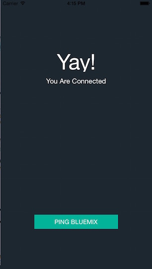

<!-- Attribute definitions -->
{:codeblock: .codeblock}

# Einführung in das Beispiel 'HelloWorld'
{: #gettingstarted-android}

Wenn Sie mit einer neuen Android-Anwendung beginnen möchten, können Sie die App 'HelloWorld' verwenden. Anhand dieser App wird veranschaulicht, wie von einer mobilen App ohne Authentifizierung eine Verbindung zum {{site.data.keyword.Bluemix}}-Back-End aufgebaut wird. Die App ist bereits mit dem SDK installiert. Wenn Sie bereit sind, können Sie die entsprechenden Bibliotheken abrufen, die Sie in der App verwenden möchten.

1. Erstellen Sie ein mobiles Back-End in {{site.data.keyword.Bluemix_notm}}.
    1. Klicken Sie im Abschnitt 'Boilerplates' des {{site.data.keyword.Bluemix_notm}}-Katalogs auf den Starter für MobileFirst Services.
    2. Geben Sie einen Namen und Host für die App ein und klicken Sie auf **Erstellen**.
    3. Klicken Sie auf **Fertig stellen**.
2. Rufen Sie das Projekt von GitHub ab. Optional können Sie den Befehl 'git clone' zum Abrufen des Projekts verwenden. Öffnen Sie auf dem Computer das Terminal und geben Sie den folgenden Befehl ein:
```
git clone https://github.com/ibm-bluemix-mobile-services/bms-samples-android-helloworld.git
```
{: codeblock}

Laden Sie vor dem Start die Datei `Gradle.zip` herunter und installieren Sie Gradle durch Extrahieren der heruntergeladenen komprimierten Datei in einem Verzeichnis Ihrer Wahl. Von Android Studio kann nach GRADLE HOME gefragt werden, wenn Sie das Beispiel zum ersten Mal importieren. Legen Sie für diesen Pfad das Verzeichnis `bin` fest, das sich in der extrahierten Datei `Gradle.zip` befindet. Von der Datei `build.gradle` wird durch Extrahieren der erforderlichen Abhängigkeiten automatisch das Projekt erstellt.
3. Initialisieren Sie das Projekt durch Ersetzen von &lt;APPLICATION_ROUTE&gt; und &lt;APPLICATION_ID&gt; durch die Anwendungsroute und die GUID im Testblock in der Funktion `BMSClient.getInstance().initialize()`:
```
// SDK mit IBM Bluemix-Anwendungs-ID und -Route initialisieren
BMSClient.getInstance().initialize(this, "<APPLICATION_ROUTE>", "<APPLICATION_ID>");
```
{: codeblock}

4. Führen Sie das Beispiel in der Entwicklungsumgebung aus.
Klicken Sie in der Android Studio-Symbolleiste auf die Schaltfläche **Play** und wählen Sie einen Simulator aus.

  Klicken Sie im Simulator auf **Ping {{site.data.keyword.Bluemix_notm}}**. Von der Beispiel-App wird eine GET-Anforderung an eine geschützte Ressource der `Node.js`-Laufzeit von {{site.data.keyword.Bluemix_notm}} gesendet. Wenn die Anforderung erfolgreich ist, wird die Verbindung überprüft und der Text im Simulator wird aktualisiert.

  **Hinweis:** Der `Node.js`-Laufzeitcode wird in der Boilerplate des Starters für MobileFirst Services bereitgestellt. Wenn Die Back-End-Anwendung nicht mit der Boilerplate des Starters für MobileFirst Services erstellt wurde, kann von der Anwendung nicht erfolgreich eine Verbindung hergestellt werden.

  Wenn Sie von einer mobilen App in Android Studio eine Verbindung zu {{site.data.keyword.Bluemix_notm}} aufbauen, wird die folgende Nachricht angezeigt:
 Yay! You are connected.
  {: screen}

  

  Wenn der Verbindungsaufbau fehlschlägt, wird Folgendes angezeigt:
  Bummer. Something went wrong.
  {: screen}

  

  Sie können die Fehler der fehlgeschlagenen Verbindung wie folgt beheben:
   * Stellen Sie sicher, dass Sie die Werte für Route und GUID ordnungsgemäß eingefügt haben.
   * Überprüfen Sie das Debugprotokoll auf weitere Informationen.

## Nächste Schritte:
{: #next}
Informationen zum Abrufen und Integrieren des SDKs in die mobile App finden Sie in den Informationen zum Konfigurieren der Bluemix-Services.
   * [Mobile Client Access](../../services/mobileaccess/index.html)
   * [Push](../../services/mobilepush/index.html)

# Zugehörige Links

## Beispiele
   * [HelloWorld (Android)](https://github.com/ibm-bluemix-mobile-services/bms-samples-android-helloworld)

## SDK
   * [bms-clientsdk-android-core](https://github.com/ibm-bluemix-mobile-services/bms-clientsdk-android-core)

## API
   * [API-Kerndefinitionen](https://www.{DomainName}/docs/api/content/api/mobilefirst/android/core-api-doc/overview-summary.html)
