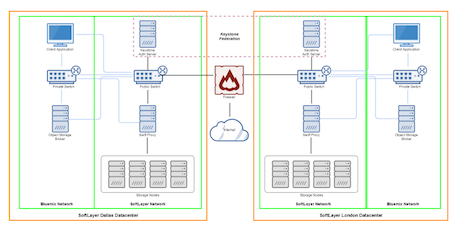

{:new_window: target="_blank"}

# Iniciación a {{site.data.keyword.objectstorageshort}} (BETA) {: #getting-started-with-object-storage} 

{{site.data.keyword.objectstoragefull}} proporciona acceso a una cuenta Swift {{site.data.keyword.objectstorageshort}} completa para gestionar los datos. Swift ofrece una plataforma de almacenamiento completamente distribuida a la que se puede acceder mediante API. Puede utilizarla directamente en sus aplicaciones o para copias de seguridad, ya que es la solución ideal para el almacenamiento escalable y eficaz.

IBM {{site.data.keyword.objectstorageshort}} for {{site.data.keyword.Bluemix_notm}} utiliza OpenStack Identity (Keystone) para la autenticación y se puede acceder a él directamente utilizando las llamadas de OpenStack Object Storage (Swift) API v1. IBM {{site.data.keyword.objectstorageshort}} se puede enlazar a una aplicación de {{site.data.keyword.Bluemix_notm}} o se puede acceder desde fuera de una aplicación de {{site.data.keyword.Bluemix_notm}}. 

Hay más información y documentación disponibles sobre el uso de OpenStack Swift y Keystone en el [sitio de documentación de OpenStack](http://docs.openstack.org){: new_window}.

El diagrama de arquitectura de {{site.data.keyword.objectstorageshort}} es el siguiente: 

[](http://www.stage1.ng.bluemix.net/docs/api/content/services/ObjectStorage/images/object_storage_solution_archectiture.png){: new_window}

*Figura 1. Diagrama de arquitectura de {{site.data.keyword.objectstorageshort}}*

**Nota:** El cifrado del lado del proveedor no se proporciona. Es responsabilidad de la aplicación cliente cifrar datos antes de subirlos.

**Nota:** El plan de {{site.data.keyword.objectstorageshort}} Service Beta se eliminará del catálogo tras la General Availability del {{site.data.keyword.Bluemix_notm}} {{site.data.keyword.objectstorageshort}} Service. Tras un periodo de gracia, se eliminarán las instancias de servicio que utilizan el plan Beta. [Actualice el plan de precios](#changeplan) para continuar utilizando el servicio de {{site.data.keyword.objectstorageshort}}. 


## Creación de una instancia de {{site.data.keyword.objectstorageshort}} en {{site.data.keyword.Bluemix_notm}} {: #creating-object-storage-instance} 

### Cómo crear una instancia de servicio de {{site.data.keyword.objectstorageshort}}
1.	Vaya al separador {{site.data.keyword.Bluemix_notm}} **Catálogo** y especifique **{{site.data.keyword.objectstorageshort}}** en el recuadro de búsqueda, o vaya a **Servicios** y seleccione **Almacenamiento**. Pulse el servicio de **{{site.data.keyword.objectstorageshort}}**. 
2.	Seleccione el espacio, la app, el nombre de servicio y el plan y pulse **Crear**. 
**Nota:** Si al principio ha seleccionado la opción **Dejar sin enlazar** en el campo **App**, aún puede enlazar la instancia de servicio a su aplicación {{site.data.keyword.Bluemix_notm}} después de completar la configuración. Consulte las instrucciones siguientes.

## Utilización de {{site.data.keyword.objectstorageshort}} desde una app de {{site.data.keyword.Bluemix_notm}} {: #using-object-storage-from-bluemix-app} 

### Cómo enlazar el servicio de {{site.data.keyword.objectstorageshort}} a una aplicación después de la creación {: #bind-object-storage-to-application} 
1.	En el panel de control de {{site.data.keyword.Bluemix_notm}}, seleccione la app que desee enlazar.
2.	En la visión general de la app, pulse **Enlazar un servicio o API**.
3.	Seleccione la instancia de {{site.data.keyword.objectstorageshort}} desde la lista de servicios y pulse **Añadir**.
4.	Haga clic en **Volver a transferir** cuando se le solicite. Es necesario volver a transferir su app para utilizar el nuevo servicio.

### Contexto enlazado

Si desea utilizar {{site.data.keyword.objectstorageshort}} en un contexto enlazado, las credenciales de la nube se proporcionan de forma indirecta a través del proceso de enlace de la aplicación. Después de enlazar correctamente una instancia de servicio a la aplicación, se añade una configuración similar al ejemplo siguiente en la variable de entorno `VCAP_SERVICES`.

    {
    "Object-Storage": [
    {
      "name": "Object-Storage - YP",
      "label": "Object-Storage",
      "plan": "Free",
      "credentials": {
         "auth_url": "https://identity.open.softlayer.com",
         "project": "object_storage_d049255b",
         "projectId": "0f47b41b06d047f9aae3b33f1db061ed",
         "region": "dallas",
         "userId": "ad78b2a3f843466988afd077731c61fc",
         "username": "user_202db1f8a7aa3f3ac51ec68f10dbe7dc29070bc7",
         "password": "K/jyIi2jR=1?D.TP",
         "domainId": "2df6373c549e49f8973fb6d22ab18c1a",
         "domainName": "639347"
        }
       }
      ]
    }

## Utilización de la interfaz de usuario de {{site.data.keyword.objectstorageshort}} {: #using-object-storage-ui}

### Navegación y elementos de IU
Cuando se suministra {{site.data.keyword.objectstorageshort}}, puede ver la información de instancia en el panel de control de instancia de servicio de {{site.data.keyword.objectstorageshort}} for {{site.data.keyword.Bluemix_notm}}. Desde el panel de control, seleccione la instancia de {{site.data.keyword.objectstorageshort}} para visualizar el panel con información más detallada.  
#### Datos de uso
En la parte superior del panel, visualizará la información de uso de almacenamiento para su instancia. También muestra el número actual de **Contenedores de almacenamiento** y el número total de **Objetos** en todos los contenedores. Lista el uso de memoria en megabytes. **Almacenamiento consumido** se refiere a la cantidad actual de espacio que se utiliza. 
#### Acciones
Para recuperar los datos de uso más recientes, pulse el botón **Renovar**.   
####Navegador de objetos 
La sección inferior del panel contiene el navegador de objetos. Utilice este navegador para gestionar los objetos y contenedores de almacenamiento de objetos. Puede crear contenedores, cargar archivos, suprimir contenedores y suprimir archivos, entre otras acciones.

## Utilización de Swift CLI para acceder a {{site.data.keyword.objectstorageshort}} {: #using-swift-cli}

Puede acceder al servicio de {{site.data.keyword.objectstorageshort}} mediante Internet y desde las aplicaciones y las máquinas virtuales del IBM {{site.data.keyword.Bluemix_notm}}. Los casos de uso comunes para el servicio de {{site.data.keyword.objectstorageshort}} son los siguientes:

* Copia de seguridad de datos de volumen desde las instancias
* Utilización de una ubicación intermediaria al transferir grandes cantidades de datos
* Transferencia de datos entre entornos que no están conectados directamente
* Función de repositorio central

El servicio de {{site.data.keyword.objectstorageshort}} se basa en OpenStack Swift y se puede acceder a él mediante cualquier aplicación de cliente compatible. Esta sección describe cómo utilizar el cliente de Python Swift, que es la interfaz de línea de mandatos (CLI) para la API de {{site.data.keyword.objectstorageshort}} y sus extensiones, para que funcione con los contenedores y los archivos.

### Instalación del cliente Swift

Instale el software de requisito previo siguiente si aún no está instalado. Para obtener más información, consulte la [Documentación de OpenStack](http://docs.openstack.org/user-guide/common/cli_install_openstack_command_line_clients.html#install-the-prerequisite-software){: new_window}. 
* Python 2.7 o posterior
* Paquete setuptools
* Paquete pip

Instale el cliente de Python Swift utilizando Python pip:

	sudo pip install python-swiftclient

### Configuración del cliente

El cliente de Swift toma la información de autenticación de las siguientes variables de entorno:
* ```OS_AUTH_URL``` es la URL de punto final
* ```OS_USER_ID``` es el nombre de usuario
* ```OS_PASSWORD``` es la contraseña

Establezca la información de autenticación como se indica a continuación: 

	export OS_USER_ID=24a20b8e4e724f5fa9e7bfdc79ca7e85
	export OS_PASSWORD=aaa55AAAaaaaa]?,
	export OS_PROJECT_ID=383ec90b22ff4ba4a78636f4e989d5b1
	export OS_AUTH_URL=https://identity.open.softlayer.com/v3
	export OS_REGION_NAME=dallas
	export OS_IDENTITY_API_VERSION=3
	export OS_AUTH_VERSION=3

Puede encontrar los valores de credenciales para el servicio de {{site.data.keyword.objectstorageshort}} en la página **Credenciales de servicio** de la interfaz de usuario de {{site.data.keyword.objectstorageshort}}. 

**Nota:** Asegúrese de añadir un ```/v3``` al ```auth_url`` desde las credenciales de la interfaz de usuario de {{site.data.keyword.objectstorageshort}} al configurar las variables de entorno ```OS_AUTH_URL`` para el cliente de Swift.


*Figura 2. Credenciales de servicio de {{site.data.keyword.objectstorageshort}}*

### Trabajar con contenedores

Lista de contenedores:

	swift list
	
Creación de un contenedor:

	swift post <nombre_contenedor>
	
Listar el contenido de un contenedor:

	swift list <nombre_contenedor>

### Trabajo con objetos

#### Cómo añadir un archivo a un contenedor

	swift upload <nombre_contenedor> <nombre_archivo>

#### Cómo añadir archivos mayores de 5 GB en un contenedor

Si está cargando un archivo mayor de 5 GB, debe dividirlo en fragmentos más pequeños. Puede dar instrucciones al cliente de Swift para que maneje tal subida facilitando el parámetro ```-segment-size```:

	swift upload <nombre_contenedor> <nombre_archivo> --segment-size <tamaño_en_bytes>
	
Cada segmento se carga en paralelo en un contenedor independiente denominado ```<nombre_contenedor>_segments```. Una vez que se hayan cargado todos los segmentos, Swift creará un archivo manifest para que los segmentos se puedan descargar en un único archivo desde el contenedor original ```<nombre_contenedor>`` con el nombre de archivo original ```<nombre_archivo>``.

Por ejemplo, el mandato siguiente carga un archivo denominado ```large_file``` desde un contenedor denominado ```test_container`` con el tamaño de segmento ```1073741824``.

	swift upload test_container -S 1073741824 large_file

Puede ejecutar el siguiente mandato para descargar el archivo:

	swift download test_container large_file

#### Descarga de un archivo

	swift download <nombre_contenedor> <nombre_archivo>
	
#### Cómo añadir un directorio a un contenedor

Swift no tiene una auténtica estructura de directorios, sino que utiliza la denominación para representar un diseño de directorios. Para añadir un directorio a un contenedor, ejecute el mandato siguiente:

	swift upload <nombre_contenedor> <nombre_directorio>
	
Este mandato cargará la estructura de directorios completa como una vía de acceso relativa. Por ejemplo, si especifica ```/mnt/volume1```, la estructura de directorios mnt/volume1 se añadirá a todos los nombres de archivos para indicar la estructura de directorios.

	
#### Descarga de un directorio

Para descargar una estructura de directorios, utilice el parámetro ```-prefix``` para indicar el directorio o la estructura de directorios que desea descargar.

	swift download <nombre_contenedor> --prefix <directorio>
	
#### Supresión de un archivo

	swift delete <nombre_contenedor> <nombre_archivo>

### Creación de un URL temporal

Un URL temporal es un URL largo y difícil de adivinar que se puede utilizar para un periodo específico para descargar objetos sin que requieran una mayor autenticación. Genere un URL temporal con los pasos siguientes:

1. Identifique la cuenta de autenticación.
2. Establezca una clave secreta.
3. Cree el URL temporal.

#### Identificación de la cuenta de autenticación

El mandato ```stat``` de Swift imprime información sobre la cuenta:

	swift stat

Ubique el campo Cuenta y anote la serie completa detrás de *Cuenta*: incluido ```AUTH_```.

#### Configuración de una clave secreta

Esta clave puede ser cualquiera que seleccione, pero la práctica recomendada es que seleccione una serie larga, aleatoria y difícil de adivinar.

	swift post -m "Temp-URL-Key:<key>"

#### Creación de un URL temporal

El mandato ```tempurl``` de Swift toma estos argumentos de posición:

* [method] GET para permitir la descarga, PUT para permitir la carga
* [seconds] Tiempo en segundos durante los que el URL estará disponible
* [path] Vía de acceso completa del objeto expresada como /v1/<autorización_cuenta>/<nombre_contenedor>/<nombre_objeto>
* [key] Clave que se establece en el paso 2

```
swift tempurl GET <segundos> <vía_acceso> <clave>
```

Este mandato devolverá un URL que se puede adjuntar al nombre de clúster para obtener un URL completo. Utilice el URL completo para descargar el objeto con cualquier cliente de HTTP compatible como por ejemplo curl, wget o Firefox.

## Utilización de la API REST de Swift para acceder a {{site.data.keyword.objectstorageshort}} {: #using-swift-restapi}

Puede utilizar la API REST de Swift con una interfaz de clientes de línea de mandatos, como por ejemplo cURL, o invocar la API desde la aplicación.  

### URL de {{site.data.keyword.objectstorageshort}} {: #access-points}

Para interactuar con la API de {{site.data.keyword.objectstorageshort}}, genere el URL de {{site.data.keyword.objectstorageshort}} tal como se indica a continuación:

	https://<punto de acceso>/<versión de la API>/AUTH_<ID de proyecto>/<espacio de nombres del contenedor>/<object namespace>

Por ejemplo:

URL de 

* Figura 3. URL de {{site.data.keyword.objectstorageshort}}*

El URL consta de cinco partes. La ```<versión de la API>``` es la v1. Puede encontrar el ```<ID de proyecto>``, el ```<espacio de nombres del contenedor>`` y el ```<object namespace>`` de {{site.data.keyword.objectstorageshort}} en la interfaz de usuario de {{site.data.keyword.objectstorageshort}}. Para el ```<punto de acceso>``, consulte la tabla siguiente: 


| **Región**  |     **Punto de acceso interno**                             |     **Punto de acceso público**                   |
|-------------|-----------------------------------------------------------|-----------------------------------------------|
| Dallas      | https://dal.objectstorage.service.open.networklayer.com/  | https://dal.objectstorage.open.softlayer.com/ | 
| Londres      | https://lon.objectstorage.service.open.networklayer.com/  | https://lon.objectstorage.open.softlayer.com/ |


*Tabla 1. Punto de acceso de {{site.data.keyword.objectstorageshort}}*

Utilice el punto de acceso interno al acceder al servicio de {{site.data.keyword.objectstorageshort}} desde dentro de {{site.data.keyword.Bluemix_notm}} o el punto de acceso público al acceder al servicio de {{site.data.keyword.objectstorageshort}} desde fuera de {{site.data.keyword.Bluemix_notm}}.

### API de {{site.data.keyword.objectstorageshort}}

Consulte la [Referencia completa de la API de OpenStack Swift](http://developer.openstack.org/api-ref-objectstorage-v1.html){: new_window} para obtener una lista completa de las opciones y los ejemplos de la API REST de {{site.data.keyword.objectstorageshort}}.

## Utilización de {{site.data.keyword.objectstorageshort}} entre varias regiones {: #multi-regions}  

El servicio de IBM {{site.data.keyword.objectstorageshort}} for {{site.data.keyword.Bluemix_notm}} da soporte a las regiones de almacenamiento Dallas y Londres. Estas regiones de almacenamiento son independientes de la región {{site.data.keyword.Bluemix_notm}}, como por ejemplo EE.UU.-Sur y Reino Unido, en la que se crea la instancia de servicio de {{site.data.keyword.objectstorageshort}}.  Por ejemplo, si crea una instancia de {{site.data.keyword.objectstorageshort}} en la región {{site.data.keyword.Bluemix_notm}} EE.UU.-Sur, puede leer y grabar datos a cualquier región de almacenamiento Dallas o Londres.  

Para la región {{site.data.keyword.Bluemix_notm}} EE.UU.-Sur, la región de almacenamiento Dallas es el valor predeterminado. Para la región {{site.data.keyword.Bluemix_notm}} Reino Unido, la región de almacenamiento Londres es el valor predeterminado.  La interfaz de usuario de {{site.data.keyword.objectstorageshort}} siempre se lanza en la región de almacenamiento predeterminada de la región {{site.data.keyword.Bluemix_notm}}. Para conmutar regiones, pulse la lista desplegable de Región de {{site.data.keyword.objectstorageshort}} y seleccione otra región.

Región de cambio de 

*Figura 4. Región de cambio de {{site.data.keyword.objectstorageshort}}*

**Nota:** El servicio de {{site.data.keyword.objectstorageshort}} NO da soporte a la réplica de la región de almacenamiento cruzada.

### Acceso de varias regiones

Para utilizar el servicio de {{site.data.keyword.objectstorageshort}}, debe [autenticarse con OpenStack Keystone](#keystone-authentication). Una vez que se haya autenticado correctamente, estarán disponibles en la respuesta ```X-Subject-Token``` y los puntos finales de {{site.data.keyword.objectstorageshort}}.

Por ejemplo, para crear un contenedor denominado ```my_container``` en la región de almacenamiento Dallas, especifique un punto de acceso Dallas en el mandato curl como se indica a continuación:

	# curl -i https://dal.objectstorage.open.softlayer.com/v1/AUTH_3c9c89a2edbb458da74a9e81e215da9e/my_container -X PUT -H "Content-Length: 0" -H "X-Auth-Token: gAAAAABWlw5mwttbb_6G3LnTiGusyoOSEHXMG7oTnDYWN1vBZB6XAxUEhz4ehGkdw6Qm_I9ZFFXr8fwcc2KaEbpWbQoglhAvrYTXbrkn8MvErLdnbcT0XK2t5N7lEZyyKQlsgmQWcrch8VOO_OiSKKToORYR7luI-2TrR_JIVZm-8AAS6hLhk9"

	HTTP/1.1 201 Created
	Content-Length: 0
	Content-Type: text/html; charset=UTF-8
	X-Trans-Id: tx4a640ca81c7240ea8f812-00569712fc
	Date: Thu, 14 Jan 2016 03:16:13 GMT


Para crear un contenedor denominado ```my_container``` en la región de almacenamiento Londres, especifique un punto de acceso Londres en el mandato curl como se indica a continuación:

	# curl -i https://lon.objectstorage.open.softlayer.com/v1/AUTH_3c9c89a2edbb458da74a9e81e215da9e/my_container -X PUT -H "Content-Length: 0" -H "X-Auth-Token: gAAAAABWlw5mwttbb_6G3LnTiGusyoOSEHXMG7oTnDYWN1vBZB6XAxUEhz4ehGkdw6Qm_I9ZFFXr8fwcc2KaEbpWbQoglhAvrYTXbrkn8MvErLdnbcT0XK2t5N7lEZyyKQlsgmQWcrch8VOO_OiSKKToORYR7luI-2TrR_JIVZm-8AAS6hLhk9"

	HTTP/1.1 201 Created
	Content-Length: 0
	Content-Type: text/html; charset=UTF-8
	X-Trans-Id: tx4a640ca81c7240ea8f812-00569712fc
	Date: Thu, 14 Jan 2016 03:16:13 GMT

**Nota:** ```X-Subject-Token``` que ha adquirido desde Keystone funciona en regiones de almacenamiento. 

Para obtener más información sobre los puntos de acceso para distintas regiones, consulte la tabla [Punto de acceso de Object Storage](#access-points).


## Comprensión de la autenticación y las credenciales {: #understanding-authentication-credentials}

### Generación de credenciales de {{site.data.keyword.objectstorageshort}} sin enlazar una aplicación

Para generar credenciales de nube de {{site.data.keyword.objectstorageshort}} para utilizarlas fuera de una aplicación de {{site.data.keyword.Bluemix_notm}}, debe generar una clave de servicio para la instancia de {{site.data.keyword.objectstorageshort}}. Puede generar una clave nueva mediante la selección de las **Credenciales de servicio** desde la barra lateral de la interfaz de usuario o utilizando la CLI de Cloud Foundry (versión 6.11.3 o posterior). Después de generar y recuperar una clave de servicio para la instancia de {{site.data.keyword.objectstorageshort}}, puede utilizar la información de integración de nube para solicitar una señal de Keystone utilizando un SDK de OpenStack o la API de OpenStack Identity y empezar a utilizar la cuenta de Swift para gestionar objetos.
   
Para crear la clave utilizando la CLI de Cloud Foundry, inicie sesión y ejecute el mandato siguiente:
 
    cf create-service-key <nombre_instancia_object_storage> <nombre_exclusivo_para_esta_clave>

Para recuperar las credenciales de servicio desde la CLI de Cloud Foundry, ejecute el mandato siguiente:

	cf service-key <nombre_instancia_object_storage> <nombre_exclusivo_para_esta_clave>


### Usuarios y proyectos de nube
El suministro de una nueva instancia de {{site.data.keyword.objectstorageshort}} crea un proyecto Keystone aislado en la nube pública de IBM. Cuando enlace una aplicación nueva en la instancia de {{site.data.keyword.objectstorageshort}}, se creará un nuevo usuario de Keystone con acceso al proyecto. Cuando desaprovisione la instancia, se suprimen el proyecto y el usuario.

### OpenStack Identity (Keystone) v3 {: #keystone-authentication}
La estructura de credenciales contiene un conjunto completo de atributos para permitirle seleccionar el método de solicitud de señales OpenStack o el SDK de OpenStack que se ajuste mejor a la aplicación. 
 
La solicitud de señal v3 recomendada es una solicitud POST a https://identity.open.softlayer.com/v3/auth/tokens, tal como se muestra en el siguiente mandato curl:

	curl -i \
	  -H "Content-Type: application/json" \
	  -d '
	{
		"auth": {
			"identity": {
				"methods": [
					"password"
				],
				"password": {
					"user": {
						"id": "ad78b2a3f843466988afd077731c61fc",
						"password": "K/jyIi2jR=1?D.TP"
					}
				}
			},
			"scope": {
				"project": {
					"id": "0f47b41b06d047f9aae3b33f1db061ed"
				}
			}
		}
	}' \
	  https://identity.open.softlayer.com/v3/auth/tokens ; echo

Utilice el valor del campo ```X-Subject-Token``` desde la cabecera de respuestas como el campo ```X-Auth-Token`` al realizar solicitudes en el servicio de {{site.data.keyword.objectstorageshort}}.

Una respuesta de ejemplo es como la siguiente:

	HTTP/1.1 201 Created
	X-Subject-Token: gAAAAABWlw5mwttbb_6G3LnTiGusyoOSEHXMG7oTnDYWN1vBZB6XAxUEhz4ehGkdw6Qm_I9ZFFXr8fwcc2KaEbpWbQoglhAvrYTXbrkn8MvErLdnbcT0XK2t5N7lEZyyKQlsgmQWcrch8VOO_OiSKKToORYR7luI-2TrR_JIVZm-8AAS6hLhk9
	Vary: X-Auth-Token
	Content-Type: application/json
	Content-Length: 960
	Date: Tue, 10 Jun 2014 20:40:14 GMT
	
	{"token": 
	{"audit_ids": ["ECwrVNWbSCqmEgPnu0YCRw"], "methods": ["password"],
	 "roles": [{"id": "c703057be878458588961ce9a0ce686b", "name": "admin"}],
	 "expires_at": "2014-06-10T21:40:14.360795Z", 
	 "project": {"domain": {"id": "default", "name": "Default"}, "id": "3d4c2c82bd5948f0bcab0cf3a7c9b48c", "name": "demo"}, 
	 "catalog": [
	 {
		"endpoints": [
			{
			"adminURL": "https://lon.objectstorage.service.open.networklayer.com/v1/AUTH_35a68d1d115b4a0f8c7975d4f96f256b",
			"id": "20cbfa6ff22b4a67a1484d30235bfc80",
			"internalURL": "https://lon.objectstorage.service.open.networklayer.com/v1/AUTH_35a68d1d115b4a0f8c7975d4f96f256b",
			"publicURL": "https://lon.objectstorage.open.softlayer.com/v1/AUTH_35a68d1d115b4a0f8c7975d4f96f256b",
			"region": "london"
			},
			{
			"adminURL": "https://dal.objectstorage.service.open.networklayer.com/v1/AUTH_35a68d1d115b4a0f8c7975d4f96f256b",
			"id": "4207049680fa4effbecd044c7448a8cb",
			"internalURL": "https://dal.objectstorage.service.open.networklayer.com/v1/AUTH_35a68d1d115b4a0f8c7975d4f96f256b",
			"publicURL": "https://dal.objectstorage.open.softlayer.com/v1/AUTH_35a68d1d115b4a0f8c7975d4f96f256b",
			"region": "dallas"
			}
			],
		"endpoints_links": [],
		"name": "swift",
		"type": "object-store"
		},
	 ], 
	 "extras": {},
	 "user": {"domain": {"id": "default", "name": "Default"}, "id": "3ec3164f750146be97f21559ee4d9c51", "name": "admin"},  "issued_at": "2014-06-10T20:40:14.360822Z"}}


El URL de {{site.data.keyword.objectstorageshort}} se encuentra en el Catálogo de servicios. El Catálogo de servicios está contenido en el cuerpo de respuesta de la solicitud de señal. La respuesta es un catálogo completo de servicios de OpenStack que están disponibles. Seleccione el punto final desde el Catálogo de servicios con el tipo de ```object-store```, región que coincide con el campo región de las credenciales, y la interfaz interna (`internalURL`) al acceder al servicio de {{site.data.keyword.objectstorageshort}} desde dentro de {{site.data.keyword.Bluemix_notm}} o la interfaz pública (`publicURL`) al acceder al servicio de {{site.data.keyword.objectstorageshort}} desde fuera de {{site.data.keyword.Bluemix_notm}}.


## Desenlazar y desaprovisionar {{site.data.keyword.objectstorageshort}} {: #deprovisioning-object-storage}

### Cómo desaprovisionar su servicio de {{site.data.keyword.objectstorageshort}}
1.	Seleccione el servicio del panel de control de {{site.data.keyword.Bluemix_notm}}.  
2.	Pulse el icono de engranaje de la esquina superior derecha y seleccione **Suprimir servicio**.
	
**Aviso:** si desaprovisiona un IBM {{site.data.keyword.objectstorageshort}} para la instancia de servicio de {{site.data.keyword.Bluemix_notm}}, se suprimirán el proyecto de nube y la cuenta de Swift. Todos los contenedores y objetos de la instancia desaprovisionada se suprimirán de Swift y no se podrán restaurar.

### Desenlace de una aplicación o supresión de una clave de servicio

Si desenlaza una aplicación de la instancia de {{site.data.keyword.objectstorageshort}} o si suprime la clave de servicio, se suprimirán las credenciales. La cuenta de {{site.data.keyword.objectstorageshort}} no se suprime hasta que desaprovisiona la instancia de {{site.data.keyword.objectstorageshort}}. Puede generar credenciales de nube nuevas [volviendo a enlazar o creando una nueva clave de servicio](#bind-object-storage-to-application).

## FAQ {: #FAQ} 

### ¿Cómo varían los precios en función del plan que escoja?
El precio varía en función del plan escogido. Para ver más información sobre precios, consulte la [Hoja de precios de IBM Bluemix](https://console.ng.bluemix.net/pricing/){: new_window} o utilice la [Calculadora](https://console.ng.bluemix.net/?direct=classic/#/pricing/cloudOEPaneId=pricing&paneId=pricingSheet){: new_window} para realizar estimaciones más detalladas.

### ¿Cómo puedo cambiar mi plan de Beta a Estándar? {: #changeplan}  
El plan de {{site.data.keyword.objectstorageshort}} Service Beta se eliminará del catálogo tras la General Availability del {{site.data.keyword.Bluemix_notm}} {{site.data.keyword.objectstorageshort}} Service. Las instancias de servicio de clientes NO de migran del plan Beta al Estándar automáticamente. Tendrá que actualizar el plan siguiendo estos pasos:

1.	Pulse **Plan** desde la barra de navegación izquierda en la interfaz de usuario de {{site.data.keyword.objectstorageshort}}.
2.	Seleccione **Estándar** como el plan nuevo y, a continuación, pulse **Guardar**.

Cambiar plan de precios de 

*Figura 5. Cambiar plan de precios de {{site.data.keyword.objectstorageshort}}*

Las instancias de servicio y los datos del cliente se moverán al nuevo plan.

También puede modificar el plan de pago mediante la interfaz de línea de mandatos. Para obtener más información, consulte [Cómo cambiar el plan](../../pricing/index.html#changing)  

**Nota:** las instancias de servicio del plan Beta no se pueden mover al plan Gratuito. Todas las instancias de servicio no migradas se inhabilitarán y, tras 60 días, se suprimirán. 

### ¿Qué cuentas y planes de pago puedo utilizar para {{site.data.keyword.objectstorageshort}}?
El servicio de {{site.data.keyword.objectstorageshort}} viene con varias opciones de planes. A partir de nuestro release de disponibilidad general, se ofrecen dos planes en este momento: Estándar y Gratuito. El plan Estándar sólo está disponible para las cuentas pagadas de {{site.data.keyword.Bluemix_notm}}, ya sean Pago según uso o Suscripción, y para usuarios internos de IBM.

Las cuentas de prueba que aún están activas podrán utilizar el plan Gratuito, que permite existir sólo una instancia en una Organización de {{site.data.keyword.Bluemix_notm}}. Una vez que caduque el tiempo en la versión de prueba de {{site.data.keyword.Bluemix_notm}}, se inhabilitará la instancia de servicio de {{site.data.keyword.objectstorageshort}} asociada, lo que significa que no se puede acceder a la cuenta de almacenamiento mediante la interfaz de usuario ni mediante la línea de mandatos de {{site.data.keyword.Bluemix_notm}}. Tras un periodo de gracia de 30 días, se depurará la cuenta de {{site.data.keyword.Bluemix_notm}}, y se suprimirán todos los datos. Para evitar la pérdida de datos, se recomienda actualizar a una cuenta de pago de {{site.data.keyword.Bluemix_notm}} lo antes posible. Para actualizar la cuenta, pulse en el menú de gestión de usuarios en la esquina superior derecha, y seleccione **Cuenta**, que proporciona instrucciones sobre el proceso de actualización.

Las instancias que se crean en el plan Gratuito se pueden actualizar al plan Estándar con los pasos descritos en [¿Cómo puedo cambiar mi plan de Beta a Estándar?](#changeplan). Para actualizar al plan Estándar, la organización asociada debe ser una cuenta de pago de {{site.data.keyword.Bluemix_notm}}. Las cuentas de versión de prueba con instancias de {{site.data.keyword.objectstorageshort}} no se pueden actualizar al plan Estándar, y las instancias del plan Estándar no se pueden degradar a otros planes.

### ¿Cómo se me cobrará y facturará por mi uso de {{site.data.keyword.objectstorageshort}}?

El servicio {{site.data.keyword.objectstorageshort}} sólo le cobrará por lo que utilice. No existe tarifa mínima, cargos de configuración ni compromisos para empezar a utilizar el servicio. No hay ningún cargo por solicitud de API ni por tráfico de red de datos entrante. 

Su uso de {{site.data.keyword.objectstorageshort}} se factura en función del uso de almacenamiento diario medio durante el ciclo de facturación. Esto incluye todos los datos de objetos en contenedores que haya creado bajo su cuenta de organización de {{site.data.keyword.Bluemix_notm}}. 

Se aplica un cargo de Transferencia de datos salientes siempre que se lean datos desde cualquiera de sus contenedores de objetos a través de la red pública. Se factura en función de la transferencia de datos salientes pública diaria media durante el ciclo de facturación. 

Los componentes de la métrica de los precios de {{site.data.keyword.objectstorageshort}} son los siguientes: 
* Uso de almacenamiento - 0,04 $ por GB al mes
* Transferencia de datos salientes pública - 0,09 por GB al mes 

Al final del ciclo de facturación, {{site.data.keyword.Bluemix_notm}} le facturará automáticamente por el uso correspondiente al período de facturación actual. Puede ver sus cambios para el período de facturación actual a través de los informes de {{site.data.keyword.Bluemix_notm}}.

El plan de servicio estándar publicado para Londres y Dallas tiene los mismos precios. 

### ¿Cómo se efectúa la réplica de datos en {{site.data.keyword.objectstorageshort}}?
El servicio de {{site.data.keyword.objectstorageshort}} conserva tres copias de sus datos que se replican a través de múltiples nodos de almacenamiento. Para obtener más información, consulte el documento [OpenStack Swift Replication](http://docs.openstack.org/developer/swift/overview_replication.html){: new_window}.

># Enlaces relacionados {:class="linklist"}
>## Referencia de API {:id="api"}
>* [OpenStack Object Storage (Swift) API v1](http://developer.openstack.org/api-ref-objectstorage-v1.html){: new_window}
>* [OpenStack Identity (Keystone) API v3.0](http://developer.openstack.org/api-ref-identity-v3.html){: new_window}
>
># Enlaces relacionados {:class="linklist"}
>## SDK {:id="sdk"}
>* [OpenStack Software Development Kits (SDK)](https://wiki.openstack.org/wiki/SDKs){: new_window}
>
># Enlaces relacionados {:class="linklist"}
>## Guías de aprendizaje y ejemplos {:id="samples"}
>* [Conexión a IBM Object Storage for Bluemix con Java](https://developer.ibm.com/recipes/tutorials/connecting-to-ibm-object-storage-for-bluemix-with-java/){: new_window}
>* [Utilice Python para acceder al Object Storage de Bluemix](https://developer.ibm.com/recipes/tutorials/use-python-to-access-your-bluemix-object-storage/){: new_window}
>* [Comunidad de Object Storage de Bluemix](https://www.ibm.com/developerworks/community/groups/service/html/communityoverview?communityUuid=1b48459f-4091-43cb-bca4-37863606d989){: new_window}
>
># Enlaces relacionados {:class="linklist"}
>## Tiempos de ejecución compatibles {:id="buildpacks"}
>* [Liberty for Java](https://www.ng.bluemix.net/docs/starters/liberty/index.html){: new_window}
>* [SDK for Node.js](https://www.ng.bluemix.net/docs/starters/nodejs/index.html){: new_window}
>* [Ir](https://www.ng.bluemix.net/docs/starters/go/index.html){: new_window}
>* [PHP](https://www.ng.bluemix.net/docs/starters/php/index.html){: new_window}
>* [Python](https://www.ng.bluemix.net/docs/starters/python/index.html){: new_window}
>* [Ruby](https://www.ng.bluemix.net/docs/starters/rails/index.html){: new_window}
>* [Compilaciones de la comunidad](https://www.ng.bluemix.net/docs/starters/byob.html){: new_window}
>
># Enlaces relacionados {:class="linklist"}
>## Enlaces relacionados {:id="general"}
>* [Hoja de precios de IBM Bluemix](https://www.ng.bluemix.net/#/pricing){: new_window}
>* [Requisitos previos de IBM Bluemix](https://developer.ibm.com/bluemix/support/#prereqs){: new_window}
>
>{:elementKind="article" id="rellinks"}
