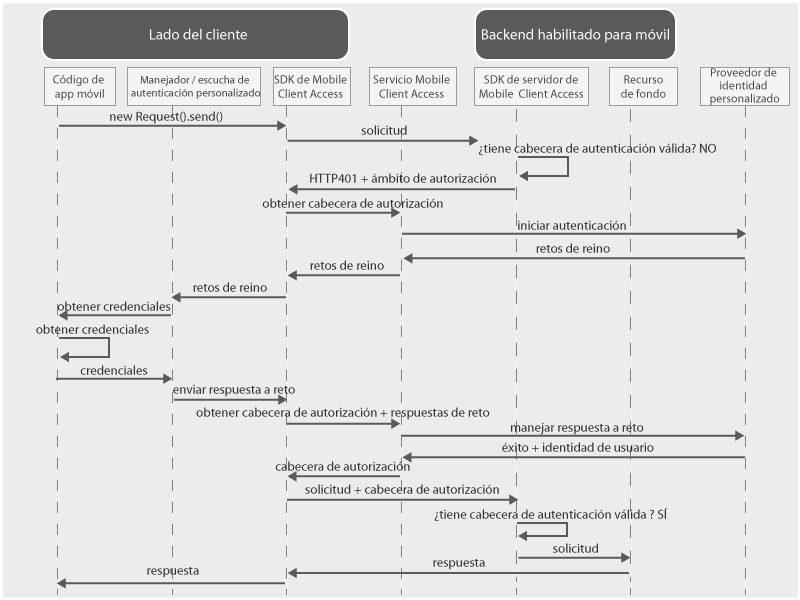

---

copyright:
  años: 2015, 2016

---

# Utilización de un proveedor de identidad personalizado
{: #custom-id}
Puede crear un proveedor de identidad personalizado e implementar su propia lógica para recopilar y validar credenciales. Un proveedor de identidad personalizado es una aplicación web que expone una interfaz RESTful. Puede alojar el proveedor de identidad personalizado de forma local o en {{site.data.keyword.Bluemix}}. El único requisito es que este debe ser accesible desde Internet público para que se pueda comunicar con el servicio de {{site.data.keyword.amashort}}.

## Visión general de {{site.data.keyword.amashort}}
{: #custom-id-ovr}
 En el diagrama siguiente se muestra cómo {{site.data.keyword.amashort}} se integra con un proveedor de identidad personalizado.



1. Utilice el SDK de {{site.data.keyword.amashort}} para realizar una solicitud a los recursos de fondo que están protegidos por el SDK del servidor de {{site.data.keyword.amashort}}.
* El SDK del servidor de {{site.data.keyword.amashort}} detecta una solicitud no autorizada y devuelve HTTP 401 y un ámbito de autorización.
* El SDK del cliente de {{site.data.keyword.amashort}} detecta automáticamente el código HTTP 401 anterior e inicia el proceso de autenticación.
* El SDK del cliente de {{site.data.keyword.amashort}} contacta con el servicio de {{site.data.keyword.amashort}} y solicita que emita una cabecera de autorización.
* El servicio de {{site.data.keyword.amashort}} se comunica con el proveedor de identidad personalizado para iniciar el proceso de autenticación.
* El proveedor de identidad personalizado devuelve un cambio de autenticación al servicio de {{site.data.keyword.amashort}}.
* El servicio de {{site.data.keyword.amashort}} devuelve una cambio de autenticación al SDK del cliente de {{site.data.keyword.amashort}}.
* El SDK del cliente de {{site.data.keyword.amashort}} delega la autenticación a una clase personalizada que haya creado. Se encargará de recopilar las credenciales y volver a suministrarlas al SDK del cliente de {{site.data.keyword.amashort}}.
* Después de que el desarrollador haya suministrado las credenciales al SDK de {{site.data.keyword.amashort}}, las credenciales se enviarán al servicio de {{site.data.keyword.amashort}} como respuesta al cambio de autenticación.
* El servicio de {{site.data.keyword.amashort}} valida esta respuesta con el proveedor de identidad personalizado.
* Si la validación es correcta, el servicio de {{site.data.keyword.amashort}} genera una cabecera de autorización y la devuelve al SDK del cliente de {{site.data.keyword.amashort}}. La cabecera de autorización contiene dos señales: una señal de acceso con información sobre permisos de acceso y una señal de ID que incluye información sobre la aplicación, el dispositivo y el usuario actuales.
* A partir de este momento, todas las solicitudes realizadas con el SDK del cliente de {{site.data.keyword.amashort}} tendrán una cabecera de autorización nueva.
* El SDK del cliente de {{site.data.keyword.amashort}} vuelve a enviar automáticamente la solicitud original que activó el flujo de autorización.
* El SDK del servidor de {{site.data.keyword.amashort}} extrae la cabecera de autorización de la solicitud, la valida con el servicio de {{site.data.keyword.amashort}} y otorga acceso a un recurso de fondo.

## Proveedores de identidad personalizados
{: #custom-id-about}

Con un proveedor de identidad personalizado, se pueden enviar cambios de autenticación al cliente. Con un proveedor de identidad personalizado, es posible personalizar totalmente el flujo de autenticación.

Cuando cree un proveedor de identidad personalizado, puede:

1. Personalizar un cambio de autenticación para que se envíe desde el servicio de {{site.data.keyword.amashort}} a la aplicación del cliente móvil. Un cambio de autenticación es un objeto JSON que contiene datos personalizados. El cliente móvil puede utilizar estos datos personalizados para personalizar los flujos de autenticación.

Ejemplo de un cambio de autenticación personalizada:

	```JavaScript
	{
		status: "challenge",
		challenge: {
			message:"Enter username and password",
			retriesLeft: 2,
			minUsernameLenth: 8
		}
	}
	```

1. Implemente un flujo de recopilación de credenciales en el cliente móvil, incluida la autenticación de varios formularios y varios pasos. Igual que el cambio de autenticación personalizada, debe diseñar la estructura de respuesta a un cambio de autenticación personalizada.

Ejemplo de respuesta a un cambio de autenticación personalizada enviado por el cliente móvil:

	```JavaScript
	{
		username:"bob.smith",
		password:"abcd1234",
		pincode:"1234"
	}
	```
1. Implemente la lógica personalizada de validación de la respuesta al cambio de autenticación personalizada.

1. Defina un objeto de identidad de usuario que contenga las propiedades personalizadas necesarias. Un ejemplo de objeto de identidad de usuario obtenido por el cliente móvil después de una autenticación satisfactoria:

	```JavaScript
	{
		username:"bob.smith",
		displayName:"Bob Smith",
		attributes:{
			age: 30,
			accountNumber: 12345,
			lastLogin: "Sept 1st, 2015"
		}
	}
	```

### Implementación de ejemplo de un proveedor de identidad personalizado
{: #custom-sample}
Puede hacer referencia a cualquiera de las siguientes implementaciones del ejemplo Node.js de un proveedor de identidad personalizado cuando desarrolle el proveedor de identidad personalizado. Descargue el código completo de la aplicación desde los repositorios de GitHub. 

 * [Ejemplo simple](https://github.com/ibm-bluemix-mobile-services/bms-mca-custom-identity-provider-sample)
 * [Ejemplo avanzado](https://github.com/ibm-bluemix-mobile-services/bms-mca-custom-identity-provider-with-user-management)
 
## Comunicación típica entre el servidor de {{site.data.keyword.amashort}} y un proveedor de identidad personalizado
{: #custom-id-comm}
1. El servicio de {{site.data.keyword.amashort}} envía una solicitud `startAuthorization` al proveedor de identidad personalizado.
1. El proveedor de identidad personalizado responde con un cambio de autenticación personalizada que se enviará al cliente.
1. El servicio de {{site.data.keyword.amashort}} envía al cliente móvil el cambio de autenticación personalizada recibido desde el proveedor de identidad personalizado y recibe una respuesta del cliente móvil.
1. El servicio de {{site.data.keyword.amashort}} envía al proveedor de identidad personalizado una solicitud `handleChallengeAnswer` con la respuesta al cambio de autenticación.
1. El proveedor de identidad personalizado verifica la respuesta al cambio de autenticación y proporciona una respuesta satisfactoria, que contiene la información de identidad del usuario.
1. De forma opcional, el proveedor de identidad personalizado puede proporcionar más cambios después de recibir una respuesta del cliente. El envío de varios cambios permite un proceso de autenticación con múltiples pasos.

## Con estado frente a sin estado
{: #custom-id-state}
De forma predeterminada, el proveedor de identidad personalizado se considera un aplicación sin estado. En algunos casos, es posible que el proveedor de identidad personalizado necesite almacenar el estado en relación con el proceso de autenticación. Un caso de uso de ejemplo es una autenticación con múltiples pasos, en la que el proveedor de identidad personalizado necesita almacenar el resultado del primer paso de autenticación antes de proceder con el segundo. Para dar soporte a la funcionalidad con estado, un proveedor debe generar un stateID y proporcionarlo en la respuesta al servicio de {{site.data.keyword.amashort}}. El servicio de {{site.data.keyword.amashort}} debe pasar el stateID en las siguientes solicitudes que pertenezcan al proceso de autenticación del cliente.

## Reino personalizado
{: #custom-id-custom}

Un proveedor de identidad personalizado da soporte a un reino de autenticación personalizado. Para manejar los cambios de autenticación entrannte, cree y registre una instancia de AuthenticationDelegate/AuthenticationListener en la aplicación del cliente móvil. Defina el nombre de reino de autenticación personalizado al configurar un proveedor de identidad personalizado en el panel de control de {{site.data.keyword.amashort}}. Se puede utilizar para identificar que la solicitud proviene de una determinada instancia de servicio de {{site.data.keyword.amashort}}.

## Próximos pasos
{: #next-steps}
* [Creación de un proveedor de identidad personalizado](custom-auth-identity-provider.html)
* [Configuración de {{site.data.keyword.amashort}} para la autenticación personalizada](custom-auth-config-mca.html)
* [Configuración de la autenticación personalizada para Android](custom-auth-android.html)
* [Configuración de la autenticación personalizada para iOS](custom-auth-ios.html)
* [Configuración de la autenticación personalizada para Cordova](custom-auth-cordova.html)
