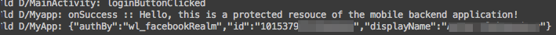

---

copyright:
  años: 2015, 2016

---

# Habilitación de la autenticación de Facebook en apps de Android
{: #facebook-auth-android}
Para utilizar Facebook como proveedor de identidad en las aplicaciones de Android, añada y configure la plataforma Android para la aplicación de Facebook.

## Antes de empezar
{: #facebook-auth-android-before}
 * Debe tener un recurso que esté protegido por {{site.data.keyword.amashort}} y un proyecto de Android instrumentado con el SDK del cliente de {{site.data.keyword.amashort}}.  Para obtener más información, consulte [Iniciación a {{site.data.keyword.amashort}}](https://console.{DomainName}/docs/services/mobileaccess/getting-started.html) y [Configuración del SDK de Android](https://console.{DomainName}/docs/services/mobileaccess/getting-started-android.html).  
 * Proteja manualmente la aplicación de fondo con el SDK del servidor de {{site.data.keyword.amashort}}. Para obtener más información, consulte [Protección de recursos](https://console.{DomainName}/docs/services/mobileaccess/protecting-resources.html).
 * Cree un ID de aplicación de Facebook. Para obtener más información, consulte [Cómo obtener un ID de aplicación de Facebook desde el portal de desarrolladores de Facebook](https://console.{DomainName}/docs/services/mobileaccess/facebook-auth-overview.html#facebook-appID).


## Configuración de una aplicación de Facebook para la plataforma Android
{: #facebook-auth-android-config}
Para utilizar Facebook como proveedor de identidad en las aplicaciones de Android, debe añadir y configurar la plataforma Android para la aplicación de Facebook.

1. Abra la aplicación de Facebook en el portal de desarrolladores de Facebook.

1. Pulse **Settings &gt; Add Platform &gt; Android**.

1. Indique el nombre del paquete de la aplicación de Android en la solicitud de nombre de paquete de Google Play. Para encontrar el nombre del paquete de la aplicación de Android, abra el archivo `AndroidManifest.xml` en Android Studio y busque `<manifest ..... package="{nombre-paquete}">`.

1. Especifique el nombre de clase de su actividad principal en la solicitud **Class Name**. Para encontrar el nombre de clase de la actividad principal de la aplicación de Android, abra el archivo `AndroidManifest.xml` y busque la declaración con un filtro de intención parecido al siguiente fragmento de código:

	```XML
	<activity
		android:name=".MainActivity"
		android:label="@string/app_name">
		<intent-filter>
			<action android:name="android.intent.action.MAIN"/>
			<category android:name="android.intent.category.LAUNCHER"/>
		</intent-filter>
	</activity>
	```

1. Para que Facebook compruebe la autenticidad de la aplicación, debe especificar un hash del SHA1 de su certificado del desarrollador.

	**Más información sobre la seguridad en Android:** el sistema operativo Android necesita que todas las aplicaciones instaladas en un dispositivo Android estén firmadas con un certificado de desarrollador. La aplicación de Android se puede compilar con dos modos:depuración y publicación. <br/>
  Utilice diferentes certificados para los modos de depuración y publicación.  Los certificados que se utilizan para firmar aplicaciones de Android en modo de depuración se empaquetan con el SDK de Android, que normalmente Android Studio instala automáticamente. Cuando quiera publicar la app en la tienda Google Play deberá firmar la app con otro certificado, que normalmente genera usted mismo. <br/>Puede introducir dos conjuntos de hash de clave con Facebook: un hash de clave para aplicaciones que se crean en modo de depuración con un certificado de depuración y otro hash de clave para aplicaciones que se crean en modo de publicación con un certificado de publicación. Para obtener más información, consulte [Signing your Android applications](http://developer.android.com/tools/publishing/app-signing.html).

1. El almacén de claves que contiene el certificado que utiliza para el entorno de desarrollo se almacena en el archivo `~/.android/debug.keystore`. La contraseña del almacén de claves por defecto es: `android`. Utilice este certificado para compilar aplicaciones en modo de depuración.

1. Recupere el hash de clave de su certificado del modo de depuración:

	```XML
	keytool -exportcert -alias androiddebugkey -keystore ~/.android/debug.keystore | openssl sha1 -binary | openssl base64
	```

	**Sugerencia**: puede utilizar la misma sintaxis para recuperar el hash de clave de su certificado de modo de depuración. Sustituya el alias y la vía de acceso al almacén de claves en el mandato.

1. Copie y pegue el hash de clave que ha obtenido con el mandato **keytool** en una solicitud de hashes de clave de desarrollo/publicación en el portal de desarrolladores de Facebook.

	**Sugerencia**: piense en habilitar el inicio de sesión único si quiere utilizar esta característica.

1. Pulse **Save Settings**.

## Configuración de {{site.data.keyword.amashort}} para la autenticación de Facebook
{: #facebook-auth-android-mca}
Cuando disponga de un ID de la aplicación de Facebook y cuando haya configurado su aplicación de Facebook para dar servicio a clientes de Android, puede habilitar la autenticación de Facebook en el panel de control de {{site.data.keyword.amashort}}.

1. Abra la app en el panel de control de {{site.data.keyword.Bluemix_notm}}.

1. Pulse **Opciones móviles** y anote los valores correspondientes a **Ruta** (`applicationRoute`) y a **Identificador exclusivo global de la app** (`applicationGUID`). Necesitará estos valores cuando inicialice el SDK.

1. Pulse el mosaico de {{site.data.keyword.amashort}}. Se cargará el panel de control de {{site.data.keyword.amashort}}.

1. Pulse el mosaico **Facebook**.

1. Especifique el ID de aplicación de Facebook y haga clic en **Guardar**.

## Configuración del SDK del cliente de {{site.data.keyword.amashort}} para Android
{: #facebook-auth-android-sdk}
Para configurar el SDK del cliente para Android, utilice el gestor de dependencias Gradle en Android Studio.

1.  Abra el archivo `build.gradle` del módulo de la app.
Es posible que el proyecto de Android tenga dos archivos `build.gradle`: para el proyecto y para el módulo de la aplicación. Utilice el archivo del módulo de la aplicación.

1. Busque la sección de dependencias en el archivo `build.gradle` y añada una nueva dependencia de compilación para el SDK del cliente:

	```Gradle
	dependencies {
		compile group: 'com.ibm.mobilefirstplatform.clientsdk.android',    
        name:'facebookauthentication',
        version: '2.+',
        ext: 'aar',
        transitive: true
    	// otras dependencias  
	}
```

	Puede eliminar la dependencia del módulo `core` del grupo `com.ibm.mobilefirstplatform.clientsdk.android`, si se encuentra en el archivo. El módulo `facebookauthentication` descarga el módulo `core` automáticamente.

  Después de guardar las actualizaciones, el módulo `facebookauthentication` descarga e instala el SDK de Facebook en el proyecto de Android.


1. Sincronice el proyecto con Gradle. Pulse **Tools > Android > Sync project with Gradle Files**.

1. Abra el archivo `res/values/strings.xml` y añada la serie `facebook_app_id` que contiene el ID de aplicación de Facebook:

	```XML
	<resources>
		<string name="app_name">HelloWorld</string>
		<string name="action_settings">Settings</string>
		<string name="facebook_app_id">522733366802111</string>
	</resources>
```

1. En el archivo `AndroidManifest.xml` del proyecto de Android:
   1. Añada el permiso de acceso a Internet al elemento `<manifest>`:

	```XML
	<uses-permission android:name="android.permission.INTERNET" />
```
  2. Añada los metadatos necesarios para el SDK de Facebook al elemento `<application>`:

	```XML
	<application .......>

		<meta-data android:name="com.facebook.sdk.ApplicationId" android:value="@string/facebook_app_id"/>

		<activity ...../>
		<activity ...../>
	</application>
```

   1. Añada el elemento de actividad de Facebook en las actividades existentes:

	```XML
	<application .....>
		<activity ...../>
		<activity ...../>

		<activity 	android:name="com.facebook.FacebookActivity"
					android:configChanges=
						"keyboard|keyboardHidden|screenLayout|screenSize|orientation"
					android:theme="@android:style/Theme.Translucent.NoTitleBar"
					android:label="@string/app_name" />

	</application>
```

1. Inicialice el SDK del cliente y registre el gestor de autenticación de Facebook. Para inicializar el SDK de cliente de {{site.data.keyword.amashort}}, especifique los parámetros de contexto, identificador exclusivo global de la app (`applicationGUID`) y ruta (`applicationRoute`).<br/>
 Un lugar habitual, aunque no obligatorio, donde colocar el código de inicialización es en el método `onCreate` de la actividad principal de la aplicación de Android.<br/>
 Sustituya *applicationRoute* y *applicationGUID* por los valores correspondientes a **Ruta** y a **Identificador exclusivo global de la app** del menú **Opciones móviles** de la página principal de la app del panel de control de Bluemix.

	```Java
	BMSClient.getInstance().initialize(getApplicationContext(),
					"applicationRoute",
					"applicationGUID");

	FacebookAuthenticationManager.getInstance().register(this);
```


1. Añada el código siguiente a la actividad:

	```Java
	@Override
	protected void onActivityResult(int requestCode, int resultCode, Intent data) {
		super.onActivityResult(requestCode, resultCode, data);
		FacebookAuthenticationManager.getInstance()
			.onActivityResultCalled(requestCode, resultCode, data);
	}
```

## Prueba de autenticación
Después de inicializar el SDK del cliente y registrar el gestor de autenticación de Facebook, puede empezar a realizar solicitudes al programa de fondo móvil.

### Antes de empezar
{: #facebook-auth-android-testing-before}
Debe utilizar el contenedor modelo de {{site.data.keyword.mobilefirstbp}} y debe disponer de un recurso que esté protegido por {{site.data.keyword.amashort}} en el punto final `/protected`. Si tiene que configurar un punto final `/protected`, consulte [Protección de recursos](https://console.{DomainName}/docs/services/mobileaccess/protecting-resources.html).

1. Intente enviar una solicitud al punto final protegido del programa de fondo móvil recién creado en su navegador. Abra el siguiente URL: `{rutaAplicación}/protected`. Por ejemplo: `http://mi-programa-fondo-móvil.mybluemix.net/protected`
<br/>El punto final `/protected` de un programa de fondo móvil que se ha creado con el contenedor modelo de MobileFirst Services Starter está protegido con {{site.data.keyword.amashort}}. Se devuelve un mensaje `Unauthorized` en el navegador. Este mensaje se devuelve porque solo se puede acceder a este punto final con aplicaciones móviles instrumentadas con el SDK del cliente de {{site.data.keyword.amashort}}.

1. Utilice la aplicación de Android para realizar solicitudes al mismo punto final. Añada el siguiente código después de inicializar `BMSClient` y registrar `FacebookAuthenticationManager`.

	```Java
	Request request = new Request("/protected", Request.GET);
	request.send(this, new ResponseListener() {
		@Override
		public void onSuccess (Response response) {
			Log.d("Myapp", "onSuccess :: " + response.getResponseText());
			Log.d("MyApp", AuthorizationManager.getInstance().getUserIdentity().toString());
		}
		@Override
		public void onFailure (Response response, Throwable t, JSONObject extendedInfo) {
			if (null != t) {
				Log.d("Myapp", "onFailure :: " + t.getMessage());
			} else if (null != extendedInfo) {
				Log.d("Myapp", "onFailure :: " + extendedInfo.toString());
			} else {
				Log.d("Myapp", "onFailure :: " + response.getResponseText());
			}
		}
	});
```

1. Ejecute la aplicación. Aparece una pantalla de inicio de sesión de Facebook.

	

	Esta pantalla puede ser ligeramente diferente si no tiene instalada la app de Facebook en su dispositivo, o bien si no ha iniciado sesión en Facebook.

1. Pulse **Aceptar** para autorizar que {{site.data.keyword.amashort}} utilice su identidad de usuario de Facebook para fines de autenticación.

1. 	Cuando la solicitud se realiza correctamente, se muestra la siguiente salida en la utilidad LogCat:

	

1. También puede añadir la funcionalidad de finalización de sesión añadiendo este código: 

 ```
FacebookAuthenticationManager.getInstance().logout(getApplicationContext(), listener);
 ```

 Si invoca este código después de que un usuario haya iniciado sesión en Facebook, dicha sesión de Facebook se cerrará. Cuando el usuario intente iniciar sesión de nuevo, se le solicitarán sus credenciales de Facebook. 

 El valor para `listener` que se pasa a la función de cierre de sesión puede ser nulo. 
