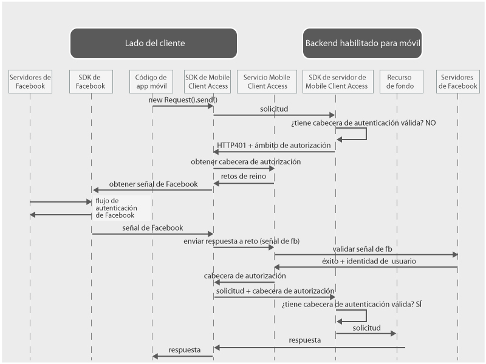

---

copyright:
  años: 2015, 2016

---

# Autenticación de usuarios con las credenciales de Facebook
{: #facebook-auth-overview}
Puede configurar el servicio de {{site.data.keyword.amashort}} para proteger los recursos utilizando Facebook como proveedor de identidad. Los usuarios de la aplicación móvil podrán autenticarse con las credenciales de Facebook.

**Importante**: no es necesario instalar el SDK de Facebook por separado. El SDK de Facebook se instala automáticamente con los gestores de dependencias cuando configura el SDK del cliente de {{site.data.keyword.amashort}}.

## Flujo de solicitudes de {{site.data.keyword.amashort}}
{: #mca-facebook-sequence}

En el siguiente diagrama simplificado se explica cómo {{site.data.keyword.amashort}} se integra con Facebook para la autenticación.

1. Utilice el SDK de {{site.data.keyword.amashort}} para realizar una solicitud a los recursos de fondo que están protegidos por el SDK del servidor de {{site.data.keyword.amashort}}.
* El SDK del servidor de {{site.data.keyword.amashort}} detecta una solicitud no autorizada y devuelve el código HTTP 401 y un ámbito de autorización.
* El SDK del cliente de {{site.data.keyword.amashort}} detecta automáticamente el código error HTTP 401 e inicia el proceso de autenticación.
* El SDK del cliente de {{site.data.keyword.amashort}} contacta con el servicio de {{site.data.keyword.amashort}} y solicita que emita una cabecera de autorización.
* El servicio de {{site.data.keyword.amashort}} solicita al cliente que realice la autenticación con Facebook primero proporcionando el cambio de autenticación.
* El SDK del cliente de {{site.data.keyword.amashort}} utiliza el SDK de Facebook para iniciar el proceso de autenticación. Después de una autenticación correcta, el SDK de Facebook devuelve una señal de acceso de Facebook.
* La señal de acceso de Facebook se considera la respuesta al cambio de autenticación. La señal se envía al servicio de {{site.data.keyword.amashort}}.
* El servicio valida la respuesta con los servidores de Facebook.
* Si la validación es correcta, el servicio de {{site.data.keyword.amashort}} genera una cabecera de autorización y la devuelve al SDK del cliente de {{site.data.keyword.amashort}}. La cabecera de autorización contiene dos señales: una señal de acceso con información sobre permisos de acceso y una señal de ID que incluye información sobre la aplicación, el dispositivo y el usuario actuales.
* A partir de este momento, todas las solicitudes que se realicen con el SDK del cliente de {{site.data.keyword.amashort}} tendrán una cabecera de autorización nueva.
* El SDK del cliente de {{site.data.keyword.amashort}} vuelve a enviar automáticamente la solicitud original que activó el flujo de autorización.
* El SDK del servidor de {{site.data.keyword.amashort}} extrae la cabecera de autorización de la solicitud, la valida con el servicio de {{site.data.keyword.amashort}} y otorga acceso a un recurso de fondo.

## Cómo obtener un ID de aplicación de Facebook desde el portal de desarrolladores de Facebook
{: #facebook-appID}

Para empezar a utilizar Facebook como proveedor de identidad, debe crear una aplicación en el portal de desarrolladores de Facebook. Durante este proceso, obtendrá un ID de aplicación de Facebook, que es un identificador exclusivo con el que Facebook sabrá que aplicación está intentando conectar.

1. Abra el [portal de desarrolladores de Facebook](https://developers.facebook.com).

1. Pulse **My Apps** en el menú superior y seleccione **Create a new app**.
Si se mostrase la opción de seleccionar una aplicación de iOS o Android, escoja una y pulse **Skip and Create App ID** en la siguiente pantalla.

1. Defina el nombre de visualización y escoja una categoría. Pulse **Create App ID** para continuar.

1. Copie el **ID de app** que se muestra. Este valor es su ID de aplicación de Facebook.  Necesita este valor para configurar la autenticación de Facebook con la app móvil.

## Próximos pasos
{: #next-steps}

* [Habilitación de la autenticación de Facebook en apps de Android](facebook-auth-android.html)
* [Habilitación de la autenticación de Facebook en apps de iOS (SDK de Swift)](facebook-auth-ios-swift-sdk.html)
* [Habilitación de la autenticación de Facebook en apps de iOS (SDK de Objective-C)](facebook-auth-ios.html)
* [Habilitación de la autenticación de Facebook en apps de Cordova](facebook-auth-cordova.html)
