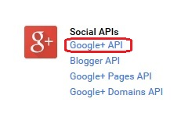

---

copyright:
  años: 2015, 2016

---

# Habilitación de la autenticación de Google en apps de Android
{: #google-auth-android}

## Antes de empezar
{: #before-you-begin}

* Debe tener un recurso que esté protegido por {{site.data.keyword.amashort}} y un proyecto de Android instrumentado con el SDK del cliente de {{site.data.keyword.amashort}}.  Para obtener más información, consulte [Iniciación a {{site.data.keyword.amashort}}](https://console.{DomainName}/docs/services/mobileaccess/getting-started.html) y [Configuración del SDK de Android](https://console.{DomainName}/docs/services/mobileaccess/getting-started-android.html).  
* Proteja manualmente la aplicación de fondo con el SDK del servidor de {{site.data.keyword.amashort}}. Para obtener más información, consulte [Protección de recursos](https://console.{DomainName}/docs/services/mobileaccess/protecting-resources.html).

## Configuración de un proyecto de Google para la plataforma Android
{: #google-auth-android-project}
Para empezar a utilizar Google como proveedor de identidad, cree un proyecto en Google Developers Console. Parte de la creación de un proyecto consiste en obtener un ID de cliente de Google.  El ID de cliente de Google es un identificador exclusivo para la aplicación que se utiliza en la autenticación de Google. 

1. Cree un proyecto en [Google Developers Console](https://console.developers.google.com).
Si ya dispone de un proyecto, puede omitir los pasos que describen la creación de proyectos y empezar a añadir credenciales.
   1.    Abre el menú del proyecto nuevo.  
         
         

   2.    Pulse **Crear un proyecto**.
   
         


   1. En la lista **API sociales**, seleccione **API Google+**.

     

   1. Pulse **Habilitar** en la pantalla siguiente. 

1. Seleccione la pestaña **Pantalla de consentimiento** y especifique el nombre de producto que se muestra a los usuarios. Los demás valores son opcionales. Pulse **Guardar**.

    
    
1. En la lista **Credenciales**, elija el ID de cliente OAuth. 

     
     


1. Seleccione un tipo de aplicación. Pulse **Android**. Indique un nombre para el cliente Android.

1. Para que Google verifique la autenticidad de la aplicación, debe especificar una huella dactilar del certificado para firmas.

	 **Más información sobre la seguridad en Android:** el sistema operativo Android necesita que todas las aplicaciones instaladas en un dispositivo Android estén firmadas con un certificado de desarrollador. Una aplicación de Android se puede compilar con dos modos: depuración y publicación. Normalmente se recomienda tener certificados diferentes para los modos de depuración y publicación.  Los certificados que se utilizan para firmar aplicaciones de Android en modo de depuración se empaquetan con el SDK de Android.  Android Studio suele instalar automáticamente el SDK de Android. Cuando quiera publicar su aplicación en la tienda Google Play deberá firmar la app con otro certificado, que normalmente genera usted mismo. Para obtener más información, consulte [Signing your Android applications](http://developer.android.com/tools/publishing/app-signing.html).

1. Un almacén de claves con un certificado para entornos de desarrollo se almacena en un archivo `~/.android/debug.keystore`. La contraseña del almacén de claves por defecto es `android`. Este certificado se utiliza para compilar aplicaciones en modo de depuración.

     1. Recupere la huella dactilar del certificado para firmas:

	```XML
	keytool -exportcert -alias androiddebugkey -keystore ~/.android/debug.keystore -list -v
	```
	También puede utilizar la misma sintaxis para recuperar el hash de clave de su certificado de modo de depuración. Sustituya el alias y la vía de acceso al almacén de claves en el mandato.

1. Busque la línea que empieza por `SHA1` en **Huellas dactilares de certificados**. Copie la huella dactilar obtenida con la ejecución del mandato **keytool** en Google Developers Console.

1. Especifique el nombre del paquete de la aplicación de Android. Para encontrar el nombre del paquete de la aplicación de Android, abra el archivo `AndroidManifest.xml` en Android Studio y busque: `<manifest package="{nombre-paquete}">`. Cuando haya terminado, haga clic en **Crear**.

Aparece un diálogo que muestra su ID de cliente de Google. Anote este valor. Deberá registrar este valor en {{site.data.keyword.Bluemix}}.


## Configuración de {{site.data.keyword.amashort}} para la autenticación de Google
{: #google-auth-android-config}

Ahora que ya tiene un ID de cliente de Google para Android, puede habilitar la autenticación de Google en el panel de control de {{site.data.keyword.amashort}}. 

1. Abra la app en el panel de control de {{site.data.keyword.Bluemix_notm}}.

1. Pulse **Opciones móviles** y anote los valores correspondientes a **Ruta** (`applicationRoute`) y a **Identificador exclusivo global de la app** (`applicationGUID`). Necesitará estos valores cuando inicialice el SDK.

1. Pulse el mosaico de {{site.data.keyword.amashort}}. Se cargará el panel de control de {{site.data.keyword.amashort}}.

1. Pulse el mosaico **Google**.

1. En **ID de aplicación para Android**, especifique su ID de cliente de Google para Android y pulse **Guardar**.

## Configuración del SDK del cliente de {{site.data.keyword.amashort}} para Android
{: #google-auth-android-sdk}

1. Vuelva a Android Studio.

1. Abra el archivo `build.gradle` del módulo de la app.

	Es posible que el proyecto de Android tenga dos archivos `build.gradle`: uno para el proyecto y otro para el módulo de la aplicación. Utilice el del módulo de la aplicación.

  Busque la sección de dependencias y añada un nueva dependencia de compilación para el SDK del cliente:

	```Gradle
	dependencies {
		compile group: 'com.ibm.mobilefirstplatform.clientsdk.android',    
        name:'googleauthentication',
        version: '2.+',
        ext: 'aar',
        transitive: true
    	// otras dependencias  
	}
	```

	Puede eliminar la dependencia del módulo `core` del grupo `com.ibm.mobilefirstplatform.clientsdk.android` si lo tiene. El módulo `googleauthentication` se descarga automáticamente. El módulo `googleauthentication` descarga e instala el SDK de Google en el proyecto de Android.

1. Sincronice el proyecto con Gradle pulsando **Tools > Android > Sync Project with Gradle Files**.

1. Abra el archivo `AndroidManifest.xml` del proyecto de Android.

1. Añada el permiso de acceso a Internet al elemento `<manifest>`:

	```XML
	<uses-permission android:name="android.permission.INTERNET" />
	<uses-permission android:name="android.permission.GET_ACCOUNTS" />
	<uses-permission android:name="android.permission.USE_CREDENTIALS" />
	```

1. Para utilizar el SDK del cliente de {{site.data.keyword.amashort}}, debe inicializarlo pasando los parámetros de contexto, applicationGUID y applicationRoute.

	Un lugar habitual, pero no obligatorio, donde poner el código de inicialización es en el método onCreate de la actividad principal de la aplicación de Android.

1. Inicialice el SDK del cliente y registre el gestor de autenticación de Google. Sustituya *applicationRoute* y *applicationGUID* por los valores de **Ruta** e **Identificador exclusivo global de la app** de la sección **Opciones móviles** del panel de control.

	```Java
	BMSClient.getInstance().initialize(getApplicationContext(),
					"applicationRoute",
					"applicationGUID");

	GoogleAuthenticationManager.getInstance().register(this);
	```

1. Añada el código siguiente a la actividad:

	```Java
	@Override
	protected void onActivityResult(int requestCode, int resultCode, Intent data) {
		super.onActivityResult(requestCode, resultCode, data);
		GoogleAuthenticationManager.getInstance()
			.onActivityResultCalled(requestCode, resultCode, data);
	}
	```

## Prueba de autenticación
{: #google-auth-android-test}
Después de inicializar el SDK del cliente y registrar el gestor de autenticación de Google, puede empezar a realizar solicitudes al programa de fondo móvil.

### Antes de empezar
{: #google-auth-android-testing-before}
Debe disponer de un programa de fondo móvil que se haya creado con el contenedor modelo de MobileFirst Services Starter y que tenga un recurso protegido por {{site.data.keyword.amashort}} en el punto final `/protected`. Para obtener más información, consulte [Protección de recursos](https://console.{DomainName}/docs/services/mobileaccess/protecting-resources.html)

1. Intente enviar una solicitud al punto final protegido del programa de fondo móvil en su navegador de escritorio; para ello, abra `{applicationRoute}/protected`. Por ejemplo, `http://mi-programa-fondo-móvil.mybluemix.net/protected`.
 El punto final `/protected` de un programa de fondo móvil creado con un contenedor modelo de MobileFirst Services está protegido con {{site.data.keyword.amashort}}. Por eso, solo las aplicaciones móviles instrumentadas con el SDK del cliente de {{site.data.keyword.amashort}} pueden acceder a él. Como resultado, verá `Unauthorized` en el navegador de escritorio.

1. Utilice la aplicación de Android para realizar solicitudes al mismo punto final. Añada el código siguiente después de inicializar la instancia `BMSClient` y registrar `GoogleAuthenticationManager`.

	```Java
	Request request = new Request("/protected", Request.GET);
	request.send(this, new ResponseListener() {
		@Override
		public void onSuccess (Response response) {
			Log.d("Myapp", "onSuccess :: " + response.getResponseText());
			Log.d("MyApp", AuthorizationManager.getInstance().getUserIdentity().toString());
		}
		@Override
		public void onFailure (Response response, Throwable t, JSONObject extendedInfo) {
			if (null != t) {
				Log.d("Myapp", "onFailure :: " + t.getMessage());
			} else if (null != extendedInfo) {
				Log.d("Myapp", "onFailure :: " + extendedInfo.toString());
			} else {
				Log.d("Myapp", "onFailure :: " + response.getResponseText());
			}
		}
	});
```

1. Ejecute la aplicación. Aparece una pantalla de inicio de sesión de Google. Después de iniciar sesión, la aplicación solicita permisos para acceder a recursos: 

	

	En función del dispositivo Android y si ha iniciado sesión en Google, es posible que tenga una IU diferente.

  Si pulsa **Aceptar** está autorizando que {{site.data.keyword.amashort}} utilice su identidad de usuario de Google para fines de autenticación.

1. 	Después de que la solicitud se haya completado correctamente, se mostrará la siguiente salida en la herramienta LogCat:

	

1. También puede añadir la funcionalidad de finalización de sesión añadiendo este código: 

 ```Java
 GoogleAuthenticationManager.getInstance().logout(getApplicationContext(),, listener);
 ```

 Si invoca este código después de que un usuario haya iniciado sesión en Google, dicha sesión se cerrará. Cuando el usuario intente iniciar sesión de nuevo, deberá seleccionar una cuenta de Google para poder hacerlo. Si el usuario intenta iniciar sesión con un ID de Google con el que haya iniciado sesión anteriormente, no se le pedirán de nuevo las credenciales. Para pedir de nuevo las credenciales, el usuario debe eliminar su cuenta de Google del dispositivo Android. 

 El valor para `listener` que se pasa a la función de cierre de sesión puede ser nulo. 
