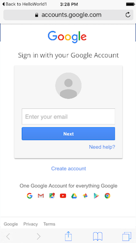

---

copyright:
  años: 2016

---

# Habilitación de la autenticación de Google en apps de iOS (SDK de Swift)
{: #google-auth-ios}

## Antes de empezar
{: #google-auth-ios-before}

* Debe tener un recurso que esté protegido por {{site.data.keyword.amashort}} y un proyecto de iOS instrumentado con el SDK del cliente de {{site.data.keyword.amashort}}.  Para obtener más información, consulte [Iniciación a {{site.data.keyword.amashort}}](https://console.{DomainName}/docs/services/mobileaccess/getting-started.html) y [Configuración del SDK de Swift de iOS](https://console.{DomainName}/docs/services/mobileaccess/getting-started-ios-swift-sdk.html).  
* Proteja manualmente la aplicación de fondo con el SDK del servidor de {{site.data.keyword.amashort}}. Para obtener más información, consulte [Protección de recursos](https://console.{DomainName}/docs/services/mobileaccess/protecting-resources.html).

## Preparación de la app para el inicio de sesión en Google
{: #google-sign-in-ios}

Para preparar la app para el inicio de sesión en Google, siga las instrucciones que proporciona Google en [Goolge Sign- En para iOS](https://developers.google.com/identity/sign-in/ios/start-integrating). En los siguientes pasos se ofrece una breve descripción de las tareas que debe llevar a cabo para preparar la app.

1. Habilite Google Sign-In for iOS para la app. Para obtener más información, consulte la sección [Try Sign-In for iOS](https://developers.google.com/identity/sign-in/ios/start?ver=swift).

1. Obtenga un archivo de configuración (`GoogleService-Info.plist`) para el proyecto. Para obtener el archivo, consulte el apartado sobre [Habilitar los servicios para la app](https://developers.google.com/mobile/add?platform=ios).

 **Importante:** cuando obtenga el archivo `GoogleService-Info.plist`, ábralo y anote el valor de `CLIENT_ID`. Necesitará este valor más adelante para configurar {{site.data.keyword.amashort}}.

1. Añada el archivo `GoogleService-Info.plist` al proyecto de Xcode. Para obtener más información, consulte el apartado sobre [Añadir el archivo de configuración al proyecto](https://developers.google.com/identity/sign-in/ios/start-integrating#add-config)

1. Actualice los esquemas de URL del proyecto de Xcode con el valor de `REVERSE_CLIENT_ID` y el identificador del paquete. Para obtener más información, consulte el apartado sobre [Añadir esquemas de URL al proyecto](https://developers.google.com/identity/sign-in/ios/start-integrating#add_url_schemes_to_your_project)

1. Actualice el archivo project-Bridging-Header.h de la app con el siguiente código:

 ```
 #import <Google/SignIn.h>
 ```

 Para obtener más información sobre cómo actualizar el archivo de cabecera de puente, consulte el paso 1 del apartado sobre [Habilitar el inicio de sesión](https://developers.google.com/identity/sign-in/ios/sign-in#enable_sign-in).

## Configuración de {{site.data.keyword.amashort}} para la autenticación de Google
{: #google-auth-ios-config}

Ahora que ya dispone de un ID de cliente de iOS, puede activar la autenticación de Google en el panel de control de {{site.data.keyword.Bluemix}}.

1. Abra la app en el panel de control de {{site.data.keyword.Bluemix_notm}}.

1. Pulse **Opciones móviles** y anote los valores correspondientes a **Ruta** (*applicationRoute*) y a **Identificador exclusivo global de la app** (*applicationGUID*). Necesitará estos valores cuando inicialice el SDK.

1. Pulse el mosaico de {{site.data.keyword.amashort}}. Se cargará el panel de control de {{site.data.keyword.amashort}}.

1. Pulse el mosaico **Google**.

1. En **ID de aplicación para iOS**, especifique el valor de `CLIENT_ID` del archivo `GoogleService-Info.plist` que ha obtenido anteriormente y pulse **Guardar**.

## Configuración del SDK del cliente de {{site.data.keyword.amashort}} para iOS
{: #google-auth-ios-sdk}

### Instalación de CocoaPods
{: #google-auth-cocoapods}

El SDK del cliente de {{site.data.keyword.amashort}} se distribuye con CocoaPods, un gestor de dependencias para proyectos de iOS. CocoaPods descarga automáticamente los artefactos desde los repositorios y los pone a disposición para la aplicación de iOS.

1. Abra Terminal y ejecute el mandato `pod --version`. Si ya tiene CocoaPods instalado, se muestra el número de versión. Puede omitir la sección siguiente de esta guía de aprendizaje.

1. Instale CocoaPods ejecutando `sudo gem install cocoapods`. Consulte el [sitio web de CocoaPods](https://cocoapods.org/) en caso de necesitar más información.

1. Cierre XCode.

1. Abra Terminal y ejecute `cd` en el directorio del proyecto.

1.  Ejecute `pod init`.

### Instalación del SDK de Swift del cliente de {{site.data.keyword.amashort}} mediante CocoaPods
{: #google-auth-ios-sdk-cocoapods}

1. Vaya al proyecto de iOS.

1. Edite el archivo `Podfile` para añadir las líneas siguientes:

 ```
 use_frameworks!
 pod 'BMSGoogleAuthentication'
 ```
 **Consejo:** puede añadir `use_frameworks!` al destino de Xcode en lugar de especificarlo en el archivo Podfile.

1. Guarde el archivo `Podfile` y ejecute `pod install` desde la línea de mandatos. CocoaPods instala las dependencias. Se mostrarán el progreso y los componentes que se han añadido.

 **Importante**: ahora debe abrir el proyecto utilizando el archivo `xcworkspace` que ha generado CocoaPods. El nombre suele ser `{nombre-proyecto}.xcworkspace`.  

1. Ejecute `open {nombre-proyecto}.xcworkspace` desde la línea de mandatos para abrir su espacio de trabajo del proyecto de iOS.

1. Copie el archivo `GoogleAuthenticationManager.swift` de los archivos fuente de pod `BMSGoogleAuthentication` en el directorio del proyecto.

## Inicialización del SDK de Swift de cliente de {{site.data.keyword.amashort}}
{: #google-auth-ios-initialize}

Para utilizar el SDK del cliente de {{site.data.keyword.amashort}}, inicialícelo pasando los parámetros `applicationGUID` y `applicationRoute`.

Un lugar habitual, pero no obligatorio, donde poner el código de inicialización es en el método `application:didFinishLaunchingWithOptions` del delegado de la aplicación.

1. Obtenga los valores de los parámetros de la aplicación. Abra la app en el panel de control de {{site.data.keyword.Bluemix_notm}}. Pulse **Opciones móviles**. Los valores de `applicationRoute` y `applicationGUID` se muestran en los campos **Ruta** e **Identificador exclusivo global de la app**.

1. Importe las infraestructuras necesarias en la clase en la que desea utilizar el SDK del cliente de {{site.data.keyword.amashort}}. Añada las siguientes cabeceras:

 ```Swift
 import UIKit
 import BMSCore
 import BMSSecurity
 ```

1. Utilice el código siguiente para inicializar el SDK del cliente. Sustituya los valores de `<applicationRoute>` y `<applicationGUID>` por los valores correspondientes a **Ruta** e **Identificador exclusivo global de la app** que ha obtenido de **Opciones móviles** en el panel de control de {{site.data.keyword.Bluemix_notm}}.

 ```Swift
 let backendURL = "<applicationRoute>"
 let backendGUID = "<applicationGUID>"

 func application(application: UIApplication, didFinishLaunchingWithOptions launchOptions: [NSObject: AnyObject]?) -> Bool {

 // Inicialice el SDK del cliente.  
 BMSClient.sharedInstance.initializeWithBluemixAppRoute(backendURL, bluemixAppGUID: backendGUId, bluemixRegion: BMSClient.<application Bluemix region>)

 BMSClient.sharedInstance.authorizationManager = MCAAuthorizationManager.sharedInstance

 GoogleAuthenticationManager.sharedInstance.register()
      return true
      }

 // [START openurl]
      func application(application: UIApplication, openURL url: NSURL, sourceApplication: String?,annotation: AnyObject) -> Bool {
             return GoogleAuthenticationManager.sharedInstance.handleApplicationOpenUrl(openURL: url, sourceApplication: sourceApplication, annotation: annotation)
      }

 @available(iOS 9.0, *)
 func application(app: UIApplication, openURL url: NSURL, options: [String : AnyObject]) -> Bool {
 return GoogleAuthenticationManager.sharedInstance.handleApplicationOpenUrl(openURL: url, options: options)
  }
 ```

## Prueba de autenticación
{: #google-auth-ios-testing}

Después de inicializar el SDK del cliente y registrar el gestor de autenticación de Google, puede empezar a realizar solicitudes al programa de fondo móvil.

### Antes de empezar
{: #google-auth-ios-testing-before}

Debe utilizar el contenedor modelo de {{site.data.keyword.mobilefirstbp}} y debe disponer de un recurso que esté protegido por {{site.data.keyword.amashort}} en el punto final `/protected`. Si tiene que configurar un punto final `/protected`, consulte [Protección de recursos](https://console.{DomainName}/docs/services/mobileaccess/protecting-resources.html).


1. Intente enviar una solicitud al punto final protegido del programa de fondo móvil en su navegador de escritorio; para ello, abra `{applicationRoute}/protected`. Por ejemplo, `http://mi-programa-fondo-móvil.mybluemix.net/protected`.

1. El punto final `/protected` de un programa de fondo móvil creado con el contenedor modelo de MobileFirst Services está protegido con {{site.data.keyword.amashort}}; por tanto, solo se puede acceder al mismo mediante aplicaciones móviles instrumentadas con el SDK del cliente de {{site.data.keyword.amashort}}. Como resultado, verá `Unauthorized` en el navegador de escritorio.

1. Utilice la aplicación de iOS para realizar solicitudes al mismo punto final.

 ```Swift
 let protectedResourceURL = "<Your protected resource URL>" // any protected resource
 let request = Request(url: protectedResourceURL , method: HttpMethod.GET)
 let callBack:BmsCompletionHandler = {(response: Response?, error: NSError?) in
 if error == nil {
    print ("response:\(response?.responseText), no error")
 } else {
    print ("error: \(error)")
 }
 }

 request.sendWithCompletionHandler(callBack)
	```

1. Ejecute la aplicación. Verá la pantalla de inicio de sesión de Google.

 

1. Si inicia la sesión y pulsa **Aceptar**, está autorizando que {{site.data.keyword.amashort}} utilice su identidad de usuario de Google para fines de autenticación.

1. 	Su solicitud debería realizarse correctamente. Debería ver la salida siguiente en el registro.

 ```
 onAuthenticationSuccess info = Optional({attributes = {};
     deviceId = 105747725068605084657;
     displayName = "donlonqwerty@gmail.com";
     isUserAuthenticated = 1;
     userId = 105747725068605084657;
 })
 response:Optional("Hello, this is a protected resource!"), no error
 ```

1. También puede añadir la funcionalidad de finalización de sesión añadiendo este código: 

 ```
 GoogleAuthenticationManager.sharedInstance.logout(callBack)
 ```

  Si invoca este código después de que el usuario haya iniciado sesión en Google y el usuario intenta iniciar sesión de nuevo, se le solicitará que autorice a {{site.data.keyword.amashort}} para utilizar Google para llevar a cabo la autenticación. En este punto, el usuario puede pulsar el nombre de usuario que aparece en la esquina superior derecha de la pantalla para seleccionar otro usuario para iniciar sesión. 

   Es opcional pasar `callBack` a la función de cierre de sesión. También puede pasar `nil`.
