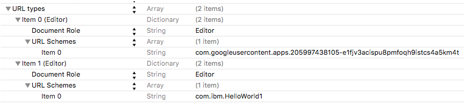

# Habilitación de la autenticación de Google en apps de iOS
{: #google-auth-ios}

## Antes de empezar
{: #google-auth-ios-before}
* Debe tener un recurso que esté protegido por {{site.data.keyword.amashort}} y un proyecto de iOS instrumentado con el SDK del cliente de {{site.data.keyword.amashort}}. Para obtener más información, consulte [Iniciación a {{site.data.keyword.amashort}}](getting-started.html) y [Configuración del SDK de iOS](getting-started-ios.html).  
* Proteja manualmente la aplicación de fondo con el SDK del servidor de {{site.data.keyword.amashort}}. Para obtener más información, consulte [Protección de recursos](protecting-resources.html).


## Configuración de un proyecto de Google para la plataforma iOS
{: #google-auth-ios-project}
Para empezar a utilizar Google como proveedor de identidad, cree un proyecto en Google Developers Console para obtener un ID de cliente de Google. Este ID de cliente es un identificador exclusivo con el que Google sabrá qué aplicación está intentando conectar. Si ya dispone de un proyecto de Google, puede omitir los pasos que describen la creación de proyectos y empezar a añadir credenciales. 

1. Abra la consola [Google Developers Console](https://console.developers.google.com).

1. Cree un proyecto. Pulse **Crear proyecto**.

1. Seleccione el proyecto y haga clic en **Utilizar API de Google**. También puede hacer clic en **Habilitar API y obtener credenciales como claves**.

1. En la lista de API, elija la API Google+ y pulse **Habilitar API**.

1. Pulse **Credenciales > Añadir credenciales** y seleccione **ID de cliente de OAuth 2.0**.

1. Se le puede solicitar que defina un nombre de producto en la consola de consentimiento. Continúe para hacerlo. 

1. En este punto se le presentará una opción de tipo de aplicación. Seleccione **iOS**.

1. Indique un nombre para el cliente iOS. Especifique el ID de paquete de la aplicación de iOS. Para encontrar bundleID de la aplicación de iOS, busque el **Identificador de paquete** en el archivo `info.plist` o el separador **General** del proyecto Xcode. 

1. Anote el nuevo ID de cliente de iOS. Necesitará este valor cuando configure la aplicación en {{site.data.keyword.Bluemix_notm}}.


## Configuración de {{site.data.keyword.amashort}} para la autenticación de Google
{: #google-auth-ios-config}

Ahora que ya dispone de un ID de cliente de iOS, puede activar la autenticación de Google en el panel de control de {{site.data.keyword.Bluemix_notm}}. 

1. Abra el panel de control de {{site.data.keyword.Bluemix}} y haga clic en su aplicación de {{site.data.keyword.Bluemix_notm}}.

1. Pulse **Opciones móviles** y anote los valores de *applicationRoute* y *applicationGUID*. Necesitará estos valores para inicializar el SDK. 

1. Pulse un mosaico de {{site.data.keyword.amashort}}.

1. Llegará al panel de control de {{site.data.keyword.amashort}}.

1. Pulse **Configurar autenticación**.

1. Pulse **Google**

1. Especifique el ID de cliente para iOS que obtuvo en los pasos anteriores y pulse **Guardar**.

## Configuración del SDK del cliente de {{site.data.keyword.amashort}} para iOS
{: #google-auth-ios-sdk}

### Instalación del SDK del cliente de {{site.data.keyword.amashort}} utilizando Cocoapods
{: #google-auth-ios-sdk-cocoapods}

1. Navegue al proyecto de iOS. 

1. Edite el archivo `Podfile` y añada la línea siguiente al destino necesario.

	```
	pod 'IMFGoogleAuthentication'
	```

1. Guarde `Podfile` y ejecute `pod install` desde la línea de mandatos.

1. Cocoapods instalará las dependencias añadidas. Se mostrarán el progreso y los componentes que se han añadido. 

	> A partir de este momento, tendrá que abrir siempre el proyecto utilizando un archivo xcworkspace generado por Cocoapods. Normalmente el nombre es {nombre-proyecto}.xcworkspace.  

1. Ejecute `open {nombre-proyecto}.xcworkspace` desde la línea de mandatos para abrir el espacio de trabajo del proyecto de iOS.

### Configuración del proyecto de iOS para la autenticación de Google
{: #google-auth-ios-googleauth}

1. Busque el archivo `info.plist`, que normalmente se encuentra en la carpeta `Archivos de soporte` del proyecto Xcode.

1. Configure la integración de Google añadiendo los dos esquemas URL siguientes al archivo `info.plist`. 

	

	> El primer esquema URL es el ID de cliente invertido que obtuvo de Google Developers Console. Por ejemplo, si el ID de cliente es `123123-abcabc.apps.googleusercontent.com`, el esquema URL será `com.googleusercontent.apps.123123-abcabc`.

	> El segundo esquema URL es un ID de paquete de la aplicación. 

1. Como alternativa, para actualizar el archivo `info.plist`, haga clic en él con el botón derecho, seleccione `Abrir como` -> `Código fuente` y añada el XML siguiente.

	```XML
	<key>CFBundleURLTypes</key>
	<array>
		<dict>
			<key>CFBundleTypeRole</key>
			<string>Editor</string>
			<key>CFBundleURLSchemes</key>
			<array>
				<string>com.googleusercontent.apps.123123-abcabc</string>
			</array>
		</dict>
		<dict>
			<key>CFBundleTypeRole</key>
			<string>Editor</string>
			<key>CFBundleURLSchemes</key>
			<array>
				<string>com.ibm.HelloWorld</string>
			</array>
		</dict>
	</array>

	```
	> Actualice ambos esquemas URL tal como se describe anteriormente.

	> Asegúrese de que no se sustituyen las propiedades existentes de `info.plist`. Si hay propiedades solapadas, tendrá que fusionarlas manualmente. Consulte las secciones de [Try Sign-In for iOS](https://developers.google.com/identity/sign-in/ios/start) en la documentación de Google para ver información adicional.

## Inicialización del SDK del cliente de {{site.data.keyword.amashort}}
{: #google-auth-ios-initialize}

Para poder utilizar el SDK del cliente de {{site.data.keyword.amashort}}, tiene que inicializarlo pasando los parámetros applicationGUID y applicationRoute. 

> Un lugar habitual, pero no obligatorio, donde poner el código de inicialización es en el método `application:didFinishLaunchingWithOptions` del delegado de la aplicación.

1. Abra la página principal del panel de control de {{site.data.keyword.Bluemix_notm}} y haga clic en la app creada anteriormente. Esta acción abrirá el panel de control de la app de fondo móvil. 

2. Pulse `Opciones móviles` en la parte superior derecha del panel de control. Se mostrarán los valores para Ruta de aplicación y GUID de aplicación. 

1. Para importar la infraestructura necesaria a la clase en la que desea utilizar el SDK del cliente de {{site.data.keyword.amashort}}, añada las cabeceras siguientes.

	Aplicaciones Objective-C:

	```Objective-C
	#import <IMFCore/IMFCore.h>
	#import <IMFGoogleAuthentication/IMFGoogleAuthenticationHandler.h>
	```

	Aplicaciones Swift:

	El SDK del cliente de {{site.data.keyword.amashort}} se implementa utilizando Objective-C; por tanto, es posible que tenga que añadir una cabecera puente al proyecto de Swift para poder utilizarlo. 

	* Pulse el botón derecho del ratón en el proyecto en Xcode y seleccione `Nuevo archivo...`
	* En la categoría `Origen de iOS`, escoja `Archivo de cabecera`. 
	* Póngale el nombre `BridgingHeader.h`.
	* Añada las importaciones siguientes a la cabecera puente.

	```Objective-C
	#import <IMFCore/IMFCore.h>
	#import <IMFGoogleAuthentication/IMFGoogleAuthenticationHandler.h>
	```
	* Pulse el proyecto en Xcode y seleccione el separador `Crear configuración`.
	* Busque `Objective-C Bridging Header`.
	* Defina el valor en la ubicación del archivo `BridgingHeader.h`, por ejemplo `$(SRCROOT)/MyApp/BridgingHeader.h`
	* Asegúrese de que la cabecera puente se selecciona en Xcode al crear el proyecto; no debería ver mensajes de error.

3. Utilice el siguiente código para inicializar el SDK del cliente.

	Aplicaciones Objective-C:

	```Objective-C
	[[IMFClient sharedInstance]
			initializeWithBackendRoute:@"applicationRoute"
			backendGUID:@"applicationGUID"];
	```

	Aplicaciones Swift:

	```Swift
	IMFClient.sharedInstance().initializeWithBackendRoute("applicationRoute",
	 							backendGUID: "applicationGUID")
	```

	> Sustituya applicationRoute y applicationGUID con los valores obtenidos en Opciones móviles.

1. Registre el manejador de autenticación de Google añadiendo el código siguiente al método `application:didFinishLaunchingWithOptions` en el delegado de la app. Se recomienda hacerlo justo después de inicializar IMFClient.

	Aplicaciones Objective-C:

	```Objective-C
	[[IMFGoogleAuthenticationHandler sharedInstance] registerWithDefaultDelegate];
	```

	Aplicaciones Swift:

	```Swift
	IMFGoogleAuthenticationHandler.sharedInstance().registerWithDefaultDelegate()
	```

1. Añada el código siguiente al delegado de la app. 

	Aplicaciones Objective-C:

	```Objective-C
	- (void)applicationDidBecomeActive:(UIApplication *)application {
		[[IMFGoogleAuthenticationHandler sharedInstance] handleDidBecomeActive];
	}

	- (BOOL)application: (UIApplication *)application openURL: (NSURL *)url
					sourceApplication: (NSString *)sourceApplication annotation: (id)annotation {

		BOOL shouldHandleGoogleURL = [GPPURLHandler handleURL:url sourceApplication:sourceApplication annotation:annotation];

		[[IMFGoogleAuthenticationHandler sharedInstance] handleOpenURL:shouldHandleGoogleURL];
		return  shouldHandleGoogleURL;
	}
	```

	Aplicaciones Swift:

	```Swift
	func application(application: UIApplication, openURL url: NSURL,
					sourceApplication: String?, annotation: AnyObject) -> Bool {

		let shouldHandleGoogleURL = GPPURLHandler.handleURL(url,
				sourceApplication: sourceApplication, annotation: annotation)

		IMFGoogleAuthenticationHandler.sharedInstance().handleOpenURL(shouldHandleGoogleURL)

		return shouldHandleGoogleURL;
	}
```

## Prueba de autenticación
{: #google-auth-ios-testing}
Después de inicializar el SDK del cliente, puede empezar a realizar solicitudes al programa de fondo móvil. 

### Antes de empezar
{: #google-auth-ios-testing-before}
Debe utilizar el contenedor modelo de {{site.data.keyword.mobilefirstbp}} y debe disponer de un recurso que esté protegido por {{site.data.keyword.amashort}} en el punto final `/protected`. Si tiene que configurar un punto final `/protected`, consulte [Protección de recursos](protecting-resources.html).


1. Intente enviar una solicitud a un punto final protegido del programa de fondo móvil en su navegador de escritorio; para ello, abra `http://{RutaApp}/protected` (por ejemplo, `http://mi-programa-fondo-móvil.mybluemix.net/protected`)

1. El punto final `/protected` de un programa de fondo móvil creado con el contenedor modelo de MobileFirst Services está protegido con {{site.data.keyword.amashort}}; por tanto, solo se puede acceder al mismo mediante aplicaciones móviles instrumentadas con el SDK del cliente de {{site.data.keyword.amashort}}. Como resultado, verá `Unauthorized` en el navegador de escritorio. 

1. Utilice la aplicación de iOS para realizar solicitudes al mismo punto final. 

	Objective-C:

	```Objective-C
	NSString *requestPath = [NSString stringWithFormat:@"%@/protected",
								[[IMFClient sharedInstance] backendRoute]];

	IMFResourceRequest *request =  [IMFResourceRequest requestWithPath:requestPath
																method:@"GET"];

	[request sendWithCompletionHandler:^(IMFResponse *response, NSError *error) {
		if (error){
			NSLog(@"Error :: %@", [error description]);
		} else {
			NSLog(@"Response :: %@", [response responseText]);
			NSLog("%@", IMFAuthorizationManager.sharedInstance().userIdentity)
		}
	}];
	```

	Swift:

	```Swift
	let requestPath = IMFClient.sharedInstance().backendRoute + "/protected"

	let request = IMFResourceRequest(path: requestPath, method: "GET");
	request.sendWithCompletionHandler { (response, error) -> Void in
		if (nil != error){
			NSLog("Error :: %@", error.description)
		} else {
			NSLog("Response :: %@", response.responseText)
			NSLog("%@", IMFAuthorizationManager.sharedInstance().userIdentity)
		}
	};

	```

1. Ejecute la aplicación. Verá la pantalla de inicio de sesión de Google. 

	

	Esta pantalla puede ser ligeramente diferente si no tiene instalada la app de Facebook en su dispositivo, o bien si no ha iniciado sesión en Facebook. 

1. Si pulsa **Aceptar** está autorizando que {{site.data.keyword.amashort}} utilice su identidad de usuario de Google para fines de autenticación. 

1. 	Su solicitud debería realizarse correctamente. Debería ver la salida siguiente en LogCat.

	
